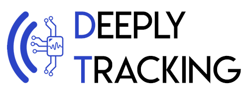
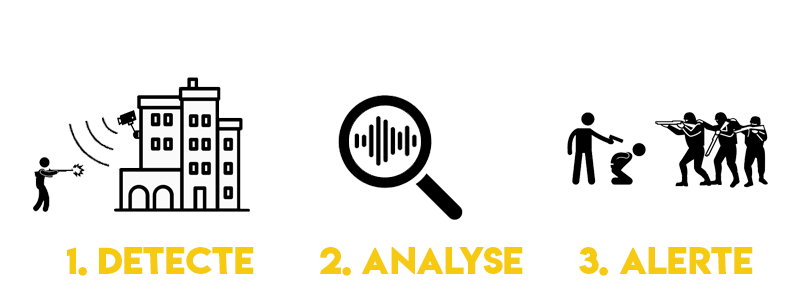
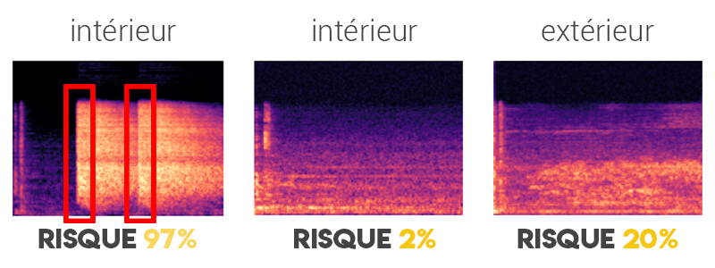

## Constat

Nous sommes dans une ère ou la disponibilité d’une arme n’a jamais été aussi facile, et sa possession n’a jamais été aussi présente, accompagné d’attaques terroristes récidivantes. Lors d’une telle attaque, les choses se passent extrêmement vite. Lorsque l’on est dans ce cas-ci, à la place d’une victime, la principale chose est de courir se mettre à l’abris et seulement ensuite de prévenir les secours. Ce processus peut mettre un certain temps, si la victime appelante est dans un état de choc, pouvant allonger l’échange avec le service de secours pour avoir les informations précises concernant le type d’attaque ou encore sa localisation. C’est à partir de cette situation que j’ai souhaité mettre en place un projet personnel, Deeply Tracking.

<!-- more -->

## Présentation du projet

DeeplyTracking est conçu pour permettre d’accélérer l’intervention des forces de l’ordre, en substituant l’appel des victimes. Il utilise des algorithmes d’intelligence artificielle ( deep learning ) pour permettre de reconnaître des sons d’armes à feu. Le but serait de placer des micros dans des villes ou lieux sensibles, et les relier à mon outil. Je sais aussi que certains types de caméras de surveillance sont déjà équipé d’un micro, permettant ainsi une installation et un déploiement de mon outil de façon extrêmement rapide. Mon logiciel permet d’analyser en temps réel le bruit environnant. Si un bruit suspect est détecté, il alertera instantanément les forces de police, faisant alors gagner un précieux temps sur l’opération, facilitant ainsi l’arrêt des malfaiteurs et pouvant alors sauver un plus grand nombre de personne.

## Réalisation

Le projet a été développé en un weekend, il est donc en phase de simple POC. Actuellement, il permet de détecter sur un enregistrement audio s’il y a présence d’arme à feu ou non (entraîné à reconnaître seulement sur des armes de type AK-47).

## Démonstration vidéo

<iframe src="https://www.youtube.com/embed/F6QcoU4n-I8" width="560" height="315" frameborder="0" allowfullscreen="allowfullscreen"></iframe>

<iframe src="https://www.youtube.com/embed/qS1KxqW2Wis" width="560" height="315" frameborder="0" allowfullscreen="allowfullscreen"></iframe>

## Fonctionnement

J'enregistre le son via mon microphone intégré à mon ordinateur. Je converti mon signal sonore en une image. Un son est une amplitude en fonction d'un temps, et via des transformations discrètes de Fourrier, je vais pouvoir avoir une fréquence en fonction d'un temps avec un gradient de couleur, indiquant une plus ou moins grande intensité de son. C'est sur ces images que je vais utiliser des CNN, qui sont des réseaux à neurones utilisant de la convolution pour analyser des images. Je vais construire un modèle qui va apprendre à reconnaître tel ou tel type de spectre et lui associer une classe ( entrainement supervisé ). C'est ainsi que mon modèle une fois entraîné, va pouvoir effectuer de nouvelles généralisations sur de futures données audio.

Les rectangles rouges représentent les moments ou j'ai lancé mon tir d'AK47

## Roadmap du projet

Améliorer la prédiction de l’outil via un enrichissement en diversité des échantillons sonores
Benchmark avec d'autres types d'input, tel que les MFCC ou encore les spectrogrammes simples
Développer l’outil à reconnaître le type d’arme. En effet il serrait intéressant de pouvoir reconnaître si l’arme repéré est un petit calibre ou une arme de guerre.
Développer l’outil à reconnaître le nombre d’arme, pour réaliser une estimation du nombre de malfaiteur.
Développer un système de triangularisation des caméras, permettant de donner une position précise de l’attaque sur une carte
Réaliser une interface pour l’outil
Réaliser l'appel téléphonique vers une plateforme de secours pour communiquer l’alerte

## Idée

Coupler mon algorithme d’intelligence artificielle précédent avec un autre qui puisse faire de l’analyse d’image provenant des cameras de surveillance, pour à la fois faire une double vérification en détectant le type d’arme du malfaiteur, mais aussi pouvoir éventuellement comparer sa photo avec une base de données, permettant aux enquêteurs d’accélérer leurs recherches, que cela soit sur le suspect, ou ses éventuels complices et proches qui pourraient rapporter d’importantes informations.
On peut également penser faire de la détection de bagarre via l'analyse des images. En effet, des villes comme Toulouse sont équipé de poste de vidéo surveillance composé de plus de 1000 camera, ce qui peut être une lourde charge pour seulement quelques personnes, de visualiser l'ensemble des flux vidéos pour détecter d'éventuelles rixes

## But

Ce projet me permet avant tout de pouvoir monter en compétence dans le domaine de l’intelligence artificiel, et d’appliquer ces algorithmes sur des sujets réels. Les idées que j’ai pour la poursuite du projet sont multiples, mais n’en sont pour le moment absolument pas implémentés.

