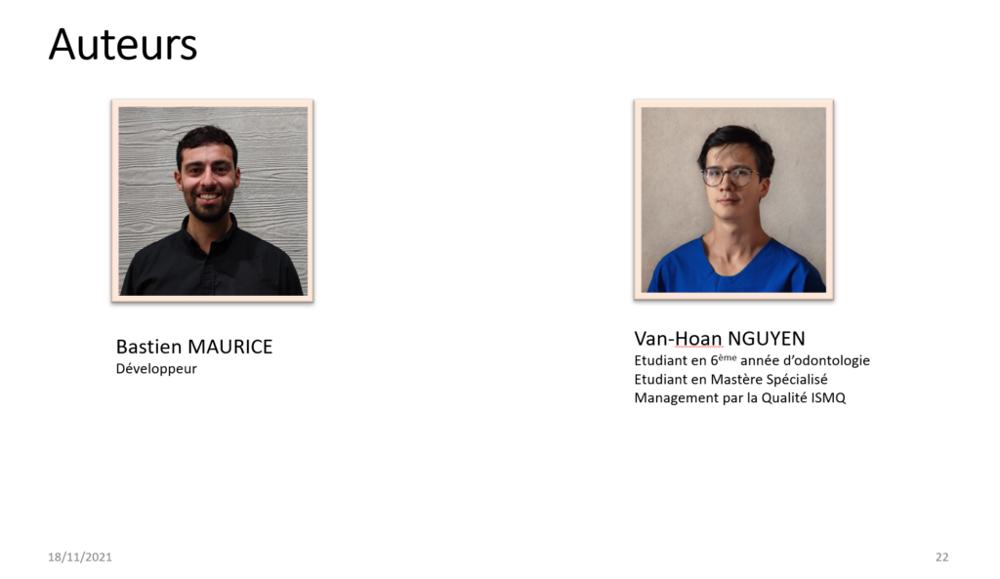

# Segmentation de lésions carieuses à partir de radiographies par un réseau de neurones à convolution

La détection précoce des lésions carieuses est un élément primordial dans le traitement de la maladie carieuse afin de pouvoir intervenir au plus vite et préserver les tissus dentaires. Le diagnostic de la maladie carieuse se fonde sur l’examen clinique mais la détection des lésions 
peut intervenir lors de l’examen radiographique. 

<!-- more -->

Depuis quelques années, le domaine de l’intelligence artificielle s’est étendu avec le développement des réseaux de neurones à convolution, dont certains spécialisés dans la détection et la segmentation d’images médicales. 

Le but de cette thèse était de programmer un réseau de neurones à convolution capable à partir d’une radiographie intrabuccale de détecter et segmenter les lésions carieuses. Mille trois cent soixante-quinze radiographies ont été analysées et les lésions carieuses segmentées. Ces données ont permis d’entraîner le réseau à segmenter les lésions et à tester ses performances. 

Les résultats obtenus montrent qu’il est possible d’obtenir un réseau fonctionnel avec des résultats exploitables. Cependant, les valeurs de sensibilité et spécificité mesurées traduisent trop d’erreurs de sous-diagnostic et donc une impossibilité de l’utiliser cliniquement. 

Ces résultats ont néanmoins démontré que les réseaux de neurones à convolution sont fonctionnels, applicables dans le domaine dentaire et qu’il apparaît nécessaire de continuer les recherches afin d’optimiser les résultats. La littérature s’accorde pour le moment sur le fait que l’intelligence artificielle ne peut remplacer l’humain dans le diagnostic des lésions carieuses.

 

# Dental X-ray tooth decay segmentation using a convolutionnal neural network

The early detection of caries lesions i2026s an essential aspect in the treatment of caries disease in order to be able to intervene as quickly as possible and preserve dental tissue. The diagnosis of caries disease is based on physical examination, but lesions may be detected on X-ray examination. In recent years, the field of artificial intelligence has expanded with the development of convolutional neural networks, some of which specialized in the detection and segmentation of medical images. The aim of this thesis was to program a convolutional neural network able to detect and segment caries lesions from an intraoral X-ray. One thousand three hundred and seventy-five radiographs were analyzed and the carious lesions segmented. These data were used to train the network to segment lesions and test its performance. The results obtained show that it is possible to obtain a functional network with actionable results. However, the values of sensitivity and specificity measured reflect too many errors of underdiagnosis and therefore an inability to use it clinically. These results nevertheless demonstrated that convolutional neural networks are functional, applicable in the dental field and it appears necessary to continue research in order to optimize the results. The literature currently agrees that artificial intelligence cannot replace humans in the diagnosis of caries lesions.

Lien vers la source/Link to source : 

- [HAL registry](https://dumas.ccsd.cnrs.fr/MEM-UNIV-BORDEAUX/dumas-03451688)
- [Thèse](https://dumas.ccsd.cnrs.fr/dumas-03451688/document)

