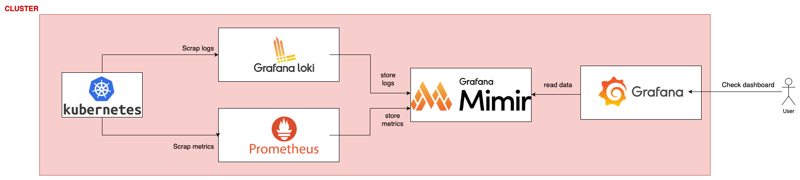
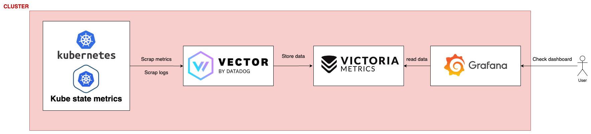

# Stack de monitoring performante sous Grafana - De Prometheus/Loki/Mimir à Vector/VictoriaMetrics

Quand on souhaite monter une stack de monitoring, on pense bien entendu à Grafana pour la réalisation de ses dashboard.   
Pour remonter toute nos infos à celui-ci, on pense Prometheus pour les métriques, Loki pour les logs, et Mimir pour le stockage.    
Mais n'existe t-il pas de nouveaux framework moins gourmant en ressource que cette traditionnel stack ? 🤔

<!-- more -->

## Comparaison entre les divers stack
Avant que j'aille plus loins dans l'explication de ma stack que je propose et qui me semble plus optimisé en terme de consomation de ressource, commençons par voir le basique, à savoir ce qui se fait de nos jours qui est commun. Je te montre ensuite ce qui me semble mieux, que j'ai mis en place et surtout en quoi elle est mieux :smile:

### Stack mainstream schema
On peut retrouver chez pas mal d'entreprise, une stack assez commune pour la gestion des logs et métriques. C'est facile à mettre en place, commun en terme d'utilisation et de technos, de documentation et de communauté.

- **Kubernetes**, ici je parle de métriques internes à k8s qui sont exposés, ou de tes divers services qui tournent et qui crash des logs
- **Grafana loki**, responsable de récuperer les logs exposés dans ton cluster
- **Prometheus**, responsable de récuperer les métriues exposées dans ton cluster
- **Grafana mimir**, est la database pour stocker tes logs/metriques sur du long terme
- **Grafana**, afin de créer tes dashboard. Ceux-ci iront lire les données dans Mimir dans notre cas 

### Stack plus récente & optimisé schema

- **Kubernetes**, ici je parle de métriques internes à k8s qui sont exposés, ou de tes divers services qui tournent et qui crash des logs
- **Kube state metrics**, permettant d'exposer d'avantage de metriques. Ce framework reste optionnel
- **Vector**, permet d'aller scrapper les métriques et logs que tu souhaites, de les reformater (j'y reviendrais plus bas)
- **VictoriaMetrics**, qui permet le stockage de long terme des données
- **Grafana**, afin de créer tes dashboard. Ceux-ci iront lire les données dans VictoriaMetrics dans notre cas 

### Avantage & inconvénients de chaque stack
Au fil du temps, on va créer de plus en plus de dashboard, et donc se baser sur d'avantages de métriques, et/ou de logs applicatifs. On continue ainsi à allourdir la stack avec le développement croissant de nos services. Un des soucis majeur, une fois votre stack qui fonctionne en production, va être la consommation en ressource de notre stockage de logs. On tombe nez à nez fasse à deux soucis :  

1. Le stockage coute plus cher chez votre cloud provider  
2. Le requêtage des datas dans notre base de données, depuis nos dashboard, deviennent de plus en plus longs à s'afficher   

C'est un soucis que l'on rencontre avec notre première stack. On peut évidemment diminuer notre nombre de métriques scrappé, ainsi que les logs, ou encore la fréquence de scrapping ou encore diminuer la rétention des données dans notre base. Mais moins de données équivaut à diminuer les fonctionnalités de notre monitoring.

C'est ici que resort 2 nouveaux framework, Vector et VictoriaMetrics, qui se veulent plus léger et moins gourmand en ressource.