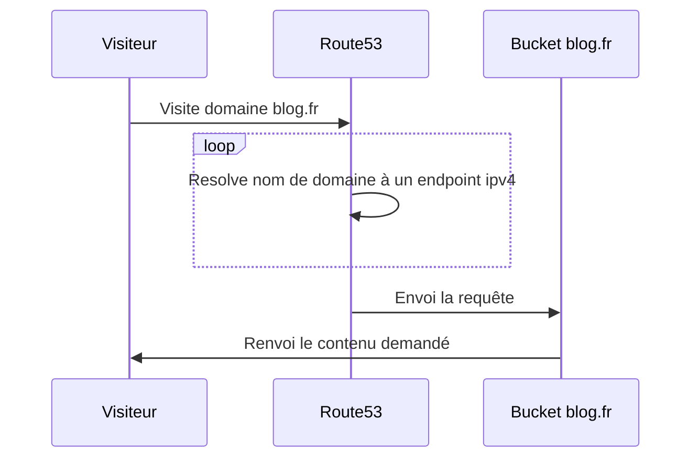
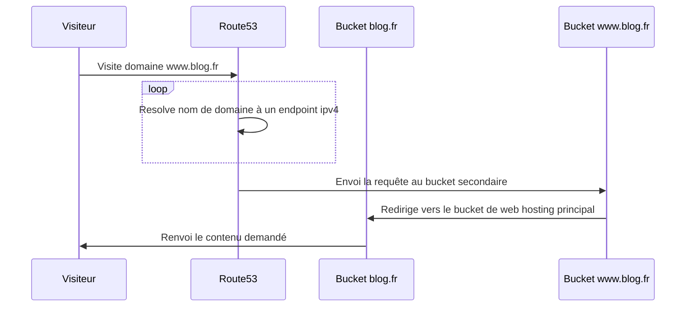
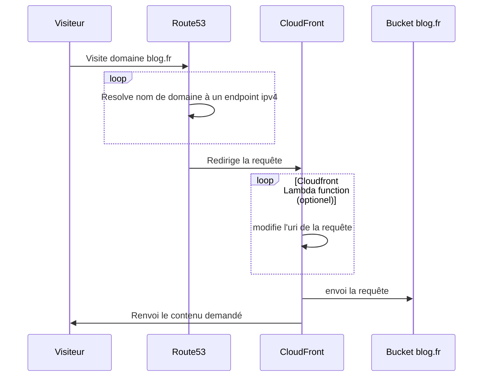
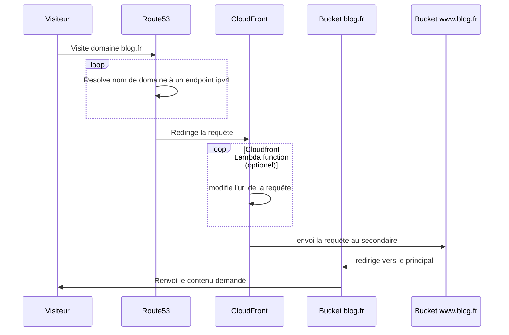

# Créer un site web statique HTTPS/SSL avec AWS Bucket S3, AWS Zone53 (DNS), AWS CloudFront (CDN), AWS Lambda et Terraform (IAC)

Je te montre comment deploy un site statique sur AWS avec toute ton infrastructure as code avec Terraform :)   
Au programme comment heberger ton site, comment le rendre visite sur le net avec un nom de domaine, gestion de la sécurité et des redirections, etc...   
Et de quoi automatiser le tout avec une pipeline pour le mettre à jour simplement 😎

<!-- more -->
<br>
Je vous propose d'heberger un simple site web statique sur AWS, pour un coût entre 1$ et 3$ le tout par mois. Ce tuto est d'ailleurs écrit avec l'expérience obtenu en faisant ce propre blog, donc c'est up to date.

Et on va faire le tout bien propre, avec du Terraform 🔥


## Pré-requis
Tools :  

- Terraform  
- AWS Cli

Compte:

- Compte AWS avec les bon IAM et roles défini

Projet:

- Un repository avec un projet terraform déjà initialisé/paramétré, auquel tu peux déjà faire tes plan/apply
- Un site statique déjà buildé
- Un nom de domaine acheté

 
## Hebergement - AWS S3 Bucket
S3 pour Simple Storage Service te propose d'heberger n'importe quel type de données. Tu vois ton disque dur avec la vue de ton File explorer ? Ben c'est la même chose. On va se servir de ce service d'amazon pour envoyer les fichiers statiques et les render dans le browser du client.

### Locals nécéssaire
On commence par créer un fichier contenant des var locals que l'on risque d'utiliser souvent pour la suite du tuto 
```terraform linenums="1"
# locals.tf

locals {
  domain_name         = "bastienmaurice.fr"
  bucket_name         = "bastienmaurice.fr"
 
  commonTags = {
    createdBy     = "terraform"
    orga          = "Momotoculteur"
    repositoryFor = "bastienmaurice-website"
  }
}
```

Ici, le commonTags est juste recommandé pour se retrouver dans ta console d'AWS et faire la différence entre des ressources crées par terraform, et celle crée manuellement pour du testing.
On créer deux var :

- **domain_name** : nom de ton domaine, de ton site web.
- **bucket_name** : nom du bucket. Doit être identique à ton nom de domaine


### Bucket principal pour l'hebergement
On focus ici sur ton bucket principal. C'est lui que tu vas remplir des fichiers de ton site web.
```terraform linenums="1"
# s3.tf

resource "aws_s3_bucket" "root_bucket" {
  bucket = local.bucket_name
  tags = local.commonTags
}
```
<br>

On rajoute la partie ownership :
```terraform linenums="1"
# s3.tf

resource "aws_s3_bucket_ownership_controls" "root_owner" {
  bucket = aws_s3_bucket.root_bucket.id
  rule {
    object_ownership = "BucketOwnerPreferred"
  }
}
```
<br>

On va modifier la partie Public Access Block (ACL). Cela va nous permettre de rendre dans un second temps le bucket public. On ne peux mofidier cette visibilité sans désactiver ces blocs ci :


```terraform linenums="1"
# s3.tf

resource "aws_s3_bucket_public_access_block" "root_access" {
  bucket = aws_s3_bucket.root_bucket.id

  block_public_acls       = false
  block_public_policy     = false
  ignore_public_acls      = false
  restrict_public_buckets = false
}
```
<br>

On peut maintenant modifier la visibilité de notre bucket, de privé à public:
```terraform linenums="1"
# s3.tf

resource "aws_s3_bucket_acl" "acl_root" {
  bucket = aws_s3_bucket.root_bucket.id
  acl    = "public-read"  # cette prop ne peut être modifié sans le bloc précédent
  depends_on = [
    aws_s3_bucket_ownership_controls.root_owner,
    aws_s3_bucket_public_access_block.root_access
  ]
}
```
<br>

Ici on va activer le web hosting sur notre bucket, et mentionner la page principal et une page d'erreur :
```terraform linenums="1"
# s3.tf

resource "aws_s3_bucket_website_configuration" "config_root" {
  bucket = aws_s3_bucket.root_bucket.id

  index_document {
    suffix = "index.html"
  }

  error_document {
    key = "error.html"
  }

}
```
<br>

Dernière étape, il faut que l'on ajoute une **Ressource based Policy**. Celle-ci va permettre à qui-quonque de lire le contenu de notre bucket S3 :
```terraform linenums="1"
# s3.tf

resource "aws_s3_bucket_policy" "policy_root" {
  bucket = aws_s3_bucket.root_bucket.id

  policy = jsonencode({
    Version = "2012-10-17"
    Statement = [
      {
        Sid       = "PublicReadGetObject"
        Effect    = "Allow"
        Principal = "*"
        Action = [
          "s3:GetObject",
        ]
        Resource = [
          aws_s3_bucket.root_bucket.arn,
          "${aws_s3_bucket.root_bucket.arn}/*",
        ]
      },
    ]
  })
}
```


### Bucket secondaire pour la redirection
Ici, ce bucket secondaire est optionnel. Sa seul tâche à pour but de rediriger les requêtes www.ton-site.fr à ton-site.fr. 
Autant prendre ce cas d'utilisation 😀
 
```terraform linenums="1"
# s3.tf

resource "aws_s3_bucket" "www_bucket" {
  bucket = "www.${local.bucket_name}"
  tags = local.commonTags
}
```
<br>

On paramètre la configuration du bucket afin d'activer la redirection vers le bucket principal :
```terraform linenums="1"
# s3.tf

resource "aws_s3_bucket_website_configuration" "config_www" {
  bucket = aws_s3_bucket.www_bucket.id
  redirect_all_requests_to {  # on redirige toute requête 'www.' vers notre bucket principal
    # a changer une fois le certif
    protocol = "https"
    host_name = local.domain_name
  }
}
```

Le **protocol** est à changer selon tes souhaits. Soit tu laisses en http, soit tu mets le https. Mais dans ce dernier cas, tu devras rajouter un certificat SSL pour activer cette liaison sécurisé


## DNS - AWS Route53
On commence par créer notre hosted zone :
```terraform linenums="1"
# route53.tf

resource "aws_route53_zone" "r53_zone" {
  name = local.domain_name
  tags = local.commonTags
}
```
<br>

Par la suite on va créer deux records. Cela nous permet de diriger une requête de notre nom de domaine, vers une ressource, car on utilise des records de type **A**. Dans notre cas, on va lier notre nom de domaine vers des ressources amazon, ici le end point de nos bucket S3.  
<br> 

Un premier record pour les adresses du type mon-blog.fr
```terraform linenums="1"
# route53.tf

resource "aws_route53_record" "r53_record_root" {
  zone_id = aws_route53_zone.r53_zone.id  # link vers notre hosted zone précédemment crée
  name    = local.domain_name             # bucket principal
  type    = "A"                           # IPv4 qui pointe vers une ressource amazon

  alias {
    name                   = aws_s3_bucket_website_configuration.config_root.website_domain # end point vers notre bucket principal
    zone_id                = aws_s3_bucket.root_bucket.hosted_zone_id
    evaluate_target_health = true
  }
}
```
<br>

Un second record pour les adresses du type www.mon-blog.fr
```terraform linenums="1"
# route53.tf

resource "aws_route53_record" "r53_record_www" {
  zone_id = aws_route53_zone.r53_zone.id  # link vers notre hosted zone précédemment crée
  name    = "www.${local.domain_name}"    # bucket secondaire
  type    = "A"                           # IPv4 qui pointe vers une ressource amazon

  alias {
    name                   = aws_s3_bucket_website_configuration.config_www.website_domain # end point vers notre bucket secondaire
    zone_id                = aws_s3_bucket.root_bucket.hosted_zone_id
    evaluate_target_health = true
  }
}
```

### Setter le DNS du nom de domaine
Alors ici, deux cas de figures possibles :  

- Soit vous vous la jouer gros rat et vous achetez votre nom de domaine au moins cher possible (ou vous en avez un sous le tapis qui prend déjà la poussière)  
- Soit vous voulez pousser l'aspect Terraform un poil plus loin et/ou tout céder à AWS, et dans ce cas-là on utilise Route53  

#### Nom de domaine chez un random provider
Allez sur votre provider, et rendez vous sur l'onglet Zone DNS. Le but va être de repartir sur une base propre, et de supprimer toute entrée crée de base par votre provider.  
<br>

On va ensuite rajouter la notre afin que le nom de domaine que vous avez acheté redirige vers l'adresse du AWS S3 bucket. Pour cela, ajouter un record dans votre Zone DNS :

- Subdomain: ceci est votre domaine, soit le nom de votre site. Chez moi, **bastienmaurice.fr**
- Hostname: ceci doit pointé sur l'adresse de votre S3 qui contient tout le contenu de votre site. Le mien est **http://bastienmaurice.fr.s3-website.eu-west-3.amazonaws.com**
- Type: il existe plusieurs types de record, ici on veut pointer un nom de domaine vers une adresse et non une IP, on choisi donc le type **CNAME**


#### Nom de domaine chez AWS Route53
C'est ce que j'ai fais initialement. Prendre mon nom de domaine sur un bon vieux OVH, ou j'ai déjà mon vieu Wordpress. Et je l'ai transferfé sur AWS afin de pouvoir terraform toute mon infra pour découvrir tout ce que proposait ce cloud provider.

!!! warning
    Attention à vos DNS défini sur votre nom de domaine si vous venez d'un transfert !!

<br>
En effet une chose qui m'a trigger un moment, après tout cela et être certains de la validité de toute ma configuration, mon site n'était toujours pas up. 
Le soucis provenant du fait que j'ai éffectué un transfert de mon nom de domaine chez AWS. Quand vous êtes confronté à cette même situation, sachez que AWS laisse le DNS de votre ancien provider. Sauf que lorsque vottre ancien provider validate le transfert de domaine, il supprime l'entrée dans son DNS de votre nom de domaine. Votre site n'est donc plus routé entre son ip et nom de domaine, celui-ci mêne vers plus rien.  
<br>
Il faut donc penser à mettre à jours les nom de serveur DNS dans votre nom de domaine. Ici cette action se fait manuellement : 

1. Rendez vous sur votre service **Route53**, et allez sur la zone hosted que vous venez de créer  
2. Selectionnez votre hosted zone  
3. Dans l'onglet **Records**, trouvez la ligne qui correspond à un type de record **NS**, qui correspond à Name Servers  
4. Récuperez depuis cette ligne les 4 **Value/Route traffic to** associés  
5. Revenez à votre service **Route53**, onglet **Domain -> Registered domains**  
6. Choisissez votre nom de domaine de votre site web, et rendez vous dans l'onglet **Details**, et cliquez sur **Edit name servers**  
7. Renseignez vos 4 **NS** de votre **hosted zone** de votre record de type **NS** et validez.  

<br>
C'est bon, vous avez bien associé votre nom de domaine avec des serveurs DNS valide.  


## Résumé & Fin - Partie 1 
On arrive ici à la fin de la première partie. On a actuellement :

- un bucket S3 qui sert de stockage de notre site web
- une zone DNS qui nous permet d'utiliser le nom de domaine que l'on a acheté, et de transiter les visiteurs sur notre bucket S3
- une redirection des requêtes en *www.* vers notre nom de domaine principal, grace au second bucket

L'atout majeur est que l'on reste sur une mise en place plutôt simple et rapide.

<br>

Diagramme de séquence pour visiter **http://blog.fr**


<br>

Diagramme de séquence pour visiter **http://www.blog.fr**


## Partie 2 - Certificat SSL et connexion sécurisé via HTTPS
Nous nous sommes arrêté sur un hebergement de site simple. Peut être même trop simple, car l'ensemble des données du bucket est entiérement public. Si l'on souhaite avoir quelque chose de plus secure pour la suite, je vous propose une seconde partie qui n'était pas prévue. On va générer un certificat SSL afin de garantir une connexion sécurité en HTTPS. Le tout bien sur via terraform 😀

<br>

Il y aura quelques partie du code à refactorer seulement :  

- Supprimer dans notre bucket principal la ressource based policy présente, supprimer l'option de web static hosting  
- Créer un service de CDN. C'est lui qui va faire le lien et recevoir la requête des utilisateurs. Il va ensuite faire suivre au bucket et avoir un pont sécurité via ssl. Ce n'est plus le bucket lui même qui renvoit les pages.  
- Update notre DNS, et modifier le record actuel de notre nom de domaine pour qu'il pointe vers CloudFront et non plus vers le S3 bucket  
- Ajouter une nouvelle ressource based policy au bucket, permettant seulement l'accès de son contenu depuis CloudFront  
- Update le protocol de http à https pour notre bucket secondaire qui gère les requêtes des utilisateurs en *www.*  
- En bonus, je vous propose d'ajouter une AWS Lambda afin de réaliser une redirection invisible, mais je donnerais d'avantage de détails plus bas sur le besoin initial de cette feature  


<br>

Nouveau diagramme de séquence avec l'ajout des nouvelles ressources pour visiter **https://.blog.fr**

<br>

Nouveau diagramme de séquence avec l'ajout des nouvelles ressources pour visiter **https://www.blog.fr**


## CDN
Ici en bonus, on peut aller plus loin et ajouter un CDN ; Celui-ci va permettre de répliquer notre contenu dans des serveurs un peu partout dans le monde, améliorant ainsi la disponibilité et latence de notre site. Ceci est donc clairement optionnel. Cloudflare en es un des plus connu.

### AWS CloudFront
Histoire de rester sur la même stack, je vous propose de test celui d'amazon.

### Modification de la politique du S3 Bucket principal

### Modification du protocol de redirection pour notre bucket secondaire

### Modification du record principal sur Route53

## TADAAAA ! HTTPS, et un site quasi HS
Vous venez de finaliser l'ajout de votre Cloudfront, et vous avez enfin ce petit cadena vert qui prouve que votre ajout d'un certificat SSL renvoi vos visiteur vers un lien en HTTPS.
Vous regardez votre page d'acceuil, tout roule. Mais essayer de vous balader sur les divers onglet de votre site. BAM, une erreur 403 qui pop de null part indiquand que la clée n'existe pas sur votre bucket.

Petit example :

**https://bastienmaurice.fr** : fonctionne  
**https://bastienmaurice.fr/blog** : erreur 403. Pourtant, ce lien devrait me renvoyer vers mon moteur de blog   
**https://bastienmaurice.fr/blog/index.html** : fonctionne, et renvoi vers la partie blog  

!!! question
    AWS CloudFront vient de tout péter notre site ? Par quel moyen ? Est-ce vraiment ce service là qui en est le responsable ? 🤔

Il semble que nous ayons un soucis pour l'affichage des répertoires.

En effet, CloudFront te permet de renseigner un object racine, notre index.html.
Mais lorsque tu demandes un lien du style **https://bastienmaurice.fr/blog** et pointe donc vers un dossier et non un fichier, c'est donc normal d'avoir une erreur car le bucket ne peut te renvoyer que des fichiers.

Je te propose deux méthode pour fix ce soucis là.

### use_directory_urls (quick & dirty)
On vient de voir que notre bucket ne peut render que des fichiers et en aucun cas un dossier. Pour cela on va ajouter une property dans notre **mkdocs.yml**

Soit tu tournes sur une version basique de mkdocs et tu ajoutes :
```yaml linenums="1"
#mkdocs.yml

use_directory_urls: false # on set le param à false
```


Cela se résume à ce tableau ci :
Source file      | use_directory_urls: true  | use_directory_urls: false
---------------- | ------------------------- | -------------------------
index.md         | /                         | /index.html
api-guide.md     | /api-guide/               | /api-guide.html
about/license.md | /about/license/           | /about/license.html


Soi tu tournes sur un thème particulier, comme moi le material, et tu utilises ça:
```yaml linenums="1"
#mkdocs.yml

plugins:
  - offline
```
Ca permet de faire la même chôse que précedemment, en plus de rendre le moteur de blogging offline pour les recherches d'articles.

Cette méthode est la plus simple à mettre en place. Cependant, l'utilisateur final se baladera avec des liens du genre :
- http://mon_blog/blog/index.html
- http://mon_blog/blog/archive/2023/index.html
- http://mon_blog/blog/2023/mon_article/index.html

au lieu de :
- http://mon_blog/blog/
- http://mon_blog/blog/archive/2023/
- http://mon_blog/blog/2023/mon_article/

Ce qui fait une barre d'addresse un peu moin sexy 😕

### AWS Lambda redirection (long mais propre) 
Ici je te propose une méthode un poil plus complexe car on va devoir passer par un autre service d'AWS. On va se servir d'une lambda, qui te permet d'exploiter un bout de code dans le cloud.
Ici on va demander que chaque URL qui transite par notre distribution de Cloudfront passe par notre Lambda. Au sein de notre lambda, on y effectuera une modification dans la requête, et on modifiera l'URL en sortie de fonction.

Ainsi, quand un utilisateur va aller sur :
http://mon_blog/blog/
la Lambda va secretement changer l'url avant de transiter par Cloudfront et aura cette forme là :
http://mon_blog/blog/index.html

Ainsi cela reste invisible pour l'utilisateur, et lui garanti une meilleure navigation.


#### Lambda edge fonction
#### Cloudfront fonction


TODO

1. Ecrire la partie terraform de la partie 1


2. Faire les modifs tf suivante
Changer route53 le record domain name de bastienmaurice => du website s3 au domain name de cloudfront

 
S3 principal
desactiver stockage site sur le principal
supprimer la policy courante + update de l'actuelle

laisser le block public access a false


## Problèmes courants
### Nom de domaine transféré
Si tu as souhaité faire un transfert de domaine avant de te lancer sur ce tuto, tu peux tomber sur un soucis.
En effet, une fois le transfert fini vers ton nouveau cloud provider, il se peut qu'il ait gardé en configuration tes anciens DNS déclaré par ton ancien fournisseur. Le soucis ? Impossible de faire la validation de tes certificats, vu que ton ancienne zone DNS est supprimé.