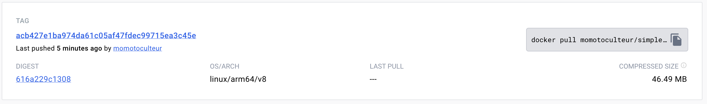

On va s'attaquer maintenant à creer notre image Docker. Cela nous permetra ainsi d'embarquer notre application pour la pousser sur un registry et l'utiliser sur un environnement disposant de Docker ou l'embarquer dans un Helm Chart.

## DinD vs Kaniko
Le moyen le plus simple est d'utiliser Docker lui même pour builder des images. Cependant il faut savoir qu'un bon nombre de CI/CD tourne sur un cluster Kubernetes, et réaliser du Docker in Docker n'est pas possible pour des raisons de sécurité et de root. En effet, tu ne peux builder d'image avec Docker dans un tel environnement. C'est pour cela que je te montre ici avec l'outils Kaniko, qui résout 2 soucis que tu rencontre concernant le docker-in-docker :

- DinD a besoin pour fonctionne d'avoir un le mode privilège
- DinD est très lent

## Example avec Kaniko
Kaniko est un outils te permettant donc de builder des images Docker dans un environnement qui tourne dans Kubernetes.

La première étape est d'avoir un **Dockerfile** dans ton repository, avec les instructions que tu souhaites pour embarquer ton application builder avec le strict nécessaire de dépendances pour tourner.

Une fois que tu as cela, on va ajouter un nouveau job dans notre Gitlab-Ci avec les étapes suivante à suivre :

```yaml linenums="1"
kaniko:
  stage: docker
  image: 
    name: gcr.io/kaniko-project/executor:v1.20.0-debug
    entrypoint: [""]
  script:
    - echo "{\"auths\":{\"https://index.docker.io/v1/\":{\"auth\":\"$(echo -n $MOMO_REGISTRY_USERNAME:$MOMO_REGISTRY_TOKEN | base64)\"}}}" > /kaniko/.docker/config.json
    - /kaniko/executor --dockerfile "${CI_PROJECT_DIR}/Dockerfile" --context "${CI_PROJECT_DIR --destination="momotoculteur/simple-test:${CI_COMMIT_SHA}"
```

1. On utilise une image debug de kaniko car on a besoin d'un shell comme image de base pour GitlabCI pour run, et de surcharger l'entrypoint de l'image pour que le job se lance depuis Gitlab
2. La première étape consiste à pousser un fichier, config.json à un endroit précis afin de donner les instructions d'authentification à Kaniko pour lui permettre d'avoir les droits d'accès à mon registry
3. Je spécifie un registry. Dans mon cas d'example, je me suis crée un registry privée sur Docker Hub. Je spécifie donc le nom de mon registry, avec un nom d'utilisateur sous la variable **MOMO_REGISTRY_USERNAME**, ainsi qu'un token **MOMO_REGISTRY_USERNAME** que j'ai généré depuis mon profil DockerHub avec les bon droits pour read/push sur mon registry. Ces 2 variables sont enregistrés en variable de pipeline que je peux setter à partir des settings de mon repository Gitlab. Celles-ci doivent être spécifiés en tant que variable sensible, nous permettant qu'elles soient cachés lorsque celles-ci sont appellés en pipeline permettant de ne pas faire fuiter notre token en clair dans la console de la pipeline.
4. Je lance enfin ma commande Kaniko, spécifiant ou est placé mon Dockerfile, le contexte de mon projet permettant à mon Dockerfile de savoir ou sont les fichiers de mon projets à packager dans mon image, ainsi que la destination de mon image, à savoir mon regitry docker privé.  Le nom de mon image sera **momotoculteur/simple-test**, et le tag de mon image sera **CI_COMMIT_SHA**, qui correpond à un sha unique de mon commit et donc de pouvoir pousser autant d'image docker que de commit. A toi de choisir un tag fix une fois que tu merges sur master, qui suit la **SEMVER** par exemple. Pour les branches de dev, à toi de te faire un tag soit unique en **-dev** par exemple afin d'avoir qu'une seule image par branche de dev histoire de ne pas surcharger le registry d'image de dev qui se fera écraser à chacun de tes commits. Si tu souhaites néanmoins une image poussé par commit, fait comme moi en utilisant une varible pré-défini provenant directement de GitlabCI

<br>


!!! success
    Super ! Notre image est bel et bien poussé sur notre registry 
