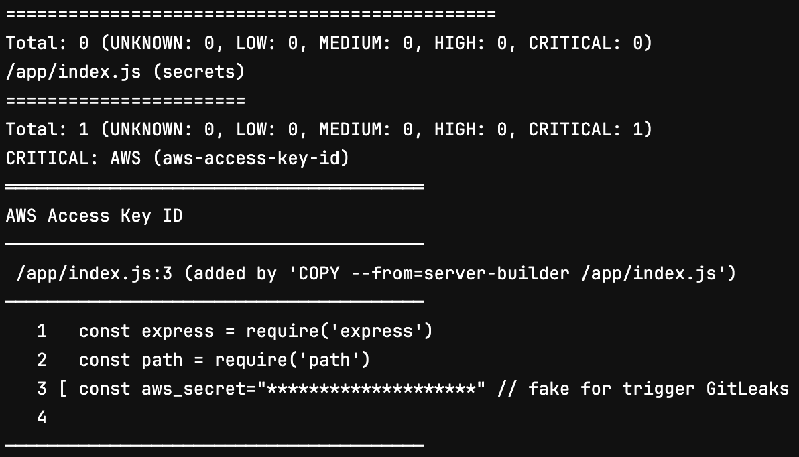
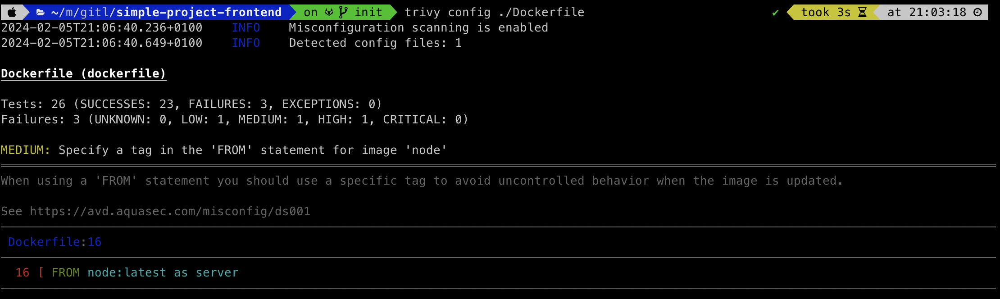

Le DevOps est une culture qui a boulversé pas mal de chose, notemment sur la sécurité, avec la notion de ShiftLeft.  
On souhaite responsabiliser d'avantage le développeur sur cette problématique de produire du code le plus sur possible. Je te montre ici quelques job qui pourrait t'aider pour améliorer tout cela.


## Example avec NodeJS
### Audit des packages - NPM
NodeJS te permet te faciliter ton développement avec des modules NPM. Ce package manager à des fonctions built-in pour te permetre d'analyser la présence d'eventuel CVE en comparant les dépendances de ton modules avec des bases de données autour de la sécurité.  

Exemple de code en CI/CD :

```yaml linenums="1"
audit: 
    stage: sast
    image: node:20-alpine3.18
    script:
        - npm audit
```

### Analyse d'image Docker - Trivy
Aquatrivy à un super outils open source, **Trivy**, qui te permet en plus d'analyser tes modules, ton image Docker. Ainsi il va pouvoir analyser les CVE que peut potentiellement contenir ta base-image.

Exemple de code en CI/CD :

```yaml linenums="1"
trivy:
    stage: sast
    variables:
        TRIVY_USERNAME: $MOMO_REGISTRY_USERNAME
        TRIVY_PASSWORD: $MOMO_REGISTRY_TOKEN
    image: 
        name:  aquasec/trivy:0.49.0
        entrypoint: [""]
    script:
        - trivy image momotoculteur/simple-test:1.0.0
```

!!! warning
    Je montre ici un simple example qui target une image fixe à scanner, mais tu dois variabilier l'image docker que tu build au job précedent. Par example **trivy image momotoculteur/simple-test:${CI_COMMIT_SHA}** pour un build de dev.  
    A toi de définir le bon tag pour target à la fois une image de dev, mais aussi l'image final une fois que tu mergeras ta branche sur master qui elle aura un tag respectant par exemple le **SEMVER** 


Example d'analyse effectué par Trivy :  


Tu n'as nullement besoin d'installer Docker pour pull l'image. Tu dois néanmoins setter les **2 variables d'environnements** pour Trivy.

<br>

Trivy peut aussi analyser les leaks, secrets et autre credentials sensible que tu pourrais leaks, lorsqu'il analyse une image Dockerfile si celui-ci est présent dans ton code source:



## Leaks & Secrets Detections

### Repository analysis - GitLeaks
**GitLeaks** va te permettre de détecter si par mégarde tu as pu faire fuiter un secret, token, et autres credentials et données sensible dont tu ne devrais pas commiter sur le répo.

Tu peux l'utiliser pour scanner le repository Git dans tout ses commits via la commande `gitleaks detect`, ou scanner ce que tu développes en local mais que tu n'aurais pas encore commité avec `gitleaks protect`.

Exemple de code en CI/CD :

```yaml linenums="1"
gitleaks:
    stage: sast
    image: 
        name: zricethezav/gitleaks:v8.18.2
        entrypoint: [""]
    script:
        - gitleaks detect -s . -v
```

Example d'output lors de la détection d'un potentiel leak :


### Helm Chart analysis - Trivy

**Trivy** peut aussi t'analyser un helm chart que cela soit pour de la misconfiguration et autres best-practices, ou encore du secrets leaks aussi.

Exemple de code en CI/CD :

```yaml linenums="1"
trivy-helm:
    stage: sast
    image: 
        name:  aquasec/trivy:0.49.0
        entrypoint: [""]
    script:
        - trivy conf --helm-values simple-project/values.yaml ./simple-project
```

Exemple de best-practices pour creer un Helm Chart évitant des problèmes de sécurité : 


### Dockerfile analysis - Trivy
**Trivy** peut aussi analyser un Dockerfile afin d'y detecter toute sorte de leaks, mais aussi te propose des best-practices !

Exemple de code en CI/CD :

```yaml linenums="1"
trivy-docker:
    stage: sast
    image: 
        name:  aquasec/trivy:0.49.0
        entrypoint: [""]
    script:
        - trivy config ./Dockerfile
```

Exemple ici de sécurité sur un Dockerfile qui ne défini pas un USER spécifique et donc potentiellement être lancé avec un utilisteur root:


Mais Trivy peut aussi te donner des best-practices comme par example de définir un tag bien précis quand tu spécifies une base image. Tu pourrais potentiellement sur un futur build avoir une update d'image majeur et avoir des API non-compatibles qui te casse ton application



