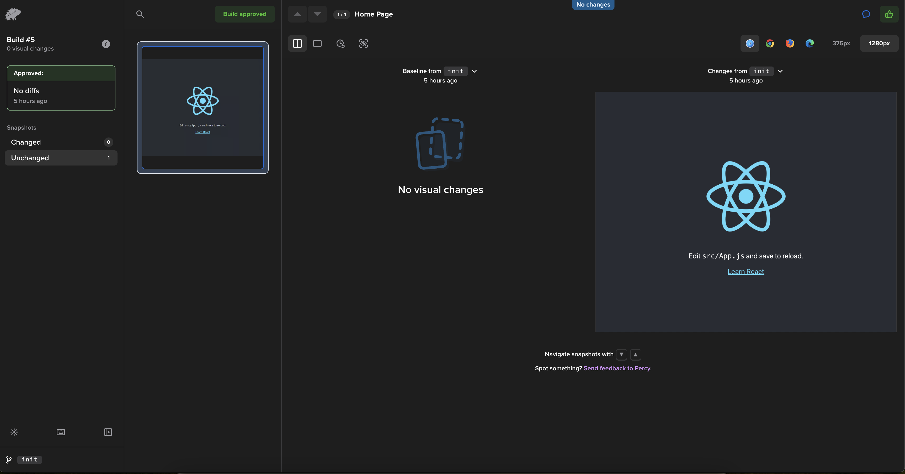
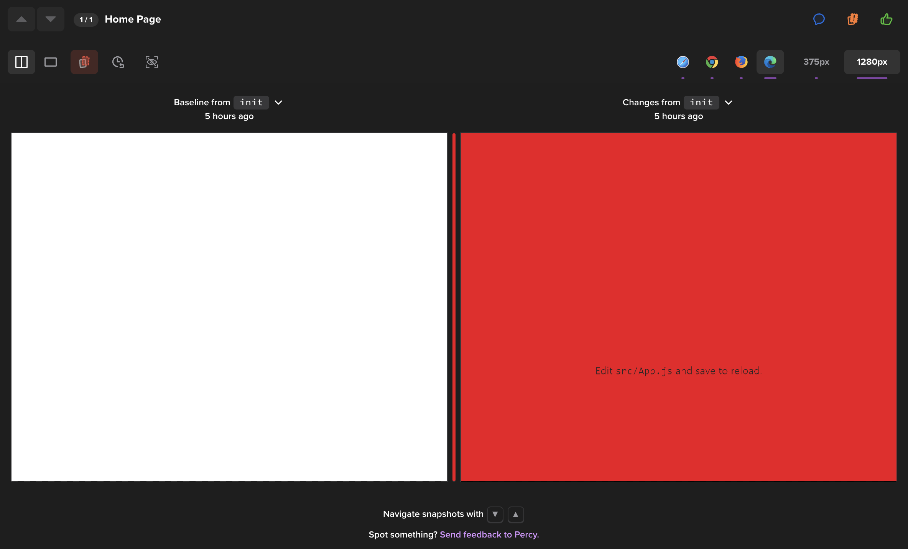
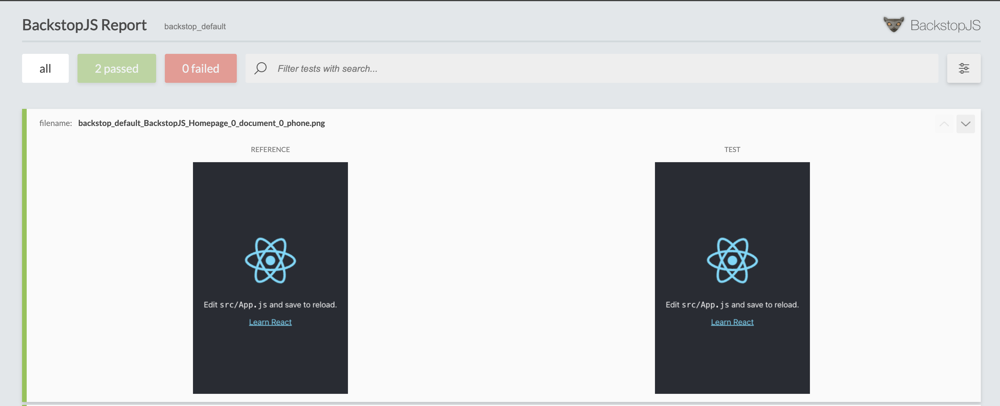

Il peut être intéréssant, lorsque vous développer une bibliothèque graphique, le design system d'une app de votre entreprise, ou un frontend qui risque d'être solicité par beaucoup de client, il peut être intéréssant d'ajouter une nouvelle batterie de test. 

Je vous propose ici de discuter de test de régression visuel.

On discutera de deux principaux tools que j'ai utilisé qui sont :

- BackstopJS, qui est open source. Tourne en local
- Browserstack Percy, qui lui est inner source et payant. Il fonctionne comme un SaaS


## Introduction
Le but ici de ces tests sont de permettre une verification entre le visuel d'un produit qui est en production (ici d'un point de vue dév, je veux dire un produit qui est sur une branche master, qui tourne en production) avec une nouvelle version que les dévs préparent en local sur leurs branches de features.

Cela à pour but d'ajouter une étape de vérification supplémentaire lorsque la feature est ajouté en production.

## Browserstack Percy
Je commence par celui-ci car c'est pour moi le plus simple à mettre en place, le plus intuitif dans son utilisation, et celui qui propose le meilleur produit pour nos tests. 

Son fonctionnement est le suivant : 

- On va devoir réaliser un build de notre application frontend ou mobile
- On va devoir le lancer en local via un serveur web (serve, http-server, appache...) pour qu'il puisse être accessible
- Percy va donc pouvoir récuperer le DOM du site.
- Percy réaliser des snapshot de notre application, et va les render avec differents browser et différents largeur pour imiter plusieurs ratio de devices différents
- C'est ici qu'il va enfin réaliser ses screenshots et faire les comparaisons entre la baseline et la feature

Il fonctionne avec de nombreux framework de test. Je vous montre ici comment l'utiliser avec la CLI officiel de Percy

### Installation de la CLI
On installe la CLI via `npm install @percy/cli`

### Setup de Percy
On ajoute un nouveau fichier de configuration à la racine 

```yaml linenums="1"
# snapshots.yaml

serve: . 
snapshots:
  - name: Home Page
    url: http://localhost:3000
```

On indique ici simplement de réaliser une comparaison sur la page d'accueil de mon site web. Je mentionne ici localhost car comme dit précédemment, je dois servir mon site web pour qu'il puisse être consulter.

### Lancement en local
On va ajouter un nouveau script NPM afin de lancer la CLI de Percy : 

```json linenums="1"
# package.json

{
    "scripts": {
        "percy": "percy snapshot snapshots.yml"
    }
}
```


### Lancement en CI/CD

On commence par setter en variable d'environnement de pipeline la variable **PERCY_TOKEN**, avec le bon acces token, disponible sur son compte Percy.

Je créer un nouveau job, avec une base de Linux Alpine. J'y installe Chromium en spécifiant bien le path de son executable. 

J'installe mes dépendances NPM, créer un build de mon application React, et lance une commande en background permettant de servir mon app web via un serveur http basique. 

Je n'ai plus qu'à lancer la CLI de Percy.

```yaml linenums="1"
# .gitlab-ci.yml

stages:
  - visual

test-visual:
  stage: visual
  image: node:20-alpine3.19
  variables:
    PERCY_BROWSER_EXECUTABLE: "/usr/bin/chromium-browser"
    PUPPETEER_SKIP_CHROMIUM_DOWNLOAD: true
  script:
    - apk add chromium
    - npm ci 
    - npm run build
    - npx serve ./build &
    - npm run percy
```




A moi maintenant de valider ou non les changes directement depuis leur application. Celui-ci renverra un code de retour à ma pipeline, permettant qu'elle soit validé ou en erreur.

Exemple ici d'un cas ou Percy detecte des changes que l'on doit approuve ou non, ici spécifié en rouge. Ici il indique absolument tout l'écran car c'est mon premier build, je n'ai encore rien de poussé sur ma branche master.



## BackstopJS
Cet outils-ci va s'executer en local uniquement.

On va devoir réaliser les opérations suivantes : 

1. Initialiser un nouveau projet BackstopJS
2. Lancer un premier build/snapshot de notre application afin de servir comme référence
3. Commit les dossier générés
4. Créer une nouvelle feature branche, et lancer Backstop à nouveau afin qu'il puisse réaliser une comparaison de snapshot entre votre branche de production et votre branche de feature

Ici on utilisera deux principales commandes.

`backstop test` afin de lancer une comparaison entre la branche de prod et ta feature branch en cours.

`backstop approve` afin de valider ta feature branch, si le contenu te paraît bon. A toi de valider les diff entre les deux branches, afin de voir si cela est une regression ou une amélioration qui doit être incorporé. Une fois le contenu courant validé, le contenu de ta feature branch devient la baseline, c'est à dire la nouvelle prod.

BackstopJS te fourni un panel d'instrument afin de pouvoir injecter des cookies, fournir des hooks de pré-test et de post-test afin de gérer si tu as des partie de ton applications qui nécéssite d'être authentifié.

### Initialisation d'un projet

Installons cet outils en global, ça nous facilitera la vie pour la suite. Mais vous pouvez bien évidemment l'installer qu'en local de votre projet, et utiliser les scripts de votre package.json afin de réaliser les mêmes appels à BackstopJS.

On commence par `npm install -g backstopjs` l'outil

On continu pour initialiser le projet avec `backstop init`. Cela va créer un panel de nouveau fichier qui va setup ton projet.

Le plus important ici à modifier afin d'adapter le boilerplate à ton projet, est de vérifier le fichier **backstop.json**

Ici je vais simplement modifier l'url de test vers **http://localhost:3000** qui correspond à la page d'accueil d'un site basique que tu developperais en react.

Ici c'est important d'avoir un serveur web qui heberge ton site afin qu'il soit accesible et navigable avec Backstop.

### Lancement en local

Pour le premier snapshot on va être obliger de valider l'existant, vu que on a pas encore de baseline avec laquelle comparer notre branche.

Pour cela on va realiser un `backstop approve` pour générer les captures d'ecrans de référence. Une fois réaliser, on pourra comparer les futurs branches avec un `backstop test`



### Lancement en CI/CD

L'utilisation de BackstopJS en pipeline risque de changer par rapport à Percy pour la simple et bonne raison que tout se fait en local via les commandes approve & test.

Un example d'utilisation serait de :

- Avoir un premier job, qui est lancé sur chaque commit de ta branch, qui run **backstop test**, afin de réaliser une comparaison entre la baseline sur master et ta feature branche. Le résultat permet de faire passer ou fail ta pipeline.
- Avoir un second job, quant à lui qui ne se lance qu'exclusivement sur un commit sur la branche master (Cf: lorsque on merge une feature branch sur master) permettant de lancer un **backstop approve**, et donc de mettre à jour la baseline de master avec les nouvelles captures d'ecrans que tu as ajoutés sur ta feature branch.

