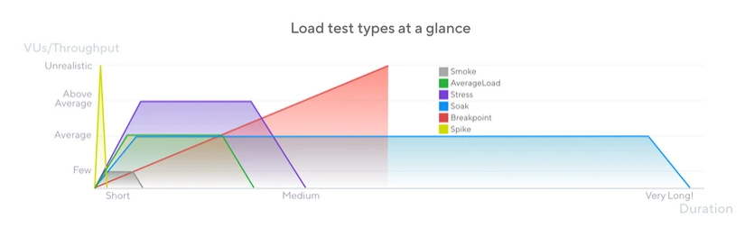
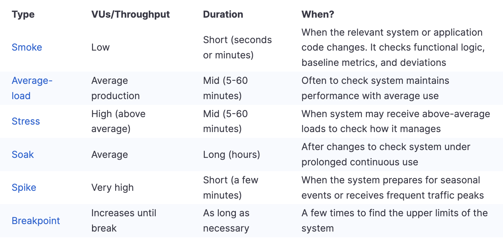
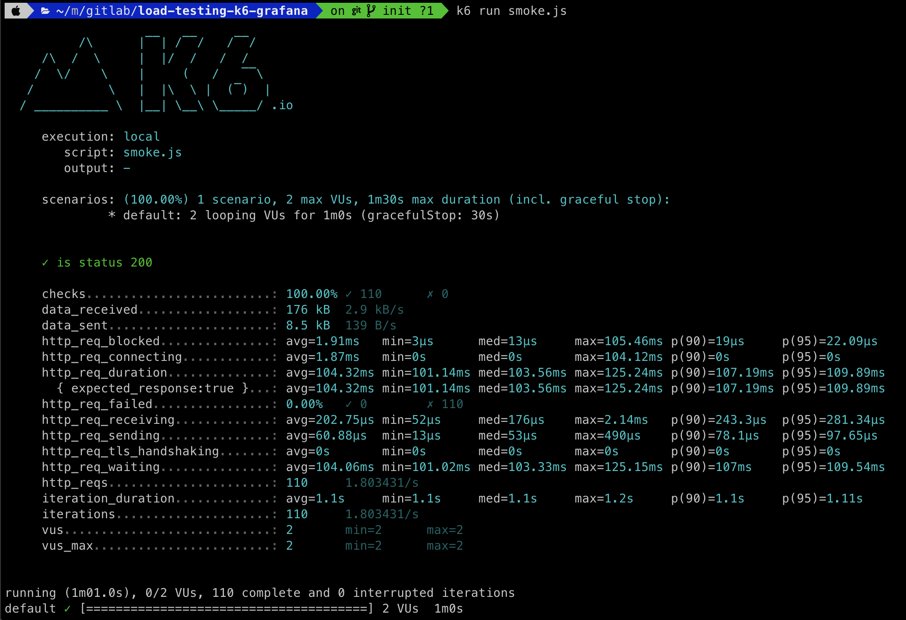
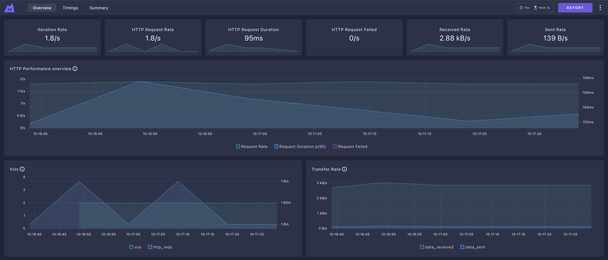
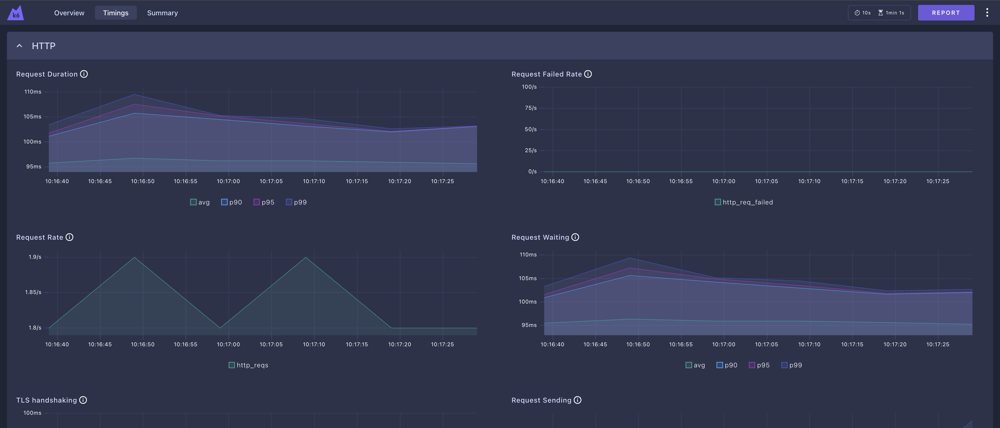
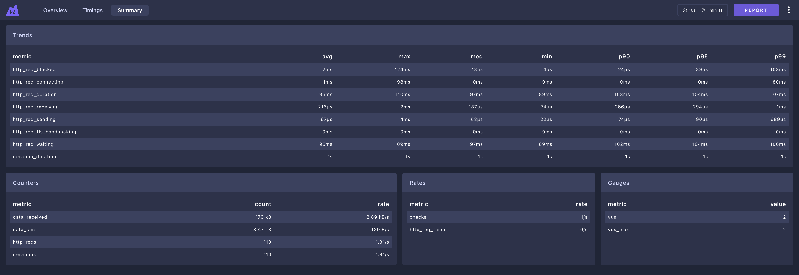
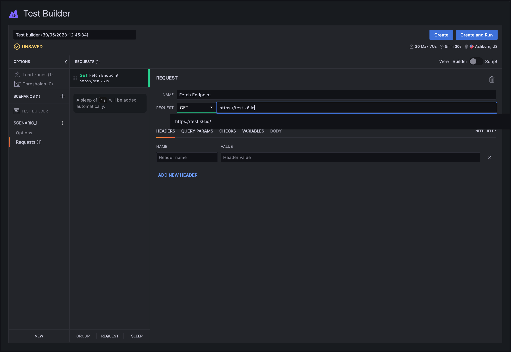

Imagine ton application, lors d'un gros évenement que cela soir sportif, lors des soldes, ou des fêtes. Le moment de l'année ou tu dois réaliser le plus gros chiffre d'affaire. Les visiteurs afflue, comme les ventes. Jusqu'au moment critique. BAM, trop de de monde, ton application devient down. RIP ta soirée de records de ventes, bonjour la mauvaise publicité avec des clients frustré et insatisfait, qui file chez la concurrence chez qui tout fonctionne.  


!!! question
    Comment pallier à ce problème et se preparer à l'avance lors de ce genre d'évenements ?

Effectuer ses propres tests de charge permet de connaitre à l'avance le flux maximal que peux recevoir ton application, ton infrastructure, ta base de donnée, chaque brique que compose ton application. Cela permet de vérifier si tu as des bottleneck, des maillons faibles qui pourrait soit ralentir le flux ou pire être indisponible.
En foncton de tes résulstats, tu peux alors connaître ou mettre tes efforts pour combler de soucis.  

**En réalisant cette opération tu t'assures que l'ensemble de ton système est hautement résilient et disponible et scalable.**  

## Comparaison entre les différentes types de tests
Il existe une multitude de test différents, qui réalise des scénarios différents et qui peuvent donc mettre en évidences plusieurs choses sur ton systeme. On pense au soak test, qui peut éventuellement mettre en évidence une fuite de mémoire sur une de tes applications, ou encore un spike test pour bench et vérifier la robustesse de ton app lors de jours exceptionnels, tel que une ouverture d'un nouveau produit sur le marché ou encore un weekend de soldes ou de black friday.



Je te met ici quelques métriques qui te définissent d'avantage en détails une comparaison précise entre les divers tests réalisable : 



## k6
C'est le tool développé pas Grafana. Open source, il est très simple à utiliser. C'est un peu l'outsider, le petit dernier crée du trio et qui se veut pour les team qui produisent des outils de type SaaS



Il propose pas mal de chose afin de permettre de gérer d'éventuels use case complexe tel que des authentication assez complexe basé sur un OIDC, bearer token ou autre cookie de session.

### Extensions disponibles 

Il a une marketplace avec quelques extensions lui donnant d'avantage d'utilités: 

- Tester d'avantage de type de protocol différents comme un client Prometheus via remote_write, de tester un container registry type Harbor, Loki, NoSQL Mongo, etc.

- Avoir des outputs différents de tes résultatas comme par example un ElasticSearch, un Kafka

- Pleins d'autres choses comme la possibilité d'avoir des systèmes de notifications variés, de proxy ou encore de protocol de Crypto

!!! note
    Pour installer et utiliser ces extensions dans ton installation de k6, tu vas devoir recompiler son binaire en utilisant Go ou Docker. Mais pas de panique, c'est super intuitif comme sytème 😉

### Dashboards 
Une nouveauté des dernières version que je viens de découvrir, et que tu peux suivre en temps réel le suivi de tes scénarios de tests, avec pas mal de métriques et d'insight différents avec la commance `K6_WEB_DASHBOARD=true k6 run test.js`







### Reports 
Tu peux automatiser la création de réports qui va te synthétiser l'ensemble des informations et métriques de ton analyse avec la commande suivante `K6_WEB_DASHBOARD_EXPORT=html-report.html k6 run test.js`

Tu peux très bien avoir les résultats une fois tout les tests passés pour les avoir en local en JSON ou CSV.

Mais tu peux très bien avoir les résultats en instantannés via un stream. K6 propose plusieurs services différents pour réaliser cela, tel que Kafka, Prometheus remote-write, etc.

### Test builder GUI
k6 te donne désormais une interface graphique pour les plus novices d'entre nous. Ceci permet de réaliser des scénaros très simplement avec la souris. Le système est ensuite capable de te générer le code de ce scenario que tu n'as plus qu'a besoin de le lancer avec la CLI de k6.



### Example de code
#### Smoke test
Ici je te propose le plus simple des tests. 
On laisse volontairement une durée courée, avec un faible nombre de VU, quelque chose qui soit inférieur à 5 si tu veux quelque chose de chiffré.

```js linenums="1"
# smoke.js

import http from 'k6/http';
import { check, sleep } from 'k6';

export const options = {
    vus: 2, 
    duration: '1m'
};

export default () => {
    const urlRes = http.get('http://example.com');
    check(urlRes, {
        'is status 200': (r) => r.status === 200,
    });
    sleep(1);
};
```

Le scénario est le suivant : 

1. On lance une requête http vers le site désiré
2. On verifie que le résultat de la requête ait bien le code de retour 200, soit une requête qui s'est correctement éxécuté. Le check sert ici d'assertion
3. On fait une pause de une seconde
4. On refait tout cela pendant une minute, avec 2 parralélisation 

#### Scénarios

Les scénarios vont te permettre de créer des types de charges soit plus réalise en ayant des charges de VU (virtual users) qui scale up ou down, réaliser des actions parrallèles, ou encore plus fine-grained afin de réaliser des choses plus complexe.

C'est l'**executor** qui va être responsable de rendre ces VU dynamique

#### Lancement en CI/CD
Je te montre ici un exemple simpliste pour lancer mon smoke test depuis une pipeline GitalbCI

```yaml linenums="1"
k6:
  image:
    name: grafana/k6:latest
    entrypoint: ['']
  stage: loadtest
  script:
    - k6 run ./smoke.js
```

## Gatling
## jmeter

