## Introduction

Projet qui consiste à reproduire le fonctionnement d'un radar automatique.

Comment fait-il, à partir d'une photo, pour reconnaître l'emplacement d'une plaque d'immatriculation, afin d'en lire les caractères ?

On s’intéressera ici dans cette première partie à la constitution du dataset nécessaire pour entraîner des modèles de réseau de neurones pour réaliser un apprentissage profond.

Je vous met [ici le lien vers mon dépôt Github](https://github.com/Momotoculteur/LicencePlateScraper/blob/master/DataScrapper/DataScrapper/spiders/plateGenerator.py#L110) avec tout le code source concernant cette première partie :)

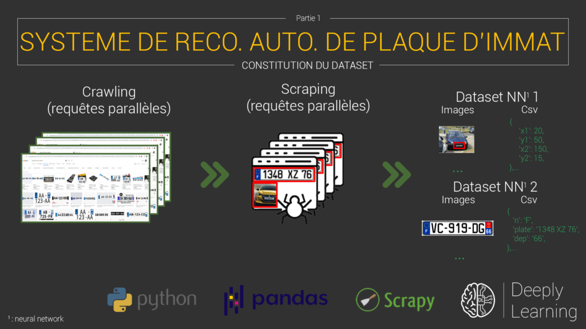{ loading=lazy }
///caption
Scénario global de notre projet
///
 

## Données nécessaires à notre projet

### Pourquoi ?

Vous avez une multitude de technique en traitement de l'image pour réaliser une lecture de caractère sur une image. Mais j'ai souhaité rester dans le domaine de la data-science, en pensant au réseau de neurones à convolution français le plus connu au monde, à savoir leNet-5 de Y.Le Cun, qui permet de transcrire en texte des chiffres écrit à la main sur une image.

Qui dit deep learning, dit nécessité de beaucoup de données.

 

### Quels types de données

Je suis partie sur l'architecture suivante :

**Entraîner un premier réseau de neurones**, pour qu'il puisse repérer une plaque d'immatriculation au sein d'une photo. On va utiliser un CNN des plus standard. Il va prendre en entrée des images de voiture, et nous extraire les coordonnées d'un rectangle contenant la plaque. Nous pourrons l'extraire par la suite de l'image pour la fournir à notre second réseau.

Notre premier dataset sera constitué de 2 parties :

- **partie 1** : regroupe des images de voitures.
- **partie 2** : un fichier CSV ou n'importe quel format permettant de stocker le nom d'une image de voiture (exemple: image1.png) associés aux coordonnées du rectangle contenant la plaque.

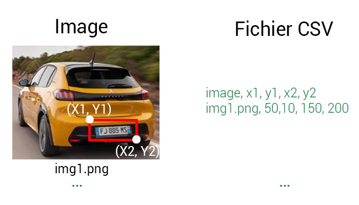{ loading=lazy }
///caption
Dataset 1 pour notre premier réseau
///
 

**Entraîner un second** **réseau de neurones** qui va prendre en entrée la sortie du premier réseau, à savoir une image sous forme de rectangle, contenant la plaque d'immatriculation de la voiture. Celui-ci encore sera un CNN standard. Il donnera en sortie, du texte, représentant les caractères présents sur la plaque d'immatriculation de la voiture.

Ce second dataset lui aussi sera en deux parties :

- **partie 1** :  regroupe des images de plaques d'immatriculation.
- **partie 2** : un fichier CSV ou n'importe quel format permettant de stocker le nom d'une image d'une plaque (exemple: image1.png) associés au caractères présent sur la plaque.
    
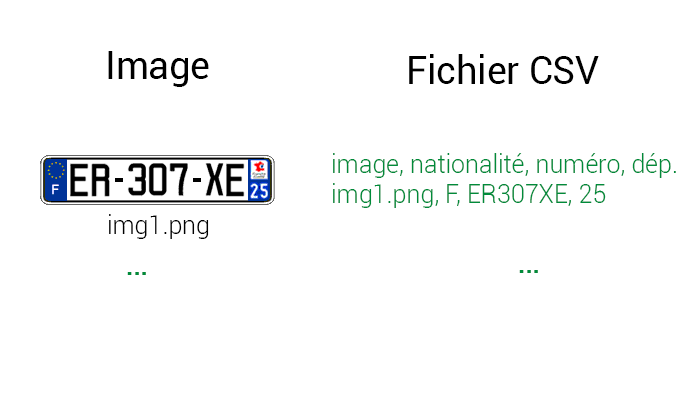{ loading=lazy }
///caption
Dataset 2 pour notre second réseau
///
  

## Constituer son jeu de données

Je vais vous présenter quelques techniques afin de récolter et réunir des données.

### Dataset pré-existant

Comme tout bon informaticien, on sait que c'est inutile de réinventer la roue. En effectuant quelques recherches, vous avez déjà de fortes chances que des chercheurs ou autres développeurs aient déjà fait le travail pour vous. En recherchant des articles scientifiques sur des moteurs de recherches spécifique ( Google Scholar, Arxiv, etc.), on peut trouver des travaux sur des reconnaissances comme celle que je souhaite réaliser. Vous pouvez des fois tomber pile sur ce que vous cherchez et gagner grandement en temps (phase de récolte, nettoyage & régulation des données, etc.), c'est tout bénéf pour vous. Ou des fois tomber comme pour moi, sur des données, mais qui ne s'adapte pas pleinement à mon cas précis pour plusieurs raisons :

- Pas de dataset sur des plaques exclusivement françaises
- Certains dataset ont des images de qualité médiocre
- Certains dataset ont très peu de données ( une centaine... )

Comme expliqué dans le point précédent, j'ai un type de données bien précis. C'est d'ailleurs pour cette raison que j'ai repoussé x fois de faire ce tutoriel, car la constitution du dataset aller être un casse-tête terrible, me demandant des fois si je ne devrais pas passer des journées entières sur la rocade Bordelaise à photographier le passage du moindre véhicule 🤣

 

### Crawling & Scraping

En effectuant des recherches sur le net, vous pouvez trouver des sites comme Google image, Twitter, Instagram, etc, contenant des images de voiture ou de plaque. Une première solution serait de réaliser des requêtes BigQuery afin de pouvoir tout télécharger (pour google), ou faire du web crawling et scraping (pour les autres réseaux). On va s'attarder sur cette seconde solution 😀

 

#### Cela consiste en quoi ? ( Théorie )

Faisons simple.

Le **web crawling** est le fait d'utiliser des robots afin de circuler et parcourir un site web de façon scripter, automatique, dans l'ensemble de son domaine.

Le **web scraping** est le fait d'utiliser des robots afin de récupérer des informations d'un site, de télécharger ses images, en bref récupérer l'ensemble de son DOM.

 

On va bosser avec des Dataframes Pandas, donc on va rester sur du Python. Et ça tombe bien, car il se prête bien à ce type d'utilisation. Les principales librairies de crawl/scrap sont les suivantes :

- **BeautifulSoup** : libraire des plus simples, donc très pratique pour ce genre de petit projet. Je l'ai utilisé pour récolter des datas pour de la détection de harcèlement.
- **Scrapy** : bien plus complet, il s'apparente à un framework à part entière, donc plus compliqué à prendre en main mais permet beaucoup plus de chose.

Pour un projet aussi simple j'aurais dû partir sur BS, mais pour le goût du défi je suis parti sur Scrapy pour découvrir de nouvelles choses. C'est vrai que BS nécessite que quelques lignes de code pour récupérer des données, chose un poil plus complexe avec Scrapy.

 

#### Initialiser un projet Scrapy

On commence par installer notre paquet :

- `pip install scrapy`

Vous pouvez l'installer aussi via Anaconda.

Dans une console initialiser un nouveau projet :

- `scrapy startproject Nom\_De\_Ton\_Projet`


Vous allez avoir l'architecture suivante :

```bash
- Projet
    - \_\_init\_\_.py
    - middlewares.py : permet de définir des customisations sur le mécanisme de comment procède le spider
    - pipelines.py : pour créer des pipelines. Les items scrapé sont envoyé là-dedans pour y affecter de nouvelles choses, comme vérifier la présence de doublon, de nettoyer des datas, qu'ils contiennent bien les champs souhaités, etc. ( on s'en fou )
    - settings.py : fichier de configuration du projet. Définissez vos vitesses de crawl, de parallélisation, nom de l'agent, etc.
    - scrapy.cfg : fichier de configuration de déploiement ( on s'en fou )
    - SPIDERS/
        - \_\_init\_\_.py
```

On a vraiment besoin que du strict minimal concernant les outils que nous propose ce framework.

On va juste s'attarder un poil sur le **settings.py**. Ce genre de technique est très peu apprécié car vous pouvez littéralement surcharger les accès à un site. Vérifier que le site ne possède pas une API publique permettant de récupérer les données souhaitées.

Pour rester courtois, renseignez les champs BOT\_NAME et USER\_AGENT. Ce qui donne pour ma part :

```
BOT_NAME = 'Crawl&Scrap'
USER_AGENT = 'Bastien Maurice (+https://deeplylearning.fr/)'

```

Utiliser des vitesses de crawl/scrap et un nombre de requête concurrente de façon raisonné :

```
CONCURRENT_REQUESTS = 16
```

Scrapy propose même des outils permettant d'ajuster sa vitesse de requêtes de façon intelligente :

```
AUTOTHROTTLE_ENABLED = True
```

```
AUTOTHROTTLE_START_DELAY = 5
```

```
AUTOTHROTTLE_MAX_DELAY = 60
```

```
AUTOTHROTTLE_TARGET_CONCURRENCY = 1.0 (le plus important)
```

#### Squelette minimal d'un spider

Un spider est un composant qui va scrap un type de donnée. Nous souhaitons scrap deux types de données, nous aurons alors deux spiders. Voici le code minimal lors de la création d'un spider :


```python linenums="1" title="squeletteMinimal.py"
import scrapy
from pydispatch import dispatcher
from scrapy import signals

class ScraperSpider(scrapy.Spider):
  name = ""
  allowed_domains = []
  start_urls = []
  
  def __init__(self):
    dispatcher.connect(self.end, signals.spider_closed)
    dispatcher.connect(self.start, signals.spider_opened)
    
  def start(self, spider):

  def end(self, spider):
    
  def parse(self, response):
```

**name** est le nom du spider

**allowed\_domains** est un tableau contenant les noms de domaines autorisés pour notre spider

**start\_urls** est un tableau contenant les URL de points de départ par où commencer à scrap

La méthode **\_\_init\_\_** est le constructeur de la classe. On va définir deux méthode (**start** et **end**) qui seront exécuté lors de l'appel de signaux (**signals.****spider\_closed** & **signals.spider\_opened**) correspondant au lancement et à la clôture du scraper.

La méthode **parse** est la méthode appelé par Scrapy, c'est ici que toute la magie du scraping va se dérouler et ou on devra définir ce que l'on souhaite récupérer du site distant 😎

 

#### Coder notre spider pour le dataset 1 & 2 ( Simple parsage )

La première idée était d'utiliser ces deux méthodes sur un maximum de site afin de récupérer un maximum de donnée. Seul bémol, j'aurais dû écrire à la main mon fichier CSV pour y ajouter le numéro des plaques. Mais j'ai réussi en creusant dans mes recherches, à trouver un site qui expose des images de plaques, avec diverses infos :

- Choix de la nationalité de la plaque ( voiture française dans notre cas exclusivement )
- Photo de la voiture en entier
- Photo de la plaque d'immatriculation (généré automatiquement, ce n'est pas un crop de la plaque de la photo)
- Date d'ajout
- Pseudo de l'utilisateur qui a ajouté

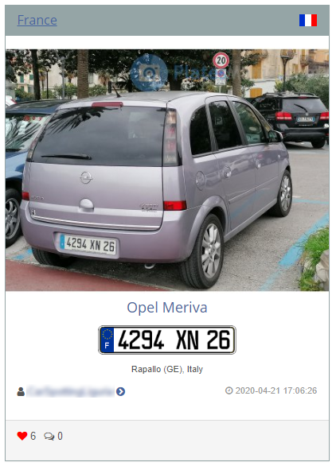{ loading=lazy }
///caption
Exemple d'une photo disponible sur le site
///
 

On va pouvoir récupérer à la fois des données pour le dataset 1 et pour le dataset 2.

Créons un nouveau fichier, **scraper.py** dans le dossier '**spider**' de notre projet Scrapy. Ajoutons-lui les attributs suivants :

```python linenums="1" title="scraper.py"
class ScrapperSpider(scrapy.Spider):
    baseUrl = "http://platesmania.com/fr/gallery-"
    name = 'licenceScraper'
    allowed_domains = ['platesmania.com']
    start_urls = [
        "http://platesmania.com/fr/gallery-0"
    ]
    csvFilepath = 'D:\\DeeplyLearning\\Github\\LicencePlateScraper\\data\\text\\dataScraped.csv'

    page = 0
    maxPage = 50

    DIRECTORY_IMG_PLATE = 'D:\\DeeplyLearning\\Github\\LicencePlateScraper\\data\\image\\plate\\'
    DIRECTORY_IMG_GLOBAL = 'D:\\DeeplyLearning\\Github\\LicencePlateScraper\\data\\image\\car\\'

    urllib.urlopener = AppURLopener()

    GLOBAL_DATA = None
```

csvFilepath : chemin de destination vers mon fichier CSV, qui va contenir les données de ma plaque d'immatriculation. Je souhaite que à chaque donnée on récupère les données suivantes :

- `date` : date à laquelle la photo a été upload sur le site distant
- `heure` : heure à laquelle la photo a été upload sur le site distant
- `voitureMarque` : marque de la voiture
- `voitureModele` : modèle de la voiture
- `imgGlobalName` : nom de l'image de la voiture global que je vais enregistrer en local
- `imgPlaqueName` : nom de l'image de la plaque que je vais enregistrer en local
- `plateNumber` : numéro de la plaque d'immatriculation
- `page `: numéro de la page en cours de scraping
- `maxPage` : nombre de page max à parser
- `DIRECTORY\_IMG\_PLATE` : dossier de destination pour enregistrer les images PNG de la plaque seule
- `DIRECTORY\_IMG\_GLOBAL` : dossier de destination pour enregistrer les images PNG de la voiture globale
- `GLOBAL\_DATA` : fichier CSV qui sera lu par la librairie Pandas

L'attribut **urllib.urlopener** va être extrêmement important. Il peut vous arriver que le site distant vous remonte une erreur, signifiant qu'il bloque les spiders qui scrap des datas. On va camoufler notre spider en lui associant une version pour le faire ressembler à une connexion venant d'un humain. Vous pouvez lui donner d'autres versions, peu importe qu'il vienne de Mozilla, Chrome, Firefox, de même pour les versions...

```python linenums="1" title="scraper.py"
import urllib.request

# BYPASS du 403 forbidden :)
class AppURLopener(urllib.request.FancyURLopener):
    version = "Mozilla/5.0 (Windows NT 6.3; WOW64) AppleWebKit/537.36 (KHTML, like Gecko) Chrome/47.0.2526.69 Safari/537.36"
```

On va pouvoir ainsi scrap nos data comme souhaité 😁

Je connecte mes signaux :

```python linenums="1" title="scraper.py"
def start(self, spider):
    self.GLOBAL_DATA = pd.read_csv(self.csvFilepath)

def end(self, spider):
    self.GLOBAL_DATA.to_csv(self.csvFilepath, encoding='utf-8', index=False)
```

**Début du scrap** : je demande à Pandas de charger mon fichier CSV contenant l'ensemble de mes datas

**Fin du scrap** : je demande à Pandas de sauvegarder mes nouvelles données en plus des anciennes en local

 

Et enfin la méthode **parse** qui permet de récupérer nos données, de les nettoyer :

```python linenums="1" title="scraper.py"
def parse(self, response):
    # J'utilise des selecteurs HTML pour atteindre mes images souhaités sur le site distant
    # Mais vous pouvez utiliser aussi des selecteurs CSS
    # Je récupère ici 6 images par page
    imgContenerAll = response.xpath('.//div[@class="panel panel-grey"]')

    # Pour mes 6 images par page :
    for imgContener in imgContenerAll:
        # J'utilise de nouveaux selecteur
        panelBody = imgContener.xpath('div[@class="panel-body"]')
        
        # Je récupère les champs de texte voulu (attribut text())
        carType = panelBody.xpath('.//h4/a/text()').get().split(' ')
        dateType = panelBody.xpath('.//p/small/text()').get().split(' ')

        voitureMarque = carType[0]
        voitureModele = carType[1]

        # car l'arg 0 est un espace
        dateAjout = dateType[1]
        heureAjout = dateType[2]

        subContenerImgGlobal = imgContener.xpath('.//div[@class="row"]')[1]
        subContenerImgPlate = imgContener.xpath('.//div[@class="row"]')[2]

        # Je récupère les urls vers les images (via attribut @src)
        urlImgGlobal = subContenerImgGlobal.xpath('.//a//img/@src').get()
        urlImgPlate = subContenerImgPlate.xpath('.//a//img/@src').get()
        plateNumber = subContenerImgPlate.xpath('.//a//img/@alt').get()

        imgGlobalName = urlImgGlobal.split('/')[-1]
        imgPlateName = urlImgPlate.split('/')[-1]

        # Déstination ou sauvegarder nos images, on prends les folder de base et on ajout le nom de l'image
        destinationFolderImgPlate = self.DIRECTORY_IMG_PLATE + imgPlateName
        destinationFolderImgGlobal = self.DIRECTORY_IMG_GLOBAL + imgGlobalName
        
        # On créer un n-uplet de donnée, selon notre image en cours de scraping
        row = {
            'date': dateAjout,
            'heure': heureAjout,
            'voitureMarque': voitureMarque,
            'voitureModele': voitureModele,
            'imgGlobalName': imgGlobalName,
            'imgPlaqueName': imgPlateName,
            'plateNumber': plateNumber
        }

        # On verifie que celui-ci n'existe pas dans notre fichier CSV, on évite les doublons
        isUnique = self.GLOBAL_DATA[
            (self.GLOBAL_DATA['date'] == dateAjout) &
            (self.GLOBAL_DATA['heure'] == heureAjout) &
            (self.GLOBAL_DATA['voitureMarque'] == voitureMarque) &
            (self.GLOBAL_DATA['voitureModele'] == voitureModele) &
            (self.GLOBAL_DATA['imgGlobalName'] == imgGlobalName) &
            (self.GLOBAL_DATA['imgPlaqueName'] == imgPlateName) &
            (self.GLOBAL_DATA['plateNumber'] == plateNumber)

        ]

        # Si non doublon, on télécharge l'image. Il nous faut son url distant, et un répertoire sur notre pc en local ou la sauvegarder
        if isUnique.empty:
            urllib.urlopener.retrieve(urlImgGlobal, destinationFolderImgGlobal)
            urllib.urlopener.retrieve(urlImgPlate, destinationFolderImgPlate)
            
            # On ajoute la data dans notre fichier CSV
            self.GLOBAL_DATA = self.GLOBAL_DATA.append(row, ignore_index=True)

    # Incrémentation de la page pour scrap la suivante
    self.page += 1
    
    # On demande à Scrapy d'aller scrap la page suivante souhaité
    if self.page < self.maxPage:
        yield Request(url=self.baseUrl+str(self.page), callback=self.parse)
```

Quelques infos utiles :

La méthode `xpath` me renvoi de base un object xpath

La méthode `.get()` me converti mon object xpath en string

L'attribut xpath du sélecteur `text()` me renvoi le champ `text`, d'une balise `<division>Coucou</division>` par exemple

L'attribut xpath du sélecteur `@src` me renvoi le champ `src`, d'une balise `` par exemple

L'attribut xpath du sélecteur `@alt` me renvoi le champ `alt`, d'une balise `` par exemple

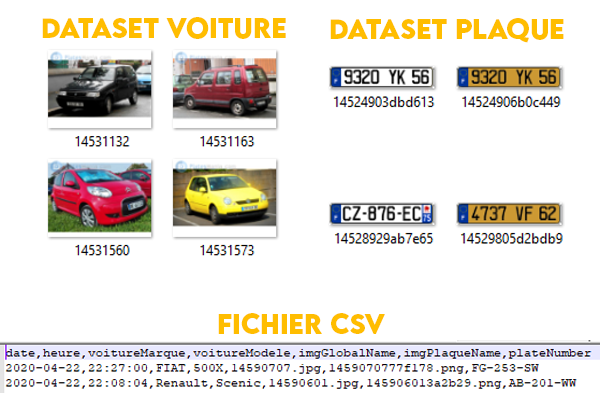{ loading=lazy }
///caption
Résultat des données récupérés par notre spider
///
 

#### Coder notre spider pour le dataset 2 ( Utilisation de leur API )

Je me suis dit pour augmenter notre dataset de façon bien plus conséquente, qu'il serait intéressant d'avoir un générateur de plaque avec des caractères aléatoire. Une image de plaque d'immat est simple à réaliser en effet. Et il se trouve que sur ce même site il y a un système permettant de réaliser nos plaques sur mesure via leur API :

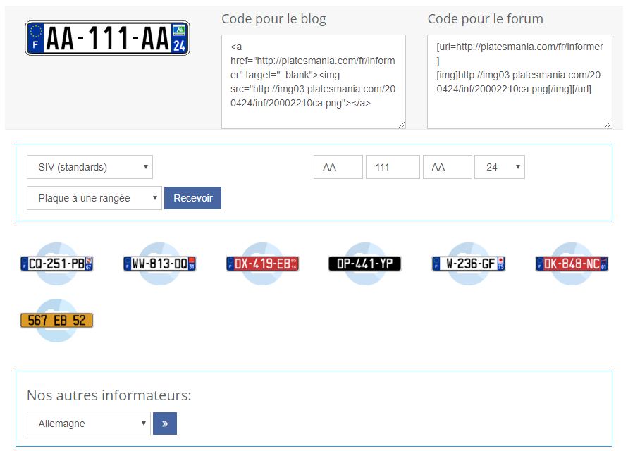{ loading=lazy }
///caption
Capture d'écran de leur système de génération de plaque
///

Comme vous pouvez le voir, on peut choisir nos plaques selon :

- La nationalité
- Le type de standard
- Le nombre de rangé
- Le département
- L'ensemble des caractères de la plaque

Après avoir remplis l'ensemble de ces informations, le site vous génère la plaque selon vos numéros choisi. J'ai souhaité rendre ce processus de façon automatique. Etant donnée que c'est nous qui rentrons les lettres voulues, on pourra les récupérer pour les inscrire dans notre fichier de données CSV.

 

Avant de se lancer dans le code, il va falloir faire une petite analyse du site, pour savoir comment générer une plaque en utilisant l'API, sans que celle-ci nous soit indiqué explicitement. En effet, contrairement à des outils tel que Sélénium, Scrapy ne peut faire des interactions directement avec le javascript, comme par exemple simuler des clics de souris sur des boutons. On a donc besoin de l'accès de l'API.

En utilisant les outils de Chrome qui sont intégrés, on va aller chercher que fait ce bouton lors d'un événement (click), et lire le code source de la page. En remontant dans les parents du bouton, on aperçoit le formulaire qu'envoi le bouton lors d'un clique. Il envoi l'action `/fr/informer` avec comme méthode `post` :

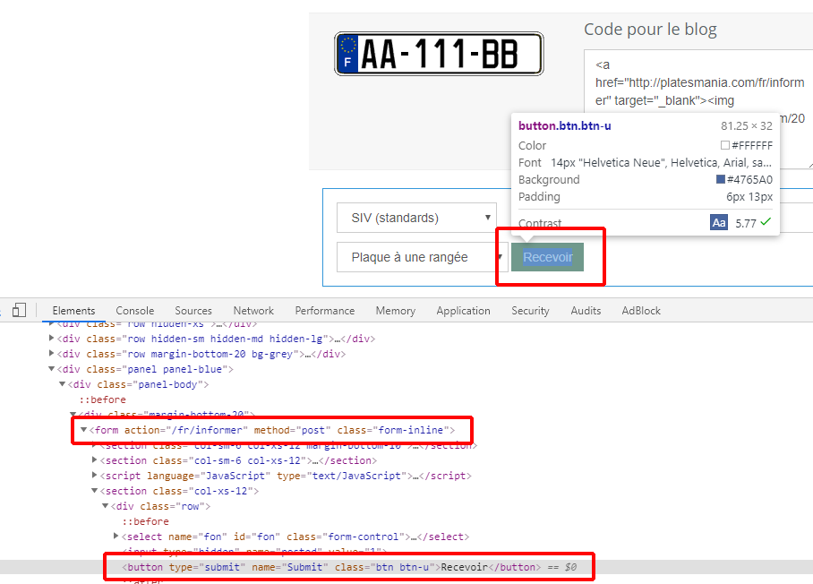{ loading=lazy }

On va maintenant aller voir du côté réseaux et des paquets qui y sont échangés. Vous pouvez enregistrer sur des périodes, l'ensemble des requêtes qui transite de vous au serveur, permettant de voir les informations qui y sont échangés. J'ai lancé mon enregistrement, puis j'ai cliqué sur le bouton pour générer une plaque. Dans l'onglet **Network**, vous aurez pleins de requêtes. A vous de les analyser pour récupérer les informations dont vous souhaitez.

J'ai réussi à retrouver l'action appelé par mon bouton :

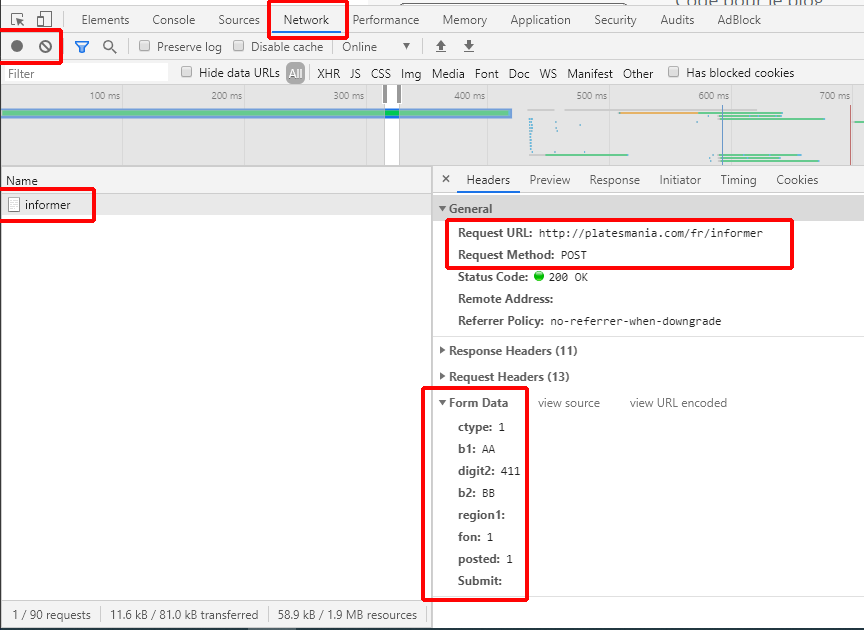{ loading=lazy }

On peut observer dans la partie Form Data, que plusieurs paramètres ont transités lors de l'appel à l'API. Celles-ci sont les données permettant de générer la plaque, donnée par les champs de texte vu précédemment et rempli par l'utilisateur. Nous devrons donc induire de nouvelles notions pour coder ce nouveau spider, afin d'y injecter des paramètres lors de notre requête au site distant.

Nous venons d’analyser brièvement le site. Passons à la pratique.

Créons un nouveau fichier, **plateGenerator.py** dans le dossier '**spider**' de notre projet Scrapy que voici :

```python linenums="1" title="plateGenerator.py"
# BYPASS du 403 forbidden :)
class AppURLopener(urllib.request.FancyURLopener):
    version = "Mozilla/5.0 (Windows NT 6.3; WOW64) AppleWebKit/537.36 (KHTML, like Gecko) Chrome/47.0.2526.69 Safari/537.36"


class PlateGenerator(scrapy.Spider):
    # Nom du spider
    name = 'plateGenerator'
    # Domaine autorisé
    allowed_domains = ['platesmania.com']
    
    #URL à lancé en premier
    start_urls = [
        "http://platesmania.com/fr/informer"
    ]
    # Répertoire destination des images de plaque généré et téléchargé
    destinationFolderPlateGenerated = 'D:\\DeeplyLearning\\Github\\LicencePlateScraper\\data\\image\\plateGenerated\\'
    # Chemin ou save et lire le fichier CSV de data
    csvFilepath = 'D:\\DeeplyLearning\\Github\\LicencePlateScraper\\data\\text\\plateGenerated.csv'
    # Fichier contener le noms des images de plaque sauvegardé en local associé à un champ de texte correspondant à cette même plaque
    GLOBAL_DATA = None
    # Permet de mettre une animation de barre de chargement dans la console. C'est la valeur du %
    pbar = None
    # Nombre de plaque d'immat à généré
    MAX_ITERATION = 3000

    # Constructeur
    # On associe un signal de début de scrap et un signal en fin de scrap
    def __init__(self):
        dispatcher.connect(self.end, signals.spider_closed)
        dispatcher.connect(self.start, signals.spider_opened)

    # Fonction appelé au démarrage du scrap
    # Permet de lire le fichier CSV si il en existe un au préalable
    def start(self, spider):
        self.GLOBAL_DATA = pd.read_csv(self.csvFilepath)
    # Fonction appelé en fin de scrap
    # Permet de sauvegarder le fichier CSV
    def end(self, spider):
        self.GLOBAL_DATA.to_csv(self.csvFilepath, encoding='utf-8', index=False)
```

Pas de nouvelles choses comparées à l'exemple précédant. On garde une version custom pour les en-têtes URL pour by-pass le **403 forbidden**.

Je définis deux nouvelles fonctions. Celles-ci vont me permettre de me générer de façon aléatoire soit seulement des lettres, soit des chiffres, de longueur que je souhaite. Elles vont me permettre de générer les valeurs de mes plaques générées :

```python linenums="1" title="plateGenerator.py"
from string import ascii_uppercase

# Génère des nombres aléatoires de longueur 'length'
def generateRandomNumber(self, length):
    return ''.join(["{}".format(randint(0, 9)) for num in range(0, length)])

# Génère des lettres aléatoires de longueur 'length'
def generateRandomChar(self, length):
    return ''.join(choice(ascii_uppercase) for i in range(length))
```

On va utiliser la méthode `start_requests`. Celle-ci est appelé de base, par rapport à notre url défini dans `start_urls` :

```python linenums="1" title="plateGenerator.py"
def start_requests(self):
    i = 0
    # On incrémente notre bar de chargement
    self.pbar = tqdm(total=self.MAX_ITERATION, initial=i)
    while i < self.MAX_ITERATION:
        # url de base de notre générateur de plaque
        url = "http://platesmania.com/fr/informer"

        # On créer les trois sous parties d'une plaque d'immat
        # 2 lettres - 3 chiffres - 2 lettres
        imatPartOne = self.generateRandomChar(2)
        imatPartTwo = self.generateRandomNumber(3)
        imatPartThree = self.generateRandomChar(2)
        imatDepartementPart = self.generateDepartementNumber()
        globalPlateGenerated = imatPartOne + imatPartTwo + imatPartThree

        # On créer un dictionnaire pour les données à envoyer en requête
        frmdata = {
            "ctype": "1",
            "b1": imatPartOne,
            "digit2": imatPartTwo,
            "b2": imatPartThree,
            "region1": imatDepartementPart,
            "fon": "1",
            "posted": "1"
        }
        
        # Je créer un dictionnaire, contenant des données que je souhaite envoyer dans la méthode 'parse'
        data = {
            "plate": globalPlateGenerated,
            "departement": imatDepartementPart
        }
        
        # Le yield va permettre de lancer la méthode parse avec les données d'une plaque
        # On incrémente ensuite afin de répéter cette opération autant de fois que l'on souhaite de plaque
        yield FormRequest(url, callback=self.parse, formdata=frmdata, meta=data)
        i += 1
```

L'ensemble du code est documenté ligne à ligne.

La dernière ligne, avec le mot clé `yield`, va nous permettre de générer une requête basée sur des données de formulaires. On lui donne les données de la plaque que l'on souhaite générer à l'API. Le paramètre `meta` n'est utilisé que pour passer des informations de ma fonction `start_requests` à ma méthode `parse`.

Cette requête appelé va être interprété par notre méthode `parse`. Comme pour le premier cas, c'est ici que tout la magie du scrapping s'opère :

```python linenums="1" title="plateGenerator.py"
def parse(self, response):
    # MAJ de notre barre de chargement
    self.pbar.update(1)
    # On récup les donneés souhaités
    urlPlateGenerated = response.xpath('.//div[@class="container content"]//div[@class="row blog-page"]//div[@class="col-md-9 col-xs-12"]//div[@class="row margin-bottom-20 bg-grey"]//div[1]//img//@src').get()

    imgPlateName = urlPlateGenerated.split('/')[-1]
    imgPlateName = imgPlateName.split('/')[-1]

    # On crée un n-uplet que l'on insérera plus tard dans notre fichier CSV
    row = {
        'imgPlaqueName': imgPlateName,
        'plateNumber': response.meta['plate'],
        'nation': 'F',
        'departement': response.meta['departement']
    }

    # Conditions de l'unicité d'un n-uplet dans notre fichier de données CSV
    isUnique = self.GLOBAL_DATA[
        (self.GLOBAL_DATA['imgPlaqueName'] == imgPlateName) &
        (self.GLOBAL_DATA['plateNumber'] == response.meta['plate']) &
        (self.GLOBAL_DATA['nation'] == 'F') &
        (self.GLOBAL_DATA['departement'] == response.meta['departement'])
    ]

    # Si unique,
    # On sauvegarde l'image de notre plaque généré & on enregistre ses informations la concernant dans notre fichier CSV
    if isUnique.empty:
        destinationFolderPlateGeneratedFinal = self.destinationFolderPlateGenerated + imgPlateName
        self.GLOBAL_DATA = self.GLOBAL_DATA.append(row, ignore_index=True)
        urllib.urlopener.retrieve(urlPlateGenerated, destinationFolderPlateGeneratedFinal)
```

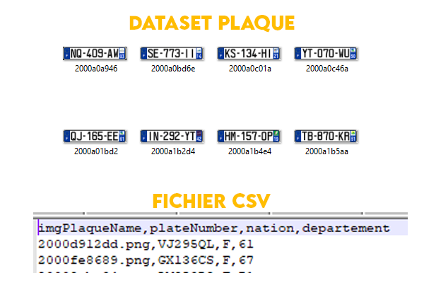{ loading=lazy }
///caption
Résultat des données récupérés par notre spider
///

## Ajuster ses données

### Ajout des coordonnées de la plaque dans le dataset 1

Après avoir craw/scrap le site en question, on se retrouve avec la photo de la voiture, le numéro de sa plaque, mais pas la position (X, Y) où se trouve la plaque sur la photo de la voiture. Cela aurait été fait dans des datasets pré-existant. Etant donné que je le constitue moi-même, je vais devoir le réaliser moi-même.

Vous avez plusieurs logiciels sur Github vous permettant d'ouvrir des images, de placer des rectangles, et celui-ci vous renvoi les coordonnées et vous permet de constituer un fichier CSV avec l'ensemble des coordonnées des images de votre dataset. ça risque d'être long et répétitif. C'est pour cela que je suis parti pour créer mon propre logiciel me permettant de tout automatiser. Cela risque de me prendre du temps, mais à terme, d'en gagner pas mal de façon proportionnelle à la taille de mon dataset.


### Coder son propre logiciel

Nous avons vu les limites pour constituer un dataset.

Que cela soit en reprenant le travail d'autres personne malgré qu'il ne corresponde pas à 100% de notre objectif. Ou le fait qu'il soit incomplet (manque de la positions X,Y de la plaque d'immatriculation au sein de la photo) lorsque on le réalise soit même par crawl/scrap. Ou encore que l'on manque cruellement de données.

**Une possible solution pourrait être de créer son propre logiciel pour générer des images ?**

On pourrait réaliser un système de génération de plaque d’immatriculation pour remplir le dataset 2 (comme le fait l'API du site précédent), ou encore coller ces plaques générées sur des photos aléatoires de Google. En effet, notre réseau de neurones 1 n'a pour but que de détecter, de localiser, et de fournir la position de la plaque au sein de la photo, rien de plus. Donc que l'on prenne de vraies photos de voiture avec de vraies plaques d'immatriculations placé au vrai endroit revient au même pour notre réseau que de générer une plaque aléatoire, et de l'insérer dans une photo aléatoire.

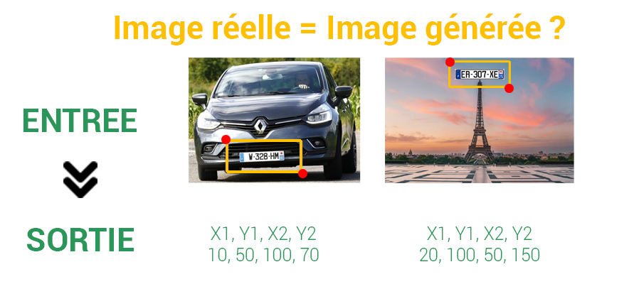{ loading=lazy }
///caption
Le fond n'est pas important, car on lui apprend à détecter seulement les plaques. Les sorties resteront les mêmes dans les deux cas
///

 
Je dit presque, car il y aura toujours une différences entre de vraies photos et des photos/plaques générés. Il ne faudrait pas entraîner notre réseau sur des données qu'il ne rencontrera pas à nouveau, du moins des données semblables. Les fonds générés ne devraient pas gêner notre système, contrairement à nos plaques que l'on va générer :

- Plaque plus ou moins inclinés et non droite selon la prise de photo
- Plaque plus ou moins éclairés selon le soleil
- Ombre plus ou moins importante selon le soleil
- Plaque plus ou moins propre (boue, moustiques, etc.)

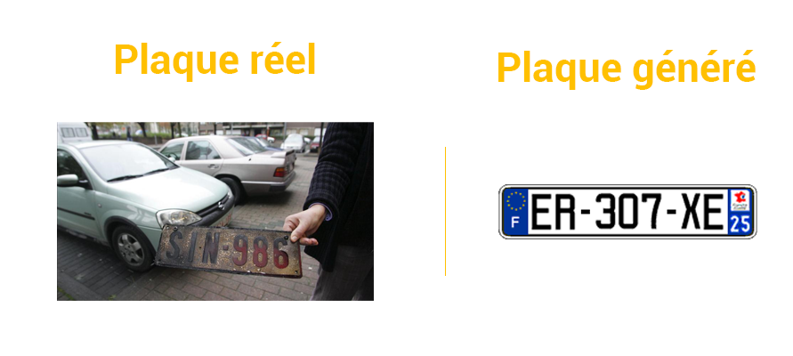{ loading=lazy }
///caption
Différences plaque généré et plaque réelle...
///

On peut prévoir d'avance des risques d'avoir quelques soucis en utilisant notre système tel quel. Il ne pourrait reconnaître que des plaques parfaitement blanches, et droite, ce qui risque de peu arriver dans la réalité sur le terrain. Il faut donc permettre à notre réseau de mieux généraliser, et donc lui fournir des cas d’exemples pour qu'il puisse apprendre plus 'intelligemment'. Il faudra donc ajouter à notre logiciel de génération de plaque le moyen de pouvoir répondre au problématiques précédents :

- Permettre d'ajouter une rotation et
- Permettre d'ajouter un effet de perspective
- Permettre d'ajouter du bruit,
- Permettre d'ajouter des assombrissement et/ou tâche

Ces effets permettront de se rapprocher un peu plus à la réalité des plaques d'immatriculation que l'on retrouve en service. Ces effets devront être généré de façon aléatoire, et ceux dans des proportions minimal et maximal définit par des intervalles.

## Conclusion

Au bout de cette première partie je vous ait données quelques pistes pour  :

- Circuler sur un site via Scrapy
- Coder son premier spider pour récupérer des données sur le net

Les données que vous souhaitez ne seront pas forcement existante sur le net, ou sous un format spécifique à votre utilisation. C'est pour cela que je vous montre que vous pouvez réaliser votre propre logiciel assez rapidement, en 10-15 jours de travail régulier pour soit réaliser de façon artificielle vos données, ou encore créer votre propre logiciel de data augmentation afin d'augmenter la taille de vos données aussi petite soient-elles.

Je vous propose de passer à la [Partie 2](radar-automatique-partie-2-detection-localisation-de-la-plaque-dimmatriculation/). On s'attaquera cette fois-ci à comment faire de la détection d'objets sur une image. Nous allons montrer comment entraîner un modèle pour qu'il puisse nous fournir les coordonnées sur une image donnée, de l'emplacement d'une plaque d'immatriculation. Nous pourrons ensuite découper cette partie de l'image afin de le donner à un second modèle, afin qu'il puisse nous lire et extraire sous forme de texte les valeurs de la plaque. Mais celle-ci se fera en [Partie 3](radar-automatique-partie-3-reconnaissance-optique-des-caracteres-de-la-plaque-dimmatriculation/) 😎

## Remerciement

Le tutoriel n'aurait pu être possible sans le site Platesmania. Pour préserver la stabilité du site, ne crawler/scraper qu'avec un nombre de requête et parallèles raisonnable.