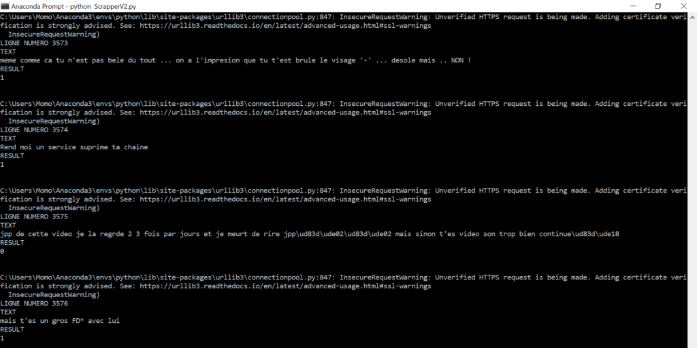

Après avoir fait un article sur de l’image et un autre sur du son, cette semaine je m’attaque à du texte. Je vous propose de réaliser un classifieur de sentiments. A me perdre sur les réseaux sociaux, je croise énormément (et je pèse mes mots) de commentaires haineux, ou l’insulte gratuite est bien connue des espaces publics dans les commentaires. Le but de ce classifieur va être d’analyser un texte, et de nous retourner si celui-ci porte une atteinte morale à une personne, quel que soit son type.

Alors oui vous allez me dire il existe des datasets déjà existants sur des millions de tweets et qui fera bien mieux que moi en termes d’efficacité. Je vous l’accorde, mais ça peut être intéressant de connaître les outils pour ajuster son dataset en fonction de ses besoins. Par exemple, un dataset pour classifier des sentiments, qui soit en français, qui prennent en compte les emojis (qui peuvent apporter des informations en plus sur les intentions du message) et qui soit classifié via plusieurs types et non juste positif/négatif. Et bien cela reste inexistant. D’où le fait de savoir récolter soit même ses données est extrêmement important.

Comme d’habitude, le code sera entièrement disponible et commenté en détails sur Github :

- [Code pour crawl une page via BeautifulSoup pour constituer son dataset](https://github.com/Momotoculteur/BodyGuardScrapper)
- [Code pour crawl Twitter via Scrappy pour constituer son dataset](https://github.com/Momotoculteur/TwitterHarcelementScrapper)
- [Code du réseau de neurones, de son entraînement, de ses modèles, etc.](https://github.com/Momotoculteur/DetecteurDeHarcelement)

 

## Constituer son propre dataset

Dans les précédents articles, je ne m’attardais pas sur le dataset. Il en existe beaucoup pour réaliser des tâches simples, et surtout de bien plus gros et déjà annoté que le mien que je vais vous présenter, ce qui nous fait un gain de temps notable. Mais comment faire si, dans une entreprise, on se retrouve avec un besoin précis sur une tâche précise dont-il n’existe pas encore de dataset ? Et bien il n’existe pas 36 solutions, il faudra le créer soit même. Pour ce tutoriel, j’aurais très bien pu le faire à la main en utilisant le maximum de synonyme possible. Seulement, il y a de grande chance que notre réseau comprenne seulement nos phrases, puisque chaque personne à un style d’écriture bien différents. Pour avoir un maximum de variétés et surtout dans un minimum de temps, je vous propose de crawl le web !

 

**Crawler le web ?**  C’est le fait de parser, d’analyser un site web et de récupérer des données. Je vous l’accorde, cette technique peut nous aider, mais ne sera pas approprié pour 100% des tâches, dans des cas précis, comme durant mon stage de master, j’ai eu besoin d’un type spécifique de donnée qui n’existait nulle part, auquel j’ai dû moi-même le constituer de A à Z. Mais pour le cas de notre classifieur, je vous propose de récupérer des données soit sur des sites telle que Jeux vidéo, Twitter ou encore l’espace commentaire de Youtube. Le but est d’avoir autant de commentaires positifs que d’injurieux.

Pour la récupération des données, il en existe pas mal, mais je vais vous parler des 3 principaux :

- Scrappy : C’est le plus connu, le plus complet, mais aussi le plus complexe à l’utilisation. Il permet de récupérer depuis des api, les informations sous format JSON.
- BeautifulSoup : Très connu aussi, je l’ai favorisé à Scrappy, quant au fait que la mise en place d’un spyder est beaucoup plus rapide et simple. En effet, il ne m’a fallu que quelques lignes pour faire mon script. Autant dire que pour débuter, c’est celui que je vous conseille !
- Selenium : Celui-ci n’est pas son but premier de crawler pour récupérer des données. Il peut le faire mais ce n’est clairement pas le plus optimisé pour ce genre d’utilisation, puisqu’il est plus orienté pour réaliser des tests sur votre application web. Vous pouvez simuler les scénarios et naviguer de bout en bout sur votre site. Cependant, il permet de faire des actions telles que la visualisation dans votre navigateur, des différents scénarios et de voir en temps réel les actions et répercutions. Il permet aussi de réaliser des clicks sur une application, ce qui peut se révéler extrêmement utile si on doit rafraîchir des données via un bouton sur le site.

{ loading=lazy } 
///caption
Exemple de récupération de données via BeautifulSoup
///

Le premier moyen que j’ai trouvé de récupérer des données est de crawl des forums de jeux vidéo, tel que JVC qui est notamment réputé pour avoir une communauté assez agressive entre leurs membres. Pour faire au plus simple j’ai utilisé BeautifulSoup. J’ai procédé de la façon suivante :

- Récupération des données brutes : pour cela rien de plus simple, on parse les pages et on récupère tout cela dans un fichier texte en local
- Nettoyage des données : et c’est ici l’étape la plus importante. En effet, le dataset doit être le plus complet, diversifié et correcte. Il ne faut pas oublier que c’est la data qui est à l’origine d’un bon ou d’un mauvais réseau en sortie, du moins en grande partie. J’ai pu rencontrer plusieurs soucis telle que l’encodage des phrases récupéré, avec les accents français écrit en code et donc qui m’a fait des phrases extrêmement bruités, ou encore des retours avec des phrases vide. Tout cela est donc à vérifier avant tout entrainement du réseau.
- Format des données : il faut ensuite donner une structure identique entre chacune de nos données pour former une dataset homogène. J’ai réalisé de la sorte suivante :
    - Phrase 1, 0
    - Phrase 2, 1
    - Etc.

Je vais associer pour chaque extrait une classe, pour indiquer si ce message est soit normal (classe 0), ou soit injurieux et présentant un risque de harcèlement (classe 1).

Autant pour trouver des textes injurieux, sexistes, homophobe ou encore raciste, cela reste une chose assez simple via une recherche par mots clés. Autant pour trouver des datas qui soient positive, cela peut être plus complexe. On se retrouve avec un premier ‘dataset’ (si on peut l’appeler ça un dataset.. :o) constitué de 1500 phrases. C’est peu, beaucoup trop peu de parser des sites indépendant. On va alors privilégier la quantité à la qualité pour ce cours ci, en allant crawler des réseaux sociaux, tel que Twitter. J’ai utilisé TweetScrapper, qui est un module libre dispo sur Github et qui est basé sur Scrapy. L’utilité de passer par ce module, est que l’on va pouvoir parcourir Twitter sans avoir besoin de l’API développeur, qui est accessible via des clés distribuées au compte goutte par Twitter. J’ai notamment essayé d’en récupérer en faisant une demande, auquel je me suis vu refuser 3 fois de suite ma demande. Je pense d’ailleurs qu’a notre ère ou la data est une ressource très convoitée, que Twitter tente de filtrer et de limiter leur accès.

C’est à ce moment-là que l’on voit que Scrapy est un outil extrêmement performant puisque qu’avec mon petit laptop, j’arrive à atteindre jusqu’à 1416 tweet récupéré par minute. Autant dire que c’est une autre paire de manche comparé à mon premier essai à crawl JVC ou encore Bodyguard pour récolter péniblement 1500 extraits.

 

**Comment je m’y suis prit pour récolter des données qui soit offensante et non offensante ?** J’ai fait quelque chose d’extrêmement simple, en faisant des re recherche de tweet selon des mots clés. Je vous mets mes 2 fonctions utilisé via Scrappy :

 

- Data négative : scrapy crawl TweetScraper -a query="pute OR salope OR pd OR connasse OR encule OR bite OR cul OR connard OR batard OR enfoire OR abruti OR gueule" -a lang=fr

 

- Data positive : scrapy crawl TweetScraper -a query="content OR excellent OR bravo OR felicitations OR heureux OR super" -a lang=fr

 

## Nettoyer le dataset

J’ai stoppé le crawling à grosso modo 50 000 extraits pour chacune de nos classes. Scrappy nous enregistre un fichier texte par tweet avec beaucoup d’informations qui nous ne serons pas utile. Or ce que l’on recherche, et d’avoir un fichier unique contenant l’ensemble des tweets avec un format le plus simple possible pour minimiser le pré traitement des données juste avant notre entrainement. Tout ce qui est fait en amont ne sera pas à faire en aval ;)

 

Exemple de tweet remonté directement depuis Scrapy :

```linenums="1"
{
  "usernameTweet": "HIRASUS298",
  "ID": "1066516448661725184",
  "text": "un jour jvai le croiser \\u00e0 chatelet jvai lui niquer sa grand m\\u00e8re surtout pcq un moment il sfoutait dla  gueule  des marocains",
  "url": "/HIRASUS298/status/1066516448661725184",
  "nbr_retweet": 0,
  "nbr_favorite": 1,
  "nbr_reply": 0,
  "datetime": "2018-11-25 03:18:30",
  "is_reply": true,
  "is_retweet": false,
  "user_id": "4537565739"
}
```

```json linenums="1"
{
  "usernameTweet": "HIRASUS298",
  "ID": "1066516448661725184",
  "text": "un jour jvai le croiser \\u00e0 chatelet jvai lui niquer sa grand m\\u00e8re surtout pcq un moment il sfoutait dla  gueule  des marocains",
  "url": "/HIRASUS298/status/1066516448661725184",
  "nbr_retweet": 0,
  "nbr_favorite": 1,
  "nbr_reply": 0,
  "datetime": "2018-11-25 03:18:30",
  "is_reply": true,
  "is_retweet": false,
  "user_id": "4537565739"
}
```
 

On va devoir réaliser plusieurs traitements de ce texte-là, afin de minimiser les temps de calculs et de faciliter le pré traitement avant d’entrainer notre réseau.

Premièrement j’ai commencé par ne récupérer que le texte du tweet et lui associer une classe, qui soit 0 ou 1 pour savoir si celui-ci est considéré comme offensant ou non. Le code est très simple je ne vais donc pas perdre de temps à l’expliquer ici, mais j’ai parcouru l’ensemble de mes fichier texte, je les ouvre et je récupérer seulement les données que j’ai besoin, car le tweet s’apparente comme état un dictionnaire. Je récupérer donc juste le contenu du champ TEXT, de la même façon que celui-ci serait un fichier JSON.

Nous obtenons à la suite de cette phase là le texte suivant :

  > _un jour jvai le croiser \\u00e0 chatelet jvai lui niquer sa grand m\\u00e8re surtout pcq un moment il sfoutait dla  gueule  des marocains, 1_

La seconde étape va être de nettoyer tout ces problèmes d’encodage. Merci python, je n’ai pas pu me débrouiller pour récupérer dès la source un texte correctement écrit… En effet j’ai eu un sacré souci concernant les accents et emojis, qui me renvoyer leur code. Tant pis, j’ai fait un nettoyage d’une façon qui s’apparente un peu à du bricolage, mais cela fonctionne et c’est le principal. On optimisera plus tard ;) .

J’obtiens le texte suivant :

  > _un jour jvai le croiser a chatelet jvai lui niquer sa grand mere surtout pcq un moment il sfoutait dla  gueule  des marocains, 1_

Malgré les fautes du monsieur, on arrive à un texte qui à du sens. Du moins un minimum de sens héhé. Une dernière étape va être de fusionner l’ensemble des tweets. En effet, rappelez vous que j’ai un fichier par tweet, ce qu’il me fait plus de 100 000 fichiers sous la main. Je vais donc pouvoir rassembler l’ensemble des tweets dans un même fichier grâce à des dataframes de Pandas.

 

Certaines de mes requêtes m’ont aussi renvoyé des textes vides. Il a fallu donc penser à plusieurs types de filtrage en plus en annexe, notamment à des textes qui étaient associés à des classes autres que 0 ou 1 suite à des soucis de crawling.

 

## Vers une reconnaissance plus pointue ?

Pour l’article je n’ai souhaité que classifier un texte en fonction de deux états, qu’il soit positif ou négatif pour me faciliter la chose avec le dataset. Mais nous pourrions aller plus loin en proposant bien d’autres états de sortie quant à une entrée. En effet une chouette utilisation serait d’avoir plusieurs niveaux pour avoir une catégorie des plus précises concernant le type d’injure, par exemple :

- Aucun risque
- Haine
- Homophobe
- Raciste
- Harcèlement morale
- Insulte
- Troll

 

Mon projet pourrait être bien plus robuste. On le lit souvent que la qualité du dataset va jouer pour beaucoup concernant les nouvelles prédictions du réseau. Il faut alors avoir un équilibre entre :

- Le nombre de données : plus vous en avez mieux c’est, car vous apportez de la diversité. En effet, selon vos données, elles doivent venir de plusieurs origines afin de diversifier les réseaux sociaux, auquel nous avons des tranches d’âges différentes, et donc des façons de parler différentes, mais aussi des communautés et donc opinions différentes.
- La qualité : mais dans l’autre cas avoir une infinité de donnée qui ne sont que peu pertinentes n’est pas bon non plus. Il faudra donc s’assurer que les données soient à la fois utiles et juste. Autant quand vous créer votre propre dataset avec vos propres données comme j’ai pu le faire dans le cours sur la reconnaissance vocale, vous connaissez l’ensemble des variables et donc vous savez ce que vous mettez dans votre jeu de donnée est juste et pertinent. Autant comme pour le cours d’aujourd’hui on ne vérifie pas les 100 000 données une par une pour s’assurer de la pertinence de chacune d’entre elle. En effet en se basant sur des mots clés je sais déjà par avance que certains de mes données seront mal classé. Exemple simple, il nous ait déjà à tous arriver d’inclure une insulte envers un amis proche, mais qui est un contexte amical.

 

## Conclusion

Nous venons de réaliser un outils permettant de classifier si un texte est injurieux ou non. Cela peut pourrait être utile sur les plateformes d’échanges de commentaires des grands réseaux sociaux pour luter contre le harcèlement moral qui peut se présenter sous diverses formes.
