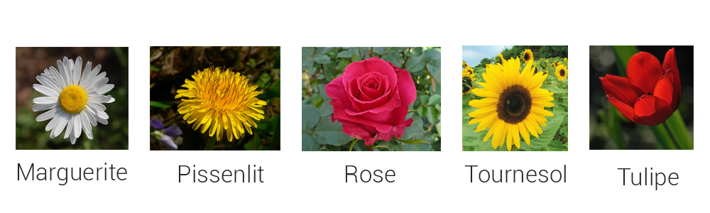
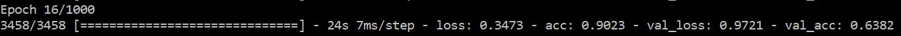
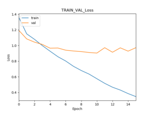
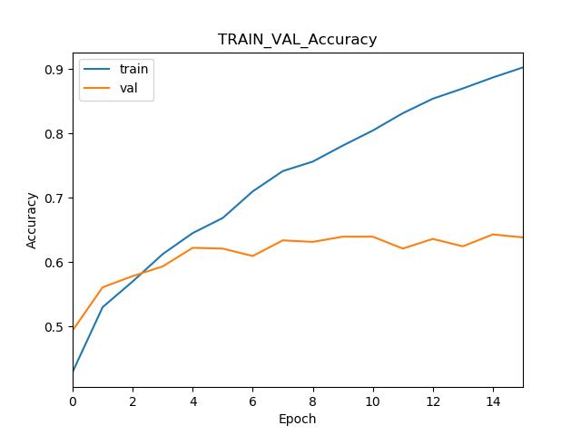
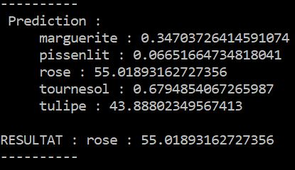
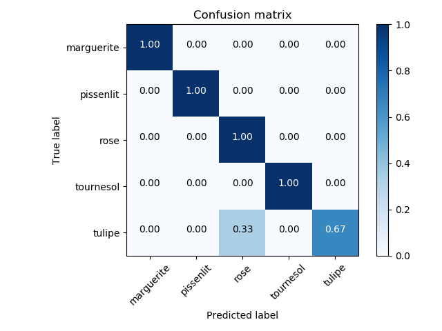

Pour ce premier tutoriel , je vous proposer de réaliser très facilement avec Tensorflow en backend et Keras en API de haut niveau, un classificateur d'images, permettant de réaliser une reconnaissance d'images. Nous allons décortiquer comment réaliser l'ensemble du processus, allant du traitement des données, à l'entrainement de notre réseau de neurones, jusqu'au test de notre modèle dans de futures condition réelles pour pouvoir avoir une idée de comment se comporte notre algorithme avant même qu'il soit intégré dans une application.

N'ayant pas tellement la main verte ( en plus d'être daltonien ), on va créer un modèle permettant de reconnaître entre 5 fleurs différentes.

{ loading=lazy } 
///caption
Voici les différentes fleurs que l'on va apprendre à notre réseau de neurones à reconnaître
///

On va sur cet article se concentrer sur les différentes notions et étapes nécessaire pour pouvoir réaliser un tel classificateur d'image. Pour la partie technique et les plus impatients d'entre vous, je vous joint [ici](https://github.com/Momotoculteur/ReconnaissanceImage) l'ensemble du code source du projet disponible sur mon Github.

C'est parti ! ;)

## Conversion de notre dataset en tableau numpy

Nous allons dans un premier temps, devoir transformer nos images d'entrées. En effet, on ne peut charger nos images en format png directement dans notre réseau de neurones. Celui-ci ne fonctionne qu'avec des tenseurs. On va donc convertir nos images vers des matrices de valeurs qui vont être empilés. Je vous ait écrit un article à propos de la constitution d'une image et quant à sa conversion, vers un tenseur de valeurs, qui correspondent aux intensités de couleurs des 3 différents canaux ( Rouge, Vert, Bleu ) correspondant pour chaque pixel composant l'image. Nous avons ainsi un fichier numpy par classe. D'habitude, la plupart des gens inclus ce processus directement dans le même fichier d'entrainement du modèle. Ce qui n'est pas optimisé puisque l'on est obligé de re-créer ces tableaux à chaque entrainement, ce qui est purement une perte de temps. Ainsi en faisant de cette manière, nous allons les créer une seule et unique fois.

## Pré traitement des données

On va devoir générer deux types différents de dataset à partir de nos fichiers Numpy :

- **Dataset d'entrainement**
- **Dataset de validation**

Le premier va permettre à notre réseau d'apprendre et d'extraire des caractéristiques distinctes de chacune de nos fleurs.

Le second quand à lui va servir à valider le modèle en fin de chaque itération au cours de l'entrainement. En effet, en montrant de nouvelles images à notre réseau, il va lui permettre de se recalibrer pour éviter de sur-apprendre les fleurs du jeu de données d'entrainement. Cette calibration va lui permettre de bien meilleurs généralisation de données.

Il faudra respecter un certain ratio entre ces deux jeux de données. A partir de notre dataset original, nous allons récupérer 80 à 90% des données pour le dataset d'entrainement, et donc de 10 à 20% pour le dataset de validation. Notre réseau à convolution va avoir comme entrée un tenseur de la dimension suivante :

**( n, w, h, c )**

- **n :** nombre total d'image de notre dataset
- **w :** largeur en pixel de nos images
- **h :** hauteur en pixel de nos images
- **c :** nombre de canaux de nos images. Correspond donc à 1 pour du noir & blanc, et 3 pour des entrées en couleurs

Il faudra donc bien faire attention de reshape nos données en les récupérant depuis nos fichiers numpy.

 

## Création du modèle

Je souhaitais reprendre le model d'alexNET. Mais étant donnée mon peu de donnée de 250Mo ( ce qui est ridicule en terme de donnée ), je suis parti sur un modèle extrêmement simple que j'ai pris au hasard. Du moins pas complètement au hasard, puisque on utilise un réseau à convolution, on doit respecter des templates concernant les empilement des différentes couches :

**\[ \[Conv -> ReLU\]\*n -> Pool \] \*q -> \[FC -> ReLU\]\*k -> FC -> Softmax**

- **Conv :** couche de convolution
- **ReLU :** fonction d'activation, Rectified Linear Unit
- **Pool :** couche de convolution
- **FC :** couche de neurones entièrement connecté
- **Softmax :** fonction d'activation à sorties multiples

 

## Entrainement du modèle

La partie rapide du projet. C'est simple, vous n'avez rien à faire, juste à attendre que votre réseau apprenne. Celui ci va se renforcer au fur et a mesure des itérations que va parcourir votre modèle sur votre jeu de donnée, devenant ainsi meilleur.

{ loading=lazy } 
///caption
Dernière itération de l'entrainement de mon réseau de neurones
///
 

## Suivit de l’entrainement

{ loading=lazy } 
///caption
Évolution de la perte au cours de l'entrainement
///

{ loading=lazy } 
///caption
Évolution de la précision au cours de l'entrainement
///

Une fois le modèle entraîné, on va vouloir voir comment il s'est comporté durant l'entrainement. Que cela soit la fonction de perte ou de précision, on va pouvoir avoir de réels informations et indices sur le comportement de notre réseau, et ce sur le jeu de donnée d'entrainement et de validation.

On peut apercevoir que le modèle n'a pas finit d'apprendre, en effet la courbe concernant le jeu de donnée de validation connait une stagnation. Nous verrons plus loin dans l'article comment améliorer notre modèle.

 

## Réaliser une prédiction

Enfin la partie intéressante ! Maintenant que notre modèle est entraîné, on va enfin pouvoir réaliser des prédictions sur de nouvelles images. Nous avons juste à le charger en mémoire, à transformer notre image au format jpg, vers un tableau numpy, puis de reshape sa dimension vu précédemment. Nous aurons en sortie un tableau de 5 valeurs, correspondant aux 5 neurones de la couche de sortie de notre modèle, et donc à nos 5 classes de fleurs. On aura pour chaque classe un pourcentage concernant sa prédiction. On prendra alors la valeur la plus élevée des 5, qui correspond donc à la prédiction effectué par notre modèle.

{ loading=lazy } 
///caption
Résultat d'une prédiction d'une nouvelle donnée depuis mon réseau de neurones
///
 

## Test de notre modèle sur un jeu de donnée entier

Maintenant que nous avons un modèle, on souhaite savoir comment il va se comporter sur de grandes quantités de nouvelles données. En effet, il serait dommage de perdre du temps de l’intégrer dans notre application pour se rendre compte bien plus tard que notre réseau n'est absolument pas fonctionnel. Perte de temps et d'argent garantie. ;)

On va donc recréer un dataset de nouvelles images, auxquelles notre réseau n'aura jamais vu auparavant, pour permettre de prédire au mieux comment notre réseau va se comporter en application réelle. Pour notre exemple, on va reprendre nos 5 types de fleurs différentes, avec des images que j'ai pu récupérer sur un moteur de recherche. Plus votre dataset sera important, et plus vous aurez une idée précise du comportement de votre réseau. Pour le cas du tutoriel ( et que je suis fenéant ), j'ai pris seulement 3 images différentes pour chacune des fleurs.

Le but de notre matrice ne va pas s'arrêter là. En effet, son application va aller bien plus loin. Il va nous permettre de mettre en évidence d'éventuel erreurs qui pourrait être critique ou acceptable, ce qui sont 2 choses réellement différentes, j'en écrirais un article d'ici peu pour de plus amples informations.

{ loading=lazy } 

On obtient un score global de 93% de bonnes prédictions sur de nouvelles données. Nous pouvons nous rendre compte qu'il a donné de parfaite prédiction concernant 4 de nos classes. Cependant, notre modèle s'est trompé sur 1 fleur sur 3, concernant les tulipes. Le but de ce procédé va donc être de viser une diagonale pour avoir des prédictions proche de 1.

 

## Axe d'amélioration

On voit sur les graphiques de suivi de métriques que notre courbe d'apprentissage laisse à désirer sur le jeu de données de validation, mais s'en sort plutôt bien sur notre jeu de données de test, de notre matrice de confusion. Pour le tutoriel, j'ai pris des photos relativement simple, ce qui peut justifier notre haut taux de reconnaissance. Il s'en sort beaucoup moins bien sur celui de validation. Je vais vous proposer plusieurs pistes pour corriger cela et vous permettre de développer un modèle bien plus robuste que le mien.

- Augmenter notre jeu de données : en effet, on a entre 700 et 1000 fichiers pour chacune de nos classe, ce qui est extrêmement ridicule. Plus on va fournir un jeu de données important et diversifié, plus il pourra apprendre et donc réaliser de meilleurs prédictions. Vous pouvez soit en récupérer d'avantage vous même à la main. Ou si votre jeu de données est cependant limité ou impossible à étendre, vous pouvez toujours utiliser des techniques de data augmentation.
- Augmenter la taille du réseau : n'ayant que très peu de données, mon choix d'un réseau aussi simple est justifié. Cependant si on augmente notre jeu de données, nous allons pouvoir augmenter la profondeur de notre réseau de neurones. Ajouter des couches va permettre au réseau d'extraire des caractéristiques plus complexes.
- Augmenter la résolution de nos images d'entrées : n'ayant pas un GPU à disposition pour mes entraînements, je suis dans l'obligation d'utiliser seulement mon CPU, me limitant ainsi dans mes calculs de tenseurs. Cependant, augmenter la résolution des images va permettre au réseau de mieux s'en sortir. En effet, plus la qualité des images du dataset est haute, et plus les prédictions en seront bonne.

 
## Conclusion

Je vous montre comment classifier des fleurs ( je vous l'accorde c'est absolument inutile ). Mais la principal chose est de comprendre la démarche du projet. Si vous comprenez comment fonctionne ce projet, vous pouvez l'appliquer ailleurs. Vous pouvez très bien faire votre propre réseau de neurones capable d'analyser des images médicales, telles que les radiographies et échographie, pour mettre en évidence d’éventuelles tumeurs qui aboutissent à des cancers pour ne donner qu'un simple exemple d'utilisation. Vous pouvez éventuellement installer des dizaines de caméras sur la voiture de votre mère, et créer votre propre voiture autonome si vous vous en sentez le courage. ;)

Je vous joint [ici](https://github.com/Momotoculteur/ReconnaissanceImage) l'ensemble de mon code source documenté et commenté sur mon profil Github, avec les informations nécessaire pour sa compilation et lancement. Vous aurez l'ensemble des informations nécessaire pour pouvoir en recréer un vous même. Je compte d'ailleurs sur vous pour me proposer d'éventuelles corrections et optimisations pour le miens. :)
