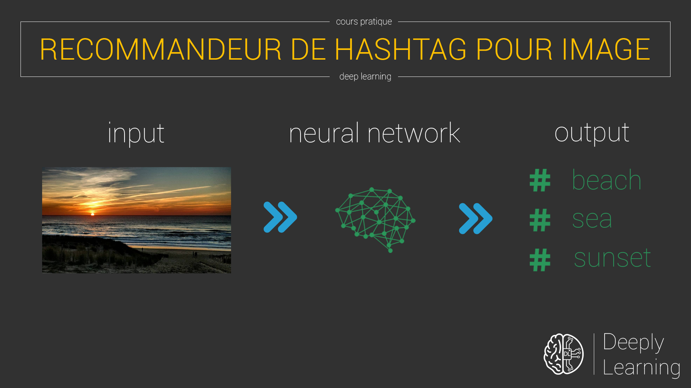
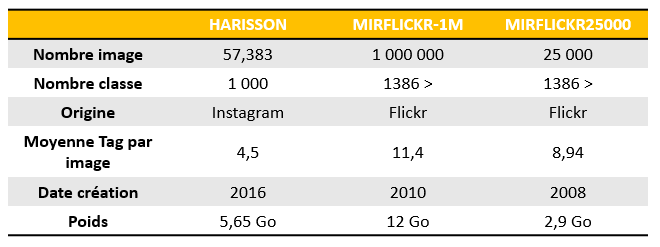
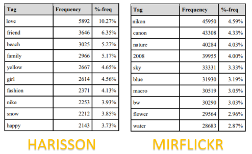
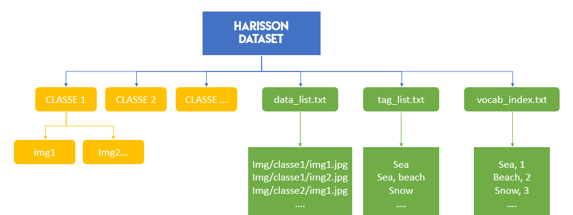
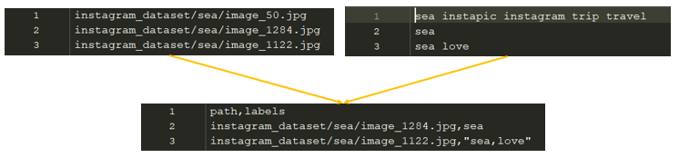
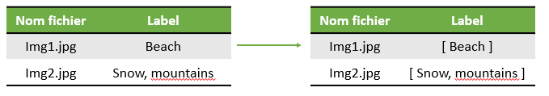
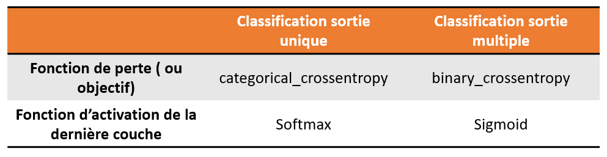

Pour ce nouveau cours, je vous propose de revenir sur de la classification d'image. Contrairement à mon cours sur la classification d'image simple, celui-ci sera légèrement différent en utilisant de la classification d'une multitude de label pour une même image donnée.

Le but est de créer un système permettant de proposer des hashtags en fonction d'une image donnée en entrée. Nous resterons sur nos outils habituels, à savoir Tensforflow en backend et Keras pour l'API de haut niveau, nous facilitant la mise en place d'un réseau de neurones, qui utilisera de la convolution pour cette fois-ci.

Comme d'habitude, le code source entièrement documenté est sur mon [Github](https://github.com/Momotoculteur/HashtagRecommandeurImage), libre à vous de venir pour me faire part d'éventuels correctifs et optimisation.

C’est parti ! 

!!! warning
    On va commencer à travailler sur des dataset assez conséquent en termes de taille, comparé aux autres tutoriels. Ce cours a pour principal but d'expliquer des méthodes, un cheminement, ainsi que des astuces pour constituer un projet en data science, et non pas d'avoir des modèles ultra performants, sinon je serais sur kaggle et non pas sur mon site perso. Travaillant sur un ordinateur portable dépourvue de carte graphique, je ne peux malheureusement pas entraîner de modèle performant.

{ loading=lazy } 
///caption
Résultat d'une prédiction de hashtag, pour une image donnée
///

## Pré-requis

Concernant le code, on va avoir besoin de quelques librairies externe pour ce projet.  Je vous laisse gérer leur installation via Conda ou Pip selon vos préférences et environnement à chacun :

- Tensorflow
- Keras
- Pandas ( gestion de tableaux performants pour la lecture et écriture de certaines de nos données )
- TQDM ( outils permettant de créer des barres de chargement au sein d'un shell, utile pour savoir où on en est du traitement de données en temps réel )
- PIL ( gestion d'image pour leur lecture et écriture )
- HARRISON dataset [(torrent)](http://academictorrents.com/collection/harrison-a-benchmark-on-hashtag-recommendation-for-real-world-images-in-social-networks)
- [Fix image corrompue + liste méta data](https://github.com/minstone/HARRISON-Dataset)

 

## Constitution du dataset

Pour créer un dataset, vous devrez crawler des réseaux sociaux proposant des images ainsi que des hastag, facilement récupérable via leur API. Je pense sans trop me tromper que les deux plus grands sont Instagram ainsi que Flickr.

 

### Crawler FlickR

Directement via leur API public : https://www.flickr.com/services/api/

 

Malheureusement pour nous, Instagram a depuis quelques années, restreint l'accès à leur API, nous empêchant de récupérer nos données. Il existe néanmoins certaines astuces pour contourner tout ça.

 

### Crawler instagram, Astuce 1

Vous pouvez récupérer des informations sur des profiles avec pas mal d'informations sous format JSON. Avec un simple parseur, vous pourrez faire votre propre outil de crawl via de simple liens :

**Avoir des informations au format JSON pour un profil spécifique :**

`https://www.instagram.com/{pseudo\_du\_profil}/?\_\_a=1`

Vous pouvez donc avoir accès aux profils que vous souhaitez, si et seulement si celui-ci est en public.

**Avoir des informations au format JSON concernant un hashtag spécifique :**

`https://www.instagram.com/explore/tags/{hashtag\_a\_tester}/?\_\_a=1`

Ne vous en faîte pas, vous pouvez récupérer les images via les liens disposés dans le fichier JSON.

 

### Crawler instagram, Astuce 2

Certains malins ont réussi à faire des outils bien plus pratique comme celui-ci ([instagram-scrapper](https://github.com/Momotoculteur/instagram-scraper-1)). Pour l'avoir utilisé, vous pouvez effectuer des recherches selon des hashtag, et donc créer son propre dataset avec ses propres classes souhaitées.

 

### Utiliser des dataset pré-existant

{ loading=lazy } 
///caption
Comparatif de 3 dataset comportant des images associés à des hashtag
///

Je n'ai pas voulu perdre trop de temps à constituer mon propre dataset, et me concentrer sur mon algorithme. J'ai trouvé deux dataset pouvant être intéressant pour notre projet :

- HARRISON : Celui qui me semble le plus adapté pour notre projet. En effet, il est plus récent, et crawler depuis instagram même. Bon compromis pour la taille. Chaque image comporte de 1 à 10 hashtag
- MIRFLICKR : Peut donner éventuellement de meilleurs résultats car composé de bien plus d'images. Cependant, il est plus orienté photo que réseau social ; je m'explique. Ses tags sont principalement orientés pour la photographie, à en suivre le schéma suivant, qui montre le top des 10 hashtag les plus cités sur nos deux dataset. Je ne pense pas dans le cadre de notre projet, le fait de mentionner un constructeur (nikon,canon...)  apportent une plus valus pour notre recommandeur. En effet, lors de la constitution de ce dataset, les chercheurs ont utilisé le fichier EXIF ( Exchangable image file format ) qui sont associés à chaque photo , lorsque on est sur la plateforme Flickr.  Ce fichier contient des méta données concernant une multitude de paramètres sur les appareils photos ( constructeur, exposition, ouverture, taille des focales et objectifs, iso, résolution, compression, etc...).

{ loading=lazy } 
///caption
Top 10 des hashtag les plus présents
///


## Pré traitement de nos données

Le dataset HARRISON est constitué de la façon suivante :

{ loading=lazy } 
///caption
Structure du dataset HARRISON
///

La façon dont est organisé le rangement des classes par dossier est parfait pour notre réseau, on ne touchera pas leur agencement. Cependant, on ne peut en dire autant pour la partie des fichiers texte qui contient l'ensemble de nos métas données qui caractérise nos classes d'images. On va devoir faire quelques arrangements.

La première étape va être de rassembler les liens des images avec leur hashtag respectif (data\_list.txt & tag\_list.txt) dans un seul et même fichier :

{ loading=lazy } 


```python linenums="1" title="preprocessData1"
df=pd.read_csv('./HARRISON/data_list.txt')
df2=pd.read_csv('./HARRISON/tag_list.txt')
df3 = pd.concat( [df, df2], axis=1)
df3.columns = ["path", "labels"]
for index, row in tqdm(df3.iterrows(), total=df3.shape[0]):
    temp = row['labels'].replace(" ", ",")
    temp = temp[:-1]
    df3.at[index, 'labels'] = temp

df3.to_csv('./HARRISON/dataTest.txt', header=["path", "labels"], index=None, sep=',', mode='w')
```

 

La seconde étape va être de changer le format du fichier vocab\_index ; on supprime les espaces inutiles, et on forme des couples => "nomTag, idTag" :

<script src="https://gist.github.com/Momotoculteur/564baa78986cf393617d84751b1dff58.js"></script>

```python linenums="1" title="preprocessData2"
colnames=['classe']
df=pd.read_csv('./HARRISON/vocab_index.txt', names=colnames, header=None)
pattern=reg.compile(r"(.)\1{1,}",reg.DOTALL)

for index, row in tqdm(df.iterrows(), total=df.shape[0]):
    temp = row['classe'].replace(" ", ",")
    print(pattern.sub(r"\1",temp))
    df.at[index, 'classe'] = pattern.sub(r"\1",temp)

df.to_csv('./HARRISON/listClass.txt', header=["classe"], index=None, sep=',', mode='w')
```

## Constitution du modèle & entrainement

On va pouvoir passer à la partie la plus fun des réseaux de neurones, entraîner notre réseaux (forcement, on a rien à faire 😎 ).

Petite astuce en cas de présence d'images qui seraient corrompues. Sois-vous téléchargez les deux images qui nous remontent des erreurs qui sont disponible sur le Github du dataset et vous aller les remplacer dans leurs dossier respectifs, soit vous pouvez forcer PIL à traiter ces images ci :

```python linenums="1" title="hackPyllow"
from PIL import ImageFile
ImageFile.LOAD_TRUNCATED_IMAGES = True
```
 

On va charger nos fichiers contenant nos métas donnés : 

```python linenums="1" title="hackColumnsNames "
CLASSE = pd.read_csv("./HARRISON/listClass.txt",sep=',', names=["classe", "index"])
df = pd.read_csv("./HARRISON/data.txt")

df["labels"]=df["labels"].apply(lambda x:x.split(","))
```

{ loading=lazy } 

La 3ème ligne va être extrêmement importante, puisque on souhaite faire comprendre à notre réseau que l'image 2 contient à la fois le label "SNOW" et "MOUNTAINS" séparé par notre virgule, et non un seul label "SNOW,MOUNTAINS". Pour cela on va convertir chacune de nos entrées en liste.

 

Nous pouvons définir l'ensemble de nos variables globales :

```python linenums="1" title="defineGlobalVar "
NB_CLASSES = 994 # Permet de fix le nombre de classe manquante du dataset
NB_EPOCH = 1
BATCH_SIZE = 32
SHUFFLE = True
IMG_SIZE = (96,96)
TRAINSIZE_RATIO = 0.8
TRAINSIZE = int(df.shape[0] * TRAINSIZE_RATIO)
LIST_CLASS = []
DIRECTORY_DATA = "./HARRISON/"
DIRECTORY_TRAINED_MODEL = './trainedModel/model.hdf5'
COLOR_MODE ="rgb"

# Chargement des noms classes
for index, row in tqdm(CLASSE.iterrows(), total=CLASSE.shape[0]):
    LIST_CLASS.append(row['classe'])
```

- NB\_CLASSES : va permettre de définir le nombre de neurone dans notre dernière couche du réseau. Nous souhaitons un neurone par classe, qui va permettre de déterminer la probabilité de la présence ou non de cette classe, qui sera entre 0 et 1.
- NB\_EPOCH : nombre d'époque durant l'entrainement. L'entrainement étant extrêmement long, je le laisse à 1 par obligation.
- BATCH\_SIZE **:** nombre de donnée envoyé dans le réseau par itération.
- SHUFFLE : permet de mélanger les données. Important puisque dans nos fichiers, ils sont listés classe par classe et donc à la suite. On souhaite que le réseau apprenne de façon équilibré et arbitraire.
- IMG\_SIZE : permet de resize nos images. Correspond à la taille de tenseur en input du réseau.
- TRAINSIZE\_RATIO : définit le ratio entre jeu de donnée d'entrainement et de validation
- TRAINSIZE : nombre d'image pour le jeu d'entrainement
- LIST\_CLASS : liste de nos labels
- DIRECTORY\_DATA : répertoire parent contenant le dataset harrison
- DIRECTORY\_TRAINED\_MODEL : répertoire ou on va aller sauvegarder notre modèle, une fois qu'il sera entraîné.
- COLOR\_MODE : permet de choisir entre des images en couleurs, ou en grayscale.

 

On va ensuite définir nos appels de retours ( callback ) appelé à la fin de chaque itération :

```python linenums="1" title="defineCallbacks "
save_model_callback = ModelCheckpoint(DIRECTORY_TRAINED_MODEL,
                                      verbose=1,
                                      save_best_only=True,
                                      save_weights_only=False,
                                      mode='auto',
                                      period=1,
                                      monitor='val_acc')

early_stopping = EarlyStopping(verbose=1,monitor='val_acc', min_delta=0, patience=3, mode='auto')
```

- modelCheckPoint : va permettre de définir comment on souhaite enregistrer notre modèle : répertoire, avec ou sans poids, etc.
- earlyStopping : va permettre de juger l'évolution d'une métrique (validation\_accuracy) sur le jeu de donnée. Si celle-ci n'évolue plus selon un certain paramètre défini, un certain gap (patiente), on stop l'entrainement

 

Nous allons ensuite charger nos images en mémoire. Contrairement a la classification d'image, on va utiliser un outils concu dans Keras qui est le _ImageDataGenerator_. Il va nous permettre des choses bien plus poussé contrairement à la méthode que j'avais pu utiliser il y a de cela quelques mois pour le chargement des images. J'avais à l'époque utilisé Numpy pour lire mes images, les transformers en tenseur, et les enregistrer sur le disque. Pour enfin dans un second temps les relire pour les charger en mémoire. L'avantage des imagesDataGenerator sont multiples

1. Une seule lecture, pas d'écriture.
2. C'est un générateur ; il envoie les données au fur et à mesure et permet donc de traiter de datasets bien plus volumineux car ne charge pas TOUT le dataset en RAM.

On a donc un gain de mémoire et de temps.

```python linenums="1" title="imageNormalization "
datagen=ImageDataGenerator(rescale=1./255.)
test_datagen=ImageDataGenerator(rescale=1./255.)
```

On définit une normalisation des données. Cela permet de traiter des données des images compris entre 0 et 1, et non plus sur l'ensemble de leurs échelles de couleurs RGB, qui s’étend de 0 à 255, ce qui permet une meilleure compréhension de la part de notre réseau ; il n'aime pas vraiment les valeurs extrêmes.

 

La classe ImageDataGenerator nous fournit 3 principales méthodes :

1. flow()
2. flow\_from\_directory()
3. flow\_from\_datadrame()

C'est cette dernière que nous allons utiliser pour traiter nos images.

```python linenums="1" title="defineFlowFromDataframe "
train_generator=datagen.flow_from_dataframe(dataframe=df[:TRAINSIZE],
                                            directory=DIRECTORY_DATA,
                                            x_col="path",
                                            y_col="labels",
                                            batch_size=BATCH_SIZE,
                                            seed=42,
                                            shuffle=SHUFFLE,
                                            class_mode="categorical",
                                            classes=LIST_CLASS,
                                            target_size=IMG_SIZE,
                                            color_mode=COLOR_MODE)

valid_generator=test_datagen.flow_from_dataframe(dataframe=df[TRAINSIZE:],
                                                 directory=DIRECTORY_DATA,
                                                 x_col="path",
                                                 y_col="labels",
                                                 batch_size=BATCH_SIZE,
                                                 seed=42,
                                                 shuffle=SHUFFLE,
                                                 class_mode="categorical",
                                                 classes=LIST_CLASS,
                                                 target_size=IMG_SIZE,
                                                 color_mode=COLOR_MODE)
```

Nous allons créer un générateur pour nos images du jeu de donnée d'entrainement, ainsi qu'un second pour celle de validation. On va pouvoir lui fournir en entrée notre dataframe chargé précédemment avec l'ensemble des chemins vers nos images, avec leurs labels associés. Les principaux attributs que l'on va utiliser sont :

- dataframe : dataframe contenant les méta données. Bien faire attention a dissocier les images du jeu d'entrainement et de validation à donner à nos deux générateur.
- directory : répertoire contenant nos images.
- x\_col : nom de colonne contenant les chemins.
- y\_col : nom de colonne contenant les labels.
- shuffle : permet de mélanger les images.
- class\_mode : choix entre le mode _binaire_ ( deux classe à prédire ) ou _categorical_ ( plusieurs ).
- target\_size : choix de la taille des images en entrée.
- color\_mode : choix entre images en couleurs, ou grayscale.
- classes : listes des labels

 

Petit point à ne pas oublier pour la suite du projet, lorsque vous voudrez tester votre modèle pour effectuer de nouvelles prédictions sur de nouvelles images. Chose que j'ai bien entendu oublier lors du lancement du fichier pour la première fois 😅.

```python linenums="1" title="labelsIndices"
labels = train_generator.class_indices
with open('./classIndice.txt', 'w') as file:
    file.write(json.dumps(labels))
```

A savoir le fait d'enregistrer les labels avec leurs indices, sous format JSON pour faciliter le parsage par la suite du fichier. C'est grâce à lui que on pourra retrouver les labels en sortie dans la dernière couche de neurone du réseau.

 

Pour gagner du temps, on va effectuer du Transfer learning. On va récupérer un réseau qui sera pré entraîné sur un jeu de donne ( IMAGENET ). Dans ce cas-là, on va utiliser MobileNetV2, en précisant la taille d'entrée de nos images avec le nombre de canaux souhaité (3 pour couleurs, 1 pour grayscale). Ce qui nous donne la dimension d'entrée de (96,96,3). On lui indique que on ne souhaite pas avoir ses couches de décisions finales, et que on souhaite du max\_pooling sur les couches de pooling.

```python linenums="1" title="modelPreTrained "
baseModel = MobileNetV2(input_shape=(96,96,3), alpha=1.0, include_top=False, weights='imagenet', input_tensor=None, pooling='max')
```

Etant donnée que les images de IMAGENET et de notre dataset sont différentes, on aura donc des sorties différentes. C'est pour cela que précédemment je ne souhaitais pas d'inclure leurs couches supérieures. On va ajouter nos propres couches de décisions pour que le réseaux MobileNet soit utilisable sur nos images à nous. Cependant, on va geler les couches profondes pour qu'elle ne puisse pas être modifié lors de notre entrainement. C'est ça le but du transfer learning, utilisé des réseaux pré entraîné, mais en modifier la surcouche pour qu'il soit adapté à nos problèmes, tout en gardant les couches profondes intactes pour gagner du temps lors de l'entrainement.


```python linenums="1" title="mergeModel"
for layer in baseModel.layers:
    layer.trainable=False

# On ajoute notre layer de classification
topModel = Dense(4096,activation='relu', trainable=True)(baseModel.output)
topModel = Dense(NB_CLASSES,activation='sigmoid', trainable=True)(topModel)

# On joint nos deux parties pour former un unique model
model = Model(inputs=baseModel.input, outputs=topModel)

# Compilation du model
model.compile(Adamax(lr=0.001, beta_1=0.9, beta_2=0.999, decay=0.0),loss='binary_crossentropy',metrics=['accuracy'])
```

La dernière ligne va nous permettre d'indiquer les entrées et sorties de nos deux modèles pour permettre de les fusionner afin d'en avoir un seul et unique. On n'oublie pas de compiler notre modèle en choisissant un optimizer de son choix. Vous pouvez trouver d'avantages d'optimizer [ici](https://keras.io/optimizers/).

Concernant la fonction d'objectif, il y a un article scientifique qui aurait démontré qu'avec un environnement ou les poids sont choisi de façon aléatoire à l’initialisation du réseau, que la cross-entropy serait plus performante que la mean-squared-error pour trouver un minimum local. L'article est disponible [ici](http://books.jackon.me/Cross-Entropy-vs-Squared-Error-Training-a-Theoretical-and-Experimental-Comparison.pdf) si vous souhaitez d'avantages d'informations, et vous pouvez trouver d'avantages de fonction de perte [ici](https://keras.io/losses/).

 

Dernière étape de ce chapitre, l'entrainement du réseau.

```python linenums="1" title="trainModel"
model.fit_generator(generator=train_generator,
                    steps_per_epoch=STEP_SIZE_TRAIN,
                    validation_data=valid_generator,
                    validation_steps=STEP_SIZE_VALID,
                    epochs=NB_EPOCH,
                    callbacks=[early_stopping,save_model_callback],
                    verbose=1
)

# Evaluation du modele
model.evaluate_generator(generator=valid_generator,
steps=STEP_SIZE_VALID)
```

- generator : définit le générateur du jeu de donnée d'entrainement.
- validation\_data : définit le générateur du jeu de donnée de validation.
- callback : définit les appels de retours effectué à chaque fin d'époque.

 

## Prédiction sur de nouvelles images

Le but est de créer un nouveau fichier ou on va devoir redéfinir le même environnement de pré-traitement des images que lors de l'entrainement, pour lui donner à notre modèle, des formats d'images identiques à celui durant lequel il a appris. La première étape va donc être de créer un fichier texte pour indiquer les chemins des images que l'on souhaite prédire leurs hashtags, en remplissant notre fichier imgTest.Txt.

```python linenums="1" title="imgTest.txt"
path
img/img1.jpg
img/img2.jpg
img/img3.jpg
```

 

On va donc pouvoir ensuite charger le modèle, charger notre dataframe contenant nos chemins vers nos images de test, accompagné de leurs labels respectifs.

Ensuite, on va recréer notre ImageDataGenerator avec les mêmes paramètres de normalization d'image que on avait lors de l'entrainement.


```python linenums="1" title="defineEnvironnement "
# Chargement du model
model = load_model('./trainedModel/model.hdf5')

df = pd.read_csv("./dataTest/imgTest.txt")

# Permet de normaliser nos imades d'entrées
test_datagen=ImageDataGenerator(rescale=1./255.)

# Chargement des images de test
test_generator=test_datagen.flow_from_dataframe(
                                    dataframe=df,
                                    directory="./dataTest/",
                                    x_col="path",
                                    batch_size=1,
                                    seed=42,
                                    shuffle=False,
                                    class_mode=None,
                                    target_size=(96,96))
```

 

On va pouvoir définir notre générateur de prédiction basé sur notre modèle entraîné :

```python linenums="1" title="definePredictGenerator"
test_generator.reset()
pred=model.predict_generator(   test_generator,
                                steps=STEP_SIZE_TEST,
                                verbose=1)
```

 

Pour une image en entrée, nous auront une sortie composée de 1000 prédiction entre 0 et 1, correspondant à nos 1000 classe.


```python linenums="1" title="defineTreshold"
booleanPrediction = (pred > 0.1)

listPrediction=[]

labelsList = json.load(open("./classIndice.txt"))
labelsList = dict((v,k) for k,v in labelsList.items())
```

On va devoir définir un interrupteur booleen, pour lequel on lèvera si un label est présent ou non dans une image si la prédiction de celui-ci dépasse la valeur de l'interrupteur. Pour notre modèle, on lève un flag de présence si une prédiction pour une classe donnée dépasse 10% de probabilité. On se chargera par la suite à charger notre fichier JSON crée précédemment.

 

On va ensuite itérer sur l'ensemble de nos images séparément :


```python linenums="1" title="iterateOverPredictionArray"

for img in booleanPrediction:
    correctPredictList=[]
    for index,cls in enumerate(img):
        if cls:
            correctPredictList.append(labelsList[index])
            print(cls)
    listPrediction.append(",".join(correctPredictList))
```

On va pouvoir comparer le tableau de probabilité à la suite d'une prédiction d'une image, avec notre fichier JSON. Cela va nous permettre de savoir à quel label appartient tel ou tel flag qui aura été levé, vu que on a seulement sa position dans le tableau à la suite d'une prédiction.


Dernière étape du projet :

```python linenums="1" title="printResultPrediction"
pathImg=test_generator.filenames

results=pd.DataFrame({"Chemin img":pathImg,
                      "Predictions":listPrediction})
print(results)
results.to_csv("results.csv",index=False)
```

On va récupérer l'ensemble des chemins des images que l'on a insérer dans notre générateur de prédiction, et les fusionner à notre tableau des sorties de labels effectué précédemment. A votre souhait de vouloir les afficher dans la console, ou les enregistrer dans un fichier csv.

 
## Axe d’amélioration

- Vers une reconnaissance de lieux ou de monuments ?

En effet, on a peu parlé du fichier EXIF que compose les images venant de Flickr. Mais on pourrait penser à l'exploiter davantage pour éventuellement avoir de nouveaux types d'informations pertinentes qui pourrait nous renseigner, afin d'avoir un système permettant une reconnaissance de monuments connus, ou encore de lieux grâce aux données géographique présent, via la latitude et longitude.

 

## Conclusion

Nous venons de voir à travers de ce projet comment réaliser un recommandeur de hashtag selon une image en entrée. Mais celle-ci est en réalité une simple classification d'image à multi label. On peut le comparer à une classification simple d'image. Les principaux changements entre ces deux types de classifieurs seront les suivant :

{ loading=lazy } 
///caption
Comparatif des différences entre un classifieur à sortie unique et un classifieur à sortie multiple
///

- Fonction d'activation : Pour la dernière couche d'un classifieur à sortie unique, on souhaite une seule classe qui corresponde à notre donnée d'entrée. Par exemple un classifieur chien/chat ne nous donnera qu'une de ces deux classes en sortie. On a donc un impact entre les deux classes, elles sont dépendantes. En effet quand le modèle pense détecter une forte proba pour une classe ( chien 95% ), l'autre classe sera donc faible ( chat 5% ), car c'est les probas de l'ensemble des classes qui sont égale à 1 ( soit :  proba(chat) + proba(chien) = 1). On choisira alors la fonction d'activation _**softmax**_.  Alors que pour une classification à sortie multiple, on souhaite que le calcul de la proba des différentes classes soit indépendante, puisque plusieurs classes peuvent être présent dans notre donnée d'entrée. On aurait donc : 0 < proba(chat) < 1 et 0 < proba(chien) < 1. Pour cela on doit donc utiliser la fonction d'activation sigmoid.
- Fonction de perte : Celle-ci est choisi selon le problème à résoudre. Comme expliqué au point précédent, on n'a pas le même problème à résoudre. On aura donc pas la même fonction d'objectif.

 

Je vous joins [ici](https://github.com/Momotoculteur/HashtagRecommandeurImage) l’ensemble de mon code source documenté et commenté sur mon profil Github, avec les informations nécessaire pour sa compilation et lancement. Vous aurez l’ensemble des informations nécessaires pour pouvoir en recréer un vous-même. Je compte d’ailleurs sur vous pour me proposer d’éventuelles corrections et optimisations pour le mien.

 
