## Introduction & code source Github

Je vous met ici l'ensemble du code source sur mon dépôt Github, avec un exemple concret de segmentation sémantique d'images sur la reconnaissance de carries sur des radiographies dentaire.

 

## Que-ce que la segmentation sémantique ?

Ce type de segmentation consiste à classifier chaque pixel d'une image en un label.

 

### Types de vos données

En entrée, nous allons envoyer à un réseau de neurones des images RGB. Mais de façon concise, notre image RGB à la forme d'un tenseur d'ordre 3 et de dimensions ( hauteur x largeur x 3 ). Le 3 est le nombre de canal. 1 pour une image noir/blanc, 3 pour RGB. Un canal pour le rouge, un pour le vert, et un dernier pour le bleu. Chaque valeur de la matrice représente donc un pixel. Ce pixel qui à une valeur entre 0 et 255, selon l'intensité de la couleur d'un canal spécifique.

En sortie, on souhaite avoir une matrice de dimensions (hauteur x largeur  x 1), avec chaque pixel ayant n'ont pas une intensité entre 0 et 255, mais un nombre correspondant à nos classes. La valeur du pixel est donc compris entre 0 (indice du background) à n (nombre de classe dans nos images).

Une image sera plus parlante :

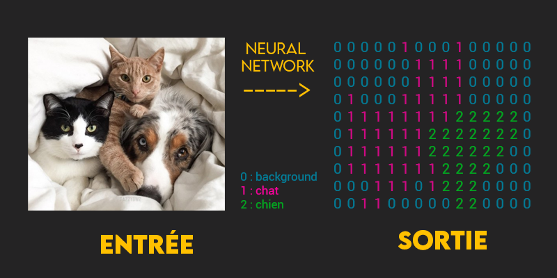{ loading=lazy }

 

### Dataset X et Y

Pour réaliser ce genre de classification on utilise de l'entrainement supervisé. Cela consiste à entrainer notre réseau de neurones sur des couples (X, Y).

- X est votre image dans laquelle vous souhaitez analyser la présence ou non d'une classe
- Y que l'on peut appeller son 'étiquette', est ce que l'on cherche à avoir. Cela correspond donc à nos masques contenant nos classes à détecter. Nous allons détailler juste après la notion de masque.

 

## Labeliser les données

Nous avons précédemment parlé de masque. Un masque est une partie de votre image que l'on souhaite mettre en évidence. Dans notre cas, le masque sera un polygone représentant une carrie. Selon le type d'objet que vous souhaitez détecter, cela pourra avoir une forme de carré, cercle, etc.

Pour chacune de vos images, vous aller devoir donc générer les masques, et par la suite les labéliser, les annoter. Via des logiciels spécialisés (VoTT, SuperAnnotate, LabelMe, etc), vous allez pouvoir segmenter vos classes au sein de vos images. Voici un Example de segmentation de Carrie sur des radiographies :

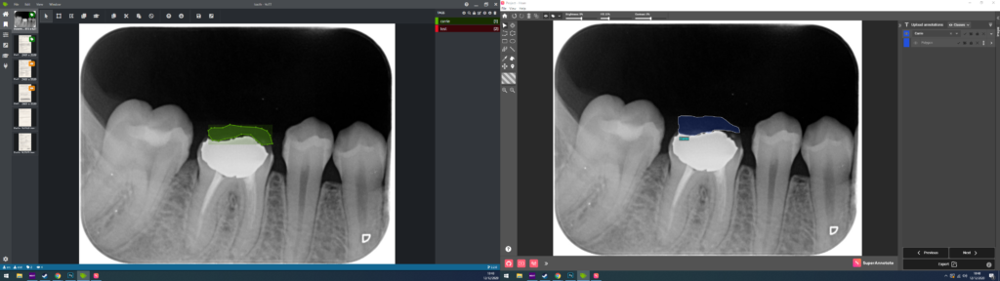{ loading=lazy }

 

A la suite de cette phase d'annotation, selon le logiciel que vous utilisez, il va vous générer un fichier (JSON dans mon cas, mais cela peut être dans le format que vous voulez). Celui-ci contiendra pour chaque photos un ensemble de coordonnées, de points (X,Y) correspondant aux formes géométriques que vous aurez dessiné sur le logiciel.

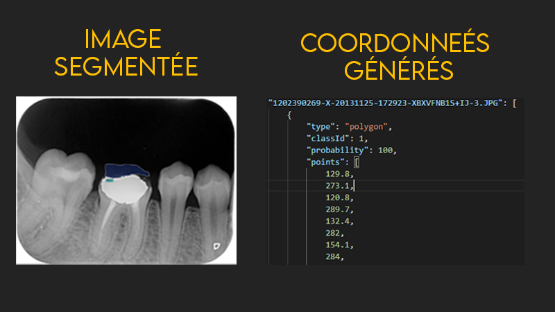{ loading=lazy }

Dans l'exemple précédent, on peut voir que pour une photo, j'ai le type de forme géométrique utilisé pour mon masque de carie, un ID de classe, une proba, et un tableau de coordonnées de points.

 

## Génération des masques

Vous devez accorder la configuration de vos masques selon ce que vous souhaitez avoir en sortie du réseau. Vous allez utiliser une fonction d'activation spécifique afin de faire de la prédiction d'une valeur binaire, ou utiliser une autre fonction d'activation pour de la prédiction multi classes. Mais vous pouvez très bien utiliser l'une ou l'autre selon comment vous agencez vos données. On va voir cela dans les prochaines lignes.

Ces différences de configuration de masque concerne la fonction d'activation de la couche final de votre réseau. Et selon elle, vous devez accorder vos métriques et fonction de perte.

 

### Génération du masque

Pour générer vos masques, vous allez devoir parcourir l'ensemble de vos radiographies une à une avec le fichier JSON de coordonnées qui lui est associé. Vous allez pouvoir tracer des masques  via plusieurs procédés. Le but est de remplir des matrices Numpy, avec la classe souhaités contenu dans chaque pixel.

Pour vous donnez des idées de librairies pouvant le faire facilement :

- Skimage via Polygon2Mask
- Pillow (PIL) via ImageDraw
- Scipy
- OpenCV
- Matplotlib via points_inside_poly

 

Exemple d'un masque crée via Skimage :

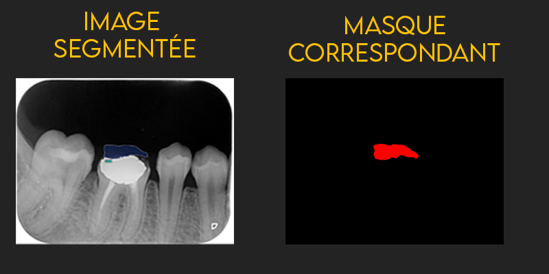{ loading=lazy }

 

⚠️ Un point extrêmement important qui m'a bieeen fait galérer dans mes prédictions concernant la génération de mes masques sont le format de sauvegarde.

En effet pour les sauvegarder, privilégiez les formats PNG ou TIFF. Car JPG est un format comprimé et vous allez perdre de l'information voir pire avoir des changements de classe. TIFF est un format sans perte, un peu lourd. PNG est un format compressé mais sans perte, donc vous pouvez le choisir sans soucis.

 

### Integer ou One hot encoding ?

Comment définir nos classes pour que notre réseau apprennent à les reconnaîtrais ? Vous pouvez avoir le choix selon votre type de segmentation, qu'elle soit binaire ou multi-classes. Comment donc définir nos classes dans nos matrices ?

 

**Integer encoding** consiste à donner un entier, un nombre unique qui sert d'identifiant unique pour chaque classe. Pour un exemple avec 3 classes différentes, on peut définir comme ci :

- `Chat, 0`
- `Chien, 1`
- `Lapin, 2`

Dans notre exemple, chaque pixel aura donc une valeur entre 0 et n, correspondant au nombre de classe total présent au sein de notre dataset.

 

**One hot encoding** consiste à définir un ensemble de colonne selon le nombre de classe possible. Chaque colonne représente une seule classe. Seul la colonne représentant la classe aura comme valeur 1. Les autres colonnes auront comme valeur 0. Si on prends pour trois classe (chat, chien, lapin) on aura un vecteur de la forme suivante :

`[probabilité chat, probabilité chien, probabilité lapin]`, soit `[0, 0, 1]` par exemple, si on a un lapin à prédire.

Dans notre exemple, chaque pixel aura donc comme valeur un tenseur d'ordre 1, un vecteur. Celui ci sera de taille n, correspondant au nombre de classe total présent au sein de notre dataset.

 

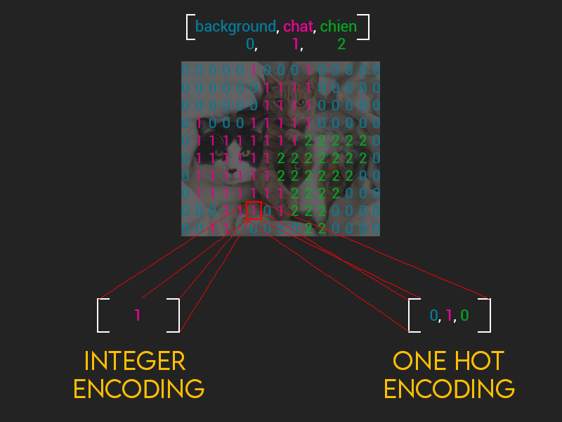{ loading=lazy }

 

Pour résumer, si vos données ont des relations entre elles, privilégiez l'**integer encoding**. Dans le cas contraire ou vos données n'ont pas de relation, privilégiez le **one hot encoding**.

 

### Préparation des données pour du binaire ( 1 classe en plus du background )

Votre fonction d'activation final sera sigmoid.

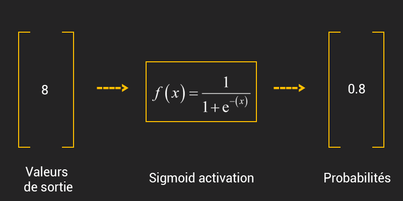{ loading=lazy }

 

### Masque et fonction d'activation finale du réseau pour du binary class

Vous aurez donc des masques de dimensions `[Hauteur, Largeur, 1]`. Chaque pixel aura une valeur comprise entre 0 et 1.

De façon concrète vous aurez ceci en sortie de prédictions :

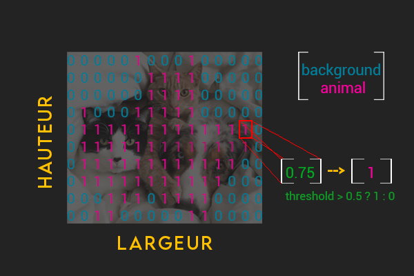{ loading=lazy }

En fonction de la sortie, vous aurez un hyperparamètre de sensibilité à définir, un 'threshold' permettant de définir la frontière entre votre classe 0 et 1. Pour le cas de l'exemple si dessus, j'ai mis '0.5'. Vous êtes obligé de choisir une fonction d'activation finale sigmoid.

 

### Préparation des données pour du multi-classes ( > 2 classes )

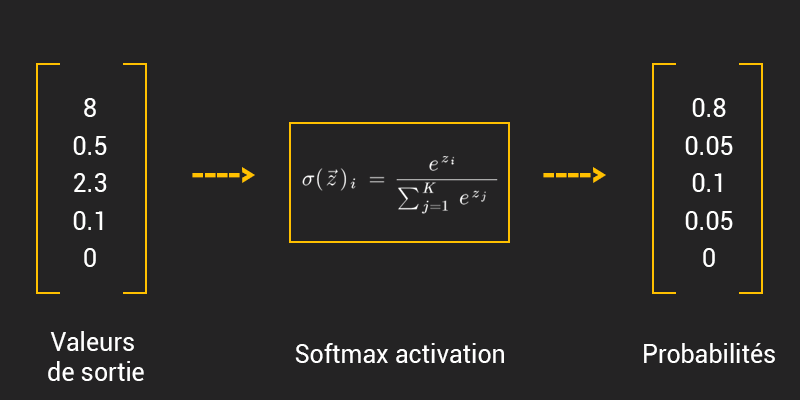{ loading=lazy }

Pensez à ajouter une classe supplémentaire étant le background. En effet elle servira de classe 'poubelle' si on ne rencontre aucun de nos classes.

Pour les sauvegarder étant donnée que l'on aura N canal, on ne peut utiliser le TIFF ou PNG car ils ont (je fais un raccourcie et une généralité car c'est plus complexe que cela) que 4 channels (rouge, vert, bleu alpha pour la transparence). Donc vous pourrez les sauvegarder directement sous leur format matricielle Numpy (.NPY).

 

### Masque et fonction d'activation finale du réseau pour du multiclasses

Selon le type de fonction d'activation finale pour votre dernière couche de votre dernier neurone de votre réseau, vous aurez un agencement différent de vos données en sortie. Vous devrez donc prendre en considération pour en faire autant avec vos masques que vous générez et envoyer en entrée du réseau lors de la constitution de votre dataset.

 

**Output d'un réseau basé sur sigmoid :**

Tenseur de taille : `[hauteurImage x largeurImage x nombreClasses]`

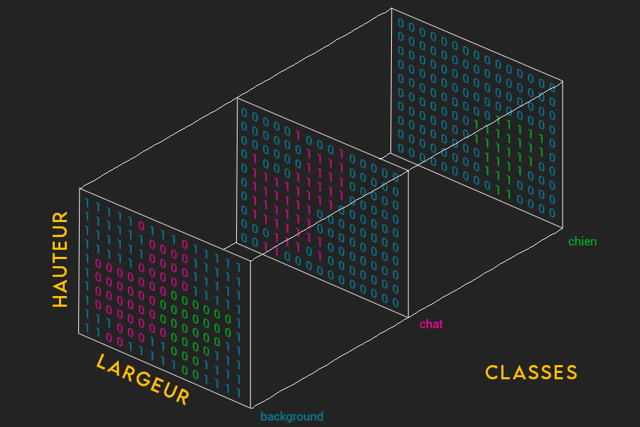{ loading=lazy }

 

**Output d'un réseau basé sur softmax :**

Tenseur de taille : `[hauteurImage x largeurImage x 1]`

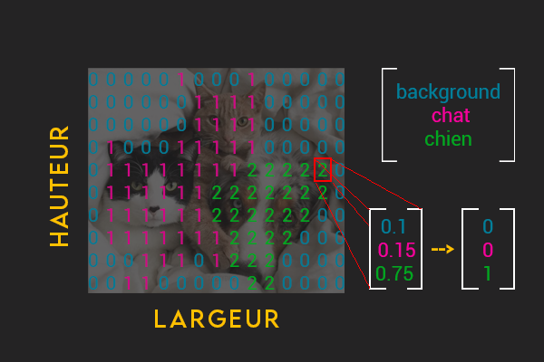{ loading=lazy }

## Réaliser une prédiction

### Masque pour classe unique

Etant donné que l'on souhaite prédire une seule classe, notre masque sera binaire et ne contiendra que des 0 (classe background ou poubelle) ou 1 (notre classe à détecter).

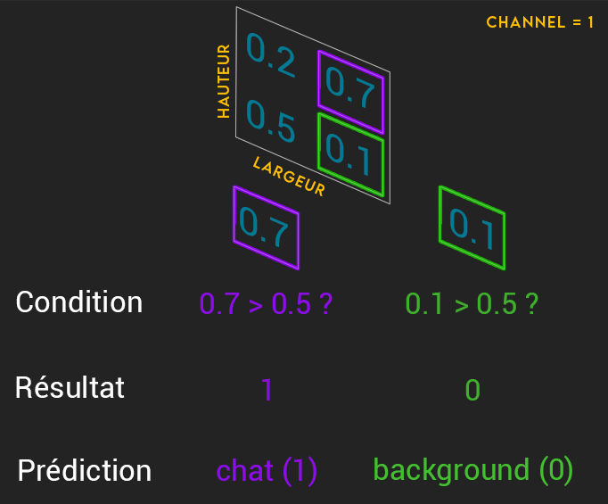{ loading=lazy }

En sortie de notre réseau, nous devrons appliquer une fonction à l'ensemble de nos valeurs de notre tenseur. Pour les valeurs inférieur à notre threshold, on applique la valeur 0. Pour celle au dessus de notre threshold, on applique la classe 1.

### Masque pour multi-classes

Si l'on souhaite prédire plusieurs classes, nous aurons donc soit plusieurs cannal (pour du sigmoid ) ou un seul (pour du softmax). Dans un cas ou l'autre, on va avoir pour un même pixel autant de valeurs que de classes à prédire. La classe prédite par notre réseau et la classe qui aura la valeur la plus haute. On utilisera la fonction argMax par exemple de Numpy pour nous récupérer la classe prédite.

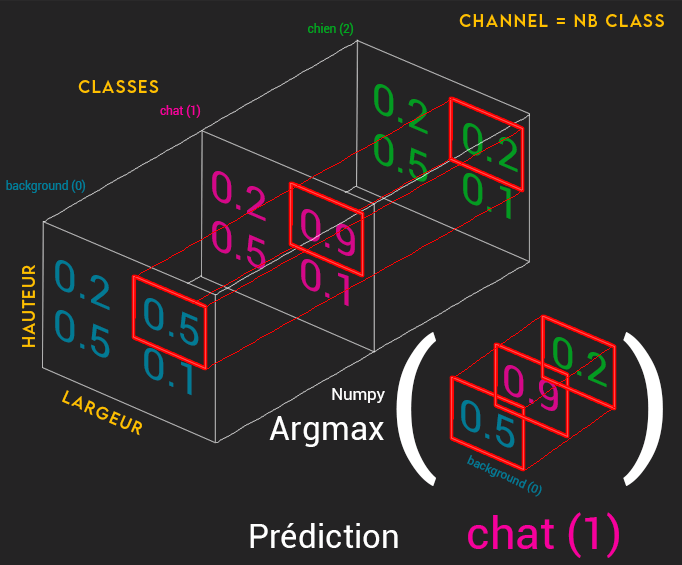{ loading=lazy }

 

## Fonction de perte plus adapté

Les fonctions de perte de type **CrossEntropy** sont les fonctions basique pour tout problème de classification.

Alors pourquoi ne pas garder nos fonctions de pertes cités plus haut si elles font le boulot ? Car celles-ci évaluent pour chaque pixel de façon individuelle, pour en faire une moyenne sur l'ensemble des pixels. Etant donnée que l'on va travailler avec des dataset déséquilibrés, nous pouvoir avoir des fonctions qui sont d'avantages étudiés pour ces problématique ci. En effet en gardant ces fonctions de base, on pourrait alors avoirs des chances d'avoir des prédictions penchant vers les classes les plus présente au sein de nos images, car basé sur leurs distributions.

Si vous souhaitez néanmoins rester sur une fonction de type **CrossEntropy**, sachez qu'il en existe des variantes. En effet, vous pouvez attribuer des poids différents pour chacune de vos classes, selon leur plus ou moins grande présence aux seins de vos images.

Mais nous allons passer en revu certaines autres fonctions de pertes qui peuvent s'avérer bien plus efficaces pour de la segmentation. Préférez la **Focal Tversky** ou la **Lovasz.**

 

## Métrique de suivi la plus adapté

Evitez les traditionnelles accurary ou d'un style similaire pour ce domaine ci. Préférez l'**IoU** ou la **Dice**.
