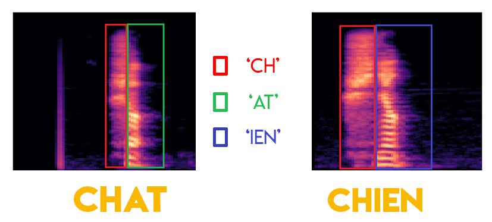
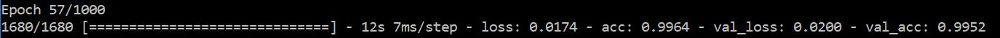
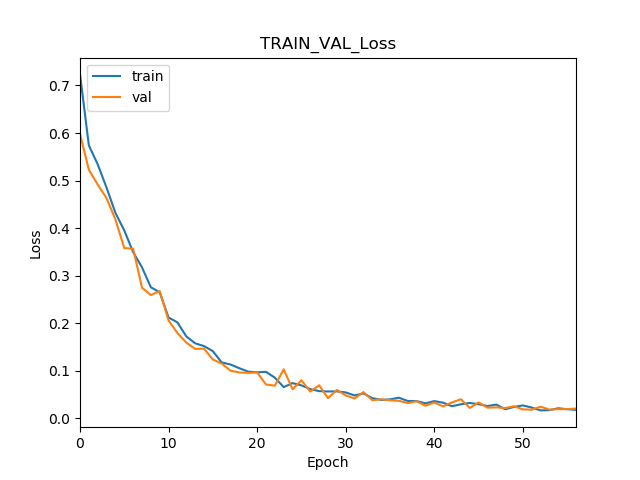
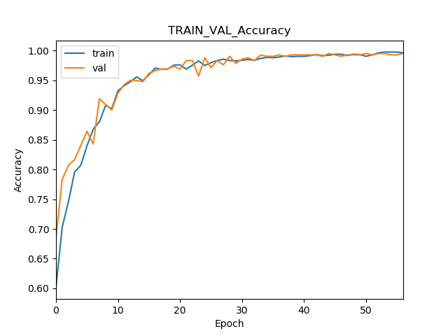
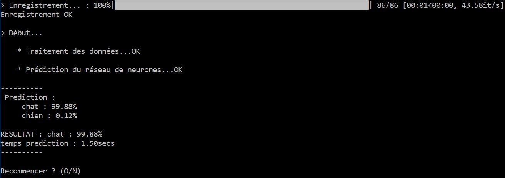
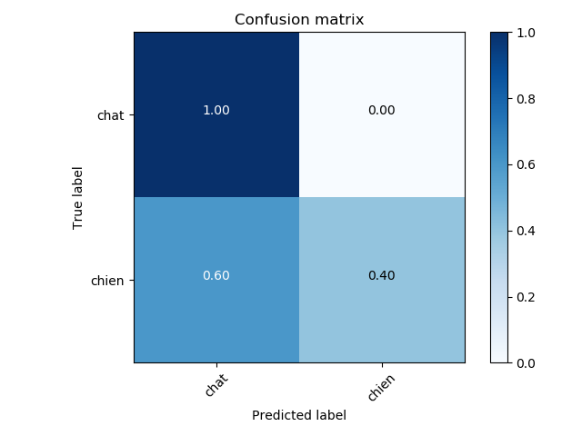
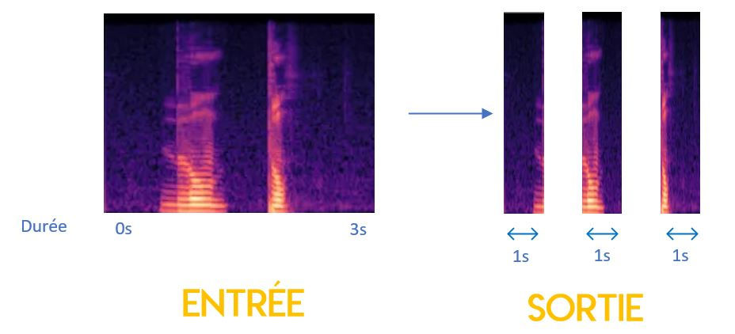
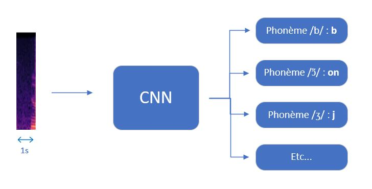
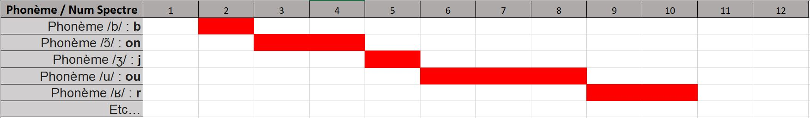

Pour ce second tutoriel, nous allons rester sur ces réseaux de neurones à convolution. On utilise le framework Tensorflow en backend, et Keras en API de haut niveau pour nous faciliter la création de l'ensemble de notre modèle. On associe généralement le traitement de la parole (NLP, Natural Language Processing) à des réseaux de neurones récurrents, mais je vais vous montrer tout un processus différent qui va nous permettre d'utiliser de la convolution.

Sur l'article suivant, on va se concentrer sur les différentes notions et étapes nécessaire pour pouvoir réaliser une telle reconnaissance de mots clés. Pour la partie technique et les plus impatients d’entre vous, je vous joint [ici](https://github.com/Momotoculteur/ReconnaissanceVocaleDeMotsCles) l’ensemble du code source du projet disponible sur mon Github. Le principe de construction de ce projet est semblable à celui du cours pratique sur la reconnaissance d'image, puisque on utilise le même type de réseau sur des spectres. On va alors s'attarder plutôt sur les différents principes de traitement des données, afin de passer nos audios d'entrée à notre réseau.

C’est parti !

## Transformation de l’audio en spectre

La première étape va être la plus longue et la plus importante de ce chapitre. C’est cette phase de pré-traitement de nos données d’entrées qui va demander le plus de code. En lisant l’article pré-requis, vous aller devoir transformer avant tout nos audio en image, mais pas de n’importe quel façon. En effet, on souhaite utiliser de la convolution sur des spectres qui vont nous donner des informations sur l’audio. Vous avez l’excellente bibliothèque Librosa qui va nous permettre très simplement de créer nos différents spectres. Celle-ci vous propose plusieurs types de spectres, je vous laisse aller visiter la documentation mais je peux vous en conseiller les 3 principaux qui sont :

- **Le spectrogramme**
- **Le mel spectrogramme**
- **Le MFCC**

Je vous conseille de lire l’excellent article scientifique que je vous ai mit en bas de l’article dans les références, il vous donnera un bench de leurs résultats pour comparer les performances qu’amène l’utilisation de tel ou tel type de spectrogramme. Pour avoir tester ces 3 là, j’ai eu des résultats différents selon le type d’utilisation que j’ai eu. J’ai eu l’occasion d’utiliser plutôt le MFCC sur un CNN qui prédisait 3 classes différentes, et de devoir changer pour utiliser le mel-spectro pour un CNN qui quant à lui, prédisait 10 classes. Vous aurez aussi de votre côté des résultats différents selon vos implémentations en fonction d'une problématique, le mieux reste de les essayer et de juger en fonction de vos résultats. Soyez rassuré, via Librosa le changement est très simple pour passer d'un type de spectrogramme à un autre.

En utilisant de l’entrainement supervisé, on va apprendre au réseau à reconnaître ces différents phonèmes. Il va ainsi être capable de pouvoir différencier tel ou tel mot.

{ loading=lazy } 

Je vous montre ci-dessus 2 mel-spectro sur le mot ‘chat’ et ‘chien’. On peut observer le même premier phonème de consonne /ʃ/ pour ‘ch’, qui est partagé et identique entre les 2 audio. Il s’en suivra un phonème de voyelle /a/ pour ‘chat’, et de /i/ et /ɛ̃/ pour ‘chien’. Ainsi en assemblant les différents phonèmes vous pouvez retrouver votre mot prononcé.

 

## Conversion de notre dataset en tableau numpy

Nous allons dans un premier temps, devoir transformer nos images d’entrées. En effet, on ne peut charger nos images en format png directement dans notre réseau de neurones. Celui-ci ne fonctionne qu’avec des tenseurs. On va donc convertir nos images vers des matrices de valeurs qui vont être empilés. Je vous ait écrit un article à propos de la constitution d’une image et quant à sa conversion, vers un tenseur de valeurs, qui correspondent aux intensités de couleurs des 3 différents canaux ( Rouge, Vert, Bleu ) correspondant pour chaque pixel composant l’image. Nous avons ainsi un fichier numpy par classe. D’habitude, la plupart des gens inclus ce processus directement dans le même fichier d’entrainement du modèle. Ce qui n’est pas optimisé puisque l’on est obligé de re-créer ces tableaux à chaque entrainement, ce qui est purement une perte de temps. Ainsi en faisant de cette manière, nous allons les créer une seule et unique fois.

 

## Création du modèle

Je souhaitais reprendre le model d’alexNET. Mais étant donnée mon peu de donnée de 250Mo ( ce qui est ridicule en terme de donnée ), je suis parti sur un modèle extrêmement simple que j’ai pris au hasard. Du moins pas complètement au hasard, puisque on utilise un réseau à convolution, on doit respecter des templates concernant les empilement des différentes couches :

**\[ \[Conv -> ReLU\]\*n -> Pool \] \*q -> \[FC -> ReLU\]\*k -> FC -> Softmax**

- **Conv :** couche de convolution
- **ReLU :** fonction d’activation, Rectified Linear Unit
- **Pool :** couche de convolution
- **FC :** couche de neurones entièrement connecté
- **Softmax :** fonction d’activation à sorties multiples

 

## Entrainement du modèle

La partie rapide du projet. C’est simple, vous n’avez rien à faire, juste à attendre que votre réseau apprenne. Celui ci va se renforcer au fur et a mesure des itérations que va parcourir votre modèle sur votre jeu de donnée, devenant ainsi meilleur.

{ loading=lazy } 
///caption
Dernière itération de l’entrainement de mon réseau de neurones
///
 

## Suivit de l’entrainement

{ loading=lazy } 
///caption
Évolution de la perte au cours de l’entrainement
///

{ loading=lazy } 
///caption
Évolution de la précision au cours de l'entrainement
///

Une fois le modèle entraîné, on va vouloir voir comment il s’est comporté durant l’entrainement. Que cela soit la fonction de perte ou de précision, on va pouvoir avoir de réels informations et indices sur le comportement de notre réseau, et ce sur le jeu de donnée d’entrainement et de validation.

On peut apercevoir que le modèle n’a pas finit d’apprendre, en effet la courbe concernant le jeu de donnée de validation connait une stagnation. Nous verrons plus loin dans l’article comment améliorer notre modèle.

 

## Réaliser une prédiction

Enfin la partie intéressante ! Maintenant que notre modèle est entraîné, on va enfin pouvoir réaliser des prédictions sur de nouveaux audio. Pour cela, on va lancer notre fichier autoPredict.py qui va enregistrer le microphone sur une période de deux secondes. Celle-ci est importante, et doit correspondre à la même longueur que les extraits audio de notre jeu de donnée sur lequel notre réseau s'est entraîné. En effet, pour obtenir des résultats probants, il faut obligatoirement comparer des choses comparables, et donc avec des caractéristiques semblables (la durée dans notre cas). Nous aurons ensuite une conversion de ces audios en spectre, et enfin une dernière transformation en tenseur via Numpy. Nous aurons en sortie de notre réseau une probabilités selon nos 2 classes de sortie, qui sont Chat et Chien.

{ loading=lazy } 
///caption
Résultat d’une prédiction d’une nouvelle donnée depuis mon réseau de neurones, pour le mot 'Chat'
///

 

## Validation de notre modèle sur un nouveau jeu de donnée

Maintenant que nous avons un modèle, on souhaite savoir comment il va se comporter sur de grandes quantités de nouvelles données. En effet, il serait dommage de perdre du temps de l’intégrer dans notre application pour se rendre compte bien plus tard que notre réseau n’est absolument pas fonctionnel. Perte de temps et d’argent garantie.

On va donc recréer un dataset de nouveaux extraits audio, auxquelles notre réseau n’aura jamais vu auparavant, pour permettre de prédire au mieux comment notre réseau va se comporter en application réelle. Pour notre exemple, on va reprendre nos 2 types de classes, avec des audios que j’ai enregistrer via un camarade auquel le réseau n'a jamais entendu sa voix. Plus votre dataset sera important, et plus vous aurez une idée précise du comportement de votre réseau. Pour le cas du tutoriel ( et que je suis fenéant ), j’ai pris seulement 5 audios différents pour chacune des classes.

Le but de notre matrice ne va pas s’arrêter là. En effet, son application va aller bien plus loin. Il va nous permettre de mettre en évidence d’éventuel erreurs qui pourrait être critique ou acceptable, ce qui sont 2 choses réellement différentes, j’en écrirais un article d’ici peu pour de plus amples informations.

{ loading=lazy } 

On obtient un score global de 70% de bonnes prédictions sur de nouvelles données. Nous pouvons nous rendre compte qu’il a donné de parfaite prédiction concernant la classe chat. Cependant, notre modèle est peu fiable, concernant la classe chien. Le but de ce procédé va donc être de viser une diagonale pour avoir des prédictions proche de 1.

 

## Axe d’amélioration

- OVERFITTING EN VUE MON CAPITAINE ! :| La data augmentation peut aider dans beaucoup de cas. Mais en abuser est dangereux pour notre réseau. On voit clairement sur nos 2 graphiques que le jeu de validation réussit mieux que le jeu d'entrainement, notre modèle apprends donc par coeur les données. Et pour cause, chaque classe de mon jeu de donnée ne contient que 50 extraits audio unique, pour 1000 extraits augmenté. Par manque de temps, j'ai utilisé des techniques de data augmentation pour me faciliter la vie. Pour cela, j'ai cloné chaque extrait de base en 20 nouveaux extraits, en y ajoutant des transformations audio pour créer artificiellement de la diversité au sein de mon dataset. Cependant, mon dataset en reste néanmoins pas assez diversifié et manque clairement de vrais extraits audio.
- Augmenter la taille du réseau : n’ayant que très peu de données, mon choix d’un réseau aussi simple est justifié. Cependant si on augmente notre jeu de données, nous allons pouvoir augmenter la profondeur de notre réseau de neurones. Ajouter des couches va permettre au réseau d’extraire des caractéristiques plus complexes.
- Augmenter la résolution de nos images d’entrées : n’ayant pas un GPU à disposition pour mes entraînements, je suis dans l’obligation d’utiliser seulement mon CPU, me limitant ainsi dans mes calculs de tenseurs. Cependant, augmenter la résolution des images va permettre au réseau de mieux s’en sortir. En effet, plus la qualité des images du dataset est haute, et plus les prédictions en seront bonne.

 

## Vers une reconnaissance vocale continue ?

Je ne suis pas aller plus loin personnellement sur ce projet, mais je peux vous partager quelques idées pour vous permettre de construire une vraie reconnaissance vocale pour créer un Speech to Text en continu. Le but serait de reprendre le même principe de mon tutoriel, et d’entraîner cependant notre réseau non pas sur 2 classes mais sur l'ensemble des phonèmes que compose la langue française, soit 36 classes. Mais pourquoi entraîner là dessus ? Le fait d’entraîner notre réseau à les reconnaître, va nous permettre de reconstituer les mots, et donc les phrases, via un système de dictionnaire que l'ont mettrait en place pour faire la conversion.

Exemple sur un spectre du mot 'bonjour'. On découpe notre spectro d'entrée en taille identique que l'on va envoyé à notre réseau :

{ loading=lazy } 

 

On aurait par la suite une analyse des spectres découpé un à un par un réseau de neurone à convolution pour permettre d'extraire les phonèmes découverts :

{ loading=lazy } 

A la suite, notre dictionnaire de conversion des phonèmes nous permettrait de récupérer depuis les phonèmes les mots prononcés. On aurait forcement des effets de bords du fait que l'ont ait le même phonème sur plusieurs spectre, cela est en fonction de la taille de découpage de nos spectres ou encore caractérisé à la vitesse ou on parle si on accentue plus ou moins certains phonèmes :

{ loading=lazy } 

Pour une meilleure visibilité, je ne vous ait mit seulement les phonèmes qui nous intéresse. Les cases blancs correspondent à des silences, et les cases rouges correspondent au phonème détecté par notre CNN sur un spectre.

Si on suit l'exemple que j'ai élaboré, cela nous donne la phrase :

> **\_ B ON ON J OU OU OU R R \_ \_**

Il faudrait alors s'en suivre une première étape de nettoyage de notre phrase, en supprimant les blancs :

> **B ON ON J OU OU OU R R**

Et enfin une seconde étape de nettoyage pour supprimer les doublons :

> **B ON  J OU R** 

Auquel cas on retrouve notre mot prononcé, 'Bonjour'.

 

Je ne pense pas que l'ajout de cette étape, nous permettant de passer d'une simple reconnaissance vocale de mot à un réel speech to text soit si complexe que ça. Le seul point qui prendrait un peu de temps, serait de récolter assez de data pour chacun des phonèmes, afin d’entraîner notre modèle pour les reconnaître.

 

## Conclusion

Je vous montre comment réaliser une simple reconnaissance vocale. Très simple à réaliser, si vous comprenez comment fonctionne ce projet, vous pouvez l’appliquer ailleurs. Vous pouvez très bien pousser le projet plus loin, et permettre de réaliser une vraie reconnaissance vocale appliqué sur des phrases entière, et non sur de simple mot, pré-défini en avance. Une chouette utilisation  de tel réseau peut être d'intégrer ces modèles pour réaliser des applications mobiles, ou encore faire un système de domotique avec un microphone associé à un RaspBerry pie pour fermer vos volets. :cool:

Je vous joint [ici](https://github.com/Momotoculteur/ReconnaissanceVocaleDeMotsCles) l’ensemble de mon code source documenté et commenté sur mon profil Github, avec les informations nécessaire pour sa compilation et lancement. Vous aurez l’ensemble des informations nécessaire pour pouvoir en recréer un vous même. Je compte d’ailleurs sur vous pour me proposer d’éventuelles corrections et optimisations pour le miens. !
