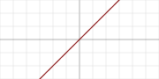
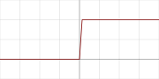
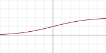
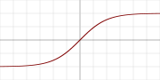
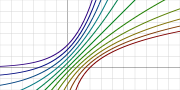
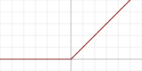
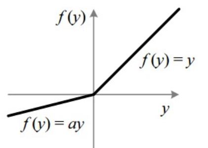
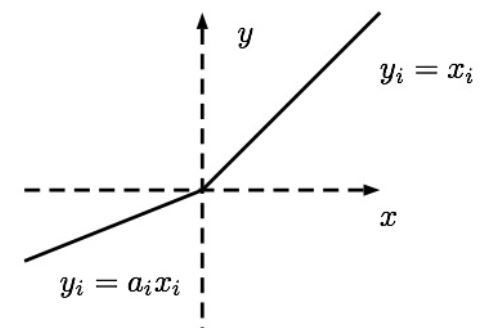
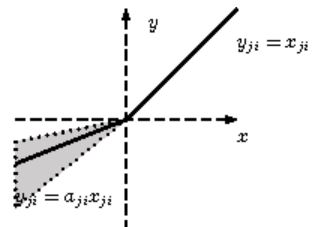
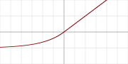

## Description

Une fonction d’activation est une fonction mathématique utilisé sur un signal. Elle va reproduire le potentiel d’activation que l’on retrouve dans le domaine de la biologie du cerveau humain. Elle va permettre le passage d’information ou non de l’information si le seuil de stimulation est atteint. Concrètement, elle va avoir pour rôle de décider si on active ou non une réponse du neurone. Un neurone ne va faire qu’appliquer la fonction suivante :

**X = ∑ ( entrée \* poids ) + biais**

C’est sur cette sortie que la fonction d’activation va s’appliquer.

 

## Exemple de fonctions

Voici les principales fonctions d’activations que l’on peut trouver dans le domaine des réseaux de neurones :

- **Linear :** Utilisé en couche de sortie pour une utilisation pour une régression. On peut la caractériser de nulle, puisque les unités de sortie seront identiques à leur niveau d’entré. Intervalle de sortie (-∞;+∞).  

{ loading=lazy width="300" }
{ .center-text }

- **Step :** Elle renvoi tout le temps 1 pour un signal positif, et 0 pour un signal négatif.  

{ loading=lazy width="300" }  
{ .center-text }

- **Sigmoid (logistic) :** Fonction la plus populaire depuis des décennies. Mais aujourd’hui, elle devient beaucoup moins efficace par rapport à d’autre pour une utilisation pour les couches cachées. Elle perd de l’information due à une saturation que cela soit pour la phase de feed forward ou de backpropagation, en donnant des effets non linéaires au réseau due à un paramètre unique. Elle a aussi des soucis de gradient 0 avec des entrées étant très large, même si le soucis est minimalisé avec les système utilisant des batch par lots (mini batch). Utilisé en couche de sortie pour de la classification binaire. Intervalle de sortie : {0,1}  

{ loading=lazy width="300" }
{ .center-text }

- **TanH :** Utilisé pour des LSTM pour des données en continue. Intervalle de sortie : (-1,1) 

{ loading=lazy width="300" }
{ .center-text }
  
- **Softmax :** Utilisé pour de la multi classification en couche de sortie. Intervalle de sortie (-∞;+∞).  

{ loading=lazy width="300" }
{ .center-text }

- **ReLU ( Rectified Linear Unit ) :** Ce sont les fonctions les plus populaires de nos jours. Elles permettent un entrainement plus rapide comparé aux fonctions sigmoid et tanh, étant plus légères. Attention au phénomène de ‘Dying ReLU’, auquel on préférera les variations de ReLU. Plus d’informations en fin d’article. Très utilisé pour les CNN, RBM, et les réseaux de multi perceptron. Intervalle de sortie (0;+∞).  

{ loading=lazy width="300" }
{ .center-text }

- **Leaky ReLU :** La Leakey Relu permet d’ajouter une variante pour les nombres négatifs, ainsi les neurones ne meurent jamais. Ils entrent dans un long coma mais on toujours la chance de se réveiller à un moment donné. Intervalle de sortie (-∞;+∞).  

{ loading=lazy width="300" }
{ .center-text }

- **PReLU (Parametric ReLU) :** La paramétrique Leaky Relu permet quant à elle de définir alpha comme paramètre du modelé et non plus comme hyper paramètre. Il sera alors apprentis sable. Il sera ainsi modifié durant la rétro propagation du gradient. Le top pour de large datasheet, moins bon sur de petit, causant d’éventuelle sur ajustement. Intervalle de sortie (-∞;+∞).  

{ loading=lazy width="300" }
{ .center-text }

- **TReLU (Thresholded ReLU) :** Elle est identique à la simple ReLU. Mais la localisation de son seuil d’activation va être décalé, il n’est plus à 0, mais selon un paramètre theta.

- **RRELU (Randomized Leaky ReLU) :** La Randomise Leakey Relu permet de choisir le hyper paramètre ALPHA. Durant l’entrainement alpha est choisi aléatoirement. Puis durant les tests, il est calculé via une moyenne. Intervalle de sortie (-∞;+∞).  

{ loading=lazy width="300" }
{ .center-text }

- **ELU ( Exponential Linear Unit ) :** Autre dérivé de la ReLU. Celle-ci va approcher les valeurs moyenne proche de 0, ce qui va avoir comme impact d’améliorer les performances d’entrainements. Elle utilise exponentiel pour la partie négative et non plus une fonction linéaire. Elle parait plus performante en expérimentation que les autres Relu. Pas de soucis de neurone mort (dying ReLU). Intervalle de sortie (-∞;+∞).  

{ loading=lazy width="300" }
{ .center-text }

- **SeLU (Scaled ELU) :** C’est comme ELU en redimensionné mais avec en plus un paramètre ALPHA pré définit. Bon résultat, bonne vitesse, et évite les problèmes d’explosion et disparition de gradients en s’auto normalisant et gardant les mêmes variances pour les sorties de chaque couche, et ce tout au long de l’entrainement.

 
## Problèmes récurrents

Les fonctions standards amènent au réseau la disparition ou l’explosion de gradient, et donc une saturation et entraîne un ralentissement de la back propagation dans les couches basses du réseau. Voici une liste d'éventuels problèmes que vous pouvez rencontrer concernant ce chapitre :

- **Problème de disparition de gradient :** L’algorithme progresse vers les couches inférieures du réseau, rendant les gradients de plus en plus petits. La mise à jour donc par descente de gradient ne modifie que très peu les poids des connexions de la couche inférieur, empêchant une bonne convergence de l’entrainement vers la solution.
- **Problème d’explosion du gradient :** Dans ce cas-ci, les gradients deviennent de plus en plus grands. Les couches reçoivent alors de trop gros poids, faisant diverger l’algorithme.
- **Dying ReLU :** La Relu souffre d’un souci : saturation pour les nombres négatifs, ce qui entraîne la mort de certains neurones, ils arrêtent de produire autre chose que des 0. Dans certains cas, la moitié des neurones peuvent mourir durant un entrainement. Il est peu probable qu’il reprenne vie en cours d’entrainement, rendant le réseau passif. C’est là que les variantes sont utiles puisque leur principal idée est d’empêcher pour la partie négative d’avoir des gradient égale à zéro.

## Recommandation personnel

Sur le papier, les ReLU fonctionnent bien mieux en pratiques que les fonctions standard. Mais ce n’est pas pour autant la peine d’en mettre à toute les sauces. Il faudra choisir la bonne fonction selon votre type de problème à résoudre. Mais si vous débuter et que votre choix n’est pas sûr, commencer par expérimenter alors avec la ReLU pour avoir un premier retour. Celle-ci fonctionnera très bien dans la plupart des cas.

Me concernant, les résultats de ELU sont meilleurs que les autres Relu pour avoir comparé personnellement l’ensemble des fonctions lors de mon stage sur un cas précis de NLP/CNN. Mais les calculs seront plus lents car on utilise exponentiel pour la partie négative, en ajoutant de la non-linéarité. Donc si vous avez le temps et la puissance de calcul nécessaire, je vous conseille l’ordre suivant d’utilisation :

 
1. ELU
2. SeLU
3. PReLU
4. Variante de ReLU ( Leaky ReLU, Randomized ReLU, Thresholded ReLU )
5. ReLU
6. TanH
7. Sigmoid
