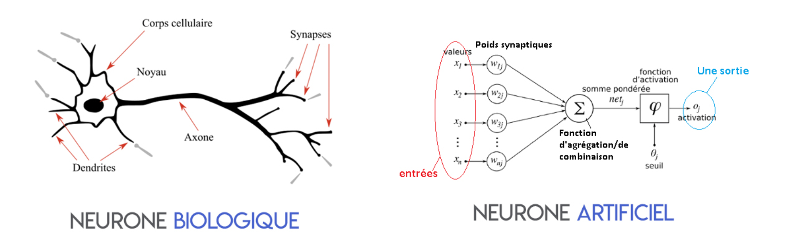

{ loading=lazy } 
///caption
Représentation mathématique/informatique d’un neurone biologique
///

Le neurone artificiel va recevoir plusieurs entrées d’informations, plusieurs valeurs, qui vont être attaché à un poids qui peut être ajusté. Ces entrées correspondent aux dendrites, et les poids qui leurs sont associés, correspondent aux actions excitatrices ou inhibitrices des synapses, ils vont pouvoir amplifier ou minimiser un signal d'entrée. Le neurone dans sa forme basique, va effectuer une somme de l’ensemble de ces variables en fonction de leurs poids, correspondant au soma. Cette valeur passe ensuite par une fonction d’activation, qui en sera l’unique sortie. Celle-ci correspond au point de départ de l’axone qui est le cône d’émergence.

Le principe de ces réseaux va donc être d’assembler de grande quantité de neurone entre eux pour former des couches.

Il existe une grande variété de type de neurone, qui engendre selon leur agencement, différents type d’architecture.

