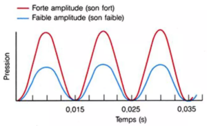
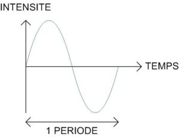
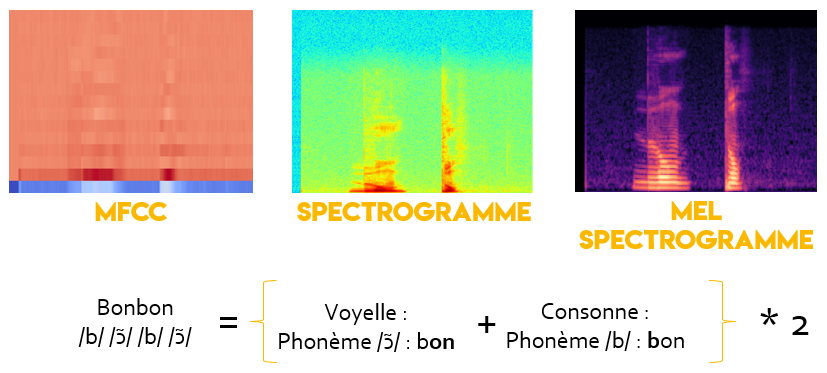

Pour comprendre mon cours pratique quant à la réalisation d’une reconnaissance vocale de mots clés] via un réseau de neurones utilisant de la convolution, vous devez comprendre les différentes étapes de transformations, entre notre fichier audio de base, vers un tenseur d’ordre 3 compréhensible et utilisable par notre modèle.

 
## Mais, c'est quoi le son ?

Les sujets autour du son et des ondes étant plus proche du domaine de la physique que de l’informatique, je vais simplifier au mieux. Un son est une variation de pression qui va entrainer une vibration dans nos molécules d’air, se propageant ainsi sous forme d’ondes. On peut définir et analyser ce signal qui est en faîte une amplitude en fonction du temps. Cette amplitude sonore nous donne une indication concernant la puissance de celle-ci, puisqu’elle représente la valeur de la pression la plus haute attend par l’onde. Concrètement, plus on produit un son fort, plus son amplitude est forte, et inversement.

{ loading=lazy } 

Ces enchaînements de montées et de descentes que l’on peut observer sur la courbe, représente les surpression et dépression du milieu, engendré par le déplacement de l’onde.

Nous venons de voir comment les signaux sont défini dans l’espace temporel, on va maintenant s’attarder sur ces signaux dans un espace fréquentiel.

 

## Fréquence et spectre

La fréquence va nous permettre de définir et de classer si un son est aigu ou grave, nous donnant des informations supplémentaires qui vont être importante pour la suite. Elle se définit en hertz, et représente le nombre d’oscillations (période) par seconde.

{ loading=lazy } 

 

## Types d’images utilisable

Je vais parler des 3 plus connues pour vous donner quelques pistes d’utilisations pour alimenter vos réseaux de neurones. On va utiliser des spectrogramme, qui sont calculés selon le type, via une transformation discrète de Fourrier, une transformation rapide de Fourrier, ou encore une transformation discrète de cosinus. Ce sont des photographies représentent le spectre d’un son. Ces type de spectrogramme vont nous permettre d’analyser des sons et de nous renvoyer :

- **Un temps**
- **Une fréquence**
- **Une intensité**

Vous devriez vous demander d’où provient ce besoin de passer sur des spectres… Et bien pour pouvoir reconnaître des phonèmes ! Un phonème est la plus petite entité phoniques, un élément sonore du langage parlé, pour faire simple : un son, qui peut correspondre à plusieurs sons. C’est cette association de phonème entre eux qui permettent de constituer les mots. Il en existe dans la langue Française 16 de voyelles, 17 de consommes, et 3 de semi consonnes/voyelles.

{ loading=lazy } 

En prenant l’exemple ci-dessus, je vous montre une comparaison entre notre 3 types de spectrogrammes différents, sur le mot ‘bonbon’. Il est constitué de deux phonèmes de voyelle et de deux phonèmes de consonne.

 

## Références

Un article extrêmement intéressant que je vous recommande est celui-ci, ‘[Comparison of time frequency representations for environmental sound classification using convolutional neural networks](https://arxiv.org/pdf/1706.07156.pdf)’. Il va bench jusqu’à 8 types d’images d’entrée pour réaliser de la classification de son en utilisant un CNN.
