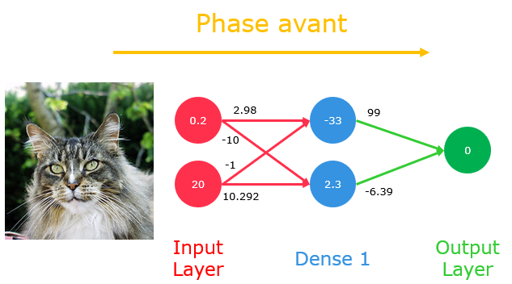
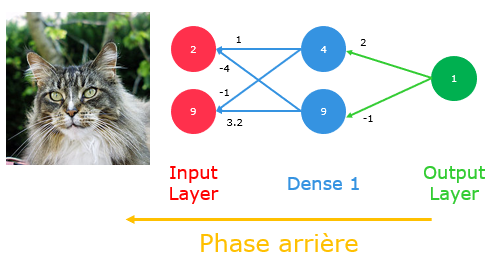

On souhaite donc trouver un minimum global pour notre fonction de coût, tout en évitant les éventuelles vallées et minimum locaux qui nous empêcherait de converger vers la solution la plus optimisé pour notre réseau de neurones. La backpropagation se résume en une approche pour partager la contribution des erreurs propulsé pour chaque neurone de chaque couche.

Cette retropropagation du gradient va se faire via l’alternation successives entre deux phases :

## Phase avant

C’est la phase de prédiction. On envoi à notre réseau une donnée et il va essayer d’en prédire la classe de sortie. Il va avoir un échange d’informations, de valeurs et de sommes, entre chaque neurones et chaque couche. Les données transitent de la couche d’entrée vers la couche de sortie.

{ loading=lazy } 
///caption
Schéma du flux d'informations, allant de la couche basse vers la couche haute (valeurs non réelles)
///

## Phase arrière

C’est la phase d’apprentissage. À la suite du passage d’une donnée au sein de notre réseau, nous allons avoir un résultat concernant la prédiction. C’est pour cela que les premiers entraînements sont souvent erronés, car les poids et biais du réseau sont initialisé de façon aléatoire, et vont être mis à jour au fil des entraînements via ce procédé.

{ loading=lazy } 
///caption
Schéma du flux d'informations, allant de la couche haute vers la couche basse (valeurs non réelles)
///
