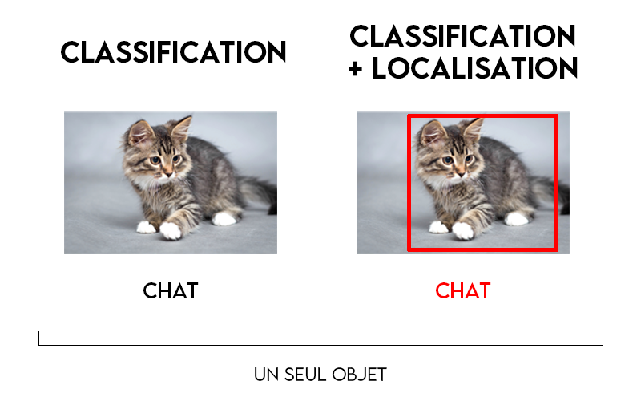
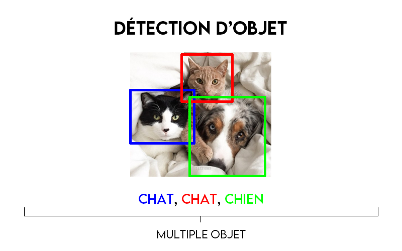
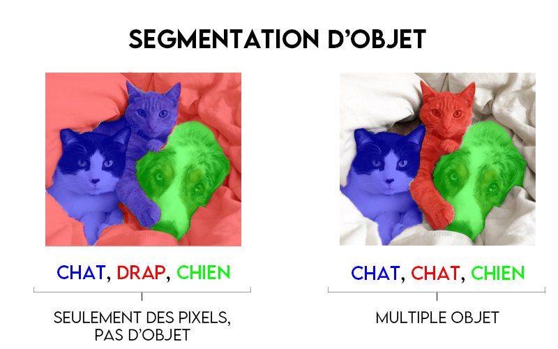

## Image classification

{ loading=lazy }

Dans la tâche la plus courante lorsque l’on parle de traitement d’image, on parle de classification d’image. Cela résulte à identifier une classe au sein de l’image. 

## Détection d’objet

{ loading=lazy }

La détection d’objet se superpose à la simple classification d’image, en ajoutant de la localisation d’objet. Cela fonctionne encore avec une classe au sein de l’image, en plus d’avoir sa position. Celle-ci est souvent définie par des rectangles, appelés bounding box.

 

## Segmentation d’objets

{ loading=lazy }

### Segmentation sémantique

C’est le processus permettant de classifier chaque pixel d’une image en un label particulier. On ne peut faire de différence entre deux instances d’un même objet. Par exemple, si on a deux voitures sur une image, ce type de segmentation donnera le même label sur l’ensemble des pixels des deux voitures.

### Segmentation d’instance

La segmentation d’instance va attribuer un unique label sur chaque instance d’un même objet au sein de l’image. En reprenant le précédent exemple, si nous avons à nouveau deux voitures sur une image, chacune d'entre elles se verront attribuer une couleur différente. À l'inverse de la segmentation sémantique, qui aurait défini la même couleur pour les deux voitures.
