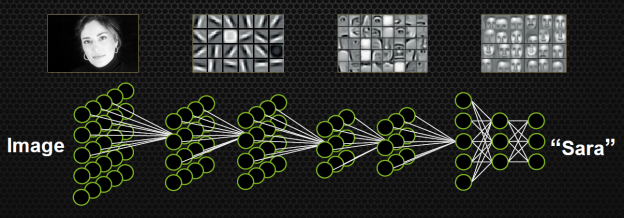
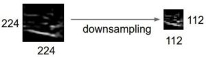
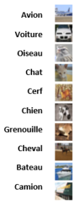

Les réseaux de neurones à convolution, ou ConNets sont utilisés pour analyser des images. Leurs architectures sont basé sur le système de vision et d'analyse des animaux. C'est Yan LeCun, un chercheur français qui est à l'origine d'une grande partie de ces travaux sur la convolution. Il avait déjà réalisé en 1993 un système permettant à une camera de filmer et de reconnaître des chiffres écrit à la main.

On peux en distinguer plusieurs couches spécifiques :

## Convolution

{ loading=lazy } 
///caption
Architecture d'un réseau de neurones utilisant la convolution
///

Ces couches vont permettre d’extraire des données, des caractéristiques de l’image. On va se servir de filtres, pour détecter des formes. Au fur et à mesure des couches, on va détecter des formes de plus en plus complexe. Par exemple à la première, les filtres vont mettre en évidence des courbes simple, traits et pixel. La suivante, en utilisant les filtres précédents, va apprendre à reconnaître des superpositions de courbes et de traits, pour détecter des formes plus complexe, et ainsi de suite, jusqu’aux couches les plus haute qui vont pouvoir détecter des visages, pour ne citer qu’un exemple.

 

## Pooling

Cette étape permet de réduire la taille des images d’entrées, de réduire la charge de travail en diminuant les paramètres du réseau et donc la charge de calcul, tout en gardant les principales caractéristiques de l’image. Cela se passe via une fenêtre, qui va glisser pas à pas sur l’ensemble de l’image, et récupérer que certaines valeurs de l’image. Soit en prenant une moyenne des valeurs de pixels de la région analysée par cette fenêtre (meanPool), ou encore le maximum de celles-ci (maxPool), car il existe une multitude de type de pooling.

{ loading=lazy } 
///caption
Action de la couche de pooling
///

## Classification

{ loading=lazy } 
///caption
Extrait du dataset CIFAR-10
///

Le but de cette étape est de classer les images entrantes dans telle ou telle classe, en fonction des caractéristiques extraite durant les couches successives de convolution et pooling, via les couches de neurones entièrement connectés. Par exemple pour reconnaître un chat, ces couches vont permettre d’accentuer les caractéristique d’avoir 4 pattes, ou encore des poils. Elles vont donc en contrepartie diminuer les poids des caractéristiques qui représenterait une autre classe, tel que la présence de plume. Nous en ferons de même concernant nos mel-spectrogramme, nous allons classer ces images en fonction des phonèmes reconnue, et donc des mots.
