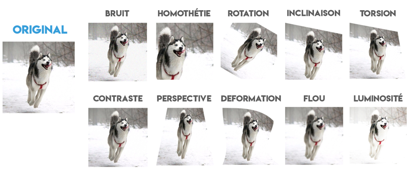
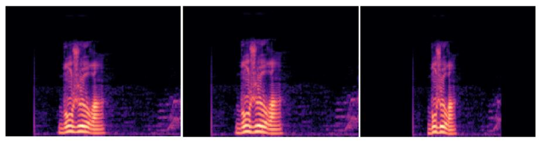

Pour pouvoir entrainer nos modèles, il nous faut d’énormes quantités de données. En effet, la quantité et surtout la qualité de notre dataset va avoir un rôle majeur pour l’élaboration d’un modèle de bonne facture. En effet, il est logique d’avoir avoir des données qui soient comparable entre elle. Quand je dis comparable, c’est qu’elles aient le même format, la même taille et longueur, etc. Et c’est à partir de ces contraintes que commence les problèmes. En effet, avoir des data spécifique selon notre problème avec les points précèdent cité peut souvent relever de l’impossible. C’est là que la data augmentation va pouvoir nous être grandement utile.

Le principe de data augmentation repose sur le principe d’augmenter de façon artificielle nos donnée, en y appliquant des transformations. On va pouvoir augmenter la diversité et donc le champ d’apprentissage de notre modèle, qui va pouvoir mieux s’adapter pour prédire de nouvelles données. Le principe de cette méthode est relativement simple, celle-ci est montré par l’image suivante concernant de l’augmentation sur des images :

{ loading=lazy } 

En partant d’une simple image, nous pouvons la dupliquer autant de fois que nous avons des types de transformation différentes à lui appliquer. Et nous pouvons en augmenter davantage en croisant ces effets sur une même image, et en y appliquant différents valeurs de l’effet dans une fourchette donnée, pour avoir un résultat plus ou moins poussé.

Voici un exemple de mel-spectrogramme, dont on à appliquer des transformations à un extrait audio sain, sur le mot ‘Bonjour’.

{ loading=lazy } 

On peut aussi imaginer un grand nombre de transformation sur des données audios. 

- Tempo : change la vitesse de parole de l’enregistrement sans en changer la longueur.
- Pitch : change l’intonation de la voix (plus aigüe ou plus grave).

Et la liste peut être plus longue : bandpass, equalizer, highpass, lowpass, chorus, delay, stretch, contrast, etc.

