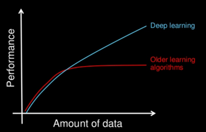
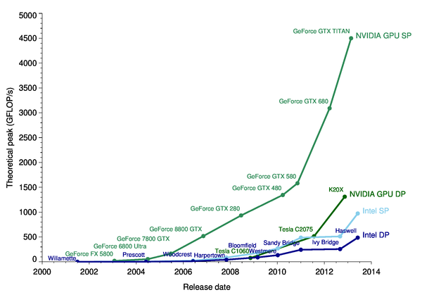
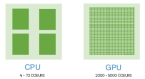

{ loading=lazy } 
///caption
Comparatif des performances entre machine et deep learning
///

Contrairement à ce que l’on pourrait penser, que le deep learning émerge seulement depuis les années 2010, il est en réalité bien plus ancien que cela. En effet, dès le début des années 40 par les chercheurs McCulloch et Pitts, précurseur du neurones formel. Il s’en est suivit les premiers algorithmes d’apprentissage de classifieurs binaires, composé d’un assemblage de plusieurs simples neurones, inventé par Franck Rosenblatt, fin des années 50. C’est ensuite dans les années 80 que le premier réseau de neurones à convolution (CNN) voit le jour par le chercheur français Yann LeCun. Mais c’est seulement depuis quelques années seulement que ce secteur explose, alors qu’il avait été laissé à l’abandon. Cet effet est dû à la convergence de plusieurs paramètres :

 

## Explosion de la quantité de données

On assiste à une diminution constante du coût de stockage, contrasté par une émergence des techniques de big data qui nous permettent d’amasser d’importante quantités de données, couplé à une grande diversité de données.

 

## Explosion de la puissance de calcul

En effet, le processeur (CPU) va être optimisé pour des tâches en série de grande diversité, alors que la carte graphique (GPU) va être optimisé pour une grande quantités de tâches qui seront-elles, en parallèle et spécifique à tel ou tel calcul.

 
{ loading=lazy } 
///caption
Puissance de calcul délivré entre GPU et CPU
///
 

Sachant que les CPU du grand public sont composé de 4 à 8 cœurs, et jusqu’à 72 cœurs pour les plus puissant tel que les Intel Xeon Phi Knights Mill, ils se font alors facilement distancé par les GPU qui sont composé de nos jours de l’ordre de 2000 à 5000 cœurs. Le deep learning se résumant à des millions de calculs matricielles, le CPU se fait alors dépasser par la puissance cumulé délivré par les GPU. La rétropropagation du gradient étant un algorithme très lent à résoudre initialement, c'est donc l'avancement des GPU qui ont redonné de l'intérêt pour le deep learning.

 

{ loading=lazy } 
///caption
Comparaison architecture des cœurs
///
 

## Développement des outils et du niveau d’abstraction 

Les algorithmes s’améliorent chaque année en se complexifiant, et sont capable de réaliser de nouvelles choses. Mais le plus fascinant est le développement d’outils, d’API de haut niveau, capable de simplifier la conception d’un réseau en quelque ligne de code seulement, tel que AutoKeras. On abordera d’ailleurs un outils que l’on a nous meme utilisé, nommé Keras. Récemment est apparu des outils tel que Google auto ML. Celui-ci va bien plus loin que nos 2 exemples précédents, en permettant de créer des réseaux en entiers sans écrire une seule ligne de code. En effet, toute la partie technique et complexe du développement d’un modèle est ici automatisée, et déléguée à Google. Cela fonctionne à l’aide une interface de type glisser-coller très intuitive.

 
## Le deep learning va-t-il rendre les autres algorithmes obsolètes ?

On voit que le deep à la cote, on en parle partout, quitte à le mettre un peu partout pour faire joli et vendeur, que l’on est révolutionnaire que l’on joue la carte de l’innovation. Mais faire du deep learning juste pour l’effet de mode est stupide. Pour répondre à la question j’aurais donc tendance à dire que non, le deep learning ne sera pas l’unique façon d’apporter une plus-value à tel ou tel projet et ne va pas plus remplacer le machine learning. C’est un peu comme utiliser un char d’assaut pour venir à bout d’un moustique. Impressionnant, efficace quand ça fonctionne, mais un poil inadapté comme moyen non ? Pourquoi faire compliqué si on peut faire simple ?

Il faut savoir que pour beaucoup d’application, nous n’avons pas besoin de sortir l’artillerie lourde. Des algorithmes plus standard fonctionneront très bien sur ce genre de modèle, et en seront d’autant plus facile à mettre en œuvre. Il faudra avant tout juger et évaluer au préalable le niveau d’effort et de la précision attendu en fonction de notre domaine d’application. Des problèmes différents auront des meilleures méthodes différentes, il faudra donc faire attention d’appliquer la bonne approche sur une situation approprié.
