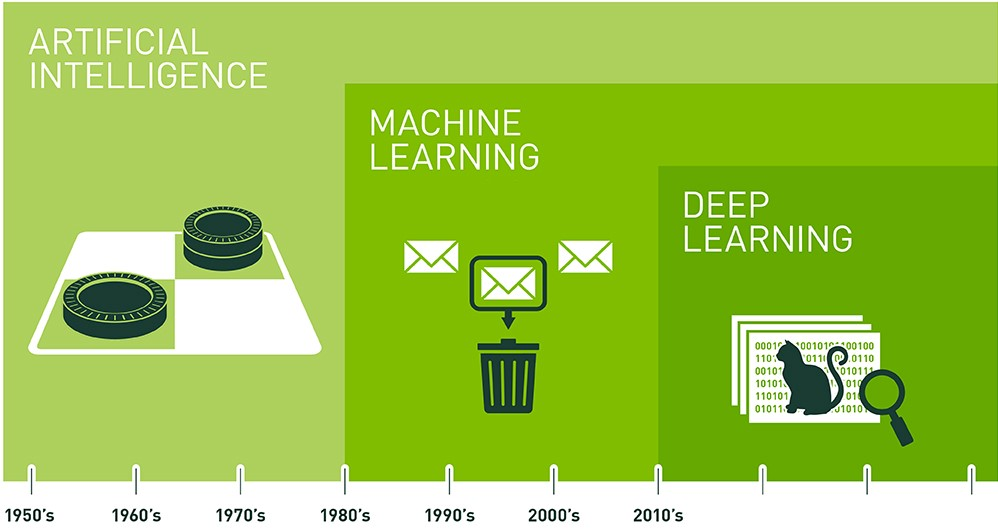

## La machine est-elle réellement intelligente ? 

Hum, pas vraiment. Si on doit résumer sur ce qu'est vraiment l'apprentissage de la machine, c'est seulement la résolution de formules mathématiques. Cette fonction va s'équilibrer en fonctions de données d'entrées. Et c'est cette fonction mathématique qui va permettre de nous donner une sortie souhaitée. Cependant, il suffit de modifier partiellement la donnée d'entrée, sur un intervalle auquel la machine n'aura jamais vu auparavant, pour que la machine nous renvoi une sortie absolument fausse. On pourrait appeler l'ensemble de ces techniques par du calcul cognitif, mais pour des raisons marketing, certains pionniers de chez IBM dans les années 60 ont préférés utiliser les termes _d'apprentissage de la machine._

 

{ loading=lazy } 
///caption
Timeline des différents type d'IA
///

 

### L’intelligence artificielle

Cela représente l’ensemble des théories et de techniques mises en œuvre, en vue de réaliser des machines capables de simuler l’intelligence. Et celle-ci ne date effectivement pas d’hier, comme on pourrait y croire. Si on souhaite créer une intelligence artificielle, nous sommes alors dans l’obligation de coder l’ensemble des éventualités et actions qu’elle doit réaliser. Ce qui peut potentiellement être extrêmement long mais surtout se révéler peu efficace dans certaines situations. Cette approche que l’on peut alors considérer comme ‘manuelle’, a bien plus de limites.

### Le machine learning

C'est un sous ensemble d’intelligence artificielle. Auparavant, pour apprendre à un ordinateur à effectuer une tâche, on le programmait manuellement. Aujourd’hui, ce même ordinateur peut apprendre par lui-même : il suffit de lui apprendre à reconnaître et à reproduire. En effet, plutôt que de coder l’ensemble des routines avec des jeux d’instructions précises pour réaliser une tache particulière, on va ‘entraîner’ la machine. On va donner de grandes quantités de données à notre algorithme, qui va avoir la capacité d’apprendre à réaliser cette tâche.

 

### Le deep learning

Appelé apprentissage profond, est un sous ensemble du machine learning. Celui-ci reprend les mêmes concepts du machine learning, en les poussant encore plus loin. Le but est de créer une architecture imitant celle du cerveau humain, basés sur des réseaux de neurones artificiels à multiples couches. Le cerveau étant lui-même ‘profond’, dans le sens ou chaque action est le résultat d’une longue chaîne de communications synaptiques avec de nombreuses couches qui communiquent entre elles. Contrairement au machine learning, ces réseaux deviennent de plus en plus performants au fur et à mesure qu’ils reçoivent des données. En effet, ceux-ci pouvant être plus profonds, et donc plus complexes, ils nous permettent d’exploiter bien plus de data et donc d’augmenter significativement les performances.
