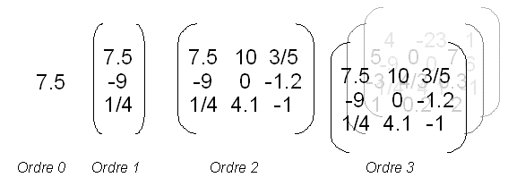
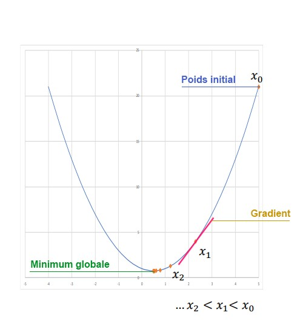
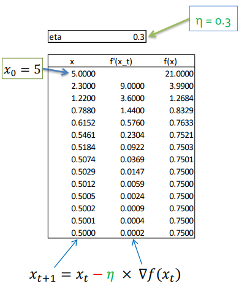
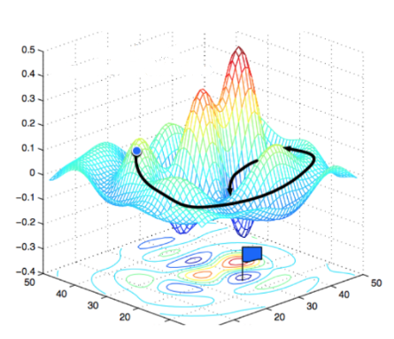

Le réseau va pouvoir via ces différents types de couches superposés, faire des prédictions, à partir d’une entrée. C’est durant l’entrainement qu’il va apprendre, se tromper, et notamment s’auto ajuster via l’étape de la rétro-propagation du gradient (**backpropagation**). Cet algorithme de descente du gradient va permettre de minimiser la **fonction de coût**, appelé aussi **fonction d’objectif** ou encore de **perte**. Celle-ci conserve donc cette notion de biologie en s’inspirant de la rétropropagation neuronale. Le but de cet algorithme est de chercher à résoudre la fonction suivante : **Ax = B**, ou :

- **A est est une matrice d'entrée**
- **x est un ensemble de variable contenu dans un tenseur qui représente l'ensemble des poids du réseau de neurone**
- **B est un vecteur de sortie des labels**

_Mais que-ce qu'un tenseur ?_

{ loading=lazy } 
///caption
Définition des degrés d'un tenseur
///

Un tenseur est une unité mathématique qui peut avoir un certain degrés :

- **Ordre 0 :** c'est un produit scalaire
- **Ordre 1 :** c'est un vecteur
- **Ordre 2 :** c'est une matrice
- **Ordre 3 :** c'est un empilement de matrice, une sorte de matrice 3D. C'est cela que l'on envoie dans notre réseau de neurone

Cette fonction de perte est une fonction mathématique. Il en existe plusieurs types pour des utilisations bien précises. En effet, selon le type de problème que l’on cherche à résoudre, on aura une sortie différente, et donc une fonction de coût bien précise concernant notre problème. Dans certains cas, on souhaite avoir un résultat en sortie compris entre (0, 1), ou (-1,1), ou encore comme dans notre cas, un vecteur \[ (0,1), (0,1)…\] correspondant à plusieurs probabilités. Elle représente la somme de l’ensemble des erreurs de l’ensemble du réseau, soit l’écart entre la prédiction effectuée par notre réseau, par rapport à l’étiquette réelle de la donnée d’entrée. On doit chercher à la minimiser, et c’est via l’algorithme de la descente du gradient que l’on va pouvoir le faire. On va pouvoir calculer la contribution de l’erreur de chacun des poids synaptique du réseau, couche après couche. Cela va nous permettre d’actualiser les poids et biais du réseau, et donc d’effectuer de meilleures prédictions au fur et à mesure des itérations, lors de l’entrainement du modèle. Ce biais est une valeur scalaire ajouté en entrée, pour assurer que quelques neurones soit actif, quelque soit la force du signal d'entrée. Ces biais seront modifiés comme les poids au cours de l'entrainement

Le gradient quant à lui, est la dérivé en un point de la courbe mathématique qui régit les données de notre modèle. Celui-ci est donc le coefficient directeur de cette tangente. Il va nous permettre de connaître la tendance de la fonction en un point donné. Cette descente peut s’effectuer soit de manière globale (**batch gradient**), soit par des lots (**mini batch gradient**), soit de façon unitaire (**stochastic gradient**). La première consiste à envoyer au réseau la totalité des données d’un seul trait, et de faire ensuite le calcul du gradient ainsi que la correction des coefficients. Alors que la seconde consiste à envoyer au réseau, les données par petit groupe d’une taille définit par l’utilisateur. La dernière quant à elle, envoi une donnée à la fois dans le réseau. Nos réseaux utilisent la méthode par mini batch. En effet, celle-ci permet une meilleure convergence par rapport à la stochastic, et nous permet de meilleures performances que la batch, car on ne charge pas entièrement nos données.

 

On peut associer l’exemple suivant pour schématiser ce gradient. On imagine être un randonneur perdu en montagne, sous un épais brouillard. Une éventuelle possibilité pour descendre de la montagne, est de sentir la pente via ses pieds, et de la suivre dans le sens descendant, pas à pas. On va alors pouvoir rejoindre le bas de la vallée en répétant l’opération. On peut alors appliquer ce même exemple d’un point de vu mathématique :

{ loading=lazy } 
///caption
Définition des termes courants
///

Si on prend cette fonction comme exemple, 𝑓(𝑥) = 𝑥² - 𝑥 + 1 que l’on souhaite minimiser par rapport à x, la solution est de résoudre l’équation 𝑓′(𝑥) = 0. Ce qui nous donne 𝑓′(𝑥) = 2𝑥 − 1 = 0 ⇒ 𝑥 = 1/2

{ loading=lazy }
///caption
Calcul de la descente de gradient de notre précédente fonction
///

La première valeur sera prise de façon aléatoire. Le gradient nous permettra de guider les prochaines valeurs en fonction de son coefficient en nous indiquant à la fois la direction et l’importance de la pente. Nous aurons un paramètre (‘eta’ sur le schéma), appelé **taux d’apprentissage**, qui nous permet de faire varier la vitesse de correction. Celle-ci doit être bien calibrer, car si celle-ci se trouve trop faible la convergence prendra un temps infini, soit au contraire celle-ci se trouve trop grande, et la convergence oscillera sans trouver le minimum. Nous utilisons un taux adaptatif en fonction de l’apprentissage. En effet, nous prenons un taux élevé au début pour améliorer la convergence, puis on la réduit progressivement au fil des itérations pour améliorer la précision. La convergence s’arrêtera soit via un nombre d’itération fixé en avance par l’utilisateur, soit dans notre cas avec l’utilisation ‘d’earlyStopping’, de stopper l’entrainement lorsque nos valeurs n’évoluent plus ou peu durant plusieurs itérations successives.

Le cas précèdent ne comporte qu’un seul paramètre. Nos réseaux de neurones comportant des milliers, voire des millions de paramètres, le schéma suivant représente d’une façon plus fidèle notre problème :

{ loading=lazy } 
///caption
Descente de gradient avec un nombre important de paramètres
///
