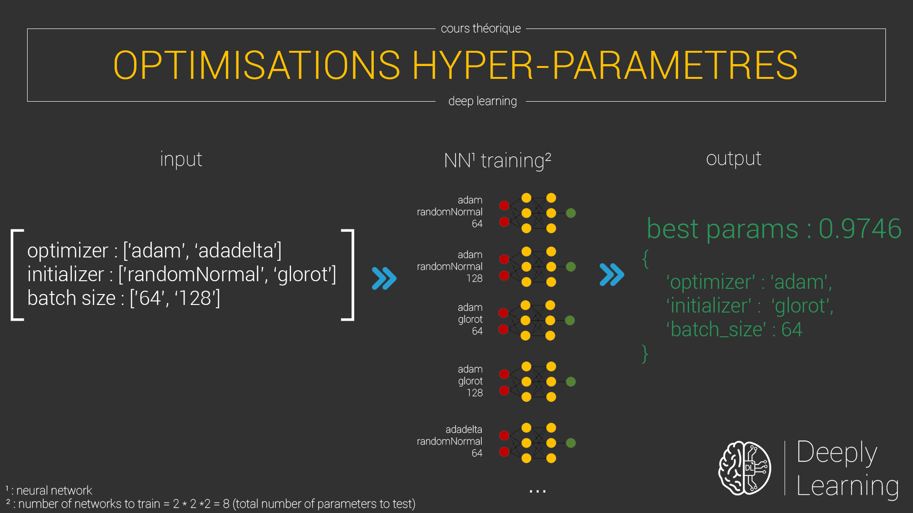
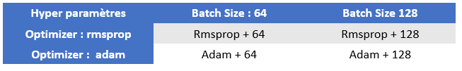
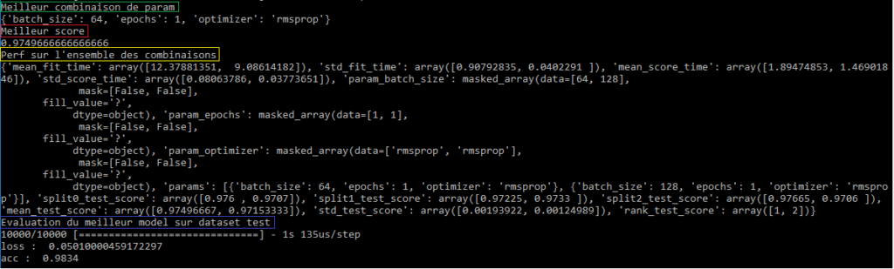

{ loading=lazy } 
///caption
Workflow du CVGridSearch de SkLearn
///

Avoir un modèle qui fonctionne, c'est bien. Mais avoir un modèle optimisé, c'est mieux. Et il existe une multitude d'expérimentations et diverses techniques pour nous permettre de grappiller davantage de précision quant à la fiabilité de prédire de nouvelles données.

Je vous explique sans plus tarder comment régler au mieux l'ensemble des hyper paramètres de votre réseau de neurones. Je vous ai créé un dépôt sur Github ([clique, clique 🙃](https://github.com/Momotoculteur/CvGridSearchNeuralNetworkExample)) reprenant l'ensemble des bouts de code cités plus loin dans cet article.

 

## Différence entre paramètres et hyper-paramètres

Un paramètre est interne au réseau de neurones. Il va évoluer durant l'ensemble du processus d'entrainement, lors de la backpropagation.

Un hyper-paramètre est à l'inverse d'un paramètre, externe au processus d'entrainement, il en définit des propriétés. Il reste statique durant l'entrainement ( ex : batch size, epoch, learning rate...).

 

## Optimisation des hyper-paramètres

Prenons un exemple simple. On souhaite optimiser deux hyper paramètres, qui sont le batch size et l'optimizer. On sait que le choix d'un hyper-param aura des conséquences sur l'apprentissage. On en connait les grandes lignes sur tel ou tel impacts qu'ils amènent, mais pour certains on ne sait pas d'avance quelles en sont les meilleures combinaisons entre eux.

 

### Comment s'y prendre pour choisir les meilleures synergies ?

Le principe serait de tester diverses combinaisons. Vous avez la solution de créer autant de modèle que d'autant de combinaisons possibles. C'est redondant, lent, obligé de les lancer un à un ( si en plus vous en oubliez pas 😅 ). Ou vous avez la solution simple, rapide et efficace. Merci la GridSearchCV de Scikit-learn ! 😎

{ loading=lazy } 
///caption
Tableaux contenant l'ensemble des combinaisons possible pour deux valeurs entre deux hyper-paramètres
///

Celle-ci va se charger toute seule d'effectuer autant d’entraînements que l'on à de combinaisons d'hyper-paramètres, et ce en quelques lignes de code.

 

La première chose à faire est de définir des listes de valeurs que l'on souhaite tester sur l'ensemble de nos hyper-paramètres :

```python linenums="1" title="defineHyperParameters"
EPOCH = [1,5]
BATCH_SIZE = [500,1000]
OPTIMIZER = ['rmsprop', 'adam']
```
 

On crée un dictionnaire regroupant l'ensemble de nos hyper-params précédent :

```python linenums="1" title="mergeAllHyperparameters"
hyperMatrix = dict(optimizer=OPTIMIZER, epochs=EPOCH, batch_size=BATCH_SIZE)
```

Vous pouvez cependant faire d'une pierre deux coups ces étapes précédente, je les dissocie pour bien expliquer 😉

 

Je vous passe l'ensemble des pré-process des données, ce n'est pas le but de ce chapitre aujourd'hui.

On va ensuite définir une fonction pour nous retourner un model construit :


```python linenums="1" title="defineModel"
def buildModel(optimizer="adam"):
    model = Sequential()
    model.add(Conv2D(32, (3,3), activation='relu', input_shape=(28,28,1)))
    model.add(Conv2D(32, (3,3), activation='relu'))
    model.add(MaxPooling2D(pool_size=(2,2)))
    model.add(Dropout(0.25))
    model.add(Flatten())
    model.add(Dense(128, activation='relu'))
    model.add(Dropout(0.5))
    model.add(Dense(10, activation='softmax'))
    model.compile(loss='categorical_crossentropy',
                  optimizer='adam',
                  metrics=['accuracy'])
    return model
```

Il se peut que vous ayez une erreur de paramètre non reconnu. Si cela vous arrive, vous devrez ajouter ce paramètre en argument de cette fonction, comme je l'ai fait dans l'exemple pour l'optimizer qui n'était pas reconnu.

 

On va ensuite wrapper notre modèle dans un KerasClassifier. Cette étape est primordiale, car c'est elle qui va nous permettre d'utiliser l'api de Scikit-Learn avec un modèle de Keras :


```python linenums="1" title="wrapperKerasModelScikitLearn"
model = KerasClassifier(build_fn=buildModel, verbose=1)
```

 

On va pouvoir associer un modèle avec notre dictionnaire englobant l'ensemble de nos combinaisons que l'on souhaite tester, et lancer l'entrainement sur notre jeu de données :


```python linenums="1" title="GridSearchCV&trainModel"
grid = GridSearchCV(estimator=model, param_grid=hyperMatrix)

# On lance l'entrainement
history = grid.fit(X_train, Y_train)
```

Vous pouvez lui passer en paramètre deux arguments qui peuvent être utile selon moi :

- **n\_jobs** : int or None, optional (default=None) : nombre de jobs à faire tourner en parallèle. Il est à défaut à 1. Pour utiliser l'ensemble des cœurs de votre processeur, mettez-le à _\-1._
- **cv** : int, cross-validation generator or an iterable, optional :  détermine la stratégie de cross validation à utiliser. Par défaut à 3.

 

Une fois entraîné, on va pouvoir récupérer :

- La combinaison d'hyper-paramètres qui nous a donné le meilleur score ( ligne 1 )
- Le score de la meilleure combinaison ( ligne 2 )
- Ou encore l'ensemble ( ligne 3 )


```python linenums="1" title="gridsearchCvtestMetrics"
print(history.best_params_)
print(history.best_score_ )
print(history.cv_results_)
```

Petite astuce si vous souhaitez tester le meilleur modèle sur un nouveau jeu de données, de test par exemple. Vous devrez récupérer dans un premier temps le modèle généré par les meilleurs hyper-paramètres, puis ensuite l'évaluer sur le jeu de donnée souhaité.


```python linenums="1" title="gridsearchCvtestMetrics"
bestModel = history.best_estimator_.model
metricsName = bestModel.metrics_names
metricsVal = bestModel.evaluate(X_test, Y_test)
for metric, value in zip(metricsName, metricsVal):
    print(metric, ': ', value)
```

{ loading=lazy } 
///caption
Résultats des métriques définit dans le code source précédent
///
 

### Recherche quadrillage ou recherche aléatoire ?

On penserait qu’une recherche par quadrillage nous permet d’essayer l’ensemble des combinaisons possible, et donc forcément d’obtenir les meilleures valeurs. Cependant, un entrainement d’un tel réseau nécessitant du temps et une puissance de calcul importante, cela reste une solution techniquement très lente à mettre en place, et donc étant finalement une solution peu efficace contre rendu de nos diverses contraintes.

 

Exemple : Tester 3 hyper-paramètres, de range 1 à 100

Exemple d’une recherche par quadrillage : (padding de 1)

`100 x 100 x 100 = 1 million de possibilités`

Exemple d’une recherche aléatoire : (padding de 10)

`10 x 10 x 10 = 1 000 possibilités`

 

On se rends facilement compte avec cet exemple, que la recherche aléatoire de variables prise aléatoirement dans une fourchette donnée, nous permet de tester bien plus de valeur sur un même temps donné. Si c’est plus rapide, on sera donc plus efficace via ces sauts de valeurs.

 

De plus, des articles scientifiques ont démontré qu'une recherche aléatoire donnait de meilleurs résultats, car certains paramètres ont d'avantages d'impact par rapport à d'autre concernant l'optimisation de la fonction de perte. En effet, ceux-ci ne sont pas tous équivalent à paramétrer.

{ loading=lazy } 
///caption
Comparaison entre une recherche par quadrillage et aléatoire pour optimiser une fonction
///
 
