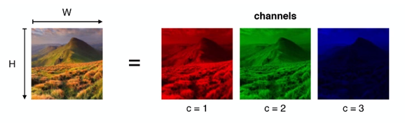
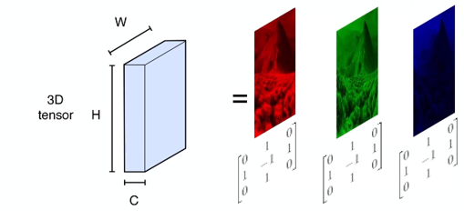

Lorsque l’on souhaite analyser des images, ce sont les réseaux de neurones à convolution qui s’en sortent le mieux. Ils sont basés grâce à des expériences effectué sur le cortex et le système de vision des animaux, ces réseaux sont beaucoup plus légers que leurs confrères composé de couche de neurones entièrement connectés les uns aux autres. Attention cependant à ne pas faire trop le rapprochement entre CNN (Convolutional Neural Networks) et images, car ceux-ci peuvent tout aussi bien être utilisé sur du texte, pour réaliser des analyseur de sentiments pour ne citer qu’un exemple. Mais ce n’est pas l’objectif de cet article-ci, j’en reparlerais dans des articles dédiés à ce sujet. 😉

Comme je disais, ces réseaux qui analysent des images, vont pouvoir extraire des caractéristiques propre à celle-ci et à l’ensemble des objets, personnes etc. la constituant. Cependant, comme je l’ai expliqué dans ce post-ci, les réseaux de neurones effectuent des calculs matricielles sur des tenseurs. Ce serait donc outrageux d’envoyer directement nos images tel quel, dans leurs formats natif comme jpg ou encore png (et de toute façon, ce n’est pas possible).

Je vais donc vous montrer comment est constitué une image, afin que vous compreniez les processus que j’effectue sur mes tutoriels pratiques, lorsque je convertis les images de mon jeu de données en tableaux de valeurs (fichier Numpy).

 

## Comment est constitué une image ?

Premièrement, notre image est composée de pixel. Je ne vais vous faire la description globale de ce qu’est un Pixel (wikipedia le fera bien mieux que moi), mais c’est l’unité de base, qui définit une image. Une image ayant une taille de 50 par 50 veut dire qu’elle sera composée de 50 pixel par 50 pixel.

{ loading=lazy } 
///caption
Les 3 canaux RGB constituant une image
///

 

Ensuite, il faut savoir qu’une image en couleurs est composé de 3 canaux, le célèbre RGB (pour Rouge Vert Bleu). Vous aurez donc deviné, que pour une image en noir et blanc, celle-ci est composé exclusivement d’un seul canal.

Ainsi, on peut représenter chaque canaux par une matrice de dimension correspondant à la largeur et la hauteur de l’image. Chaque pixel de l’image va donc représenter une variable de la matrice, qui correspond à l’intensité de la couleurs à ce pixel précis. Petit rappel concernant ce sujet, un pixel peut être définit via une variable comprise entre 0 et 255, correspondant à l’intensité de sa couleur. Cependant, pour homogénéiser nos matrices, nous allons diviser par 255 chacune de nos valeurs, pour avoir à l’entrée de notre réseau de neurones, des matrices ayant l’ensemble de ses valeurs entre 0 et 1.

 
{ loading=lazy } 
///caption
Empilement de chaque matrice de nos canaux qui forment un tenseur d'ordre 3
///

Nous nous retrouvons au final avec 3 matrices correspondant à nos 3 canaux de couleurs, qui seront empilés pour former ce qu’on appelle un Tenseur d’ordre 3. Et c’est sur ces structures algébriques que la magie de notre réseau va opérer. 😉
