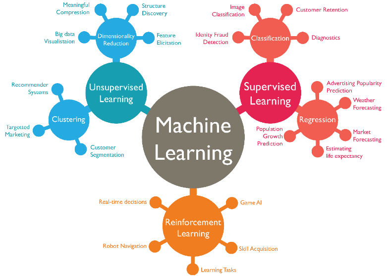

{ loading=lazy } 
///caption
Schéma des différents cas d’utilisation pour un type d'entrainement donné
///
 

Selon notre type de problème à résoudre, on va devoir utiliser un entrainement spécifique. Voici les 3 principaux types entrainement auquel on peut se confronter :

- **Apprentissage supervisé :** dans ce cas-ci, on va avoir un utilisateur qui va guider la machine, en fournissant une grande quantité d’exemple qui aura été labélisé au préalable. Cette étape de labélisation, indispensable, permet d’associer une entrée à une sortie souhaité. Par exemple, si on souhaite un algorithme capable de reconnaitre un chat, les image d’entrée de chat seront étiqueté ‘chat’, et les autres photos qui ne représente pas de chat seront étiqueté ‘autre’. Ainsi pour une donnée d’entrée, nous auront en sortie soit un ‘chat’, soit un ‘autre’, identifié par notre réseau(classification). Le modèle peut aussi apprendre à généraliser et prédire de futures données (régression), par exemple pour prédire le prix d’une maison que l’on souhaiterait vendre, en renseignant juste sa superficie et ses installations. C’est ce type d’apprentissage que j’utilise pour le POC 2. Nous pouvons donner un exemple très populaire de ce type d’entrainements, tel que la détection d’objet pour les voitures autonomes.
- **Apprentissage non supervisé :** cela concerne des problèmes de clusterisation, procédé auquel on souhaite partitionner et classer des éléments hétérogènes sous forme de sous-groupe qui seraient liés par des caractéristiques communes. C’est la machine elle-même qui va déterminer les traits en communs entres les données, sans intervention externe. Utilisé pour comprendre et explorer des données, dont le nombre de classe est inconnues, ou dont le jeu de données est non étiqueté. Un exemple peut être, que la NASA puisse classer l’ensemble des nouveaux corps célestes qu’elle découvre, en objets astronomiques telle que des étoiles, planètes, astéroïdes, trous noirs, en comparant certaines de leurs données, tel que leur distance, poids, force gravitationnel, etc.
- **Apprentissage par renforcement :** On va utiliser des notions d’agent, d’environnement et de récompense. Un agent va réagir en fonction d’un état de l’environnement, et renvoyer une action en fonction de celui-ci. Un système de récompense permettra quant à lui d’impacter positivement ou négativement l’agent, en fonction d’action prise. Le but du système étant d’amasser le maximum de point possible, il pourra comprendre la différence entre une bonne et une mauvaise action, et donc au fur et à mesure de favoriser les bonnes actions. On essaye de reproduire le mécanisme naturel d’acquisition des connaissances. C’est comme un enfant qui découvre pour la première fois une flamme. Il se brûlera une première fois en la touchant, et ne le refera plus. Extrêmement puissant car ne nécessite pas de large jeu de donnée comme les 2 apprentissages précédents. Ce type d’apprentissage peut se voir dans les intelligences artificielles des nouveaux jeux vidéo par exemple. En effet, devenant de plus en plus complexe, il devient difficile d’en concevoir avec les anciennes méthodes.
