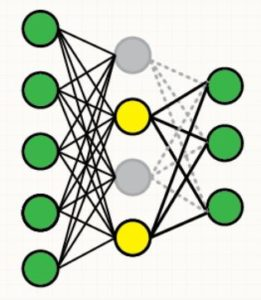
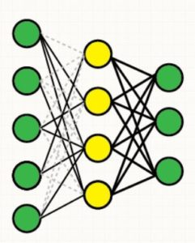

La régularisation du réseau a pour principal objectif de prévenir le sur apprentissage (**overfitting**). Celle ci, va pouvoir via différentes techniques, permettre de gérer les éventuels débordements des paramètres du réseau au cours de l'entrainement.

- **Dropout :** On va souhaiter favoriser l'extraction de caractéristique de façon indépendante, afin d'apprendre des caractéristique plus général et plus diverse. Cela va consister à 'éteindre', à désactiver certains neurones du modèle, et ce de façon aléatoire d'une même couche, qui ne contribuera donc ni à la phase de feedforward, ni à la phase de backpropagation. D'un point de vue du réseau, cela revient à instancier la valeur en sortie d'une fonction d'activation à 0.
    
{ loading=lazy } 
///caption
Schéma du DropOut
///    

- **DropConnect :** On va reprendre le même principe que précédemment. Mais au lieu de désactiver des neurones, on va simplement désactiver les connexions entrantes (toujours de façon aléatoire) sur une couche depuis la précédente. D'un point de vue du réseau , cela revient à instancier les valeurs des poids des connexions à 0.
    
{ loading=lazy } 
///caption
Schéma du DropConnect
///    

- **L1 regularization (lasso regression) :**  Cette méthode ci va plutôt avoir une action de prévention , pour contenir les variables du réseau dans des intervalles spécifique, afin que celle-ci ne deviennent au cours de l'entrainement trop extrêmes. Pour ce cas là, cette régularisation va ajouter un terme de régularisation à notre fonction de perte, correspond à la somme des valeurs absolues de nos poids. Approche les poids vers 0. Fonctionne bien lorsque on est dans un cas avec énormément de caractéristiques. Utile pour des réseaux dont les données sont espacés.

- **L2 regularization (ridge regression) :** Celle ci va aussi ajouter une pénalité à notre fonction de perte, de sorte que l'ensemble des erreurs soient minimal, ou maximal, mais pas entre les deux. En effet, il correspond à la somme des valeurs au carré de nos poids. Utile pour des réseaux dont les données sont rapprochés.

- **Max-Norm regularization :** Empêche les poids d'exploser lorsque on utilise de haut taux d'apprentissage. Très utile lorsque l'on utilise des optimizer avec decay ( optimizer avec un learning rate haut au départ, et qui diminue au fil des entraînements, ex : Adagrad, etc.), sans même l'utilisation de drop-out.

On peut combiner l'utilisation simultané de la régulation L1 et L2. Cependant en pratique, on note un avantage pour la L2 qui donne de meilleurs résultats.
