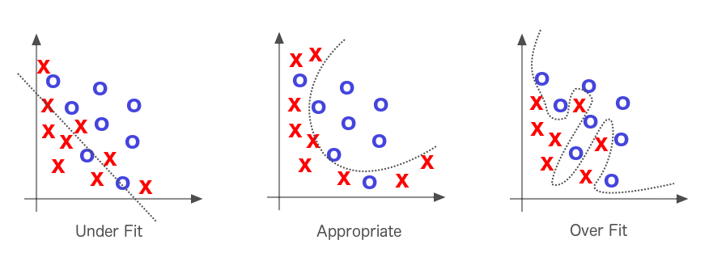

{ loading=lazy } 
///caption
Schéma représentant l'underfitting, le cas idéal et l'overfitting
///

On souhaite avoir un réseau qui puisse effectuer des prédictions sur de nouvelles données. Selon la façon dont est entrainé le model, on peut se heurter à 2 problèmes :

- **Sur apprentissage :**

Cela représente un modèle qui a appris par cœur ses données d’entrainement, qui fonctionne donc bien sur le jeu d’entrainement mais pas de validation. Il effectue alors de mauvaise prédiction sur de nouvelles, car elles ne sont pas exactement les mêmes que celle du jeu d’entrainement. Pour y remédier, il faut améliorer la flexibilité du modèle, et donc jouer sur des concept de régularisation par exemple, ou encore d’early stopping.

- **Sous apprentissage :**

Ce cas-ci représente un modèle qui n’arrive pas à déduire des informations du jeu de données. Il n’apprend donc pas assez et réalise de mauvaise prédiction sur le jeu d’entrainement. Il faut donc complexifier le réseau, car il ne taille pas bien par rapport aux types de données d’entrées. En effet, il n’arrive pas à capter la relation entre les données d’entrées et leur label.

Dans le cas où la précision du réseau n’est ni bonne sur le jeu d’entrainement, ni sur celui de validation, c’est que le réseau n’a pas eu assez de temps pour apprendre des données. Il faut donc augmenter le nombre d’itération, ou augmenter la taille du jeu de donnée.

