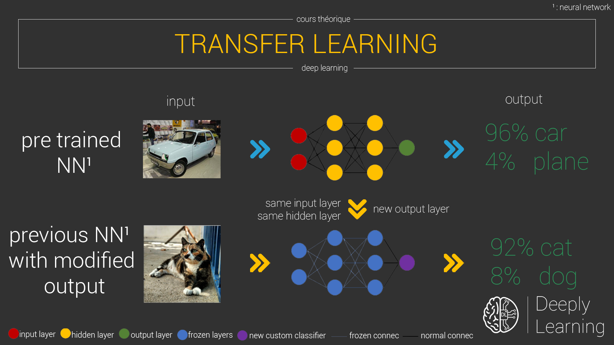

En rédigeant mon dernier cours sur comment réaliser un recommandeur de hashtag pour image, j'ai utilisé une nouvelle approche pour me permettre de déployer mon projet de data science bien plus rapidement et efficacement ( du moins pour une première version ). Cela a dû être une nécessité pour la simple et bonne raison que c'est la première fois que je vous propose un cours avec un jeu de données bien plus conséquent que les autres fois.

Je vous présente de ce pas, le **transfer learning** 😏

{ loading=lazy }
///caption
Schéma du fonctionnement du transfer learning
///

## Généralité

### Définition

Le transfer learning comme son nom l'indique, est une approche permettant de transférer le savoir d'un modèle, à un autre. En l’occurrence, transférer les poids d'un modèle pré entraîné à une tâche précise, pour les associer à un autre modèle.

Dans des problématiques réelles ou l'on traite de data science, la vrai, vous allez vous taper le nez contre des dataset gigantesque pour permettre d'avoir un modèle qui couvre le maximum de cas possible, permettant de réaliser les meilleures généralisations sur de nouvelles variables. Le soucis étant que vous n'aurez peut-être pas ( comme moi à l'heure actuelle 😅 ) la puissance de calcul nécessaire pour réaliser ces opérations, vous obligeant à rester sur des inputs soit en quantité réduite, soit en qualité réduite. L'un comme l'autre a un effet nuisant à la bonne performance de votre modèle.

On peut se poser la question comment un réseau pourrait fonctionner sur un nouveau jeu de données, si celui-ci n'a rien à voir par rapport à celui sur lequel il a appris. Et bien il va falloir le ré-entraîner sur les nôtres, et pas de n'importe quelle façon, puisque que si on le ré-entraîne de la plus simple des manières, cela reviendrait au même de faire notre propre modèle à partir de zéro. On souhaite qu'il garde les plus grandes notions qu'il a appris durant son entrainement bien plus long que l'on ne pourrait le faire, et surtout sur l'importante quantité d'images que l'on ne pourrait rassembler sur un projet personnel, ou du moins sur un projet qui débute.

On va alors geler les couches basses du réseau, celle qui sont responsable de la détection de caractéristiques simples. On pourrait parler de formes géométriques simple dans le cas d'une classification d'image, pour vous donner une idée, tel que des traits horizontaux et verticaux. Ces formes simples étant la base de la constitution de n'importe quelles formes et structures, nous n'aurons pas besoin de les modifier. En d'autres termes, ce gel se traduit par l’impossibilité pour ces couches de neurones, de changer leurs poids.

Pour adapter le réseau à nos données, on va devoir ajouter notre propre classificateur qui va être adapté à nos données. Pour cela, on va supprimer les couches décisionnelles ( les couches dîtes hautes, qui servent à classifier correspondant aux couches de neurones entièrement connecté, appelé _dense layer_ ou _fully connected layer_) du réseau pré-entraîné afin de pouvoir les remplacer par les nôtres, qui elles vont pouvoir apprendre les formes de plus en plus complexe, et donc pouvoir s'adapter à nos données qu'il n'aura jamais vu auparavant lors de son entrainement de base. C'est donc cette dernière étape qui va nous permettre d'adapter n'importe quel modèle sur un autre cas d'utilisation

Les grandes lignes de votre workflow pour mettre en place cette stratégie vont être les suivantes :

- Récupération d'un modèle pré entraîné,
- Adaptation de la structure du modèle à vos propres données d'entrées, et surtout à vos données de sortie souhaités,
- Ré-entrainement partiel du modèle pré entraîné sur votre propre jeu de données.

### Quand l'utiliser et pour quels avantages

- **Modèle déjà existant** : il peut exister qu'une personne ait déjà rencontré la même problématique que vous. Il se peut donc qu'un modèle existe déjà pour la tâche que l'on essaye de traiter.
- **Pas assez de data** : il se peut aussi que vous n'ayez pas assez de données pour pouvoir entraîner un modèle de A à Z
- **Pas assez de puissance de calcul** : entraîner qu'une infime partie des couches d'un réseau de neurones va pouvoir accélérer son apprentissage

On peut alors traduire l'ensemble des points précédent par une diminution des contraintes techniques, ainsi qu'un gain de temps général.

## Mise en place du code

La première chose va donc être de récupérer un modèle pré entraîné. Vous avez quelques choix concernant le traitement d'images sur le site de [Keras](https://keras.io/applications/). Mais vous avez des _zoo_, qui sont des répertoires entier de modèles pré-entraînés et gracieusement partagés par la communauté. Vous aurez donc peut être des chances d'avoir des personnes ayant travaillés sur des projets relativement proche du votre. Du moins, ça vaut le coup d'y jeter un coup d’œil. Une fois trouvé, téléchargé le modèle au format .hdf5 et chargez le.


```python linenums="1" title="getPreTrainedModel"
baseModel = MobileNetV2(input_shape=(96,96,3), alpha=1.0, include_top=False, weights='imagenet', input_tensor=None, pooling='max')
```

Dans mon cas je vais en récupérer un directement depuis le site de Keras. Extrêmement pratique puisque on a le choix de vouloir ou non les couches de décisions. On ne les souhaite pas, afin d'adapter ce modèle à nos données.

 

Ensuite on gèle les couches basses du réseau :

```python linenums="1" title="frozePreTrainedTopLayerModel"
for layer in baseModel.layers:
    layer.trainable=False
```
 

On ajoute nos couches de décisions composée de fully connected :

```python linenums="1" title="newTopLayers"
topModel = Dense(4096,activation='relu', trainable=True)(baseModel.output)
topModel = Dense(NB_CLASSES,activation='sigmoid', trainable=True)(topModel)
```

On instancie un nouveau model en concaténant l'entrée du model de base, et la sortie de la dernière couche que nous venons d'ajouter à précédemment, ce qui nous donne :

```python linenums="1" title="mergeDualModel"
model = Model(inputs=baseModel.input, outputs=topModel)
```

Je ne vous joins pas le reste du code, mais vous n'avez plus qu'à compiler le modèle et l’entraîner avec les mêmes fonctions et argument que vous avez l'habitude d'utiliser, à savoir :

- model.compile(...);
- model.fit(...);
