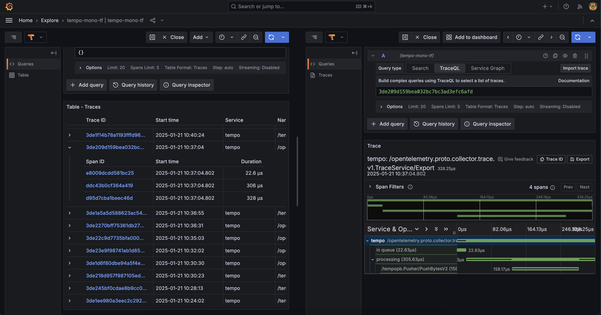

Dans un article précédent j'ai montré comment installer Grafana Bayla, qui permet de scrap des traces afin de les envoyer vers un collector OTEL. 

OTEL doit maintenant les envoyer vers une TSDB afin que les traces y soit stocker pour y être consulté plus tard avec des dashboard Grafana par example.

Ici je te montrerais comment faire une configuration complète avec :

- **Grafana Tempo**: TSDB maintenu par Grafana Labs, en mode monolitics (utile pour ceux qui ont un laptop rincé comme le mien et qui veulent éviter les OOMKILLED)
- **Grafana Tempo Distributed**: la version micro services qui permet un meilleur scaling pour les cluster à forte charge
- **Jaeger**: Une autre TSDB open source la plus connue et qui mérite d'y jeter un coup d'oeil.


## Introduction
### Tempo, la simplicité
Grafana Tempo, c’est le chill du tracing. Pas d’indexation complexe, juste des traces bien rangées à bas coût.

Ce qu’il fait bien :

- **Simple & efficace** : OpenTelemetry, Jaeger, Zipkin ? Ça roule.
- **Stockage éco-friendly** : Il balance tout dans un stockage objet (S3, GCS, MinIO) sans indexer. Résultat : ça coûte peanuts.
- **100 % Grafana vibes** : Il s’intègre direct avec Grafana pour tout visualiser en un clin d’œil.


Ce qu’il faut savoir :

- Pas de recherche avancée sans logs associés (il te faut Loki/Promtail pour ça).
- Parfait pour les petits budgets ou si t’aimes les choses simples.

### Tempo Distributed, la version body-buildé

C’est Tempo, mais dopé aux amphétamines ! Conçu pour les gros volumes et les gros besoins.

Ce qu’il fait bien :

- **Hyper scalable** : Pensé pour les mastodontes avec une architecture distribuée au top (compactor, querier, distributor, etc.).
- **Toujours low cost** : Même principe de stockage sans index, donc ça reste économique.
- **Taillé pour les pros** : Si t’as une infra massive et des tonnes de traces à gérer, c’est lui qu’il te faut.

Ce qu’il faut savoir :

- Plus complexe à déployer (mais Kubernetes est ton ami).
- Clairement orienté pour les environnements XXL.
  

### Jaeger, le vétéran solide

Jaeger, c’est la Rolls du tracing distribuée. Créé par Uber, il est puissant, flexible, et fait partie des stars du CNCF.

Ce qu’il fait bien :

- **Multi-protocole** : OpenTelemetry, OpenTracing, Jaeger Thrift… Il parle toutes les langues !
- **Stockage flexible** : Tu choisis ton backend préféré : Elasticsearch, Cassandra, Kafka…
- **Interface top** : T’as une belle UI pour chercher tes traces et te permet d'analyser le tout avec des graphes de dépendance stylés.
- **Power user-friendly** : Recherche avancée, stats poussées (erreurs, latences), tout y est.

Ce qu’il faut savoir :

- Gourmand en ressources (surtout avec Elasticsearch).
- Idéal si tu veux creuser dans les détails.
  
### Résumé du comparatif

- **Jaeger** : Pour les experts qui veulent du contrôle total et des recherches ultra-fines.
- **Tempo** : Si t’as un budget serré et que t’aimes bosser dans l’écosystème Grafana sans te compliquer la vie.
- **Tempo Distributed** : Si t’as un cluster de malade et un flot de traces digne d’une plateforme à la Netflix, tout en maîtrisant les coûts.


| **Critères**                  | **Jaeger**                                  | **Tempo**                                   | **Tempo Distributed**                       |
| ----------------------------- | ------------------------------------------- | ------------------------------------------- | ------------------------------------------- |
| **Scalabilité**               | Moyenne (backend dépendant du stockage)     | Bonne (grâce au modèle sans index)          | Excellente (architecture distribuée)        |
| **Coût de stockage**          | Elevé (backend comme Elasticsearch coûteux) | Faible                                      | Faible même à grande échelle                |
| **Protocole supporté**        | OpenTelemetry, OpenTracing, Jaeger Thrift   | OpenTelemetry, Jaeger, Zipkin               | Idem Tempo                                  |
| **Recherche avancée**         | Très riche                                  | Basique (dépend de Loki/Promtail pour logs) | Basique (dépend de Loki/Promtail pour logs) |
| **Interface utilisateur**     | Riche et complète                           | Intégrée à Grafana                          | Intégrée à Grafana                          |
| **Simplicité de déploiement** | Moyenne                                     | Simple                                      | Complexe                                    |
| **Intégration Grafana**       | Possible (non natif)                        | Natif                                       | Natif                                       |

## Configuration de Tempo
Je te montre ici un exemple de résultat que j'ai obtenu 


### Beyla Configuration
Ici j'utilise un scrappeur de traces très simple à mettre en place, fonctionnant via eBPF, qui lui permet de fonctionne directement sur le kernel de la machine afin d'être au plus bas niveau pour la récolte de traces.

Rien de bien compliqué ici, l'installation se fait via le chart Helm. Une seule chose à bien configurer est l'endpoint de notre instance OpenTelemetry

```terraform
env = {
    "OTEL_EXPORTER_OTLP_TRACES_ENDPOINT" = "otel-collector-global-collector.otel.svc.cluster.local:4317"
}
```

### OTEL Configuration
OpenTelemetry est installé via son Opérateur, et j'utilise donc une CRD afin de créer un collector.

On va lui spécifier ici des props comme tel :

- **receivers** : props permettant d'écouter des traces sur des protocols différents 
- **exporter** : permet d'envoyer les traces reçu vers l'endpoint de notre TSDB choisi
- **pipeline** : permet de définir quel composant on va utiliser dans notre flux de données. Ici rien de plus simple, on a une datasource et un sink. Mais on pourrait potentiellement faire appel à un **processor**, permettant de faire du memory_limit, batch_limit, etc
  
```yaml
apiVersion: opentelemetry.io/v1beta1
kind: OpenTelemetryCollector
metadata:
  name: otel-collector-global
  namespace: otel
spec:
  mode: deployment
  config:
    receivers:
      otlp:
        protocols:
          grpc:
            endpoint: 0.0.0.0:4317
          http:
            endpoint: 0.0.0.0:4318
    exporters:
      otlp/tempo:
        endpoint: "tempo.monitoring.svc.cluster.local:4317"
        tls:
          insecure: true
    service:
      pipelines:
        traces:
          receivers: [otlp]
          exporters: [otlp/tempo]
```

### Tempo Helm Chart
Le monolitic de Tempo à une installation très simple. Je passe directement via son chart, je n'ai eu besoin d'aucune modification particulière concernant les values:

```terraform
resource "argocd_application" "tempo" {
  metadata {
    name      = "tempo"
    namespace = "argocd"
  }

  spec {
    destination {
      server    = "https://kubernetes.default.svc"
      namespace = kubernetes_namespace.monitoring_ns.metadata[0].name
    }

    sync_policy {
      automated {
        prune       = false
        self_heal   = true
        allow_empty = true
      }

      sync_options = ["Validate=true"]
      retry {
        limit = "5"
        backoff {
          duration     = "30s"
          max_duration = "2m"
          factor       = "2"
        }
      }
    }

    source {
      repo_url        = "https://grafana.github.io/helm-charts"
      chart           = "tempo"
      target_revision = "1.18.1"

      helm {
        release_name = "tempo"
        values = yamlencode({})
      }
    }
  }
}
```
### Grafana datasource
On veut maintenant être capable d'intéroger Tempo avec une datasource que l'on va configurer dans Grafana. Pour cela, j'ai aussi terraformer cette datasource comme suit :

```terraform
resource "grafana_data_source" "tempo" {
  depends_on = [argocd_application.tempo]
  type = "tempo"
  name = "tempo-datasource"
  url = "http://tempo.monitoring:3100"
}
```

## Configuration de Tempo Distributed

Ici on va avoir quelque chose d'extremement semblable à la configuration de sa version monolitic. Nous allons avoir que juste quelques endpoint à ajuster afin de bien target tel ou tel microservice désiré de Tempo Distributed.

### Beyla Configuration
Ici la configuration reste identique.

```terraform
env = {
    "OTEL_EXPORTER_OTLP_TRACES_ENDPOINT" = "otel-collector-global-collector.otel.svc.cluster.local:4317"
}
```

### OTEL Configuration
On va ajuster ici l'endpoint de notre exporter afin de target le service **Distributor**.
  
```yaml
apiVersion: opentelemetry.io/v1beta1
kind: OpenTelemetryCollector
metadata:
  name: otel-collector-global
  namespace: otel
spec:
  mode: deployment
  config:
    receivers:
      otlp:
        protocols:
          grpc:
            endpoint: 0.0.0.0:4317
          http:
            endpoint: 0.0.0.0:4318
    exporters:
      otlp/tempo:
        endpoint: "tempo-distributor.monitoring.svc.cluster.local:4317" // tempo-distributed
        tls:
          insecure: true
    service:
      pipelines:
        traces:
          receivers: [otlp]
          exporters: [otlp/tempo]
```

### Tempo Helm Chart
On va ajuster quelques valeurs pour le chart :

- **gateway** : son activation va nous permettre d'ajuste la datasource grafana afin que l'on puisse y lire nos traces
- **listener** : on active ici les protocol que l'on souhaite, http et/ou grpc
- et bien évidemment aussi le repo url du nouveau chart

```terraform
resource "argocd_application" "tempo" {
  metadata {
    name      = "tempo"
    namespace = "argocd"
  }

  spec {
    destination {
      server    = "https://kubernetes.default.svc"
      namespace = kubernetes_namespace.monitoring_ns.metadata[0].name
    }

    sync_policy {
      automated {
        prune       = false
        self_heal   = true
        allow_empty = true
      }

      sync_options = ["Validate=true"]
      retry {
        limit = "5"
        backoff {
          duration     = "30s"
          max_duration = "2m"
          factor       = "2"
        }
      }
    }

    source {
      repo_url        = "https://grafana.github.io/helm-charts"
      chart           = "tempo-distributed"
      target_revision = "1.21.1"

      helm {
        release_name = "tempo"
        values = yamlencode({
          traces = {
            otlp = {
              grpc = {
                enabled = true
              }
              http = {
                enabled = true
              }
            }
          }
          gateway = {
            enabled = true
            autoscaling = {
              enabled = true
            }
          }
        })
      }
    }
  }
}
```

### Grafana datasource
On ajute ici le nouvel endpoint qui pointe directement vers la gateway de notre nouveau chart :

```terraform
resource "grafana_data_source" "tempo-distributed" {
  depends_on = [argocd_application.tempo]
  type = "tempo"
  name = "tempo-distributed"
  url = "http://tempo-gateway.monitoring:80"
}
```

## Configuration de Jaeger