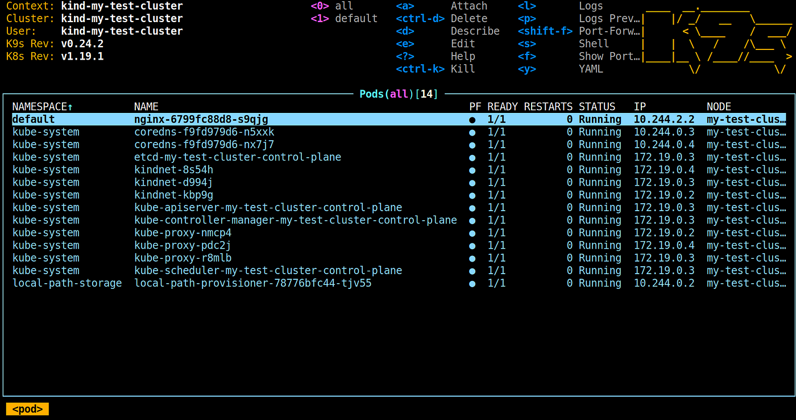
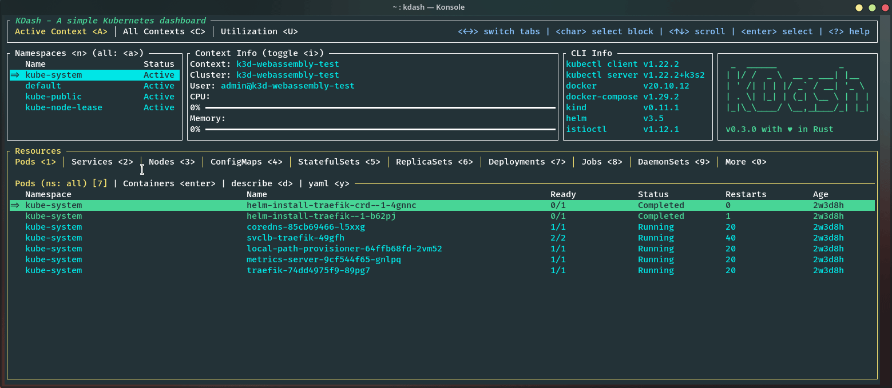
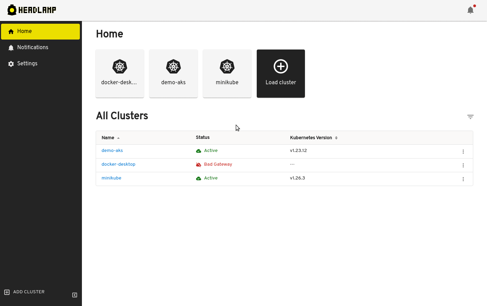
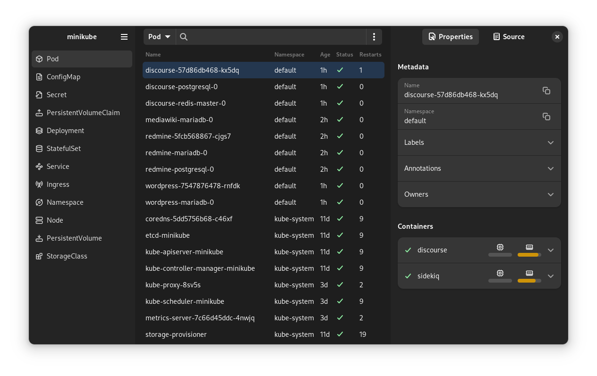

## Surveiller son cluster Kubernetes 
Tu vas vouloir monitorer ton cluster kubernetes à un moment donné. Tu pourrais très bien le faire à la mano à base de bon **kubectl**. Mais au fur et à mesure que ton cluster grossi, ça peut vite devenir la merde pour gérer tout ça. Connaître les commandes de bases c'est bien, mais une fois que tu veux faire un peu de monitoring de ressources, de port-forward tes services, modifier à chaud des configmap de façon efficace, simple et rapide, il te faut absolument un de ces outils suivant.

Je te propose deux tools que j'utilise au quotidien pour me faciliter la tâche 😎

### Lens
Lens est un soft avec une chouette interface qui va te permettre d'absolument tout suivre en un clin d'oeil tout ce qui se passe sur ton cluster. Si t'es pas un fan du terminal, c'est fait pour toi !

Plus d'info sur [LENS](https://github.com/lensapp/lens)

!!! info
    Lens devient payant. La version OpenSource [OpenLens](https://github.com/MuhammedKalkan/OpenLens) est annulée, car Mirantis qui a racheté ce produit à fermer le source code.

Pour un usage perso et étudiant tu peux avoir la version free qui fait le taff.

### K9S
C'est mon préféré. K9s te permet de faire grosso modo la même chose que Lens. Il est cependant un poil moins sexy, et s'utilise dans un terminal. Donc si la console ne te rébute pas, que tu es d'avantage clavier que souris, tu dois partir sur celui-ci !

Plus d'info sur [K9S](https://github.com/derailed/k9s)

!!! tips
    Si tu as des contraintes de ressources, dans un environement embarqué par example, que tu doit faire tourner un tool de monitoring, k9s sera bien plus light que lens !

### KDash

D'un genre semblable à K9S, c'est le petit nouveau.

Plus d'info sur [KDash](https://github.com/kdash-rs/kdash?tab=readme-ov-file)

 
### Headlamp

Un bon concurrent à Lens pour de l'enterprise, en version OpenSource et incubé chez CNCF ? 

Plus d'info sur  [Headlamp](https://github.com/headlamp-k8s/headlamp)

### Seabird

Un n-ième concurrent avec une UI, à tester

Plus d'info sur  [Seabird](https://github.com/getseabird/seabird)

