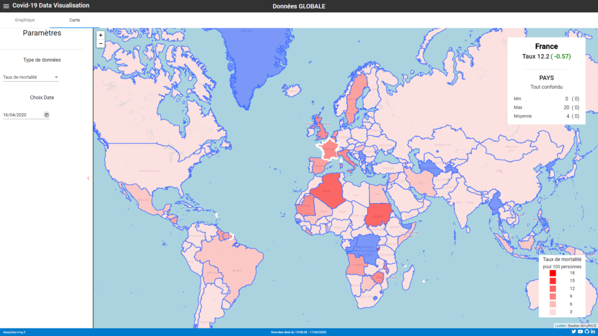
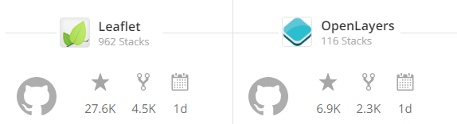
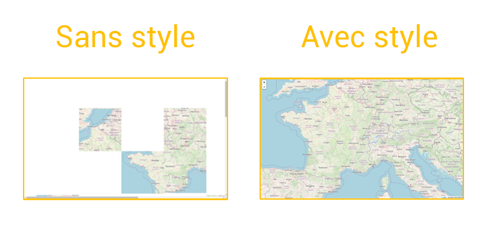
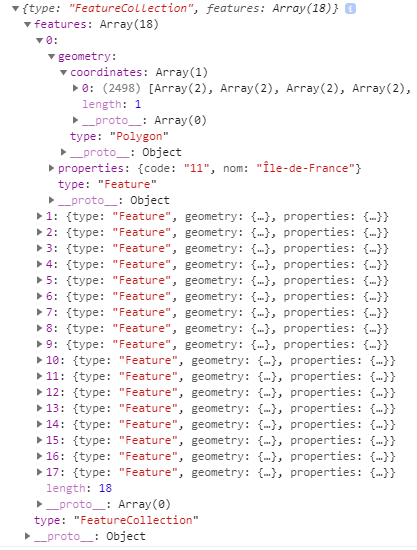
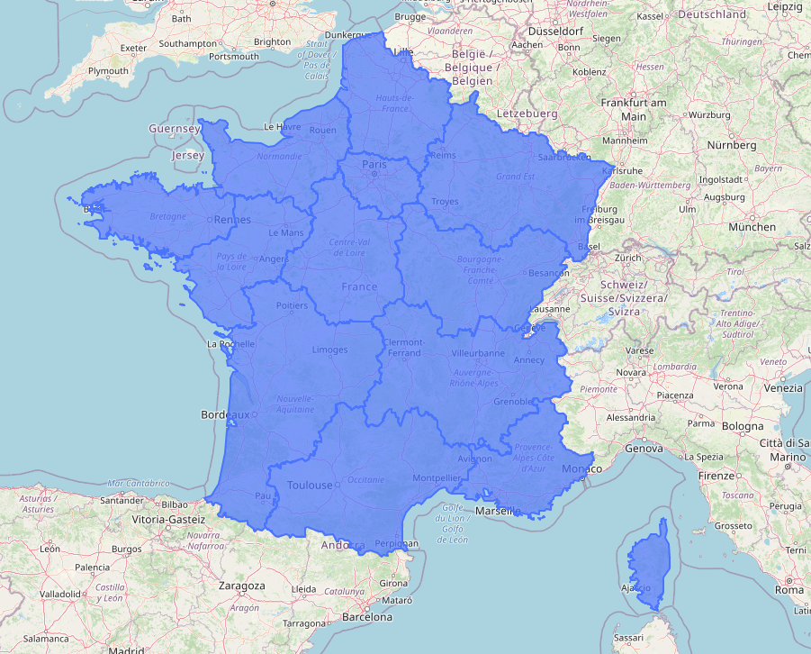
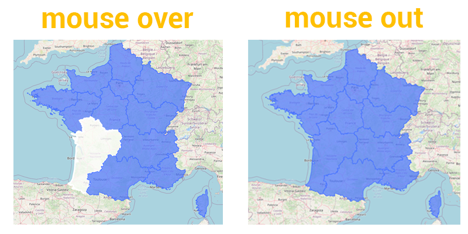
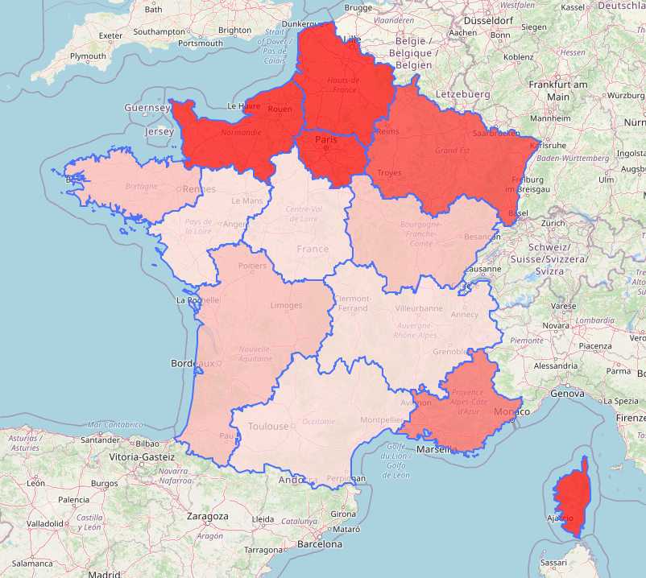
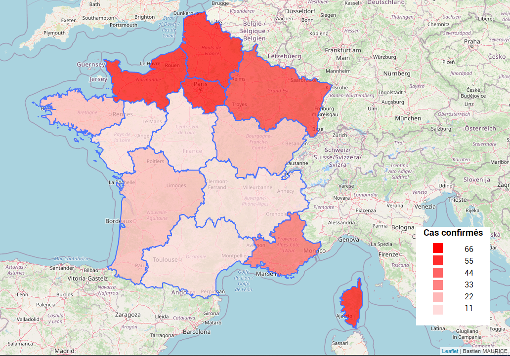
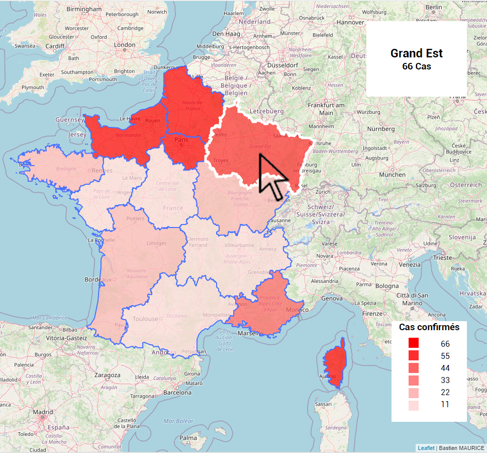

{ loading=lazy }
///caption
Exemple d'une carte choroplèthe, venant de mon projet [Covid19-Vizualisation](https://momotoculteur.github.io/covid19/)
///

Je vous propose aujourd'hui de réaliser une carte choroplèthe. C'est une carte de chaleur mettant en évidences certaines zones de différents gradients de couleurs pour montrer une intensité plus ou moins forte sur un type de donnée.

C'est d'actualité, je vous propose une carte de la France, découpé en Région, mettant en évidence l'évolution du COVID-19 sur une date donnée.

 

## Objectifs

- Intégration de Leaflet
- Affichage d'une carte vierge
- Ajout de données GeoJSON
- Ajout de légende & inter-action

C'est parti !

 

## Source du projet

**[Lien vers le dépôt Github contenant les sources](https://github.com/Momotoculteur/leaflet_integration_angular9)**

**[Lien vers une utilisation possible pour réaliser de la Data vizualisation pour suivre l'évolution de la pandémie du Covid19](https://momotoculteur.github.io/covid19/welcome)**

 

## Quelques infos sur les cartes interactives

Leaflet, Openlayers pour ne citer que les plus grands, sont des librairies javascript permettant d'afficher des cartes, et d'y ajouter une multitude d'actions. Vous pouvez ajouter des dessins, des actions, des couleurs, zones, marqueurs, etc. Le but principal est de les rendre interactives pour mettre en évidences toute sorte de chose.

{ loading=lazy }

- **OpenLayers** : considéré comme la référence actuellement, c'est un vrai framework à part entière. Permet donc de réaliser des choses très poussées.
- **Leaflet** : certainement le plus populaire. Certaines fonctionnalités ne pourront pas être aussi poussé que Openlayers, car plus léger. Il marque cependant des points quant à sa prise en main, qui s'en fera plus rapidement.

 
## Intégration de Leaflet

### Intégration & affichage du fond de carte

#### Installation de la librairie

On installe Leaflet et son module NPM facilitant son utilisation via :

`npm install --save leaflet @asymmetrik/ngx-leaflet`

On installe les définitions de types pour se faciliter la vie pour coder : `npm install --save-dev @types/leaflet`

 

#### Import de la librairie

On intègre le module **Leaflet** dans la partie '**Imports'** de notre fichier de définition de notre module principal :

```typescript linenums="1" title="app.module.ts "
import { LeafletModule } from '@asymmetrik/ngx-leaflet';

@NgModule({
  declarations: [
    AppComponent
  ],
  imports: [
    BrowserModule,
    AppRoutingModule,
    LeafletModule
  ],
  providers: [],
  bootstrap: [AppComponent]
})
export class AppModule { }
```
 

#### Ajout du fond de carte

On commence par la mise en place de notre carte dans la vue. Pour cela on créer une division avec un composant _leaflet :_

```html linenums="1" title="app.component.html "
<div fxFlex>
    <div 
        style="height: 100%;"
        leaflet 
        [leafletOptions]="options">
    </div>
</div>
```

Pour la partie back, on va définir un objet contenant les caractéristiques de notre carte qui sera bindé avec la vue :

```typescript linenums="1" title="app.component.ts"
export class AppComponent {
    public options: any = {
        layers: [
            tileLayer('http://{s}.tile.openstreetmap.org/{z}/{x}/{y}.png', {
                maxZoom: 18,
                attribution: 'Bastien MAURICE'
            })
        ],
        zoom: 6,
        center: latLng(46.303558, 6.0164252)
    };
}
```

Rien de bien complexe. On ajoute un layer à nos options qui est le fond de notre carte, en le faisant pointer au service de cartographie de Openstreetmap. On lui définit un niveau de zoom maximum utilisable par l'utilisateur, ainsi qu'un bandeau de droit d'auteur qui s'affichera en bas à droite de la carte.

On ajoute en plus des options d'initialisation que l'on retrouvera par défaut lorsque on arrive sur la page de la carte, à savoir le niveau de zoom actuelle de la carte ainsi que le point (latitude, longitude) à afficher au centre de notre écran.

 

#### Style de la carte

Si vous avez suivi les instructions, vous devriez vous retrouver avec une carte bien cassé, et c'est normal 😂

{ loading=lazy }

On va y remédier en ajoutant un fichier CSS de style, permettant un affichage correct de notre carte. Cet ajout de ce fichier de style se réalise dans notre fichier de configuration de notre application, à savoir **angular.json** :

```json linenums="1" title="angular.json"
{
  "styles": [
    "src/styles.scss",
    "./node_modules/leaflet/dist/leaflet.css"
  ]
}
```

### Ajout de données GeoJSON

#### Type des données

Le GeoJSON est un format de donnée géospatial, suivant le format JSON. Pour faire simple, cela consiste à réunir une multitude de points GPS (latitude et longitude) afin de créer des marqueurs sur la carte. Selon le type des données, vous pouvez ainsi dessiner des traits, rectangle et toute sorte de polygone sur la carte via ces points. On va alors exploiter ces possibilités afin de découper notre France en région.

Il existe déjà une multitude de dataset GeoJSON avec toute sorte de découpage, que ça soit en fonction d'état, de départements, etc. Plus vous aurez de points au sein de votre fichier, et plus vos tracés seront précis. Cependant votre fichier sera alors plus lourd, alourdissant notre page et donc les temps de chargement.

Voici la structure de mon fichier des Régions de France :

{ loading=lazy }

Nous avons 18 objets, représentant nos 18 régions.

Chaque région comporte les éléments suivants :

- **properties** : contient des données, comme le nom de la région. C'est ici que nous ajouterons le nombre de cas actifs de patient du Covid19.
- **geometry** : contient les couples Latitude/Longitude de points permettant les tracés de chaque région.

Je vais ajouter mes données à la main dans mon objet **properties**, en ajoutant un nouvel attribut :

**"confirmed": "10"**

Je le fais à la main car peu de donnée, et surtout choisit aléatoirement. Le but n'est pas de montrer les vraies stats mais de vous montrer comment afficher ces données. Je vous laisse le soin d'ajouter des vraies données avec des scripts Python pour manipuler ces objets ci 😎

 

#### Affichage des données

On va ajouter une nouvelle 'couche' contenant nos données des régions sur notre carte. Pour cela on ajout dans notre vue dans notre composant **leaflet**, l'attribut **leafletLayers** que l'on va bind avec notre contrôleur **:**

```html linenums="1" title="app.component.html"
<div 
    style="height: 100%;"
    leaflet 
    [leafletOptions]="options"
    [leafletLayers]="layers">
</div>
```

On initialise ce nouvel attribut dans notre composant :

```typescript linenums="1" title="app.component.html"
public layers: any[];
constructor(private http: HttpClient) {
    this.layers = [];
}
```
 

On ajoute ensuite nos données de nos régions :

```typescript linenums="1" title="app.component.html"
ngOnInit(): void {
    this.http.get('assets/REGION.json').subscribe((json: any) => {
         this.layers.push(L.geoJSON(json, {
             style: {
                 color: '#4974ff',
                 fillOpacity: 0.7,
                 weight: 2
             }
         }));
     });
}
```

J’initialise nos données dans un hook Angular, **ngOnInit**, pour être sûr que la carte Leaflet soit bien déjà initialisée. J'utilise ensuite le module **HttpClient** pour lire note fichier de donnée en local, disposé dans mon dossier des **Assets**. Je vais ensuite les ajouter dans mon attribut **layers**, via la méthode **geoJSON** de Leaflet qui permet de lire des données GeoJSON. J'initialise mes régions avec une couleur bleu en fond, une certaine opacité et épaisseur de bordure, qui sert à délimiter les régions entre elle.

{ loading=lazy }
///caption
Et voilà notre layer des régions superposé au fond de base de Openstreetmap
///
 

#### Changer l'UI d'une région à son survol

On va améliorer l'interface de notre carte, en mettant en évidence la région survolée.

Je vais définir deux objets définissant les états graphiques que peuvent prendre nos régions. Soit elle est normale, soit elle est en cours de survolage par la souris de l'utilisateur. On fait deux style différents afin de remonter l'information à l'utilisateur pour lui montrer sur quoi il pointe :

```typescript linenums="1" title="app.component.html"
const STYLE_INITIAL = {
    color: '#4974ff',
    fillOpacity: 0.7,
    weight: 2
};

const STYLE_HOVER = {
    weight: 5,
    color: 'white'
};
```

 

On va aller modifier la fonction qui ajoute notre layers de données de nos régions afin de lui affecter un style définit précédemment :

```typescript linenums="1" title="app.component.html"
public highlightFeature(e): void {
    const layer = e.target;
    layer.setStyle(STYLE_HOVER);
}
```

On en profite pour leur ajouter des listeners. Vous pouvez voir que sur mon layer des régions, j'ajoute deux listener :

- mouseover : quand l'utilisateur passe la souris sur une région
- mouseout : quand l'utilisateur enlève la souris d'une région
- click : quand un utilisateur clique sur une région, mais je ne l'utiliserais pas pour ce tutoriel ci

On affecte à nos deux listener deux fonctions qui seront appelé à chaque fois qu'un event sera exécuté.

 

L'event pour mettre en surbrillance une région :

```typescript linenums="1" title="app.component.html"
public highlightFeature(e): void {
    const layer = e.target;
    layer.setStyle(STYLE_HOVER);
}
```

L'event pour rétablir les styles par défaut :
 
```typescript linenums="1" title="app.component.html"
private resetHighlight(e): void {
    this.layers[0].setStyle(STYLE_INITIAL);
}
```

Notez la syntaxe qui diffère entre les deux, mais réalise la même action. a vous de choisir celle que vous préférez.

{ loading=lazy }

 

#### Coloriser la région en fonction des data

On va pouvoir passer au cœur du projet, à savoir créer nos gradients de couleurs sur nos différentes régions. On va créer une nouvelle méthode qui va être appeler lors de la lecture de notre fichier de donnée GeoJSON, juste après que l'on ait mis nos listener sur l'ensemble de nos régions :

```typescript linenums="1" title="app.component.html"
public updateStyleMap(): void {
    this.updateLegendValues();

    this.layers[0].eachLayer((currentRegion) => {
        currentRegion.setStyle({
            fillColor: this.getColor(currentRegion.feature.properties.confirmed),
            fillOpacity: 0.7,
            weight: 2
        });
    });
}
```

On reviendra un peu plus tard sur l'action qu'effectue l'appel à la méthode **updateLegendValues()**.

 

On ajoute deux nouveaux attributs à notre classe :

```typescript linenums="1" title="app.component.ts"
public selectedLegendInfos: number[];
public selectedLegendColorGradient: string[];
```

Le premier correspond à un tableau rempli de nombre. Il va nous définir plus tard les intervalles de valeurs, permettant des comparaisons afin de décider si telle région appartient à tel ou tel intervalle selon sa valeur de cas confirmés. Quant au second, il va contenir des string de code hexadécimal de couleur, il en aura autant que d'intervalle défini dans le tableau précédent.

 

On va les initialiser dans notre constructeur de notre classe :

```typescript linenums="1" title="app.component.ts"
this.selectedLegendInfos = [];
this.selectedLegendColorGradient = [
    '#ff0000',
    '#ff2e2e',
    '#ff6363',
    '#ff8181',
    '#ffb8b8',
    '#ffdcdc',
];
```

J'ai crée le gradient de couleur à la main, vous avez des sites sur le net pour vous aider à les faire selon vos couleurs. Je suis parti dans mon exemple autour d'un gradient de rouge.

 

Pour la suite, on va simplement re-parser notre layer contenant l'ensemble de nos régions, et changer leur style. En parcourant nos régions, on va récupérer notre attribut **confirmed** représentant le nombre de cas confirmé au Covid19. On souhaite en fonction de leur valeur affecter une couleur différente. On va donc pour l'attribut **fillColor**, lui passer une fonction qui prendre en entrée l'attribut '**confirmed**' :

```typescript linenums="1" title="app.component.ts"
private getColor(value: number) {
    return value > this.selectedLegendInfos[0] ? this.selectedLegendColorGradient[0] :
        value > this.selectedLegendInfos[1] ? this.selectedLegendColorGradient[1] :
        value > this.selectedLegendInfos[2] ? this.selectedLegendColorGradient[2] :
        value > this.selectedLegendInfos[3] ? this.selectedLegendColorGradient[3] :
        value > this.selectedLegendInfos[4] ? this.selectedLegendColorGradient[4] :
        this.selectedLegendColorGradient[5];
}
```

Cette fonction renvoi en fonction de son entrée, un code hexadécimal de couleur. Je pense que la fonction peut être optimisé. En effet je fais à la main les comparaisons entre 6 intervalles de valeurs, correspondant chacune d'entre elle à 6 couleurs d'intensités différentes.

 

Il nous manque juste une seule chose, vous vous souvenez de ma fonction **updateLegendValues()** ? Que j'ai parlé un poil plus haut, et qui est appelé au début de ma fonction **updateStyleMap()**. Celle-ci va nous permettre de remplir notre tableau des intervalles, que l'on utilise dans la fonction **getColor()** pour assigner une couleur du tableau **selectedLegendColorGradient** en comparant aux intervalles de **selectedLegendInfos.** 

```typescript linenums="1" title="app.component.html"
private updateLegendValues(): void {
    let maxValue = 0;
    this.layers[0].eachLayer((currentRegion) => {
        if (currentRegion.feature.properties.confirmed > maxValue) {
            maxValue = currentRegion.feature.properties.confirmed;
        }
    });

    let tick = Math.round(maxValue / 7)

    this.selectedLegendInfos = [
        tick * 6,
        tick * 5,
        tick * 4,
        tick * 3,
        tick * 2,
        tick
    ];
}
```

On va encore une fois parser notre layer des régions, pour y récupérer la valeur max de l'attribut **confirmed**. Celle fonction aussi peut être grandement optimisé mais j'ai opté pour la simplicité pour ce tutoriel. Une fois la valeur max récupéré, je vais créer autant d'intervalle que je souhaite pour faire autant de gradient que je souhaite. Je suis partie sur 6 gradients de Rouge différent. Je créer ces intervalles en fonction de ma valeur maximale de cas crée auparavant, de façon linéaire. A vous de choisir quel algorithme vous souhaitez pour créer vos gradients, si vous voulez des intervalles avec autant d'écarts entre eux comme j'ai souhaité le faire ou en fonction d'autre chose. C'est selon vos souhaits selon comment vous souhaitez mettre en valeur vos données une fois sur la carte.

{ loading=lazy }
///caption
Carte avec lecture de data et colorisation via le GeoJSON
///
 

#### Affichage d'une légende

On vient de coloriser notre carte, mais on ne sait guerre comment elles sont exposées avec des chiffres précis. C'est pour cela que je vous proposer d'ajouter une légende pour préciser à quoi correspond chacun de nos gradients de couleur.

 

Je commence par ajouter une nouvelle division dans notre vue pour cette légende :

```html linenums="1" title="app.component.html"
<div class="firstPlan legend">
    <div fxLayout="column" fxLayoutGap="10px">
        <div fxLayoutAlign="center">
            <h3 style="margin: 0px;">
                Cas confirmés
            </h3>
        </div>
        <div fxFlex fxLayout="row" fxLayoutGap="10px" fxLayoutAlign="space-evenly">
            <div fxLayoutGap="5px" fxLayout="column" fxLayoutAlign="center">
                <div  *ngFor="let color of selectedLegendColorGradient" style="background: {{color}}" class="squareLegend"></div>
            </div>
            <div fxLayoutGap="5px" fxLayout="column" fxLayoutAlign="center">
                <div  *ngFor="let info of selectedLegendInfos">{{info}}</div>
            </div>
        </div>
    </div>
</div>
```

J'y ajoute un titre.

J'y ajoute une première boucle pour itérer sur l'ensemble de nos gradients de couleur, que j'inclus sous forme de petits carrés.

J'y ajout une seconde boucle pour itérer sur l'ensemble de nos intervalles de valeurs.

Vous pouvez voir que j'ai des appels de type **fx** dans mes balises. C'est du à l'utilisation d'une bibliothèque disponible dans Angular, FlexLayout, permettant de manier les flexbox directement dans le fichier HTML plutôt que de style CSS, je trouve cela un poil plus clair, mais ce n'est que mon opinion. Vous pouvez l'installer via npm (**npm i -s @angular/flex-layout @angular/cdk**).

 

Pour finaliser ma légende, et avoir cet effet de superposition de ma légende sur ma carte, on va parler d'index. Pour cela on va ajouter attribuer des classes à nos division dans notre fichier HTML :

- Ajout d'une classe **lastPlan** pour notre carte
- Ajout d'une première classe **firstPlan** et d'une seconde classe **legend**, pour notre légende

On y ajouter le SCSS suivant :
 
```scss linenums="1" title="app.component.scss"
.firstPlan {
    z-index: 2;
}

.lastPlan {
    z-index: 1;
}

.squareLegend {
    width: 20px;
    height: 20px;
}

.legend {
    width: 150px;
    height: 200px;
    position: fixed;
    bottom:60px;
    right:40px;
    background-color: white;
}
```

La classe **firstPlan** permet de mettre en premier plan notre légende

La classe **lastPlan** permet de mettre notre carte en second plan. Vous pouvez jouer avec les index de façon infini pour créer autant de plan que vous souhaitez utiliser plus de deux plans.

La classe **squareLegend** permet de définir la taille des carrés contenant nos couleurs.

La classe **legend** permet de définir le conteneur de l'ensemble de notre légende, de sa position sur l'écran ainsi que sa taille.

{ loading=lazy }
///caption
Ajout d'une légende en bas à droite de l'écran
///
 

#### Affichage de data via popup

Je vous propose d'ajouter sur notre carte un popup, qui s'affiche au survol d'une région en affichant le nombre de cas confirmé au Covid19 qu'elle a.

On commence par créer deux nouvelles variables qui seront affiché dans notre vue :

```typescript linenums="1" title="app.component.ts"
public regionName: string;
public regionConfirmed: number;
```

Comme les noms qu'elles portent, la première pour afficher le nom de la région et la seconde pour afficher le nombre de cas. On les initialise à **null** dans le constructeur de notre composant.

 

On modifie notre fonction lors de l’événement **mouseover**, afin qu'elle affecte la valeur de la région et du nombre de cas à nos deux variables précédentes :

```typescript linenums="1" title="app.component.ts"
public highlightFeature(e): void {
    const layer = e.target;
    layer.setStyle(STYLE_HOVER);
    this.regionName = layer.feature.properties.nom;
    this.regionConfirmed = layer.feature.properties.confirmed;
    this.ref.detectChanges();
}
```
 

On utilise la classe **ChangeDetectorRef** dans la dernière ligne de notre fonction, qui offre des possibilités pour forcer les mises à jour de l'interface. On n'oublie pas de l'instancier en privée dans le constructeur du composant :
 
```typescript linenums="1" title="app.component.ts"
constructor(
    private ref: ChangeDetectorRef
    ) {
}
```

On modifie la fonction concernant l’événement **mouseout**, afin qu'elle supprime nos deux valeurs lorsque l'on sort d'une région :
 
```typescript linenums="1" title="app.component.ts"
private resetHighlight(e): void {
    this.layers[0].setStyle(STYLE_INITIAL);
    this.regionName = null;
    this.regionConfirmed = null;
    this.ref.detectChanges();
}
```

Nous venons de modifier la partie du contrôleur, passons à la vue. On va créer une nouvelle division contenant notre popup :

```html linenums="1" title="app.component.html"
<div class="firstPlan legendTop" *ngIf="regionName">
    <div fxFlex fxLayout="row" fxLayoutAlign="center">
        <div fxLayout="column" fxLayoutAlign="center">
                <h2 fxLayoutAlign="center" style="margin: 0px;font-weight: bold;">
                    {{regionName}}
                </h2>
                <div fxLayoutAlign="center">
                    <h3 style="margin: 0px;">
                        {{regionConfirmed}} Cas
                    </h3>     
                </div>
        </div>
    </div>       
</div>
```

Celle-ci ne s'affiche que si **regionName** contient une valeur. Vous pouvez voir que l'on a attribuer la classe css **firstPlan** pour qu'elle s'affiche dessus notre carte Leafleat, ainsi que la classe **legendTop**, définit dans notre fichier de style scss :
 
```scss linenums="1" title="app.component.scss"
.legendTop {
    width: 200px;
    height: 150px;
    position: fixed;
    top: 40px;
    right: 40px;
    background-color: white;
}
```

L'article touche à sa fin, vous devriez avoir le résultat suivant 😎

{ loading=lazy }
///caption
Lecture des données d'une région via popup en haut à droite
///
 

## Conclusion

Vous avez donc accès pleinement à la librairie Leaflet.js dans votre application Angular.

Rien de bien complexe sur son intégration donc, juste un zeste déroutant d’utiliser du Javascript dans du Typescript, on mélange du typage fort avec des objets que l’on remplit d’attributs à la volé.

Vous pouvez faire des choses bien plus pousser. Réaliser une multitude de layers, que vous pouvez contrôler leur affichage ou non, ajouter une multitude de données dans vos GeoJSON pour binder avec des éléments dans Angular, pour réaliser par exemple un suivi du Covid19 mais sur plusieurs jours pour réaliser quelque chose de plus dynamique. Ou encore dessiner tout une multitude de polygone complexes, rendre leur affichage dynamique au sein même de la carte pour faire bouger automatiquement des marqueurs par exemple.
