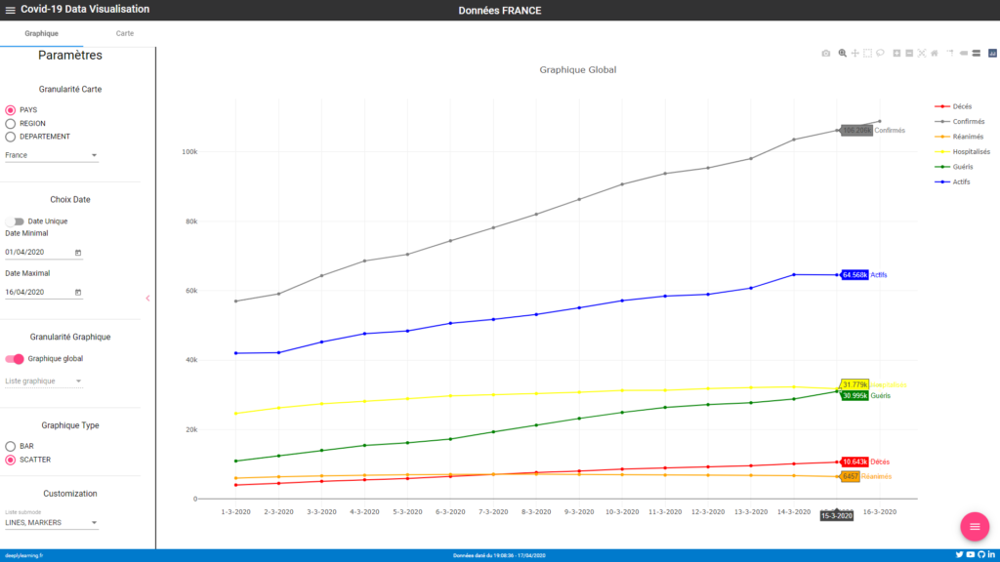
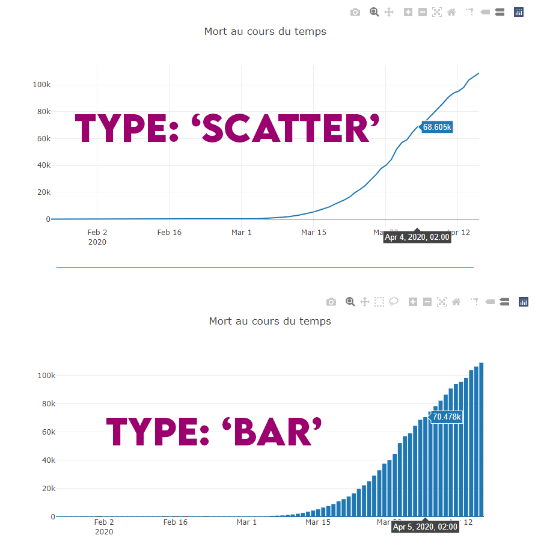
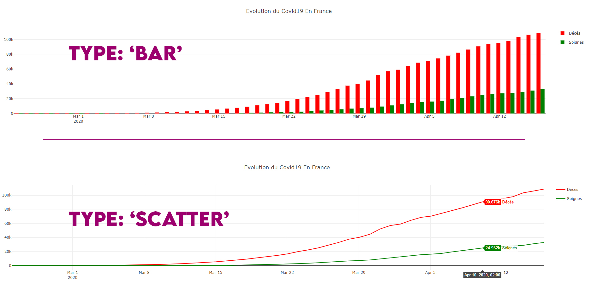
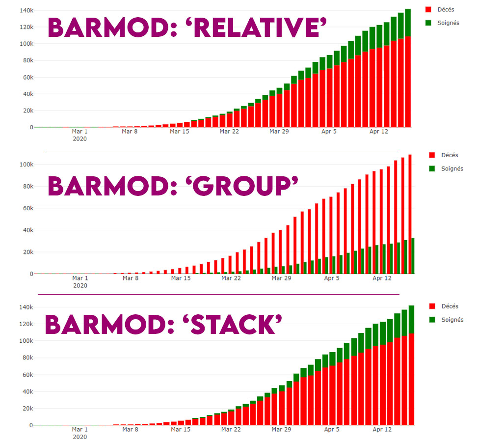
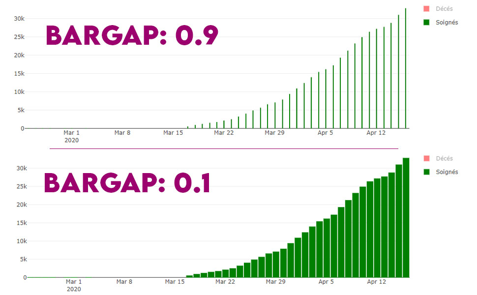
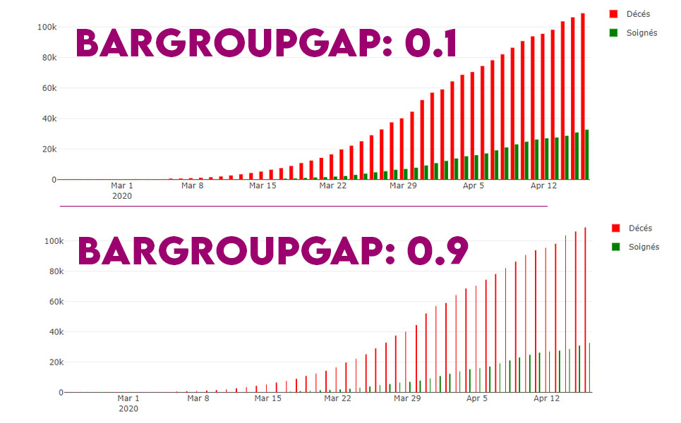
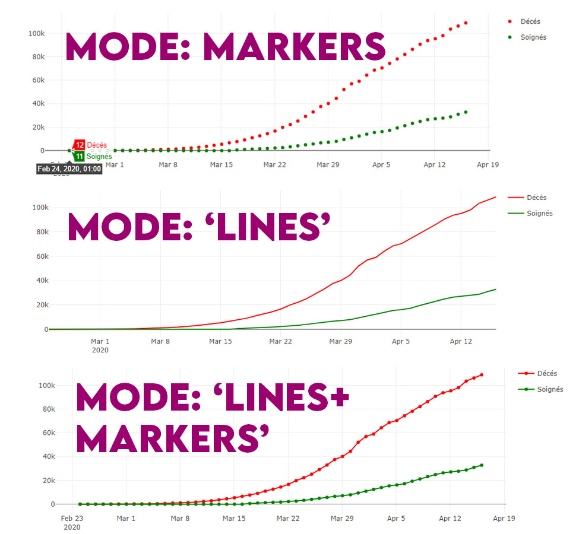

{ loading=lazy }
///caption
Exemple d'un graphique, venant de mon projet [Covid19-Vizualisation](https://momotoculteur.github.io/covid19)
///

Lorsque j'ai voulu me lancer dans la data visualisation intégrée à un site web, j'ai directement voulu utiliser la librairie la plus célèbre en la matière, à savoir **D3.js**. Mais j'ai trouvé une alternative qui m'a interpellé car basé à la fois sur **D3.js** ainsi que **Stack.gl**, permettant de réaliser des graphiques plus interactifs, à première vue.

Celle-ci est disponible à la fois en Python, R, et enfin Javascript, celle qui nous intéresse dans notre article. Et c'est pour cette raison que je l'écris, car celui-ci n'est pas vraiment disponible en Typescript et bien intégré à l'écosystème d'Angular, qui a des notions de modules, de composants, etc.

{ loading=lazy }
///caption
Comparatif de popularité entre nos deux librairies
///
 

## Objectifs

- Intégration de Plotly.js
- Initialisation d'un graph
- Ajout de données
- Customisation du type de graph
- Customisation de son UI

 
## Source du projet

**[Lien vers le dépôt Github contenant les sources](https://github.com/Momotoculteur/plotyjs_integration_angular9)**

**[Lien vers une utilisation possible pour réaliser de la Data vizualisation pour suivre l'évolution de la pandémie du Covid19](https://momotoculteur.github.io/covid19/welcome)**

On utilisera des données du Covid19 pour alimenter en data nos graphiques. C'est parti !

## Quelques infos sur Plotly.js

Pour créer un graphique, on va avoir besoin de trois choses principalement qui se découpe de la façon suivante :

### Data

Un objet **data** qui va contenir l’ensemble des points (ordonnées Y, et abscisse X) que l’on souhaite afficher sur notre graphique.

On le défini dans notre composant en Typescript.

### Layout

Un objet **layout** qui définit les caractéristiques générales au niveau de l’UI de notre graphique, comme le titre, la taille de notre graphique, etc. Si l’on souhaite modifier l’allure d’une courbe en particulier, cela se fera dans l’objet **data** cependant.

On le défini dans notre composant en Typescript.

### Config

C’est l’objet final crée, qui englobe notre objet **Data** ainsi que notre objet **Layout**.

On le défini dans notre composant en Typescript, et on ira le binder avec notre fichier de vue en HTML.

## Intégration de Plotly.js

Je commence par initialiser un nouveau projet Angular pour illustrer notre exemple. Je vous renvoie sur un précédent article, expliquant comment initialiser une application Angular.

On installe via npm les modules nécessaires :

- `npm install angular-plotly.js plotly.js`

On ajoute le module Plotly à notre module globall **App** :

```typescript linenums="1" title="app.module.ts"
import * as PlotlyJS from 'plotly.js/dist/plotly.js';
import { PlotlyModule } from 'angular-plotly.js';

PlotlyModule.plotlyjs = PlotlyJS;

@NgModule({
  declarations: [...],
  imports: [
    ...,
    PlotlyModule
  ],
  providers: [],
  bootstrap: [AppComponent]
})
export class AppModule { }
```

Dans votre fichier de configuration **tsconfig.json**, passez **'target'** en **'es5',** si vous avez une erreur dans votre console comme quoi Plotly n'est pas défini dans votre document.

## Création d'un graphique avec une courbe

### Partie vue

```html linenums="1" title="app.component.html"
<div fxFlex>
    <plotly-plot fxFlex [style]="{width: '100%', height: '100%'}" [useResizeHandler]="true" [data]="allData"
        [config]="config" [layout]="layout">
    </plotly-plot>
</div>
```

On ajout un composant 'plotly-plot'. Celui-ci est composé de plusieurs directives et attributs :

- fxFlex & Style : directive FlexLayout de Angular, permettant à notre composant de prendre toute la hauteur et largeur du parent disponible
- useResizeHandler : directive permettant de resize automatiquement le graphique selon la taille de la fenêtre
- data: object contenant l'ensemble des données du graphique
- config: object contenant la configuration général de notre graphique
- layout: object contenant la configuration graphique de notre graphique

 

### Partie composant

On déclare nos attributs généraux :

```typescript linenums="1" title="app.component.ts"
public allData: any[];
public layout: object;
public config: object;
```

J'initialise mes précédents attributs dans le constructeur du composant :

```typescript linenums="1" title="app.component.ts"
this.allData = [];
this.allData.push({
    type: 'bar',
    mode: 'lines+points',
    x: [],
    y: []
});        
this.layout = {
    title: 'Mort au cours du temps',
    autosize: true
};
this.config = {
    responsive: true
};
```

Par la suite, je vais charger mon fichier de données. J'utilise un fichier CSV qui va être lu en local via le **httpClient** :
 
```typescript linenums="1" title="app.component.ts"
private loadData(): void {
    this.http.get('assets/data.csv', { responseType: 'text' })
        .subscribe(data => {
            this.parseXmlFile(data);
        });
}
```

Enfin, ma fonction permettant de parser mon fichier CSV de string :

```typescript linenums="1" title="app.component.ts"
private parseXmlFile(csvContent: string): void {
  const csvContentByLine = csvContent.split('\n');

  let xTemp: object[] = [];
  let yTemp: number[] = [];

  csvContentByLine.forEach((csvLine) => {
      // Verif ligne non vide, inséré par Pandas
      if (csvLine.length && csvLine !== '') {
          const currentLine = csvLine.split(',');
          if (this.nbEntree === 0) {
          } else {
              if(currentLine[1] === 'PAYS') {
                  xTemp.push(new Date(currentLine[0]));
                  yTemp.push(Number(currentLine[4]));
              }
          }
          this.nbEntree++;
      }
  });

  this.allData[0].x = xTemp;
  this.allData[0].y = yTemp;
}
```

Le plus important sont les lignes suivantes :

- 4-5 : création de tableau temporaire, contenant nos données
- 14-15: on remplit nos tableau déclarés précédemment des données du fichier CSV en cours de parsage
- 23-24: ajout de nos nouvelles données

Voici le résultat de ce que l'on obtient selon le **type** de graphique que l'on choisit dans notre objet de **data** :

{ loading=lazy }

Vous avez une multitude de type de graphique selon ce que vous voulez donner comme aspect à vos données, je vous laisse lire la doc pour en savoir plus.

## Création d'un graphique avec une multitude de courbe

On va reprendre l'exemple précédent, et y ajouter une nouvelle courbe concernant les cas soignés. Je vais enlever quelques données en début de pandémie, étant donné que l'on a eu des cas à partir du 1er Mars à peu près. Cela permettra une meilleure visibilité pour mon tutoriel.

On commence par ajouter une nouvelle courbe en ajoutant une donnée dans notre tableau de données. On fait cela comme précédemment, dans le constructeur du composant :

```typescript linenums="1" title="app.component.ts"
this.allData.push({
    type: 'scatter',
    mode: 'lines+points',
    x: [],
    y: [],
    marker: {
        color: 'green'
    },
    name: 'Soignés',
    legendgroup: 'Soignés',
});   
```

Vous pouvez apercevoir quelques changements comparé à la première partie de ce tutoriel :

- `marker` : permet d'affecter une couleur à notre courbe
- `name` : nom de la courbe dans la légende
- `legendgroup` : permet de grouper plusieurs courbes dans un même groupe, et de pouvoir les cacher en cliquant dessus dans la légende pour toute les faire disparaître


La dernière étape va être de modifier notre fonction de parsing de notre fichier CSV qui contient nos données, afin de récupérer des informations pour une seconde courbes, qui sera elle concernant les cas soignés :

```typescript linenums="1" title="app.component.ts"
private parseXmlFile(csvContent: string): void {
  const csvContentByLine = csvContent.split('\n');

  let xTempDate: object[] = [];

  let yTempHealed: number[] = [];
  let yTempDeath: number[] = [];

  csvContentByLine.forEach((csvLine) => {
      // Verif ligne non vide, inséré par Pandas
      if (csvLine.length && csvLine !== '') {
          const currentLine = csvLine.split(',');
          if (this.nbEntree === 0) {
          } else {
              if(currentLine[1] === 'PAYS') {
                  xTempDate.push(new Date(currentLine[0]));
                  yTempDeath.push(Number(currentLine[4]));
                  yTempHealed.push(Number(currentLine[8]));
              }
          }
          this.nbEntree++;
      }
  });
  this.allData[0].x = xTempDate;
  this.allData[0].y = yTempDeath;

  this.allData[1].x = xTempDate;
  this.allData[1].y = yTempHealed;
}
```

- Lignes 4 : L'axe X des abscisses ne change pas, puisque on veut garder nos dates.
- Lignes 6 et 18 : On va créer un nouveau tableau contenant des nombres, et le remplir de la même façon que précédemment, mais avec un indice différent et donc une donnée différente.
- Lignes 29-30 : correspond à notre second objet de données créer précédemment. On fait attention de lui affecter en abscisses nos données DATE, et en ordonnés notre tableau contenant le nombre de cas soignés.


Voici le résultat de ce que l'on obtient selon le **type** de graphique que l'on choisit dans notre objet de **data** :

{ loading=lazy } 

## Quelques exemples de customisation de l'UI

Je vous présente quelques attributs plutôt chouettes pour changer rapidement le sous type de nos graphiques que je vous ai présenté précédemment, à savoir _Scatter_ et _Bar_

Vous avez moyen de vraiment poussé beaucoup de chose dans l'UI du graphique, regardez la [documentation](https://plotly.com/javascript/) si vous voulez des envies bien précises.

### Sous-type de BAR

L'attribut _'barmod'_ se définit dans l'objet **LAYOUT** de notre graphique ( attribut '_layout'_ dans nos exemples précédents )

{ loading=lazy }

### Espacement de BAR

Vous pouvez gérer l'espacement entre les bars pour optimiser la lisibilité de votre graphique. Vous avez deux arguments pour cela :

- **bargap** : espacement entre les bars d'un même groupe
- **bargroupgap** : espacement entre les bars de groupes différents

Ces deux arguments se définissent dans l'objet **LAYOUT.**

{ loading=lazy }

{ loading=lazy }

### Sous-type de SCATTER

L'attribut _'mode'_ se définit dans l'objet **DATA** de notre graphique ( attribut '_allData'_ dans nos exemples précédents )

{ loading=lazy }

## Conclusion

Vous avez donc accès pleinement à la librairie Plotly.js dans votre application Angular.

Rien de bien complexe sur son intégration donc, juste un zeste déroutant d'utiliser du Javascript dans du Typescript, on mélange du typage fort avec des objets que l'on remplit d'attributs à la volé.

Vous pouvez ajouter des events de clic, de listener, pour rendre tout cela un peu plus dynamique comme par exemple divers chargements de données pour combiner plusieurs sources, modifier en temps réel l'allure et l'UI des graphiques, etc.
