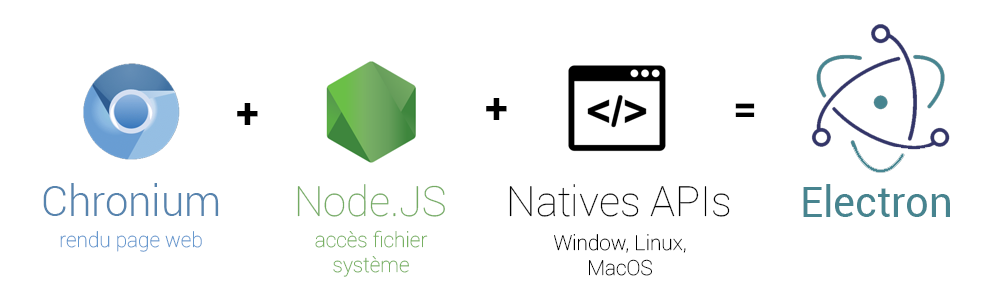
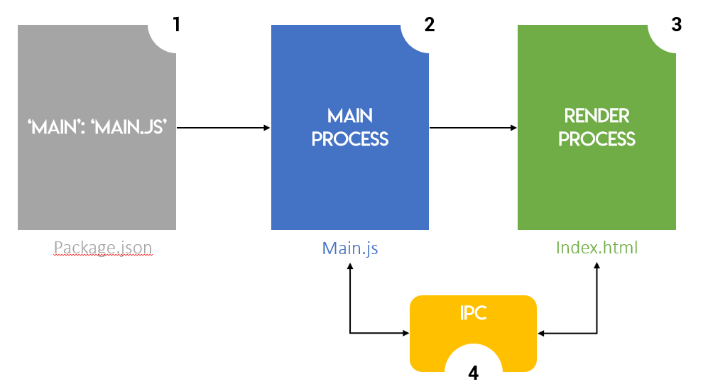

## Présentation

Electron est un framework permettant de développer des applications bureaux multi plateforme ( Linux, Windows, MacOS ) avec des technologies web ( HTML, CSS et Typescript/Javascript ). Il est open source et permet de réaliser très rapidement des applications. Vous pensez que cela n'est pas possible ? Et pourtant vous en utilisez surement sans même le savoir ; Atom, Visual studio, Slack pour n'en citer que les plus gros.

Vous allez donc développer votre application comme si vous développiez un site web.

## Composition de Electron

{ loading=lazy }

 

Electron embarque plusieurs outils/bibliothèque pour permettre d'avoir les mêmes accès qu'un logiciel développé avec un langage plus adapté et/ou de plus bas niveau :

- Chronium : c'est le navigateur open source qui sert de base au célèbre Chrome de Google. Il va assurer le rendu visuel de l'application.
- NodeJS : c'est un environnement d’exécution de code javascript. Il permet l'accès au système de fichier de l'ordinateur, ainsi que le réseau.
- APIs Natives : permet l'accès aux fonctions natives, propres à chacun des OS.

 

## Fonctionnement global

Le développement en est extrêmement simplifié, mais aussi accéléré, car vous aurez accès à plus de 300 000 modules sur NPM. C'est une sorte d’hébergeur de module, qui permet de réaliser certaines tâches. Vous ajoutez donc en quelques secondes de nouvelles fonctionnalité sur votre application.

D'autant plus que vous pouvez ajouter un framework pour le frontend pour structurer votre application : Angular, React, VueJS...

 

Vous allez avoir deux processus différent pour faire fonctionner une application tournant sous Electron :

 

- **Main process**

C'est le point d'entrée de votre application. Il va contrôler le cycle de vie de l'application. Vous aurez tout les accès depuis ce processus, via les API native ou de NodeJS. Il peut aussi créer de nouveau processus de rendu, ainsi que de démarrer et de quitter l'application.

Ce processus est unique

 

- **Render process**

Il va être responsable de la vue de votre application, par le biais d'affichage de vos pages HTML/CSS. Vous aurez accès au javascript pour gérer les contrôleurs et interactions. Mais attention, pas d'accès direct au système.

Chacun des processus de rendu sont indépendant les uns des autres. Si un crash, il n'affecte pas ses voisins. Il peut être caché, permettant d’exécuter du code en arrière plan.

Ce processus peut être multiple.

 

**/!\\** L'ensemble des fonctionnalités disponible par l'API de Electron ne sont pas forcement accessible depuis les deux types processus. Certains ne seront garanti que dans un seul des deux type de processus.

 

## Communication entre Render et Main process

Electron à mit en place un module, appelé **IPC**, permettant de réaliser une communication ainsi qu'un échange de données entre main et render process, qui est appelable depuis chacun des processus. Cette communication fonctionne sous forme de canaux, et l'échange est bi-latéral. Celle-ci s'apparente à des sockets.

 

## Architecture d'une application Electron

Le schéma suivant montre d'une façon simplifié le fonctionnement de base d'une appli Electron.

{ loading=lazy }
///caption
Architecture simplifiée
///

1. Le **package.json** est le point d'entrée de votre application. Il va indiquer à Electron ou est le main process,
2. Le **main.js** définit votre processus principal. Il va créer la fenêtre graphique pour y appeler le render process.
3. Le **index.html** définit votre vue.
4. Le module **IPC** permet l'échange d'informations entre les divers processus.

## Conclusion

**Points positifs**

- Stack web facile à apprendre
- Dév rapide ( hot reload, console chronium, modules NPM... )
- Cross-platform

**Points négatifs**

- Consommation excessive de RAM
- Taille du bundle ( ~100Mo pour un simple 'Hello World !' )

 
Maintenant que vous voyez le fonctionnement global d'un projet sous Electron, je vous propose d'expérimenter vous même, et de réaliser un traitement de texte basique sur le chapitre suivant.

