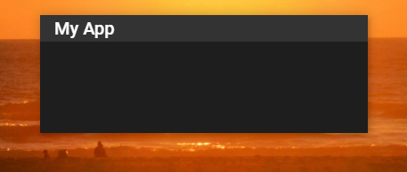
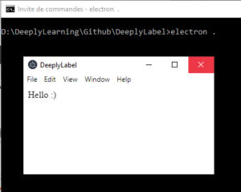
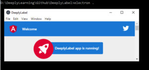

Je vais vous présenter comme installer votre environnement de développement, et créer votre première fenêtre, avec quelques astuces de dév, vous permettant d’accélérer vos rendus.

Le code source concernant ce chapitre est disponible sur mon [Github](https://github.com/Momotoculteur/DeeplyNote/tree/Chap3).

{ loading=lazy }
///caption
Résultat du cours
///

## Initialisation d'un nouveau projet

On va initialiser une nouvelle application angular avec tout le squelette de base qui va bien, afin de nous faire gagner du temps :

- `ng new Nom_de_votre_app`

!!! note
    ng est une commande de la CLI de Angular

Sélectionner _Yes_ pour avoir le routing du module de base,

Sélectionner ensuite votre langage pour les feuilles de style, je prends SCSS pour ma part.

 

On va ajouter Electron à notre projet via :

- `npm install --save-dev electron`

 

## Création de la fenêtre principale

On va créer un fichier **main.js**_._ C'est lui qui va servir de fichier principal pour créer notre fenêtre, avec le code suivant :

```javascript linenums="1" title="main.js"
const { app, BrowserWindow } = require('electron')

function createWindow () {
  let win = new BrowserWindow({
    width: 800,
    height: 600,
    webPreferences: {
      nodeIntegration: true
    }
  })

  win.loadFile('src/index.html')
}

app.on('ready', createWindow)
```

On va ensuite mettre à jour notre fichier **package.json** pour lui indiquer le point principal d'entrée pour Electron an ajoutant la ligne :

```
"main": "main.js"
```

De retour sur la console, déplacer vous au sein du projet, vous allez pouvoir lancer votre application dans electron via la commande :

- `electron .`

Tadaaaaaaaaaaaaa. Ça ne casse pas 3 pattes à un canard, mais ça à le mérite d'être du développement plutôt rapide ! 😂

{ loading=lazy }
///caption
Première fenêtre sous Electron !
///
 

## Liaison du serveur de dév de Angular vers Electron

Nous n'avons fait que lier de façon statique la page index.html. Cependant, pour le bon fonctionnement de Angular, il va nous falloir un serveur HTTP qui gère le typescript. Celui de base de Angular fonctionne très bien.

On va modifier notre fichier **main.js** pour qu'il prenne non plus un fichier en entrée, mais une URL qui pointe vers notre serveur de développement.

```javascript linenums="1" title="main.js"
win.loadURL('http://localhost:4200/')
```

Lancer depuis une console le serveur de développement de Angular :

- `ng serve`

Lancer ensuite depuis une seconde console electron. Vous avez désormais accès à Angular depuis votre application Electron. Vous pouvez avoir accès au rechargement à chaud ( mise à jour de l'UI en direct dès une modification du code ) directement dans Electron.

{ loading=lazy }
///caption
Angular tourne dans Electron
///

## Lancement parallèle 

Pour éviter d'avoir deux console, on va pouvoir automatiser le lancement de Electron et Angular depuis un script.

Dans le fichier **package.json**, rajoutez les scripts suivants :

```json linenums="1" title="package.json"
{
  "electron": "electron .",
  "electron-serve": "npm run start | npm run electron"
}
```

La première permet de lancer electron. La seconde quant à elle permet de lancer le serveur local de développement de Angular et Electron de façon concurrentielle.

 

## Customization de la fenêtre

C'est dans l’ère du temps, donnons un peu de style à notre application 😎

On va supprimer la barre d'outils toute moche, et y incorporer une toolbar un poil plus joli, qui nous permettra de déplacer notre app, ainsi que de l’agrandir via une double tap.

Ajoutons la librairie de base pour les material UI :

- `ng add @angular/material`

Nous n'avons pas besoin de HammerJS, mais belle et bien cependant des browser animations pour Angular material, qui seront à préciser à la suite de cette commande.

On va ajouter notre toolbar à notre fichier HTML du composant **App**

```
<mat-toolbar class="menu">My App</mat-toolbar>
```

Ajouter à notre module principal **App** le bon import pour la librairie _Material_ :

```
import { MatToolbarModule} from '@angular/material'

```

Et ajouter **MatToolbarModule** dans la déclaration du Module principal, dans la partie **Import**


## Lancement instantané de l'app ( white blank screen )

Quand on lance l'application, on a un écran blanc temporaire qui s'affiche. C'est une chose que l'on ne souhaite pas avoir au sein de notre application une fois buildé. C'est pour cela que l'on va modifier notre fichier **main.js** pour demander à Electron d'afficher notre fenêtre seulement une fois que celle-ci sera entièrement chargé, ce qui nous donnera l'impression d'avoir une ouverture quasi instantané.

Pour cela on va créer notre fenêtre et demander à Electron de la cacher dans un premier temps. Ajoutez la ligne suivante en paramètre de création lors de l'appel de la méthode :

- `show: false`

On va ensuite rajouter un event, qui sera appelé une fois que la fenêtre sera prête :


```javascript linenums="1" title="main.js"
win.once('ready-to-show', () => {
  win.show();
});
```

Notre application va désormais se lancer directement.

## Icone de l'application

Pour changer l'icone de votre application sur le bureau de windows, ajouter l'option lors de la création de la fenêtre avec le lien pointant vers une image placé dans votre dossier d'assets :

- `icon: './src/assets/icon/icon_transparent.png'`

## Conclusion

Nous venons de créer très simplement et rapidement une simple fenêtre, avec un chouette esthétisme.

Le prochain chapitre va permettre d'y ajouter de nouvelles fonctionnalités, concernant la barre d'outils.

