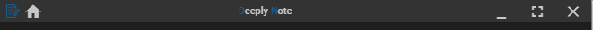

Nous avons vu au chapitre précédent comment créer une frameless window basique.

Nous allons y ajouter quelques fonctionnalités de base que doit avoir un logiciel, via sa barre d'outils.

Le code source concernant ce chapitre est disponible sur mon [Github](https://github.com/Momotoculteur/DeeplyNote/tree/Chap2).

{ loading=lazy }
///caption
Résultats du cours
///
 

## Hot reloading du backend

Autant le hot reload des pages web du front se font automatiquement via le module Webpack contenu dans Angular, autant le backend ne s'effectue pas. Pour cela on va ajouter un module npm dans notre projet :

- `npm install electron-reload`

Il va nous permettre de créer un nouveau main process de Electron, en lui donnant simplement en argument le chemin de l’exécutable de electron.

Nous lui ajouterons un argument pour permettre un hard reset du module, ce qui évite d'avoir des processus de Electron fantôme qui peuvent persister.

Et enfin un dernier argument, nous permettant de pouvoir injecter des arguments au lancement de electron, et dans notre cas de garder dans notre environnement de dév, le lancement des dev tools de chronium.
 
```javascript linenums="1" title="main.js"
require('electron-reload')(__dirname, {
    electron: require(`${__dirname}/node_modules/electron`),
    hardResetMethod: 'exit',
    argv: ['--devTools']
});
```

## Barre d'outils via l'API de Electron

### Définition de la vue, via des flexbox 

On va introduire des notions de _responsive design_ qui est propre aux stack du web. Ceci nous permet de rendre adaptable la vue d'une page en fonction de la hauteur et largeur de l'écran de l'utilisateur, et ainsi d'en modifier sa disposition. On parle alors de **Flexbox**. Celles-ci sont déclaré dans les pages CSS, et permette de définir des règles de disposition entre chaque éléments ( des <_div>_ par exemple ). Cela peut définir des règles pour indiquer comment tel ou tel élément doit grossir, réduire, ou encore se disposer en ligne ou colonne avec ses éléments voisin. Un petit module que j'apprécie et qui est disponible sur NPM, va nous permettre d'induire ces flexbox, directement dans les balises du code HTML de la page :

- `npm install @angular/flex-layout`

On souhaite avoir une barre d'outils comme ceci :

- Partie gauche :
    - Une icone du logiciel avec un bouton d’accueil
- Partie du milieu :
    - Le nom du logiciel
- Partie droite :
    - Une barre d'outils avec des boutons permettant de réduire, de minimiser/maximiser la fenêtre, ainsi qu'un dernier pour fermer la fenêtre

 

#### Contener Global

On va commencer par créer un contener global ( notre mat-toolbar ), qui va prendre le maximum d'espace possible de son parent, définit par la directive **fxFill** :

```html linenums="1" title="header.html"
<mat-toolbar class="toolbar" fxFill>
</mat-toolbar>
```
 

#### Création des 3 sous conteners (définit précédemment)

On utilise la directive **fxLayout='row'** afin de créer 3 conteners sur la même ligne. Quand a **fxLayoutAlign='space-between'**, elle va nous permettre de définir le type d'espacement entre chacun d'eux. Celle-ci nous permet de les espacer au maximum des un aux autres.

```html linenums="1" title="header.html"
<mat-toolbar class="toolbar" fxFill>
  <div class="contenerMenu" fxLayout="row" fxLayoutAlign="space-between" fxFill>
    
    <div class="contener_gauche">
    </div>
    
    <div class="contener_milieu">
    </div>
    
    <div class="contener_droit">
    </div>
    
  </div>
</mat-toolbar>
```

#### Alignement vertical d'un des trois sous conteners

On souhaite qu'ils soient aligné au milieu ce leur ligne. On va donner l'exemple pour le contener de droite. Pour cela, on va ajouter au contener précédent, la directive **fxLayout='column'** pour pouvoir créer des conteners de façon vertical ( rappeler vous que le **row** permet d'aligner des conteners de façon horizontal), avec le bon **fxLayoutAlign='center'** qui va bien, pour permettre de les aligner au milieu au seins de celui-ci.

Si on reprend notre cheminement depuis le début, on doit normalement avoir un contener fixé à droite de la barre, et qui sera aligné au milieu concernant son axe vertical. On souhaite maintenant avoir y incorporer 3 bouttons d'actions.

```html linenums="1" title="header.html"
<div class="contener_droit" fxLayout="column" fxLayoutAlign="center stretch">
</div>
```

#### Boutons d'actions

On va recréer un contener de type **row** cette fois-ci, nous permettant de grouper l'ensemble de nos trois boutons de façon horizontal. En effet avec le point précédent, nous étions dans un contener de type **column**, et donc aligné sur l'axe vertical, chose que l'on ne souhaite pas.

Vous n'avez plus qu'a ajouter vos trois boutons, avec l'appel aux fonctions qui seront déclaré dans le contrôleur, via la directive de angular, **(click)='votre\_fonction()'**.

```html linenums="1" title="header.html"
<div class="contener_droit" fxLayout="column" fxLayoutAlign="center stretch">
  <div fxLayout="row" fxFill>

      <!--------------------   FLEX REGION | BUTTON REDUCE   ------------------------>
      <button fxFlex mat-button class="button hoverBtnWhite" (click)="reduceApp()">
          <i fxFlex class="material-icons">minimize</i>
      </button>
      <!--------------------   FLEX REGION | BUTTON MAXI   ------------------------>
      <button fxFlex mat-button class="button hoverBtnWhite" *ngIf="!isFullScreen()" (click)="maximizeApp()">
          <i class="material-icons">fullscreen</i>
     </button>
      <!--------------------   FLEX REGION | BUTTON UNMAXI   ------------------------>
      <button fxFlex mat-button class="button hoverBtnWhite" *ngIf="isFullScreen()" (click)="unMaximizeApp()">
          <i class="material-icons">fullscreen_exit</i>
     </button>
      <!--------------------   FLEX REGION | BUTTON CLOSE   ------------------------>
      <button fxFlex mat-button class="button hoverBtnRed" (click)="closeApp()">
          <i class="material-icons">close</i>
     </button>

  </div>
</div>
```

Pour un peu d’esthétisme, j'ai rajouté une classe**class\='button hoverBtnWhite'**, lié dans le fichier CSS, permettant qu'au passage de la souris, la couleur de l'icone et de son background change.
 
```scss linenums="1" title="style.scss"
.hoverBtnRed: hover {
    background-color: rgba(255,0,0,0.6);
    color: white;
}

.hoverBtnWhite: hover {
    background-color: rgba(255,255,255,0.2);
    color: white;
}
```
 

### Définition du contrôleur, via le service Electron

Maintenant que la partie graphique est mise en place, on va passer au contrôleur, permettant d'ajouter des actions à nos jolis boutons 😉

On va ajouter un nouveau module, nous permettant d'accéder à l'API de Electron directement depuis notre contrôleur.

- `npm install ngx-electron --save`

On l'importe dans notre module principal, soit App :

```typescript linenums="1"
import {NgxElectronModule} from 'ngx-electron';
```

Et on le déclare dans la partie des imports :

```typescript linenums="1"
import: [ NgxElectronModule ]

```

Dans notre composant **Header.ts**, nous aurons besoin d'importer le module _ElectronService_. En créer un attribut de classe, l'instancier lors de la construction du composant, et se servir du module **REMOTE** de l'API de Electron. On va alors pouvoir utiliser via ce module, les utilitaires du _process main_, depuis le _render process_. Le code suivant vous montre comment lier nos boutons créer précedemment pour leur affecter respectivement les actions  suivantes :

- fermer la fenêtre,
- réduire la fenêtre,
- maximiser,
- unmaximiser.
 
```typescript linenums="1" title="header.ts"
import { Component, OnInit } from '@angular/core';
import { ElectronService } from 'ngx-electron';

@Component({
  selector: 'app-header',
  templateUrl: './header.component.html',
  styleUrls: ['./header.component.scss']
})
export class HeaderComponent implements OnInit {
    private electronService: ElectronService;
    constructor() {
        this.electronService = new ElectronService();
    }
    private closeApp() {
        this.electronService.remote.getCurrentWindow().close();
    }
    private isFullScreen(): boolean {
        return this.electronService.remote.getCurrentWindow().isMaximized();
    }
    private maximizeApp() {
        this.electronService.remote.getCurrentWindow().maximize();
    }
    private unMaximizeApp() {
        this.electronService.remote.getCurrentWindow().unmaximize();
    }
    private reduceApp() {
        this.electronService.remote.getCurrentWindow().minimize();
    }
}
```

## Materials icons en offline

Si vous utilisez des icons de la librairie Material, soit celle de base de Angular, vous allez les télécharger à chaque lancement de l'app. Cependant, le jour ou vous voulez déployer votre application hors ligne, plus rien de marche, et les messages d'erreurs ne sont pas tellement explicite, vous êtes obligé d'aller chercher dans les requetes HTTP. Pire si comme moi vous avez du déployer une app offline sur iPad, sans n'avoir de console de développeur de iOS, alors autant prévoir les choses à l'avance. On va utiliser un module disponible sur NPM pour pouvoir toujours les avoir dans notre app :

- `npm install material-design-icons-iconfont --save`

Et ajoutez les lignes suivantes dans votre fichier de style globale de votre app, soit style.scss :

```scss linenums="1" title="style.scss"
$material-design-icons-font-directory-path: "~material-design-icons-iconfont/dist/fonts/";
@import "~material-design-icons-iconfont/src/material-design-icons";
```

## Conclusion

Nous venons de voir comment appeler l'API de Electron depuis notre front en Angular, pour lui ajouter des fonctionnalités simple d'un logiciel.

Nous verrons au prochain chapitre comment créer un explorateur de fichier simple, pour présenter le module ipc de Electron, permettant de communiquer et d'échanger des données entre main et render process.

