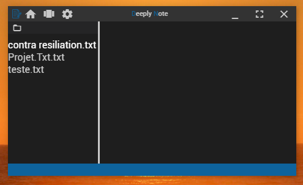
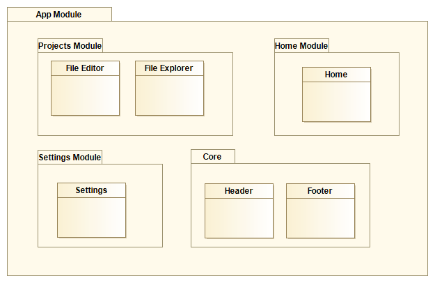

Nous avons vu au chapitre précédent comment réaliser la barre d'outils principal du logiciel.

Nous allons maintenant rentrer dans le vif du sujet pour la réalisation d'un explorateur de fichier texte basique.

Le code source concernant ce chapitre est disponible sur mon [Github](https://github.com/Momotoculteur/DeeplyNote/tree/Chap3).

{ loading=lazy }
///caption
Résultats du cours
///
 

## Explorateur de fichiers redimensionable

C'est tout bête, mais il va arriver à un moment ou à un autre que l'on tombe sur des noms de fichiers plus ou moins long, donc certains pourrait être tronqué. Autant faire quelque chose de propre, et donner la possibilité à notre explorateur d'être redimensionable par l'utilisateur.

Depuis le dernier chapitre, j'ai légèrement modifié l'architecture du projet afin de le rendre plus maintenable pour la suite des tutoriels. En voici une présentation simplifié :

{ loading=lazy }
///caption
Diagramme général
///

- Module App
    - appComponent.ts
    - appComponent.html
    - appComponent.scss
    - appRouting.ts
    - Module Settings
        - settingsComponent.ts
        - settingsComponent.html
        - settingsComponent.scss
        - settingsRouting.ts
    - Module Home
        - homeComponent.ts
        - homeComponent.html
        - homeComponent.scss
        - homeRouting.ts
    - Module Projects
        - projectsComponent.ts
        - projectsComponent.html
        - projectsComponent.scss
        - projectsRouting.ts
            - File Explorer
                - fileExplorerComponent.ts
                - fileExplorerComponent.html
                - fileExplorerComponent.scss
            - File Editor
                - fileEditorComponent.ts
                - fileEditorComponent.html
                - fileEditorComponent.scss

 

 

Pour la partie graphique de notre file explorer, il va être composé d'une toolbar pour permettre d'ouvrir un dossier, une partie pour afficher nos fichier en colonne, et enfin un grabber nous permettant de modifier la taille de notre fenêtre :

```html linenums="1" title="file-explorer.html "
<div fxLayout="row" fxFill [style.width.px]='divWidth'>
    <div fxFlex fxLayout="column">
        <div class="toolbarContener">
        </div>
        <div class="explorerContener">
        </div>
    </div>
    <div fxFlex="3px" class="grabber">
    </div>
</div>
```

On va utilise une directive de angular pour nous permettre de bind la largeur de notre file explorer **\[style.width.px\]='divWidth'.**

Pour la partie de style, rien de bien sorcier, juste de prévoir de changer le curseur de souris lorsque l'on passera sur le grabber afin de faire remarquer à l'utilisateur que la fenêtre est modifiable :
 
```scss linenums="1" title="file-explorer.scss "
.grabber {
    background-color: #c8c8c8;
    cursor: ew-resize;
}
```

La partie la plus intéressante et ou se passe la magie de notre grabber est dans notre contrôleur. On va définir :

- un boolean, pour savoir si on a le clique enfoncé ou non,
- une largeur de fenêtre,
- une ancienne largeur de fenêtre pour connaître les déplacements.

```typescript linenums="1" title="file-explorer.ts "
public grabber: boolean;
public divWidth: number;
public oldX: number;

constructor() {
    this.grabber = false;
    this.divWidth = 150;
    this.oldX = 0;
}
```

Dernière étape, on va devoir ajouter des listener d'actions :

- Un pour savoir quand on bouge la souris,
- un autre pour savoir quand on enfonce le clic,
- et un dernier pour savoir quand on relâche le clic

Dans l'ordre, cela va nous pouvoir de modifier la taille en temps réel, de savoir quand effectuer cette action, et savoir quand l'arrêter :

```typescript linenums="1" title="file-explorer.ts "
@HostListener('document:mousemove', ['$event'])
onMouseMove(event: MouseEvent) {
    if (!this.grabber) {
        return;
    }
    this.resizer(event.clientX - this.oldX);
    this.oldX = event.clientX;
}

@HostListener('document:mouseup', ['$event'])
onMouseUp(event: MouseEvent) {
    this.grabber = false;
}
resizer(offsetX: number) {
    this.divWidth += offsetX;
}
@HostListener('document:mousedown', ['$event'])
onMouseDown(event: MouseEvent) {
    this.grabber = true;
    this.oldX = event.clientX;
}
```

## Explorateur basique de fichier texte

On souhaite avoir  un système qui puisse lister l'ensemble des fichiers textes d'un dossier, et nous l'afficher sous une forme de liste au sein de notre logiciel. Cela nous permettra d'un simple clique de pouvoir ouvrir tel ou tel fichier texte à modifier.

 

### Demande de fichier depuis le Frontend

On va ajouter un bouton nous permettant à son click, de notifier le backend afin d'ouvrir une fenêtre de dialogue pour sélectionner un dossier, dans lequel on souhaite récupérer l'ensemble des fichiers textes qui y sont situé. Rien de bien complexe pour la partie graphique, juste un bouton contenant une icone, qui à son click sera bindé avec l'appel de '**openFolderDirectory()'**. L'utilisation de la flexbox nous permet de positionner le boutton sur le côté gauche de la div.

```html linenums="1" title="FileExplorer.html"
<div fxFlex="20px" class="toolbarContener" fxLayout="row" fxLayoutAlign="start">
    <button mat-button class="button" (click)="openFolderDirectory()" >
        <i class="material-icons">
            folder_open
        </i>
    </button>
</div>
```

Dans le contrôleur on va ajouter la fonction précédente. Celle-ci fait appel au module **ipcRender**, qui permet la communication de message du renderProcess vers le mainProcess. Il permet d'envoyer des messages via la fonction **'send'**, ou d'écouter via **'on'**. Cela fonctionne exactement comme des sockets, si vous en avez déjà utilisé. Dans notre cas on va juste envoyer un message vide, une sorte de ping pour exécuter une fonction.
 
```typescript linenums="1" title="FileExplorer.ts "
public openFolderDirectory(): void {
    this.electronService.ipcRenderer.send('pingOpenFolderDirectory');
}
```

### Traitement de la demande par le Backend

On va réceptionner la notification venant du front via le module **ipcMain** dans notre backend, avec sa méthode **'on'**.  La fonction prend un argument **'event'**, permettant de renvoyer un message, ainsi qu'un second argument **'message'** contenant des données envoyé. Mais rappelez vous, on a juste ping sans envoyer le donnée, cet argument sera donc vide.

Le module **dialog** va nous permettre de créer une fenêtre de dialogue, avec en argument notre fenêtre principal, suivit d'un dictionnaire d'options permettant de définir si l'on souhaite ouvrir un dossier, un fichier, de définir un nom de fenêtre en particulier, etc.

Cette fonction nous renvoi une promesse, sur laquelle on va pouvoir lui attache deux bloc :

- `.then()` : est appelé si l'ouverture du dialog se passe correctement,
- `.catch()` : est appelé si une erreur est lancé lors de son ouverture.

Dans le cas ou on a une erreur, on la remonte simplement dans la console du back.

Dans le cas ou tout se passe bien, on va vérifier que l'utilisateur à bien choisit un dossier et n'a tout simplement pas annulé son action par la fermeture de boite de dialogue.  On va alors appelé le module **fs** de Node qui permet de réaliser des opérations de lectures et d'écritures sur le disque. On va dans un premier temps récupérer l'ensemble des fichiers contenu dans le dossier renseigné pour l'utiliser, puis lui appliquer un filtre via une **regexp**, permettant de garder seulement les fichiers dont leurs noms se termine par **.txt**.

On va utiliser le premier argument pour pouvoir répondre au front, en lui envoyant dans un nouveau canal, un tableau contenant les noms de fichiers textes étant dans son dossier de sélection.

```typescript linenums="1" title="main.ts"
const { app, BrowserWindow, dialog, ipcMain } = require('electron')

ipcMain.on('pingOpenFolderDirectory', (event, message) => {
    const options = {
        title: 'Ouvrir un dossier',
        properties: ['openDirectory'],
    };
    dialog.showOpenDialog(win, options
    ).then(result => {
        if(!result.canceled) {
            const listFiles = fs.readdirSync(result.filePaths[0]);
            let files = listFiles.filter( function( elm ) {return elm.match(/.*\.(txt)/ig);});
            event.reply('responseOpenFolderDirectory', files);

        } else {
            console.log('Annulation par l utilisateur')
        }
    }).catch(err => {
        console.log(err);
    })
});
```
 

### Affichage de la réponse dans le Frontend

On va réceptionner la réponse venant du Backend via une fonction écoutant sur le même canal que celui utilisé pour l'émission. On va récuperer le tableau de données, et l'associer à un attribut de composant que l'on aura déclaré au préalable.

```typescript linenums="1" title="FileExplorer.ts "
this.electronService.ipcRenderer.on('responseOpenFolderDirectory', (event, response) => {
    let responseArray: string[] = response;
    this.listTxtFiles = [];
    responseArray.forEach( (file) => {
        this.listTxtFiles.push({name: file, highlight: false});
    });
});
```
 

Maintenant que l'on a nos données, on a plus qu'a les afficher comme une liste dans notre vue. On utilisera une **mat list item**, et on utilisera le bind **\*ngFor** de Angular pour parcourir l’ensemble des items de notre tableau de données.
 
```html linenums="1" title="FileExplorer.html"
<mat-nav-list fxLayout="column" fxFlex class="explorerContener">
    <mat-list-item  *ngFor="let file of listTxtFiles">
        <a (click)="updateHighlight(file)" [ngClass]="{'highlight': file.highlight}">{{file.name}}</a>
    </mat-list-item>
</mat-nav-list>
```

### Un petit plus pour l'ésthetisme

Vous avez vu le binding **\[ngClass\]** ? C'est une directive de Angular, permettant de lui associer une classe CSS en plus (_highlight, dans mon cas),_ si la condition _file.highlight_ est respecté, soit si et seulement si le booléan est à true. Lorsque l'utilisateur clique sur un fichier, une fonction sera appelé. Celle-ci mettra à jour le boolean de l'ensemble des fichiers à _faux_, et mettra à _true_ sur celui qui a été sélectionné.

Si vous regarder le code, concrètement cela permet lors d'une sélection d'un fichier, de lui ajouter une couleur plus clair que les autres, pour renseigner de façon plus jolie à l'utilisateur, sur quel fichier il est. Cela aura d'avantage de sens lors du prochain chapitre vous verrez 😉
 

## Conclusion

Vous pouvez rendre plus complexe votre explorateur en y ajoutant certaines fonctionnalités comme :

- Pouvoir remonter dans le dossier parente : pour cela vous n'avez qu'a juste ajouter un bouton 'parent', qui va ré-appeler notre fonction de ping du backend, mais en lui envoyant un chemin avec un niveau plus haut.
- Possibilité d'ajouter un logo à côté de chaque fichier, en fonction de leur type. Vous aurez juste besoin d'une fonction qui split le nom d'un fichier, et qui compare l'extension, et affiche un type d'icone en fonction de celle-ci. A faire soit directement dans la vue avec un binding **\*ngSwitch**, soit d'ajouter un nouvel attribut dans notre FileType.


Le prochain chapitre portera sur l'ouverture d'un fichier texte dans notre éditeur, pour pouvoir le modifier et le sauvegarder sur le disque.  

