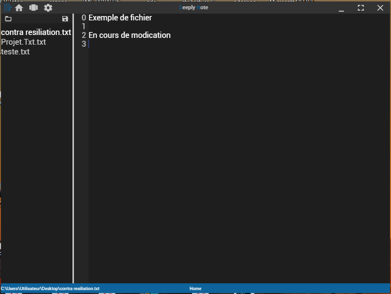

Nous avons vu au chapitre précédent comment réaliser un simple appel à NodeJS via le module de communication IPC, afin d'éffectuer un appel au système de fichiers pour nous remonter des fichiers textes disponible dans un dossier précis.

Nous allons maintenant nous attaquer à une nouvelle fonctionnalité, nous permettant lors qu'un clique sur un fichier affiché dans notre explorateur de fichier, d'afficher son contenu dans un nouvel espace.

Le code source concernant ce chapitre est disponible sur mon [Github](https://github.com/Momotoculteur/DeeplyNote/tree/Chap4).

{ loading=lazy }
///caption
Résultat du chapitre
///

## Affichage d'un fichier

### Notifier le main process

On va reset les classes permettant de surligner le fichier sélectionné, sur l'ensemble de nos fichiers listé dans notre explorateur.

On va ensuite activer seulement le surlignage pour le fichier actuellement sélectionné.  

On envoi une notification au main process via le module IPC, sur le canal **pingDisplayFile,** en lui envoyant en donnée le chemin relatif de ce fichier.

```javascript linenums="1" title="fileExplorer.component.ts "
public updateHighlight(file: FileType): void {
    this.listTxtFiles.map( file => file.highlight = false);
    file.highlight = true;
    this.electronService.ipcRenderer.send('pingDisplayFile', file.path);
    this.footerService.updateFileOpenSubject(file.path);
    this.currentFile = file;
}
```

### Réponse du main process

On écoute sur ce même canal avec le module IPC.

On va lire le contenu du fichier, via son path précédemment envoyé, via le module **fs** de Nodejs.

Je récupère aussi le nombre de lignes que contient le fichier, cela nous permettra d'indiquer les lignes dans notre éditeur de texte.

Je créer un objet qui réunit ces deux résultats, afin de l'envoyer au render process via le canal **responseFileContent.**

```javascript linenums="1" title="main.js"
ipcMain.on('pingDisplayFile', (event, message) => {
    const fileContent = fs.readFileSync(message, 'utf8');
    const lineNumber = fileContent.split('\n').length;
    const response = {
        file: fileContent,
        line: lineNumber
    };
    event.reply('responseFileContent', response);
});
```
 

### Affichage du fichier dans le render process

La première fonction me permet de mettre mon attribut **fileContent** à jour via le nouveau fichier précédemment envoyé, ainsi que l'attribut **lineNumber** pour le compteur de nombre de ligne.

La seconde fonction va permettre de sauvegarder notre nouveau contenu affiché, et de l'enregistrer sur notre disque à la place de notre ancien fichier. On envoi une notification via le canal **saveFile**, en lui donnant en paramètre un _object_ qui contient notre fichier, son contenu ainsi que son chemin d'accès.
 
```javascript linenums="1" title="fileEditorComponent.ts"
this.electronService.ipcRenderer.on('responseFileContent', (event, message) => {
    this.fileContent = message.file;
    this.lineNumber = Array(message.line).fill(0).map((v,i)=>i);
});

this.projectsService.getSaveFileSubjectObservable().subscribe( (newSaveFile: FileType) => {
    this.electronService.ipcRenderer.send('saveFile', {
        file: newSaveFile,
        content: this.fileContent
    });
});
```

On va ensuite construire notre page HTML pour affiche d'une part le contenu de notre fichier d'une façon éditable, mais aussi d'avoir à proximité un compteur de ligne pour se référer.

```html linenums="1" title="fileEditor.component.html "
<div fxLayout="row" fxFill fxLayoutAlign="start" class="contener">
    <div fxFlex="30px" class="lineCounterDisplay" fxLayout="column" fxLayoutAlign="start">
        <div *ngFor="let number of lineNumber" fxLayout="row" fxLayoutAlign="end" class="numberLine">
            {{number}}
        </div>
    </div>
    <div fxFlex class="textEditorDisplay">
        <mat-form-field fxFlex >
            <textarea (input)="updateTextArea()" matInput cdkTextareaAutosize [(ngModel)]="fileContent" >
            </textarea>
        </mat-form-field>
    </div>
</div>
```

Cette disposition de flexbox me permet d'avoir deux colonne, via **fxLayout="row"** :

- `lineCounterDisplay` : est la partie pour le compteur de ligne. Le trick est de créer une division par chiffre de ligne via le bind angular **\*ngFor**. Pour cela j'ai créer un tableau qui contient n item qui est le nombre de ligne du fichier, et qui sont incrémenté de 1 entre chaque item. Le contenu est bindé via J'ai réaliser via la fonction suivante :

```javascript linenums="1" title="fileEditor.component.ts"
public updateTextArea(): void {
    this.lineNumber = Array(this.fileContent.split('\n').length).fill(0).map((v,i)=>i);
}
```

- `textEditorDisplay` : est la partie pour l'édition du fichier texte. Rien de bien spécial, c'est juste un **textArea**, qui permet d'afficher et de taper du texte. On le bind avec **\[(ngModel)\]** pour l'associer à l'attribut de notre contrôleur qui contient les données du fichier texte, envoyé auparavant par notre main process. On utilisera un second bind, **(input)**, qui sera affecté à la fonction précédemment présenté. Celle-ci permet de déclencher la fonction à chaque changement fait dans le textArea. Cela permet de recalculer en temps réel le compteur de ligne à afficher.

 

### Sauvegarde du fichier sur le disque

On utile le module fs de NodeJS pour sauvegarder notre fichier fraîchement modifié.

```javascript linenums="1" title="main.js"
ipcMain.on( 'saveFile', (event, data) => {
    fs.writeFileSync(data.file.path, data.content);
});
```
 

## Conclusion

Vous pouvez rendre plus complexe votre éditeur de fichiers en y ajoutant certaines autres fonctionnalités tel que :

- Une sauvegarde automatique via un timer, ou même à chaque ajout/suppression du moindre caractère ?
- Proposer des outils afin de customiser la couleurs, taille, ou type de police ?

 
Direction pour le prochain chapitre qui abordera comment créer des thèmes clair et sombre ( pour reposer les yeux la nuit ), comment gérer le stockage de données utilisateurs, et enfin un rapide tour sur la programmation réactive via le paradigme Observer/Observable via la bibliothèque RxJS !
