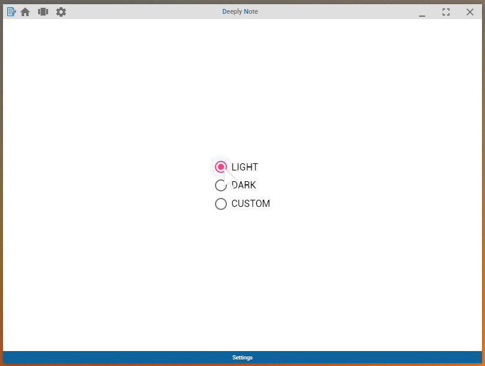
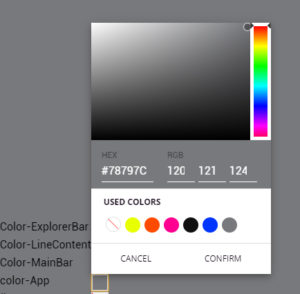
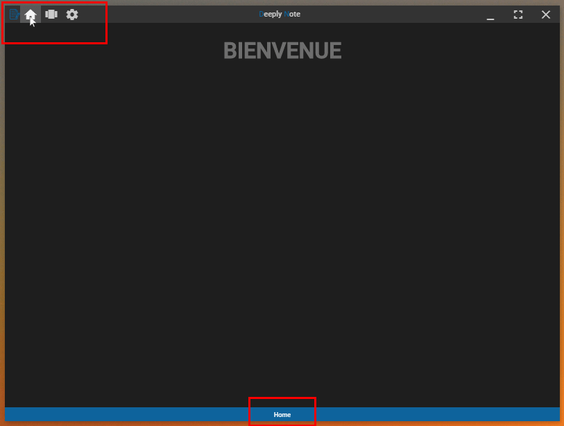

Nous avons vu au chapitre précédent comment créer notre éditeur de texte, comment communiquer du render au main process via le module IPC afin d'interagir avec les fichiers disques via les API de NodeJS.

Pour ce cours-ci nous allons nous consacrer sur une fonctionnalité apprécié en ce moment, à savoir comment avoir un thème sombre et clair, et comment enregistrer ces données-ci afin de les récupérer à chaque ouverture du logiciel. Une rapide ouverture à la programmation réactive Observer/Observable via la librairie RxJS afin d’implémenter une fonctionnalité pour améliorer l'UX de notre logiciel, afin de renseigner le nom du fichier texte actuellement ouvert par l'utilisateur.

Ce cours sera donc principalement consacré à l'amélioration de l'UI pour l'utilisateur.

Le code source concernant ce chapitre est disponible sur mon [Github](https://github.com/Momotoculteur/DeeplyNote/tree/Chap4).

{ loading=lazy }
///caption
Résultat du cours
///
 

## Mise en place du système de persistance

Je vous propose d'ajouter une fonctionnalité, permettant de sauvegarder l'état du thème choisit, pour qu'il puisse être à jour à chaque lancement de l'application et que l'on ne soit pas obligé de le re-sélectionner. D'une manière général, je vous propose un moyen simple afin de sauvegarder et charger des paramètres utilisateurs en cache.

Pour sauvegarder des données, vous pouvez très bien créer une base de données plutôt traditionnel afin de stocker vos informations nécessaire au fonctionnement de l'application. Mais pour notre application qui reste extrêmement minimaliste, je vous propose la sérialisation des data dans un simple fichier JSON. Si vous souhaitez néanmoins rester sur une BD traditionnel, vous devriez regarder vers SQLite database, ou encore IndexedDB sur NPM.

 

Première chose, on va installer un simple module nous permettant de gagner du temps quand à la persistance de fichier JSON.

`npm install electron-store --save`

Souvenez vous que nos fichiers seront disponible dans le dossier %Appdata% de votre ordinateur, dans le dossier du nom de votre application.

On commence par vérifier si notre fichier JSON de sauvegarde existe au préalable sur l'ordinateur. Si celui-ci existe on ne fait rien en particulier. Dans le cas contraire, on va initialiser les valeurs des nos couples Clés/Valeurs. On souhaite avoir comme paramètre sauvegardé, le type de thème sélectionné ( Light, Dark ou Custom ) mais aussi les codes couleurs hexadécimal de nos différentes parties de notre application customizable, via le thème 'Custom'. En effet, autant les thèmes Light et Dark sont pré-défini au sein de l'application et non modifiable, autant le thème Custom est modifiable lui.

On ajoute dans notre main process de Electron les bons imports qui vont bien :

```javascript linenums="1" title="main.js"
const Store = require('electron-store');
const storage = new Store({name:'settings'});
```

L'argument '**name**' représente le nom du fichier JSON de sauvegarde, lors de la création de notre objet '**storage**'.

 

On définit ensuite une fonction qui sera appelé dans notre fonction '**createWindow**' :

```javascript linenums="1" title="main.js"
function initSettingsPreferences()
{
    if(storage.get('SETTINGS')) {
    } else {
        storage.set({
            'SETTINGS': {
                'THEME_TYPE': 'DARK',
                'CUSTO_PALETTE': {
                    '--backgroungcolor-App': '#1e1e1e',
                }
            }
        });
    }
}
```

Comme je vous ai dit plus haut, si le fichier '**settings.json**' existe déjà, on ne fait rien. Dans le cas inverse, on va le créer et initialiser :

- SETTINGS : clé
    - THEME\_TYPE : clé, contient le type de thème à appliquer au lancement de notre app
    - CUSTO\_PALETTE : clé, contient d'autres clés qui sont nos variables CSS avec leur code couleur hexadécimal qui leur sont associé


## Thème clair & sombre

Il existe plusieurs façon de créer son propre système de thème pour son application. Nous allons voir une méthode très simple qui utilise les variables CSS. Au lieu d'affecter une couleur en dur à un composant HTML via son fichier CSS ( code en hexadécimal ou RGB ), on va désormais lui affecter une variable. C'est celle si que l'on va aller modifier selon no thème. Cela nous permet ainsi de bind plusieurs couleurs au même composant. Je vous propose de créer un thème clair, foncé, et un custom, auquel on pourra lui affecter au sein même de notre application une couleur modifiable à la volée.

 

### Création des différents modèles de thèmes 

Premièrement, on va créer  une énumération définissant nos différents type de thème que l'on peut choisir:

```javascript linenums="1" title="TypeTheme.ts "
export enum TypeTheme {
    LIGHT = "LIGHT",
    DARK = "DARK",
    CUSTOM = "CUSTOM"
}
```

Ensuite, nous  allons créer une interface permettant de créer des objets du même type :

```javascript linenums="1" title="Theme.ts "
import {TypeTheme} from '../enum/TypeTheme';

export interface Theme {
    type: TypeTheme;
    props: any;
}
```

Dans le même fichier précédent, on va maintenant créer 3 objects correspondant à nos 3 thèmes. Nous allons leur affecter un type ( Light, Dark ou Custom ) et leur définir l'ensembles des propriétés CSS que l'on souhaite modifier. Les propriétés CSS ont été réduite volontairement pour gagner en lisibilité, vous pouvez retrouver l'ensemble des propriétés du projet via son dépôt Github. Si on souhaite modifier par exemple seulement la couleur de fond de notre application :

```javascript linenums="1" title="Theme.js"
export const light: Theme = {
    type: TypeTheme.LIGHT,
    props: {
        '--backgroungcolor-App': 'white',
    }
};

export const dark: Theme = {
    type: TypeTheme.DARK,
    props: {
        '--backgroungcolor-App': 'black',
    }
};

export const custom: Theme = {
    type: TypeTheme.CUSTOM,
    props: {
        '--backgroungcolor-App': '#1e1e1e',
    }
};
```

Le mot clés **export** nous permet d'y accéder en dehors de ce fichier.

 

### Mise en place de l'interface pour la sélection du thème

Pour la vue de notre page de paramètres, faisons quelque chose de simple. On va disposer d'un groupe de bouton radio, permettant une sélection unique du thème. Cela nous rampement de choisir entre Light, Dark et Custom. Les deux premiers thèmes ayant des couleurs définit dans notre application, seul le Custom pourra être modifiable, histoire de laisser un maximum de liberté à l'utilisateur dans le choix de ses couleurs. Pour la vue, rien de bien complexe :

```html linenums="1" title="Settings.component.ts "
<div fxFill fxLayout="row" fxLayoutAlign="center">
    <div>
        <mat-radio-group fxFlex [(ngModel)]="activeTheme" (change)="changeTheme()" fxLayout="column" fxLayoutAlign="center" fxLayoutGap="10px">
            <mat-radio-button *ngFor="let theme of availableTheme" [value]="theme" >
                {{theme.type}}
            </mat-radio-button>
            <div *ngIf="activeTheme.type == aliasTypTheme.CUSTOM">
                <div *ngFor="let color of activeTheme.props | keyvalue">
                    <div fxLayout="row" fxLayoutAlign="space-between" fxLayoutGap="30px">
                        {{color.key}}
                        <input matInput type="hidden"[(ngModel)]="color.value" mccColorPickerOrigin #trigger="mccColorPickerOrigin" />
                        <mcc-color-picker (selected)="updateCustomProperty(color)" hideEmptyUsedColors mccConnectedColorPicker [mccConnectedColorPickerOrigin]="trigger"></mcc-color-picker>
                    </div>
                </div>
            </div>
        </mat-radio-group>
    </div>
</div>
```

On ajoute juste une condition, dans le cas ou l'utilisateur choisit le thème 'Custom', on affiche un sélecteur de couleur pour chaque item modifiable de notre application. Pensez d'ailleurs à installer ce module que j'apprécie fortement, un color picker simple qui permet de choisir une couleur en héxadecimal, en RGB ou via un arc-en-ciel de couleur, et qui propose une multitude de fonctionnalités via son api, installable via :

`npm install material-community-components --save`

Petit aperçu du module :

{ loading=lazy }
///caption
Plutôt sympa non ?😎\[/caption\]
///
 

Passons maintenant au contrôleur de notre page de paramètres. Nous devons définir des attributs pour lier nos boutons précédemment expliqués :

```javascript linenums="1" title="Settings.component.ts "
public availableTheme: Theme[];
public aliasTypTheme = TypeTheme;
public activeTheme: Theme;
```

- `availableTheme` : Tableau contenant les thèmes disponible à la séléction, responsable de la création des boutons radio
- `aliasTypeTheme` : cet alias est un bind à notre énumération précédente, qui contient les trois type de thèmes. Cela nous permet de pouvoir faire dans la vue notre comparaison, et afficher le color picker si et seulement si l'utilisateur à sélectionné le thème Custom
- `activeTheme` : c'est le thème actuellement activé

 

Concernant le constructeur du composant, on va créer une instance de ElectronService, permettant de discuter du render process au main process et vice versa :

```javascript linenums="1" title="Settings.component.ts "
constructor(public electronService: ElectronService) {
    this.availableTheme = [
        light,
        dark,
        custom
    ];
}
```

On initialise nos thèmes disponible pour créer nos boutons radio.

 
### Système pour initialiser un thème au démarrage de l'app via Electron-store

On va déléguer la gestion des préférence utilisateurs à un service, un singleton. Créons le via la CLI de Angular :

`ng generate service ThemeManager`

On va lui définir un attribut correspond au thème actif, et un second correspondant lui aussi au thème actif, mais qui sera un BehaviorSubject ( le but de celui-ci et de mettre à jour le thème actif au lancement de l'application , lorsque celle-ci chargement au démarrage les préférences de l'utilisateur) :

 
```javascript linenums="1" title="ThemeManager.service.ts "
public activeTheme: Theme;
public activeThemeSubject: BehaviorSubject<Theme>;
```

Concernant le constructeur du service, on va créer une instance de ElectronService permettant de contacter le main process :

```javascript linenums="1" title="ThemeManager.component.ts "
constructor(public electronService: ElectronService) {
    this.activeTheme = dark;
    this.activeThemeSubject = new BehaviorSubject(light);
    this.initChannels();
    this.electronService.ipcRenderer.send('loadUserSettings');
}
```

On initialise par des valeurs random nos deux précédents attributs (je vous l'accorde niveau QUALITÉ du code, on a fait mieux hein 😅). et on envoi une notification au main process sur le canal '**loadUserSettings**'.

 

On va définir dans le main process la méthode permettant de lire dans notre fichier JSON de sauvegarde, les données des préférences (définit par notre clé 'SETTINGS', et de l'envoyer au render process via le cannal '**responseLoadUserSettings**':

```javascript linenums="1" title="main.js "
ipcMain.on('loadUserSettings', (event, data) => {
    event.reply('responseLoadUserSettings', storage.get('SETTINGS'));
});
```
 

On réceptionne dans le thème manager les données d’initialisation envoyé par le main process :

```javascript linenums="1" title="ThemeManager.service.ts "

public initChannels(): void {
        this.electronService.ipcRenderer.on('responseLoadUserSettings', (event, data) => {
            switch (data['THEME_TYPE']) {
                case 'DARK': {
                    this.activeTheme = dark;
                    break;
                }
                case 'LIGHT': {
                    this.activeTheme =  light;
                    break;
                }
                case 'CUSTOM': {
                    this.activeTheme = custom;
                    break;
                }
            }
            custom.props = data['CUSTO_PALETTE'];
            this.activeThemeSubject.next(this.activeTheme);
            this.setTheme();
        });
    }
```

On actualise notre thème actif, la palette de couleurs pour le thème 'CUSTOM',  et on met à jour notre BehaviorSubject pour mettre la vue à jour concernant le thème actif, et enfin on appelle une méthode permettant d'appliquer notre thème :

```javascript linenums="1" title="ThemeManager.service.ts "
public setTheme(): void {
    Object.keys(this.activeTheme.props).forEach(property => {
        document.documentElement.style.setProperty(
            property,
            this.activeTheme.props[property]
        );
    });
}
```

On parcours les variables CSS du thème actuel, et on va les appliquer à notre document. Voilà, notre thème est appliqué au démarrage ! 😄

 

La dernière étape consiste à mettre à jour le modèle de nos boutons radio suite au chargement du thème initial. On ajoute une fonction dans le constructeur du composant de la page paramètres, afin qu'il soit notifié dès que le thème actif de notre service ThemeManager change. Voilà pourquoi je l'ai définit en tant que Observable, pour lui attacher un observateur. On va pouvoir **subscribe** a ce **Subject** de la façon suivante :
 
```javascript linenums="1" title="Settings.component.ts "
this.themeManager.activeThemeSubject.asObservable().subscribe( (newTheme: Theme) => {
    this.activeTheme = newTheme;
});
```

### Système pour appliquer le thème courant

Maintenant que au lancement de notre application nos préférences sont lues et appliqués, on souhaite pouvoir changer de thème durant l'utilisation de notre application. On retourne sur le contrôleur de notre page de paramètre, et on ajoute la fonction suivante :

```javascript linenums="1" title="Settings.components.ts "
public changeTheme(): void {
    this.themeManager.activeTheme = this.activeTheme;
    this.themeManager.setTheme();
}
```

Cela va nous permettre de mettre à jour le thème actif pour nos boutons radio mais aussi de l'appliquer, via le ThemeManager.

 

### Système pour sauvegarder le thème courant

Nouvelle fonctionnalités qui peut être cool, c'est de pouvoir enregistrer l'état courant de notre application, concernant le thème actif actuellement. Très simple, on va ajouter une seule ligne à la méthode expliqué juste avant, **changeTheme()** disponible dans le contrôleur de notre page '**SETTINGS**' :

```javascript linenums="1" title="Settings.component.ts "
this.electronService.ipcRenderer.send('saveSettings', this.activeTheme);
```

Cela permet à chaque changement de thème, ou de couleur sur le color picker pour le thème CUSTOM ( car cette méthode d'actualisation est aussi appelé lors d'une modification de couleurs ) d'envoyer une notification à notre main process sur le canal '**saveSettings**', avec notre thème actuel en data.

Dans le main process, nous ajoutons une méthode permettant de réceptionner le thème actuel :

```javascript linenums="1" title="main.js"
ipcMain.on('saveSettings' , (event, data) => {
    storage.set('SETTINGS.THEME_TYPE', data.type);
    storage.set('SETTINGS.CUSTO_PALETTE', data.props);
});
```

Et on met à jour notre fichier JSON contenant nos préférences utilisateurs, via Electron-store.

 
## Indication de la page en cours d’exécution

Vous allez avoir besoin d'un nouveau module, permettant de faire de la programmation réactive :

`npm install rxjs --save`

Histoire d'améliorer l'interface utilisateur, je vous propose d'ajouter au centre de notre footer, une indication pour rappeler à l'utilisateur sur quel page il se situe au sein de notre application. Pour cela, on va définir une énumération contenant l'ensemble des pages de notre application :

```javascript linenums="1" title="MenuState.ts "
export enum MenuState {
    HOME = 'Home',
    SETTINGS = 'Settings',
    EDITOR = 'Editor'
}
```
 

Ainsi lorsque l'utilisateur va changer de page via les boutons de navigation situé en haut de notre application, on demandera une mise à jour du footer. Et pour cela, on va avoir besoin d'un **service**. On va créer ce service depuis la CLI de Angular :

`ng generate service FooterUpdateService`

 

Ce service va nous permettre d'échanger des données entre nos différents composants. Il se compose de la façon suivante :

```javascript linenums="1" title="FooterUpdateService.ts "
@Injectable({
  providedIn: 'root'
})
export class FooterUpdateService {
    public menuStateSubject: BehaviorSubject<MenuState>;
    constructor() {
        this.menuStateSubject = new BehaviorSubject(MenuState.HOME);
    }
    public updateMenuStateSubject(newState: MenuState): void {
        this.menuStateSubject.next(newState);
    }
    public getMenuStateObservable(): Observable<MenuState> {
        return this.menuStateSubject.asObservable();
    }
}
```

On définit un **BehaviorSubject**. Ceci est un type de la librairie RxJs, qui propose de réaliser de la programmation réactive. Cela est grosso modo de la programmation qui suit le paradigme Observable et Observer. Ce **menuStateSubject** est un observable. Le '**behavior**' indique que c'est un observable, qui sera initialisé dès sa création avec un état pré-défini. Vous pouvez le voir dans le constructeur du service, on lui définit l'état **HOME**. Si vous souhaitez de pas lui définir d'état en particulier à sa création, vous pouvez utiliser simplement un **Subject** à la place du **BehaviorSubject**.

On a une première méthode, **updateMenuStateSubject**, permettant de lui envoyer un nouvel état.

La méthode **getMenuStateObservable** permet de renvoyer notre observable, nous l'utiliserons juste après.

 

Le but de ces observables, et d'y attacher des observateurs, ou juste de pouvoir **subscribe** au sujet. Cela permet de notifier à chaque changement d’état de notre Observable,  ses observateurs et de pouvoir faire des actions en conséquence.

 

On va ajouter dans le contrôleur de notre Header, une fonction permettant de mettre à jour l'état de notre Observable, définit dans le service précédent :

```javascript linenums="1" title="Header.component.Ts "
public updateHeader(newState: MenuState): void {
    this.footerService.updateMenuStateSubject(newState);
}
```

N'oubliez pas d'ajouter au constructeur de notre contrôleur Header,  l'appel au singleton de notre service via '**public footerService: FooterServiceUpdate**'. On ajoute un argument à cette fonction, du type de l’énumération précédemment crée, afin de déterminer quelle page on ouvre.

 

On ajout ensuite le bind **(click)** dans notre vue sur chacun de nos boutons, qui nous permettent de changer de page. Ils permettent dorénavant de mettre à jour notre observable :

```html linenums="1" title="Header.component.Ts "
<button fxFlex (click)="updateHeader(aliasMenuState.HOME)" [routerLink]="['home']" class="button" mat-button >
    <i class="material-icons">
        home
    </i>
</button>
<button fxFlex (click)="updateHeader(aliasMenuState.EDITOR)" [routerLink]="['projects']" class="button" mat-button >
    <i class="material-icons">
        view_carousel
    </i>
</button>
<button fxFlex (click)="updateHeader(aliasMenuState.SETTINGS)" [routerLink]="['settings']" class="button" mat-button >
    <i class="material-icons">
        settings
    </i>
</button>
```
 

On ajoute dans la vue du footer une variable permettant d’afficher le contenu d'une variable qui sera définit dans son contrôleur :

```html linenums="1" title="Footer.component.html "
<div fxLayout="row" fxLayoutAlign="center">
    {{menuState}}
</div>
```
 

On va ajouter dans le contrôleur du footer, l'attribut précédemment utilisé pour l'affichage de l'état courant du menu :

```javascript linenums="1" title="FooterComponent "
export class FooterComponent implements OnInit {
    public menuState: MenuState;
    constructor(public footerService: FooterUpdateService) {
        this.initObserver();
    }
    public initObserver(): void {
        this.footerService.getMenuStateObservable().subscribe( (newState: MenuState) => {
            this.menuState = newState;
        });
    }
}
```

Et voilà le résultat !

{ loading=lazy }
///caption
Résultat de l'actualisation du footer
///
 

## Conclusion

Nous venons de voir quelques pistes afin d'améliorer l'UI pour notre application, ainsi qu'une piste pour sauvegarder les préférences de l'utilisateur. Nous aurons aussi vu une rapide approche sur la bibliothèque RxJS, permettant de suivre le paradigme Observable/Observer.
