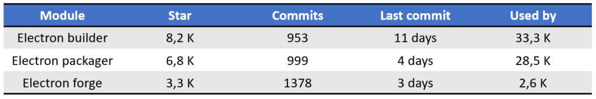

Nous avons vu au chapitre précédent comment améliorer l'UI de notre application avec un système permettant à l'utilisateur de choisir son thème. Cela se fait beaucoup actuellement sur les applications pour reposer notamment les yeux lors d'une utilisation nocturne. Nous avons aussi vu comment sérialiser simplement et rapidement des données utilisateurs concernant les préférences et paramètres de l'application via de simples fichiers JSON.

Le code source concernant ce chapitre est disponible sur mon [Github](https://github.com/Momotoculteur/DeeplyNote/tree/Chap6).

 
## Principe global

Dans ce sixième et dernier chapitre de cette série consacré à l'utilisation de Electron, nous allons voir comment packager notre application afin de la distribuer. Pour cela nous allons utiliser le très bon module Electron-builder pour créer nos installateurs. On va installer ce module en tant que dépendances de dév :

- npm i electron-builder -g


Nous allons devoir réaliser deux principales étapes afin de créer notre installateur :

1. Builder notre application Angular en mode production,
2. Packager le précédent build via Electron-builder.


## Génération du build Angular en mode prod

Cette première étape va consister à créer un bundle de notre application. On va demander à Angular de builder notre application en mode production afin de compiler l'ensemble de nos composants, contrôleurs et pages web avec nos modules NPM, afin de passer d'un dossier de quelques centaines de Mo à un build ne pesant que quelques Mo.

Nous allons devoir effectuer quelques modifications de code, car actuellement on ne fait que build notre application dans un environnement de développement via notre serveur local.

 
### Chargement de la page d'accueil

Pour le moment on demandait à Electron de charger à l'initialisation de la fenêtre, le rendu du serveur local de Angular via :

```
win.loadURL('http://localhost:4200/')
```

On va ajouter du code permettant de demander le chargement de **index.html** de notre build dorénavant :


```javascript linenums="1" title="main.js"
if (isToolsDev) {
    win.webContents.openDevTools();
    win.loadURL('http://localhost:4200/');
} else {
    win.loadURL(url.format({
        pathname: path.join(__dirname, 'dist/DeeplyNote/index.html'),
        protocol: 'file:',
        slashes: true
    }));
}
```

On va demander de charger un fichier et non plus une URL, en indiquant via le paramètre **protocol**. Le chemin correspond au fichier index.html dispo dans notre build, situé dans le dossier 'dist' de Angular. Le paramètre **slashes** est extrêmement important pour Angular, afin de permettre le routage des diverses pages au sein de notre application.

 

### Activer le Hash (#)

Etant donnée que l'on crée une SPA ( Single Page Application ), on peut observer des # dans notre URL, mais pas pour tout le monde, puisque Angular le cache dans les dernière version, et cela pose problème.

En effet avec le serveur de dév, tout fonctionne bien. Mais une fois passé en mode production, on arrive plus à afficher nos pages web correctement, car l'URL est faussé sans notre #. Pour cela, on va devoir le spécifier dans notre module principal de routing, d'utiliser le hash :


```javascript linenums="1" title="app-routing.module.ts"
@NgModule({
  imports: [RouterModule.forRoot(routes, {preloadingStrategy: PreloadAllModules, useHash: true})],
  exports: [RouterModule]
})
export class AppRoutingModule { }
```

 
### Base des liens

On va aller modifier la base de l'ensemble des liens de notre application, disponible dans notre **index.html** afin qu'il corresponde avec Electron :

```html linenums="1"
<base href="./">
```


### Cible de build

Dans le fichier de configuration de build de Angular, **tsconfig.json**, on va modifier la ligne suivante :

`"target": "es2015"`

par :

`"target": "es5"`

 
### Génération du build

Dernière étape, on va générer le build Angular via :

`ng build --prod`

Le build est dispo sous /dist.

 
Pensez à tester ce build de production directement avec Electron avant de passer à l'étape suivante, via la commande :

`electron .`

Sans utiliser notre arguments --devTools, on demande à electron de tester notre build précédemment crée et non le serveur de développement de Angular.

 

Tout fonctionne pour moi, on peut passer à l'étape finale 😎

 
**/!\\** Attention à bien vérifier les liens vers vos assets, qu'ils soient bien relatif et non absolue, sinon vous risquez d'avoir des soucis et ne seront pas trouvé dans votre app Electron !

 

## Package du build via Electron-builder

Vous avez de disponible quelques modules pour vous permettre de vous faciliter la vie pour créer votre installateur. En voici les principaux :

{ loading=lazy }
///caption
Comparatif des modules de build/package les plus populaires
///

Je vous propose de partir sur le plus populaire du moment de Github, à savoir Electron-builder. Mais vous pouvez partir sur celui qui vous fait plaisir, je n'ai pas essayé les autres mais je présume qu'ils doivent chacun faire le boulot !

 
Du coup avec le notre de module, c'est plutôt simple. On a juste à définir de nouveaux comportements dans notre fichier main.js. Je vous montre la spécification minimal, la plus simple pour générer un installateur. De nombreuses autres options sont disponible sur le site de Electron-builder, que cela soit pour faire un build Window, Linux ou macOS.


```javascript linenums="1" title="main.js"
"build": {
    "appId": "DeeplyNote",
    "compression": "maximum",
    "asar": true,
    "win": {
        "target": "nsis",
        "icon": "./src/assets/icon/icon_transparent.png"
    },
    "electronDownload": {
        "cache": "./cache"
    },
    "directories": {
        "output": "./distElectron"
    },
    "nsis": {
        "oneClick": false,
        "perMachine": false,
        "allowToChangeInstallationDirectory": true,
        "deleteAppDataOnUninstall": true
    },
    "files": [
        "main.js",
        "package.json",
        "./dist/**/*"
    ]
}
```

- **appId** : nom de l'application
- **compression** : définit le niveau de compression des données de notre application dans l'installateur
- **win** : on définit ici les options pour un build pour window, à savoir la cible ainsi que le fichier d'icone pour notre application
- **electronDowload** : permet de mettre en cache les utils et dépendances nécessaire à Electron builder afin de compiler notre installateur
- **directories** : on définit le dossier d'output pour notre installateur
- **nsis** : c'est la cible concernant un build pour window, on définit les options ici de l'installateur. On lui spécifie que on veut laisser le choix à l'utilisateur pour installer sur une session ou en global, la possibilité de choisir son dossier d'installation ainsi que de supprimer ou non les données de l'application en cache une fois celle-ci de supprimé
- **files** : c'est ici que l'on spécifie à Electron builder les fichiers nécessaires au bon fonctionnement de notre application. On lui donne notre point d'entrée de notre app qui est main.js, ainsi que notre package.json ou l'ensemble du fonctionnement y est spécifié, et enfin le build de production généré par Angular précédemment

 

Pour générer l'installateur, ouvrez votre console dans le dossier du projet et tapez :

`electron-builder`

Il va télécharger les dépendances et utilitaires nécessaire pour créer l'installateur. Vous pouvez lui spécifier des arguments pour définir quelle plateforme et quelle architecture cible vous souhaitez pour votre/vos installateurs.

Dans votre dossier de sortie de Electron builder, sous **/distElectron**, vous aurez à la fois un dossier avec l'ensemble de votre application buildé et packagé prêt à fonctionner ( on peut appeler ça une installation dite **portable**, d'un simple copié/collé vous partagez votre app) ainsi que d'un installateur au format .exe traditionnel.

 

### Astuce : builder en mode offline

Electron-builder va descendre certaines extension pour réaliser le build. Si vous souhaitez réaliser des builds en mode offline, sur un pc n'étant pas connecté à internet, vous pouvez mettre une variable d'environnement pour forcer le cache de electron builder dans le dossier spécifique de votre choix :

- set ELECTRON\_BUILDER\_CACHE="votre\_dossier"

 
Vous aurez ainsi dans ce dossier les éléments suivants :

ELECTRON\_BUILDER\_CACHE :

- votre\_dossier
    - nsis
        - nsis-x.x.x.x
        - nsis-ressources-x.x.x
    - winCodeSign
        - winCodeSign-x.x.x

 

Vous aurez plus qu'a récupérer ce dossier, et de les déposer via usb sur votre nouvel ordinateur qui ne dispose pas d'un accès internet. N'oubliez pas de re-set la variable d'environnement sur ce dernier pc pour lui indiquer le bon chemin pour accéder à ce même dossier.


## Conclusion

On arrive avec de sixième chapitre à la fin de la série consacré à comment débuter sur Electron. Vous êtes désormais capable de :

- Initialiser un nouveau projet, développer avec un serveur de dév en local avec hot reload du frontend & backend,
- Créer votre première fenêtre avec persistance des données utilisateurs,
- Gérer la communication entre render & main process, gérer la communication entre composant de Angular,
- Builder un projet Angular, packager votre application Electron.

 