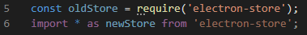
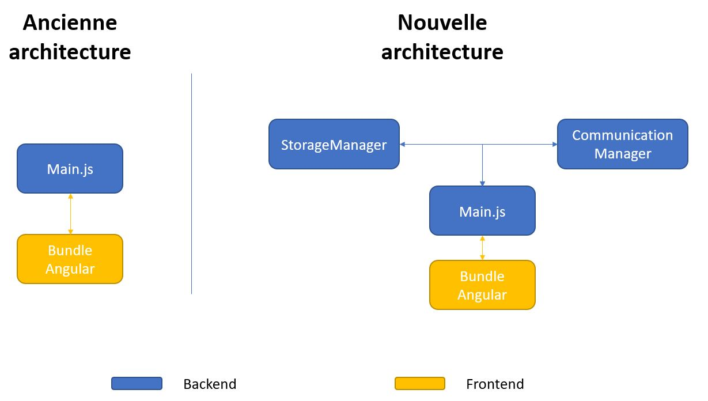
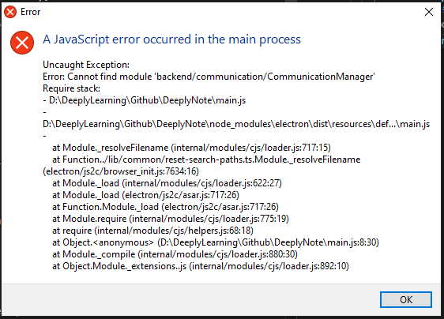

Nous avons vu précédemment comment build et package l'ensemble de notre application en un .exe ou un installateur, si on souhaite le distribuer dans le chapitre précédent.

Je pensais avoir déjà fait un rapide tour d'Electron en 6 chapitres, mais à force de l'utiliser je pense pouvoir ajouter quelques chapitres supplémentaires qui pourrait bien vous servir et faciliter le développement autour de ce génial framework.

## Objectif

- Diviser les fonctionnalités de notre unique fichier du backend (main.js) en une multitude de fichiers
- Permettre d'écrire le backend en Typescript et plus Javascript via un transpileur (TSC)
- Pouvoir transpiler en instantané ( hot reload )

Le code source concernant ce chapitre est disponible sur mon [Github](https://github.com/Momotoculteur/DeeplyNote/tree/Chap7).
 

## Passage du Javascript vers le Typescript

Pour le moment, nous avons l'ensemble de notre application du frontend écrit via Angular en Typescript, mais le backend en Javascript. Il faut dire que le TS apporte beaucoup au JS traditionnel, et c'est pour cela que j'ai décider de migrer le backend. Il faut savoir que seul le pure javascript est compréhensible de nos navigateurs.

 

- Comment Angular peut-il alors faire du frontend alors que l'on écrit notre application en TS ? 🤔🤔

 

De façon invisible, nous avons Webpack, planqué dans Angular, qui nous créer notre bundle en effectuant une multitude de transformation de nos fichiers, donc une que l'on va voir maintenant, est qui est la phase de transpilation. Celui-ci va **transpiler** l'ensemble de nos fichiers TS. Un mot bien complexe qui n'est rien d'autre que la conversion des fichiers TS en JS.

 

### Script NPM pour la transpilation du typescript

Je suis parti sur TSC, qui est le transpiler de base de Typescript, car il est très simple d'utilisation, pas besoin de s’embêter avec un tas de paramétrage pour transpiler deux pauvres fichiers TS. Si vous souhaitez vous lancer dans des utilisations plus poussés, renseignez vous auprès de **Webpack** ou encore **Babel**.

 

On ajoute premièrement à notre **package-json** un nouveau script pour nous permettre d'appeler TSC :

```json linenums="1" title="package-json.json "
{
    "name": "DeeplyNote",
    "main": "main.js",
    "scripts": {
      "backend-serve": "tsc --project tsconfig.backend.json --watch",
      "backend-build": "tsc --project tsconfig.backend.json",
    }
}
```

- `backend-serve` : nom du script
- `\--project` : argument pour fournir un fichier json de description pour le transpiler
- `\--watch` : argument pour compiler à la volé, dès qu'une sauvegarde de code est détecté

 

Si vous souhaitez transpiler seulement une fois sans avoir besoin du rechargement à la demande, vous pouvez supprimer l'argument `'--watch'`.

 

Une fois le script ajouté, on va créer un nouveau fichier comme vous avez pu le lire précédemment, **tsconfig.backend.json**, qui va nous permettre de décrire comment nous souhaitons transpiler nos fichiers TS.

```json linenums="1" title="tsconfig.backend.json"
{
    "compileOnSave": true,
    "include": [
        "main.ts",
        "backend/**/*.ts"
    ],
    "exclude": [
    ],
    "compilerOptions": {
      "baseUrl": "./",
      "sourceMap": false,
      "declaration": false,
      "downlevelIteration": true,
      "experimentalDecorators": true,
    },
}
```

Les arguments les plus importants sont :

- include : on liste ici l'ensemble des fichiers TS que l'on souhaite transpiler
- baseUrl : décrit la base du projet. On s'en servira plus tard lorsque je parlerais d'import de module en absolue ou relatif.

 

### Ré-écrire son Main.js en typescript

Le but va être de ré-écrire son fichier d'entrée de notre application Electron, Main.js, en une version typescripté. Ouais je sais que ce mot existe pas, et alors c'est mon blog !😋

{ loading=lazy }
///caption
La ligne 5 représente un import de module pour les fichiers JS, la ligne 6 la méthode pour les fichiers TS
///

On va copier notre fichier Main.js et en faire un nouveau Main.ts. Vous risquez d'avoir quelques erreurs de lancé par votre linter, rien de bien complexe à modifier, vous devriez vous en sortir sans grand soucis. Un exemple dont vous pouvez avoir est la façon dont vous devez importer vos modules.


Je vais néanmoins quand même vous accompagner pour vos premières classes, car vous risquez d'avoir un petit soucis 😜
 

## Architecture du backend

Jusqu’à présent nous n'avions qu'un seul fichier pour le backend, pour la gestion du cycle de vie de notre application. Au fur et à mesure des fonctionnalités que vous allez ajouter au backend, il se peut que vous souhaitiez éclater ce fichier **'main.js'** en une multitude d'autres afin d'avoir une plus fine granularité, et ainsi d'améliorer l'extensibilité du code dans le futur. Je vous propose de suivre l'architecture suivante :

{ loading=lazy }

 

On va ajouter les deux classes suivantes :

- **StorageManager** : on va lui déléguer l'ensemble des fonctionnalités de Main.js qui touche l'ensemble des serialization des données du module **electron-store**
- **CommunicationManager** : on va lui déléguer l'ensemble des fonctionnalités de Main.js qui touche à l'échange d'informations entre le render et le main process, soit l'ensemble des fonctions du module **IPC**.

 

### Erreur du loader/resolveFilename

{ loading=lazy }

Vous avez enfin une belle architecture, écrite en TS, et vous avez TSC de configuré. Aucune erreur sur l'ensemble de vos consoles, super, vous pouvez lancer Electron... et BIM ! Une belle erreur devrait apparaître, comme quoi vos nouveaux composants fraîchement crées ne sont pas trouvable 😒. Tsc étant un transpiler simple, il ne fait pas la liaison entre les composants lorsque on utile des imports absolue. Cependant si vous utilisez des importation de module avec des liens relatifs, vous n'aurez pas de soucis. Cependant, l'écriture de ces imports rend leur lecture complexe, en voici un exemple :

> import \* as test from '../../../../../../monModule';

 

- Mais pourquoi la console de TSC ne m'a pas indiqué d'erreur lors de la transpilation, mais seulement au moment de lancer Electron ? Car nous l'avons paramétré dans le fichier **tsconfig.backend.json**, avec l'argument **'baseURL'** souvenez vous.

 

Si j'ai fais ce tutoriel avec TSC, c'est qu'il existe néanmoins des solutions, même si je vous avoue m'être bien cassé la tête sur ce problème. Pour résoudre ce soucis de chemin dans les **require**, vous avez deux petits modules à la rescousse disponible sur NPM.

 

### Méthode 1 - La plus simple & basique

Son principe est simple, il va ajouter le répertoire parent de plus haut niveau dans le module de recherche de chemin de Node.

 

Il suffit d'installer le module suivant :

npm install app-module-path --save

C'est la méthode la plus simple, car il suffit d'ajouter une seule ligne de code, au début de notre fichier **main.ts :**

```typescript linenums="1" title="main.ts"
require(‘app-module-path‘).addPath(__dirname);
```

Pratique, car fonctionne lors du build, mais aussi en mode hot-reload durant le développement.

 

Cependant, si vous souhaitez seulement tester un fichier en particulier, une classe par example, et donc ne pas lancer votre application entière via le main.ts (faire simple un => node maclasse.js), cela ne fonctionnera pas car ayant ajouté le code précédent dans le main.ts, celui-ci ne sera pas lu. Pour cela vous êtes soit obligé de toujours lancer le main.ts depuis node pour que l'ensemble des imports soient modifiés, soit ajouter ce code dans l'ensemble des classes, ce qui peut vite devenir lassant. C'est pour cette raison là que je vous conseille la méthode 2.

 

### Méthode 2 (recommandé) - Un poil plus complexe, mais plus flexible

Un second module vient à notre rescousse mais se comporte tout autrement. En effet, il va aller modifier les imports absolue de chaque fichier pour les remplacer par des liens absolue lors du build, dans les fichiers transpilé .js. Terriblement efficace, et pas bien plus complexe en ne nécessitant qu'une petite étape supplémentaire de configuration.

On installe ce module via:

- `npm install ttypescript --save`
- `npm install @zerollup/ts-transform-paths --save`

Héhé, je vous en fait installer un second en cachette car nous allons avoir besoin d'un wrapper, **ttypescript**, qui va nous permettre d'utiliser des plugins de transformation qui sont supporté dans notre fichier de configuration des options de compilation, disponible dans le fichier tsconfig.json.

 

Premièrement, on va modifier notre script NPM du fichier **package.json** de tout à l'heure pour qu'il utilise **ttypescript** que l'on vient d'installer :
 
```json linenums="1" title="package.json"
{
    "name": "DeeplyNote",
    "main": "main.js",
    "scripts": {
      "backend-serve": "ttsc --project tsconfig.backend.json --watch",
      "backend-build": "ttsc --project tsconfig.backend.json",
    }
}
```

On va ensuite modifier notre fichier de configuration qui permet de transpiler le backend, **tsconfig.backend.json**, afin de lui ajouter notre transformateur dans l'option **'plugin'** pour qu'il puisse ré-écrire les imports :

```json linenums="1" title="tsconfig.backend.json"
{
    "compilerOptions": {
      "baseUrl": "./",
      ....,
      "plugins": [{ 
          "transform": "@zerollup/ts-transform-paths" 
      }],
      "paths": { 
        "*": [
            "*"
        ]}
    },
}
```

Et on lui dit dans l'argument **'paths'** de récupérer tout les fichiers à la base du projet et de les importer tel quel.

 

C'est finit, vous n'avez plus qu'a builder le backend depuis la console, avec notre script npm via la commande :

`npm run backend-serve`

Pour tester si tout fonctionne lancer le serveur de développement Angular avec:

`npm run angular-serve`

Ainsi que electron via :

`npm run electron-serve`

## Mise à jour de la configuration du build

Afin de pouvoir continuer à builder, packager et distribuer votre application avec le module **electron-builder**, n'oubliez pas de modifier votre configuration de build disponible dans le fichier **electron-builder.json** ( ou dans votre **package.json** si vous n'avez pas dissocié les fichiers de configuration ). En effet, venant de modifier le backend en une multitude de nouveau fichiers TS et JS, nous devons mettre à jour notre configuration afin que celle-ci les prennes en compte dans le packaging de l'application. Pour cela, on va ajouter un nouvel item dans l'argument **'files'**, afin d'ajouter nos fichiers javascript précédemment transpilé :

```json linenums="1" title="electron-builder.json"
{
    "appId": "DeeplyNote",
    ...,
    "files": [
      "main.js",
      "./dist/**/*",
      "backend/**/*.js"
    ]
}
```
 
## Conclusion

On vient de voir la façon la plus simple pour pouvoir transpiler son backend Electron via TSC et un transformateur, pour résoudre les liens des imports absolue en relatif. Cela va nous permettre d'utiliser le typage et ainsi d'avoir un code source plus rigoureux grâce à Typescript.
