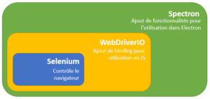

C'est lassant, ça prend du temps, et c'est bien souvent idiot au premier abord. Je vous présente donc..... les TESTS ! 😒 On les évites bien trop souvent, mais il faut le dire moi le premier, que l'on a tous connus des projets auquel à force de rajouts de fonctionnalités, que certaines unes d'entres elles, ont sans le vouloir casser d'autres fonctionnalités. En effet, quand on est sur une branche et que l'on focus cette nouvelle feature, on test celle-ci exclusivement dans l'environnement de développement. Et il se peut que l'on casse d'autres chose à vouloir bouger, modifier et optimiser notre code. Et on s'en rend bien souvent compte trop tard lors d'éventuelle realease en production, ce qui peut engendrer d'importantes conséquences. Ou dans le meilleur des cas comme moi, passer pour un con lors de mes démos 😅

 
## Spectron & Jest : pourquoi et comment

Lors de la création d'un projet Angular via CLI, vous aurez d'avantage de chance de connaître les noms de Karma, Jasmine, ou encore Protractor, qui sont proposé par défaut.

- Pourquoi migrer de framework si ceux de base sont proposé par Angular ? 🤔

Et bien pour deux raisons :

1. Jest est vraisemblablement plus rapide que ses concurrents pour effectuer ses tests, car ils peuvent s’exécuter en parallèle. Vous gagnez donc au change, au fil du temps que votre application se développe.
2. La seconde est que même si on créer à première vu un site web, il a néanmoins pour but d'être utilisé sous forme d'application bureautique via Electron. Les framework de test cité plus haut sont formidable pour tester des sites web. Cependant, comme on fait appel à des fonctions de l'API de Electron, on ne peut ouvrir notre application Electron convenablement sur notre navigateur favori. Ceux-ci ne vont donc être utile que vous du test unitaire, mais on peut dors et déjà oublier les tests e2e. C'est pour cela que Spectron est idéal, puisque développé pour tester des applications conçu sous Electron.
3. Donne la couverture de code couvert par les tests
4. Pas besoin d'un navigateur web pour exécuter les tests, tout se fait depuis la console
5. Réalisation de 'snapshot', afin d'assurer que l'on ait pas de régression d'un point de vue UI

### Jest

C'est le moteur de test développé par Facebook. Pratique, car tourne sur Angular, React, Vue. 

### Spectron

{ loading=lazy }
///caption
Spectron wrapper de WebDriverIO et Selenium
///

C'est un wrapper qui embarque à la fois Selenium, et WebDriverIO.

- Selenium est un framework de test, qui permet de réaliser des opérations sur le navigateur web.
- WebDriverIO quant à lui, est un autre framework de test qui reprend l'API de Selenium de façon customisé, écrit en javascript et exploitable par NodeJS. Il va ainsi ajouter des fonctionnalités de binding. On va pouvoir réaliser des opérations de click de souris sur des éléments, récupérer des champs de valeur, naviguer dans notre application, etc. Concrètement, on va pouvoir reproduire une utilisation du logiciel par un vrai utilisateur, mais en ligne de code.
- Spectron, enfin, va ajouter des fonctionnalités pour avoir accès à l'ensemble de l'API de Electron

### Optionnel : bibliothèque d'assertions

Lorsque on effectue des tests, on compare un état souhaité, avec l'état réellement obtenue lors de l'utilisation de l'application. J'utilise la librairie de base de NodeJS, à savoir **assert**. Simple et facile d'utilisation. Mais il est vrai que certains préférerons d'utiliser des styles d'écriture BDD ou TDD. **Chai** est une librairie que je recommande, qui permet de faire cela, tout en poussant les fonctionnalités de comparaison pour avoir des tests encore plus poussé.

Exemple de style que vous pouvez rencontrez, pour faire une comparaison de base :

- `Should` : foo.should.equal('bar');
- `Expect` : expect(foo).to.equal('bar');
- `Assert` : assert.equal(foo, 'bar');

## Spectron & Jest : utilisation

### Installation

On commence par installer les modules nécessaire, en dépendance de développement via le gestionnaire de packets NPM :

**Jest** : `npm install --save-dev jest`

**Auto complétion Jest** : `npm install --save-dev @types/jest`

**Spectron** : `npm install --save-dev spectron`

 

!!! danger
    Veillez à bien respecter les versions entre Electron et Spectron, ou vous risquez d'avoir des soucis de compatibilité :

| Electron Version | Spectron Version |
| --- | --- |
| `~1.0.0` | `~3.0.0` |
| `~1.1.0` | `~3.1.0` |
| `~1.2.0` | `~3.2.0` |
| `~1.3.0` | `~3.3.0` |
| `~1.4.0` | `~3.4.0` |
| `~1.5.0` | `~3.5.0` |
| `~1.6.0` | `~3.6.0` |
| `~1.7.0` | `~3.7.0` |
| `~1.8.0` | `~3.8.0` |
| `^2.0.0` | `^4.0.0` |
| `^3.0.0` | `^5.0.0` |
| `^4.0.0` | `^6.0.0` |
| `^5.0.0` | `^7.0.0` |
| `^6.0.0` | `^8.0.0` |
| `^7.0.0` | `^9.0.0` |
| `^8.0.0` | `^10.0.0` |

 

### Configuration

On va créer un fichier de configuration pour jest, jest.config.json, à la racine de notre projet :

```json linenums="1" title="jest.config.json"
{
    "verbose": true,
    "testMatch": [
      "**/e2e/?(*.)+(e2e|unit).[jt]s?(x)"
    ],
    "testEnvironment": "node"
}
```


- `testMatch` : définit une regexp pour matcher le nom des fichiers de tests. Ici, on garde les fichiers dans le dossier /e2e/,  et qui contient le mot .e2e. ou .unit. et qui est un fichier TS ou JS

Ensuite, on va ajouter un nouveau script pour automatiser le lancement de nos tests, dans notre fichier package.json :

```json linenums="1" title="package.json"
{
    ...
    "main": "main.js",
    "scripts": {
      "test": "jest --config jest.config.json --detectOpenHandles --runInBand"
    }
    ...
}
```

- `config` : pour renseigner la configuration crée précédent
- `runInBand` : lancer les tests de façon séquentiel
- `detectOpenHandles` : autorise Jest à fermer une session d'un test automatiquement si celui-ci ne se termine pas correctement, afin de continuer les tests

 

### Squelette de base d'un test

Voici le template de base pour réaliser un test :

```javascript linenums="1" title="basic.e2e.js "
// IMPORT
const assert = require('assert');
const path = require('path');
const Application = require('spectron').Application;
const electronPath = require('electron');

// Définition d'un fichier de test
describe('Description du fichier', function () {
    // Time out
    jest.setTimeout(10000)
    // Définition de notre application à tester
    const app = new Application({
        path: electronPath,
        args: [path.join(__dirname, '../..')],
        startTimeout: 10000,
        waitTimeout: 10000
    });

    // Appelé avant chaque test
    beforeEach(() => {
        return app.start();
    });

    // Appelé après chaque test
    afterEach(() => {
        if (app && app.isRunning()) {
        return app.stop();
        }
    });
    
    // Définition d'un test
    it('Description du test', () => {
        // C'est ICI que vous réalisez votre test
    });
    
});
```

- `describe` : c'est le mot clé pour définir un groupe de test
- `beforeEach` : permet de retourner une application lancé a chaque début de test
- `afterEach` : permet de fermer notre application une fois un test exécuté
- `it` : mot clé pour définir un test

Vous pouvez observer la mise en place d'un timeout par Jest, mais aussi dans la définition de notre application. Cela permet de laisser un peu de temps à notre application pour s'ouvrir, avant de pouvoir l'utiliser.

L'ensemble des interactions possible via WebDriverIO sont disponible sur leur page de leur [API](https://webdriver.io/docs/api.html).

Le code est exécuté de façon asynchrone. Vous allez donc devoir les rédiger soit en utilisant **async/await**, ou en utilisant des **promesses**. Chacun ses préférences, même si je trouve le code avec des async/await bien plus lisible et compréhensible.

### Exemple de test

Je vous donne quelques exemple de tests simples, pour vous donnez des idées. Vous verrez les tests les plus simple à savoir cliquer sur des bouttons, récupérer des valeurs de champs de texte, accéder à l'API de Electron...

**Vérifier que les outils de développement de Chronium ne sont pas ouvert** 

```javascript linenums="1" title="basic.e2e.js"
it('Await/Asyn - Devtools fermé', async () => {
    const isOpen = await app.webContents.isDevToolsOpened();
    return assert.equal(isOpen, false);
});

it('Await/Asyn - Devtools fermé', () => {
    return app.webContents.isDevToolsOpened()
        .then((isOpen) => {
            return assert.equal(isOpen, false);
        });
});
``` 

**Lire le contenu d'un champ texte**

```javascript linenums="1" title="basic.e2e.js"
it('Await/Asyn - Lire un champ de texte', async () => {
    const txtData = await app.client.getText('#appTitle')
    return assert.equal(txtData, 'BIENVENUE');
});

it('Await/Asyn - Lire un champ de texte', () => {
    return app.client.getText('#appTitle')
        .then((txtData) => {
            return assert.equal(txtData, 'BIENVENUE')
        });
});
```

**Vérifier la navigation entre module et composant**

```javascript linenums="1" title="basic.e2e.js"
it('Await/Asyn - Ouverture de lapplication sur le module HOME', async () => {
    const te = await app.webContents.getURL()
    const isHome = te.includes('home');
    return assert.equal(isHome, true);
});

it('Promesse - Ouverture de lapplication sur le module HOME', () => {
    return app.webContents.getURL()
        .then((url) => {
            return url.includes('home');
        })
        .then((isHome) => {
            return assert.equal(isHome, true); 
        });
});
```

**Tester l'application en plein écran**

```javascript linenums="1" title="basic.e2e.js"
it('Await/Asyn - Plein ecran', async () => {
    await app.client.click('#maximizeApp');
    const isFull = await app.browserWindow.isMaximized();
    return assert.equal(isFull, true);
});

it('Promesse - Plein ecran', () => {
    return app.client.click('#maximizeApp')
        .then(() => {
            return app.browserWindow.isMaximized();
        })
        .then((isFull) => {
            return assert.equal(isFull, true);
        });
});
```