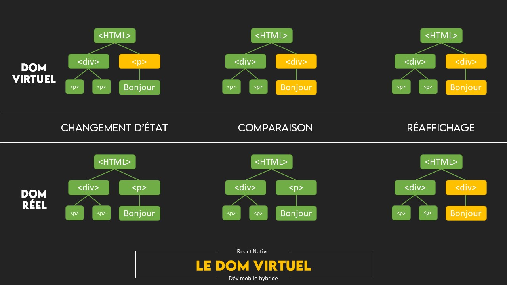

Vous commencez le développement mobile et vous hésitez à choisir ReactNative ou la surcouche Expo ? Je vous donne quelques indices afin d'y voir plus clair sur quel framework vous devriez choisir en fonction de vos compétences, du temps, et de vos besoins.

Code source du projet est disponible ici, sur [Github](https://github.com/Momotoculteur/ReactNative_Expo_Formation).

## Présentation de React

Framework pour le développement web frontend, développé par Facebook et concurrent direct de Angular et de Vue.js.

### Dom Réel et virtuel

React est à la mode. Il est performant, et ce grave à un point important, est qu'il utilise un DOM (Document Object Model) virtuel.

Le DOM (réel) est l'arbre de nœuds, la représentation textuelle de toute votre application web. Quand vous effectuez un changement d'état au sein de votre application, l'intégralité du DOM est recréer. Cela comprend alors l'ensembles des éléments fils de l'application. Et ceci peut être couteux en terme de performance pour des applications grandissantes, surtout si vous y effectuez des modifications fréquentes de votre UI.

Le DOM virtuel quand à lui est un second arbre, correspondant à l'état réel de la globalité de votre application. Vous pouvez alors vous demandez, n'est-ce pas doublon d'avoir deux arbres à l'identique ? Et bien non.

On imagine que vous effectuiez une modification de couleur, sur un texte par exemple. Dans le cas d'une application avec Angular, celui-ci va redessiner la globalité de l'application. Avec React, seul le DOM virtuel va être modifié. React va alors réaliser une comparaison avec des algorithmes spécifiques entre le DOM virtuel fraichement actualisé, et le DOM réel. En fonction des différences entre les deux arbres, seul les nœuds qui ont un nouvel état, vont être redessiner dans le DOM réel. Cela permet de redessiner seulement un seul nœud, dans notre exemple.

Voici une image plus parlante :

{ loading=lazy }
{ .center-text }

## Présentation de React Native (Vanilla)

C'est un framework développé par Facebook pour le développement d'applications cross-platform (iOS et Android).

 

### Développement natif vs développement hybride

Le développement natif est l'utilisation de SDK spécifique. Xcode pour iOS, et Android studio pour Android.

 

#### Pourquoi favoriser le dév. natif

- Le développement natif utilise ses modules et bibliothèques natives, avec son langage natif. Il sera toujours plus performant que les solutions hybrides, même si au cours du temps nous observons de moins en moins de différences
- L'accès aux modules spécifique facile (notification push par exemple)
- Poids des apk/ipa très léger

 

#### Pourquoi favoriser le dév. hybride

- Un seul langage de développement pour deux plateformes
- Un code unique. Donc 2x moins de bug, en 2x moins de temps
- Une interface UI/UX identique, évitant des différences

## Présentation de Expo

Expo embarque ReactNative, c'est une sorte de wrapper, de surcouche. Vous retrouvez donc l'ensemble des items graphiques de ReactNative.

En voici les principales caractéristiques :

**Projet déjà configuré !** En une minute vous avez votre Helloworld de fonctionnel ! Cela évite des paramétrages en tout genre et fastidieux sous ReactNative Vanilla pour paramétrer Xcode et AndroidStudio.

**Pas besoin de mac pour tester votre app sur les deux OS mobile !** Et ça, ça fait plaisir. Ayant un vielle Iphone et mon Android de tout les jours, je peux tester via l'application Expo (disponible sur les stores iOS et Play), avec hot-reload, et sans avoir de Mac, l'application que je développe sur mes deux smartphones. Même si le dév. hybride promet d'avoir un UI/UX 100% identique entre les deux plateformes, il m'est arrivé que mes _checkbox_ ne s'affichait pas correctement sur iOS. J'ai donc forcé pour mes deux plateforme, l'utilisation de la checkbox Android. Soucis auquel je me serais rendu compte une fois seulement uploadé sur les stores. Sous ReactNative Vanilla, vous pouvez seulement tester sur votre iOS si vous tournez sous macOS,  et seulement sur votre Android si vous êtes sur Windows pour développer.

**Pas besoin de mac pour builder votre app !** Vous pouvez utiliser les serveurs expo pour cela. Attention, il vous faudra obligatoirement un compte développeur chez les deux sociétés, et acheter la licence qui va avec. Autre piège, votre build se fera à distance et non en local, attention donc si vous développer une app qui doit rester à l'abris des regards.. Mais dans tout les cas si vous souhaitez build en local et sans mac, vous pouvez utiliser une VM sous macOS Catalina avec QEMU/KVM sans soucis. Sous ReactNative Vanilla il vous faudra forcement les deux OS pour builder sur les deux plateformes, mais qui se résous aussi bien par la VM.

**Accès à l'ensemble des modules natifs compliqué voir impossible...** A un moment donnée, votre application grandissante va prendre en fonctionnalités. Etant donnée que Expo est une surcouche, l'accès aux modules natifs n'est pas possible pour réaliser certaines fonctionnalités. Je prends comme exemple connu comme les notifications push, ou achats-in app. Vous n'y aurez simplement pas accès.

**... mais vous pouvez Ejecter Expo !** Vous pouvez cependant 'éjecter' Expo pour palier au problème précédent. Mais à en lire certaines expériences sur le net, selon la taille et le versionning de votre projet, que ça puisse très bien se passer comme mal se passer.

**Poids supérieur des apk/ipa !** J'ai publié sur les stores ma première application avec des fonctionnalités très simple. Elle fait 50mo à télécharger sur les stores.

 

## Quel framework choisir au final ?

- Vous débutez sur le développement mobile ?
    - Oui ? Foncez sur ReactNative + Expo

- Votre application requiert des accès natifs à des modules particuliers (achats in-apps ou push-notifications) ?
    - Oui ? : Foncez sur ReactNative vanilla
    - Non ? : Foncez ReactNative + Expo

Si votre choix se confirme à développer sous Expo, je vous propose de commencer par le premier chapitre, afin d'installer l'environnement de développement. Hello World sur mon smartphone en moins d'une minute garantie ! 😉
