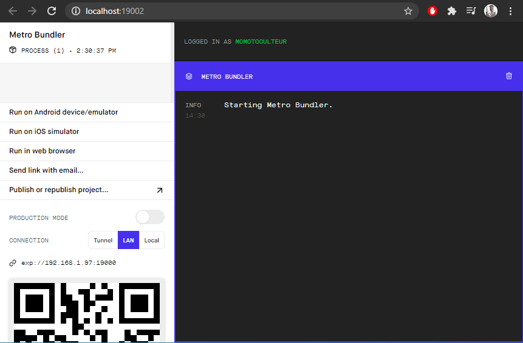
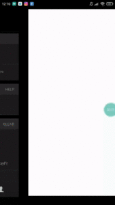

{ loading=lazy }
{ .center-text }
///caption
Résultat du cours
///

## Objectif

- Configurer l'environnement de développement
- Générer le squelette basique d'une application
- Tester son application sur son smartphone

Code source du chapitre disponible sur [Github](https://github.com/Momotoculteur/ReactNative_Expo_Formation/tree/Chap1).  

## ReactNativeCLI, ExpoCLI...

Nous avons des outils dans le développment web, permettant de développer rapidement un squelette de base pour une application :

- CLI pour Angular
- CRA pour React
- CLI pour React Native

Mais pour créer mon premier projet pour découvrir ces technos mobile, je pars non pas sur ReactNative CLI, mais sur ExpoCLI. C'est comme Rails mais pour ReactNative, ou encore Phonegap pour Cordova. Il étends les fonctionnalité de ReactNativeCLI.

Qu'apporte t-il de plus par rapport à React Native CLI et quand l'utiliser ?

**Avantage :**

- Pas besoin d'Android Studio ni de Xcode
- Configuration bien plus simple & rapide ( hello world en moins de une minute )
- Hot reload, sur smartphone physique et non par simulateur. Oui, via l'appli Expo, vous pouvez tester votre app sur votre smartphone iOS ou Android physique, et ce instantanément. En react native vanilla, vous avez droit au simulateur Android sur Windows, et simulateur iOS sous macOS exclusivement.

**Inconvénient :**

- Poids de l'apk/ipa, du à l'ajout de librairie annexes (~50mo le hello world, ça fait mal...)
- Accès aux modules natifs impossible. Vous ne pouvez ajouter de lib natif via Xcode ou Android studio, car tout est packagé via le sdk Expo. Certaines fonctionnalité sont impossible d'être utilisé, comme les achats in-app ou le bluetooth.

En résumé, pour débuter le dév mobile ou pour de simples application, vous devriez commencer par Expo. Pour des utilisateurs expérimentés ou souhaitant des fonctionnalités spécifiques à chaque plateforme, partez sur du ReactNative vanilla.

## Prérequis

Il vous faudra de base :

- NodeJS

Installez ensuite la CLI de Expo via une console :

```
npm install -g expo-cli
```

Pensez à avoir Python dans vos variables d'environnements, au risque d'avoir une erreur d'installation.

## Initialisation du squelette

On initialise une nouvelle application via la commande :

```
expo init "Nom_de_votre_app"
```

Vous aurez l'architecture suivante :

- assets/ : dossier contenant vos images
- app.json : fichier de configuration du projet
- app.tsx : fichier d'entrée de votre application
- package-json : contient l'ensemble des dépendances et scripts du projet
- tsconfig.json : fichier de configuration de typescript
- babel.config.js : fichier de configuration pour la gen du bundle ( une sorte de webpack )

## Lancement du serveur de dév

Simple :

```
npm start
```

Un nouvel onglet dans votre navigateur va s'ouvrir, vous proposant divers options :

(images/resultat-chapitre-169x300.gif)
{ .center-text }

Pour faire fonctionner le simulateur Android ou iOS, vous allez devoir installer les biblio natives. Mais on peut éviter cela en utilisant notre propre smartphone. On va devoir connecter notre smartphone au même réseau wifi que l'ordinateur sur lequel on développe.

Installez l'application **EXPO**, disponible sur l'iOS Store et GooglePlay store, selon votre type de device. Une fois l'application lancé sur votre smartphone, vous allez pouvoir scanner le QR code affiché sur la console, comme montré sur la capture d'écran précédent. Cela va permettre de transférer le bundle directement sur le smartphone.

Vous allez pouvoir ainsi voir vos modification en temps réel sur votre téléphone, de l'application que vous codez, à chaque sauvegarde.

## Icone & Splash screen

Vous pouvez changer l'icone de votre application via le fichier "**app.json"**.

De même pour le splash screen, qui correspond a l'image qui sera affiché le temps que votre application soit chargé par votre smartphone.

{ loading=lazy }
{ .center-text }

## Conclusion

Nous venons de voir comment réaliser un "HelloWorld" en quelques minutes, et ce directement sur notre smartphone.

On discutera dans le prochain chapitre sur comment générer les fichiers APK et IPA, permettant d'installer et de distribuer notre application.  
