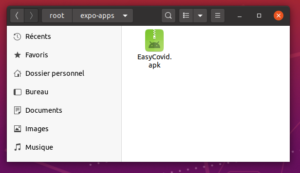{ loading=lazy }
{ .center-text }
///caption
Après quelques instants de build.. TADAAA !
///

## Objectif

- Signer son app
- Builder offline et en local son app
- Générer les fichiers d'installation Android (apk) & iOS (ipa)

Code source du chapitre disponible sur [Github](https://github.com/Momotoculteur/ReactNative_Expo_Formation/tree/Chap2).  

## Introduction

Vous pouvez utiliser directement Expo pour lancer très facilement votre build sur leurs serveurs distants, avec la simple commande :

```
expo build:android
```

Pourquoi je ne l'utilise pas ?

Car lorsque que j'ai voulu lancer un build, leurs serveurs étaient down, laissant mon build en attente. Flemme de perdre plus de temps, je me suis lancé dans les recherches afin de savoir si l'on pouvait nous même générer notre build. C'est un peu plus tricky, mais ça marche.

## A SAVOIR AVANT DE SE LANCER DANS LE DEV MOBILE

Je souhaite vous parler de compte **développeur**. ça vous évitera toute surprise comme j'ai pu avoir en développant ma première application sur les stores.

Si vous souhaitez **distribuer** votre application sur les stores :

- iOS : Compte développeur nécessaire ( 100€ par an )
- Android : Compte développeur nécessaire (25€ à vie )

Avec une licence, vous pouvez ensuite lancez autant d'application que vous le souhaitez, vous n'êtes pas limité en nombre.

Si vous souhaitez seulement **builder** votre application en local :

- iOS : Compte développeur toujours nécessaires, sur un macOS exclusivement. Vous ne pouvez générer votre certificat, teamID et votre fichier de provision en local par vous même.
- Android : Pas besoin de compte spécifique. Juste un macOS ou Linux d'obligatoire. Car votre fichier de clée nécessaire au build est générable en local, par vous même.

## Prérequis

- Bash
- NodeJS

Build pour Android

- macOS ou Linux ( pensez à avoir une VM )
- JDK/JRE (Java Development kit) en version 8 exclusivement

Build pour iOS

- macOS
- Xcode (minimum v11.4)
- [Fastlane](https://docs.fastlane.tools/getting-started/ios/setup/) ( préférez l'installation par Homebrew, le plus simple et rapide moyen )

Si comme moi vous êtes pauvres et n'avez pas de macbook pour build votre .IPA, je vous ait fait un article qui vous sauvera un ou deux jours de recherche et de test pour avoir un macOS Catalina sur votre linux qui est proche d'avoir les performances d'une install native ! Oubliez windows, oubliez virtual box ou vmware. Même mon pc à 4000€ ne fait pas tourner macOS, car aucun de ces softs ne peut attribuer des ressources graphiques, entrainant de gros ralentissement lors de vos déplacement de souris et ouverture de logiciel. Bref, c'est inutilisable, à moins de passer par mon tuto qui utilise le combo QEMU/KVM, et qui fait tourner lui Catalina facilement sur mon portable à 2 coeurs de 2015 😁

On utilisera la TurtleCLI pour générer le build. Installez le via npm :

```
npm install -g turtle-cli
```

## Signature de l'application

### Android

La première étape consiste à signer l'application. Cela permet de créer des certificats concernant la sécurité, pour la distribution. On va utiliser l'outil **keytool** de java pour générer notre **keystore** :

```bash linenums="1"
keytool -genkeypair -v -keystore MON_NOM_DE_CLE.jks -alias MON_ALIAS_DE_CLE -keyalg RSA -keysize 2048 -validity 10000
```

Vous pouvez apercevoir aussi des clés avec l'extension **".keystore"**. C'est une clée comme les **".jks"** avec un format différent.

Cette commande va vous demander plusieurs questions vous concernant :

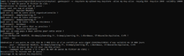{ loading=lazy }
{ .center-text }
///caption
Génération du keystore
///

Un fichier va être crée. Veillez à bien mettre de côté de fichier. Il vous sera demander à chaque build de votre application

### iOS

Il vous faudra un certificat, un apple Team ID, et un fichier de provision

####  Génération du certificat

Allez sur votre compte développeur Apple. Dans l'onglet certificat, cliquez sur le bouton **+** :

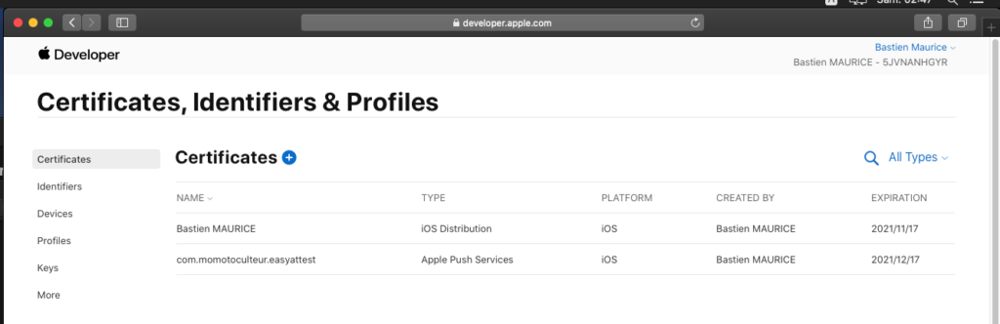{ loading=lazy }
{ .center-text }

Choisissiez l'option **iOS Distribution (app store and ad hoc )** :

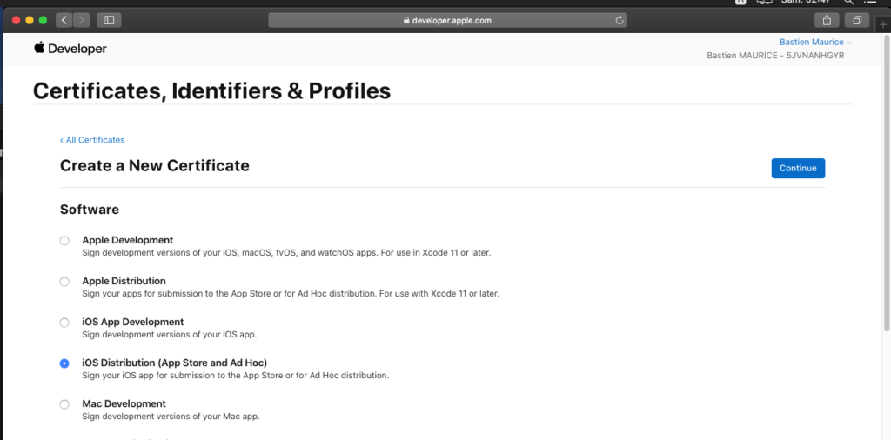

Faîte continuer, et on arrive sur une nouvelle fenêtre nous invitant à envoyer un fichier **CRC** :

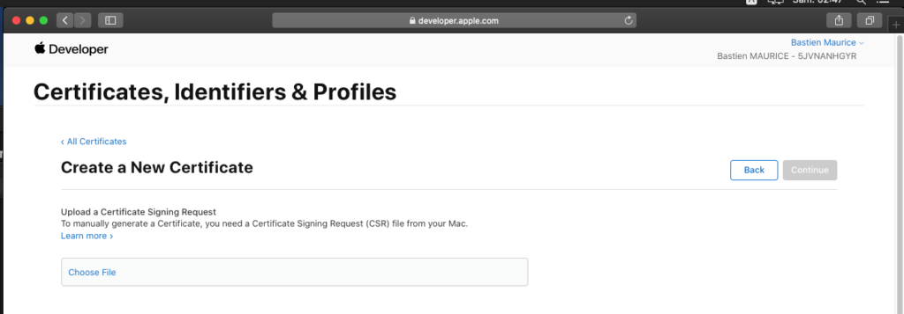{ loading=lazy }
{ .center-text }

On va devoir générer un certificat. Pour cela, lancez l'application **Trousseaux d'accès** qui est dans le dossier **Applications/Utilitaires** de votre macbook. Dans le menu en haut à gauche, cliquez sur **Trousseaux d'accès**, puis sur **Assistant de certification**, puis sur **Demander un certificat à une autorité de certificat** :

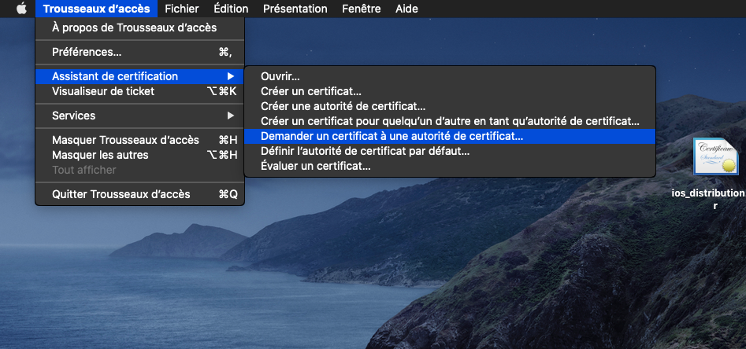{ loading=lazy }
{ .center-text }

Remplir les champs demandé, et faîte enregistrer en **local** :

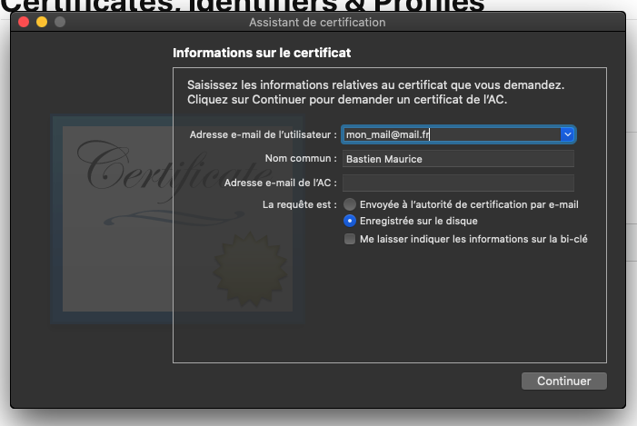{ loading=lazy }
{ .center-text }

Vous aurez un nouveau fichier sur votre bureau :

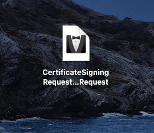{ loading=lazy }
{ .center-text }

On retourne sur le compte développeur Apple ouvert précédemment, nous étions rester sur la fenêtre ou on nous demander notre fichier CSR. C'est le fichier que nous venons de générer sur le bureau que nous allons upload :

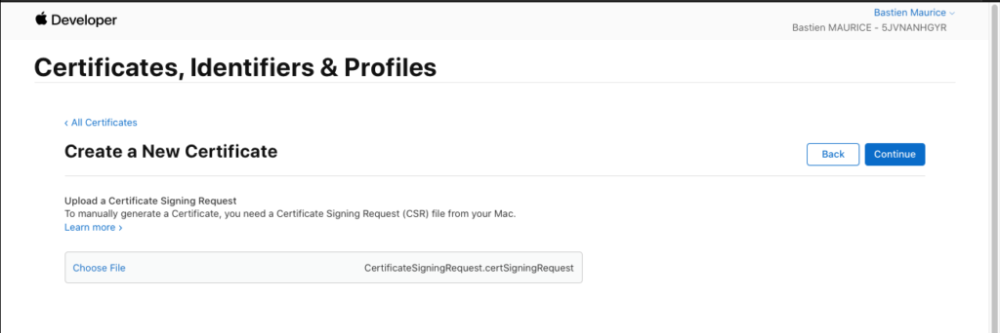{ loading=lazy }
{ .center-text }

Nous pouvons désormais télécharger notre certificat ! Téléchargez le, et ouvrez le :

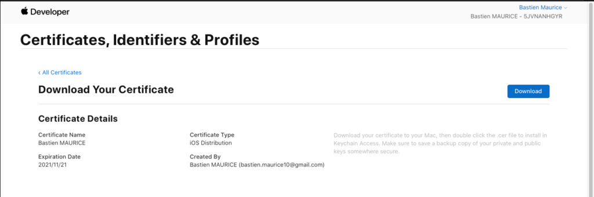{ loading=lazy }
{ .center-text }

Il sera automatiquement ajouté à notre **trousseau d'accès**, attaché à notre **session** :

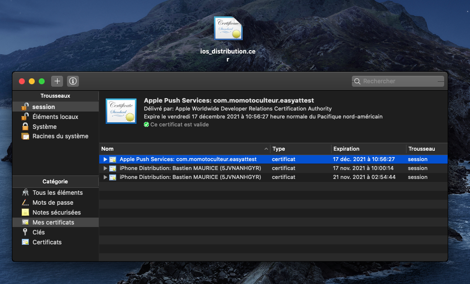{ loading=lazy }
{ .center-text }

Sélectionnez votre certificat fraichement installé avec sa clé privée, et exportez les deux éléments :

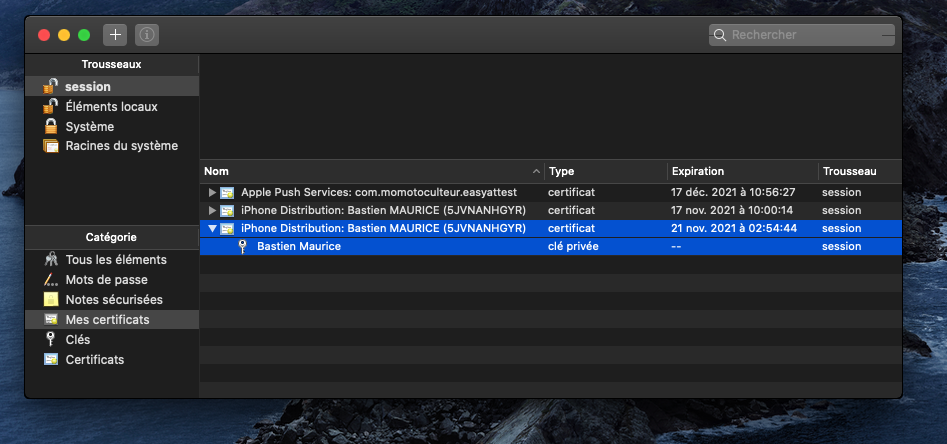{ loading=lazy }
{ .center-text }

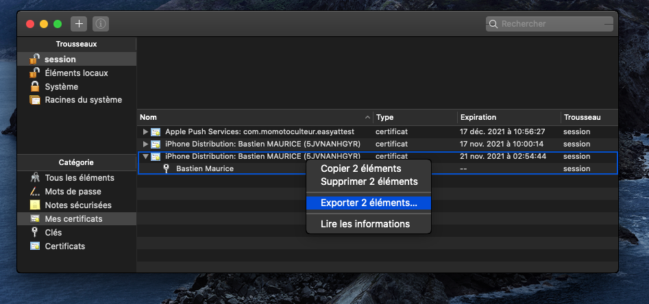{ loading=lazy }
{ .center-text }

Exportez au format .p12, et donnez lui un nom et mettez le de côté, ce fichier vous sera obligatoire pour builder :

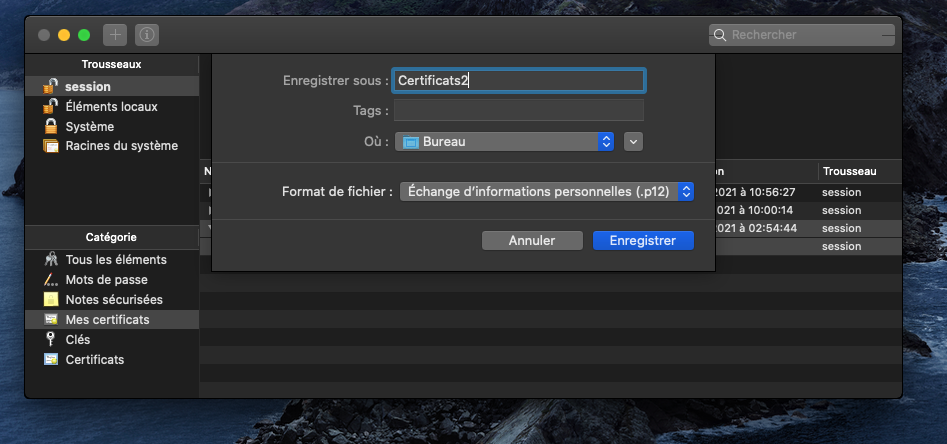{ loading=lazy }
{ .center-text }

Un mot de passe sera demandé, notez le bien de côté, il vous le sera demandé lors du build :

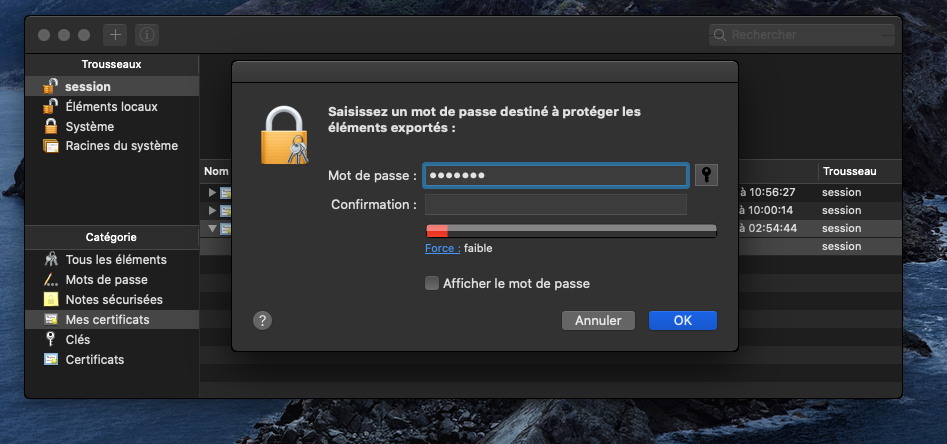{ loading=lazy }
{ .center-text }

Vous avez maintenant un certificat au format **.p12** sur votre bureau. Gardez le bien de côté.

#### Création du teamID

On revient sur le compte développeur Apple, et on va allez cette fois ci dans l'onglet **Identifiers**, cliquez sur **+** :

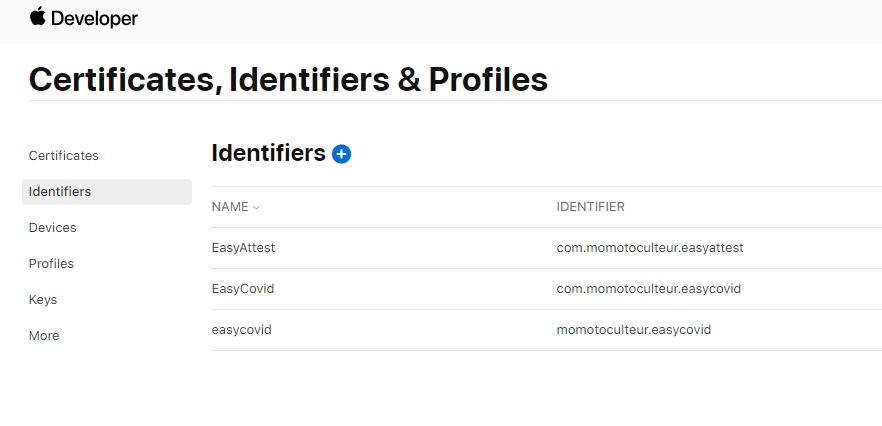{ loading=lazy }
{ .center-text }

On coche **App IDs**, et on continue :

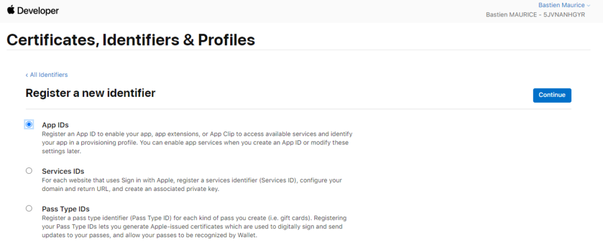{ loading=lazy }
{ .center-text }

On sélectionne **App**, et on continue :

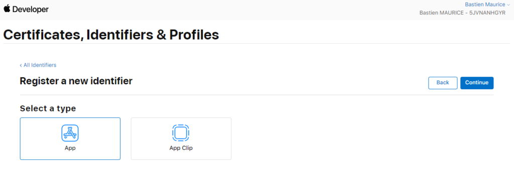{ loading=lazy }
{ .center-text }

On remplis le champ **Description** qui est le nom de l'application, ainsi que son **bundleID** sous la forme recommandé. Dans **Capabilities**, vous cocherez les accès et autorisations que votre application à besoin. Par exemple si c'est une application photo, elle devra avoir accès à l'APN du smartphone. Vous cliquez ensuite sur **Continue**, puis **Register** :

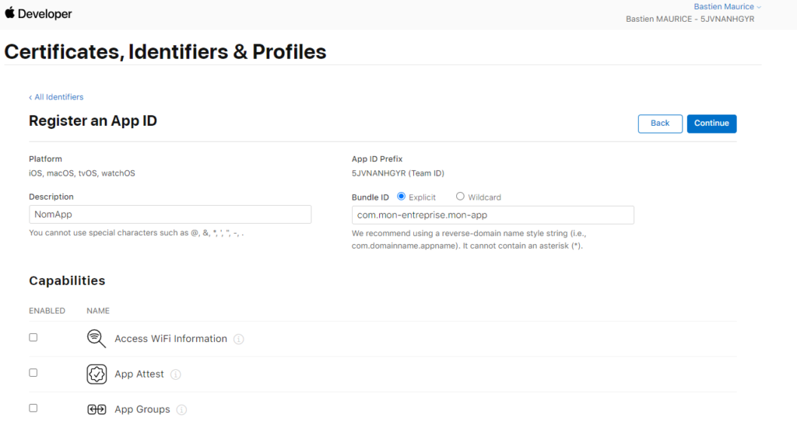{ loading=lazy }
{ .center-text }

Notez bien votre App ID Prefix, qui est votre Team ID. Vous en aurez besoin pour build par la suite.

#### Fichier de provision

Troisième et dernière étape. On va maintenant s'occuper de générer du fichier de provision, lui aussi nécessaire pour buid l'application.

Toujours sur notre compte développeur Apple, on va sélectionner cette fois ci l'onglet **Profiles**, et cliquer sur **+** :

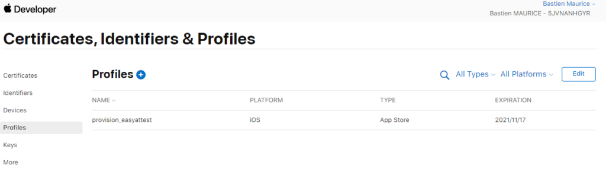{ loading=lazy }
{ .center-text }

On sélectionne ensuite **App store**, dans l'onglet **Distribution**. A savoir, les builds Ad Hoc ne sont pas pris en charge par Expo. On clique sur **Continue** :

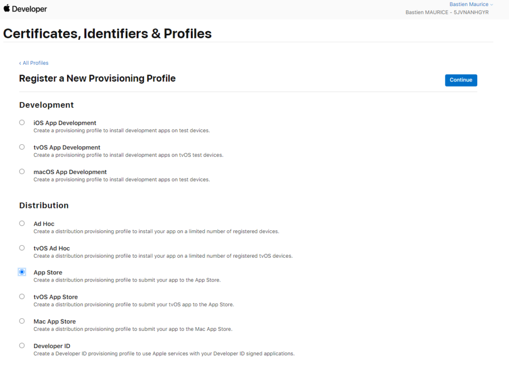{ loading=lazy }
{ .center-text }

Sélectionnez l'**app ID** précédemment crée, et faîte **Continue** :

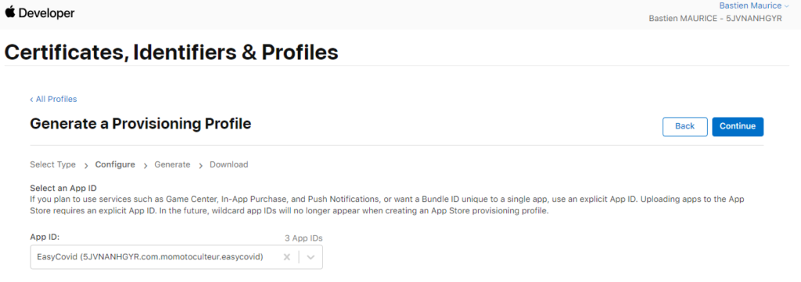

 

Sélectionnez le **certificat** précédemment crée, et faîte **Continue** :

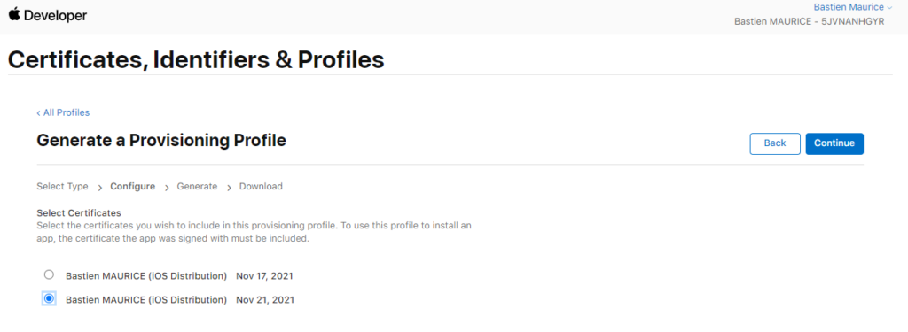

Donnez un nom à votre fichier de **provision**, et faîte **Generate** :

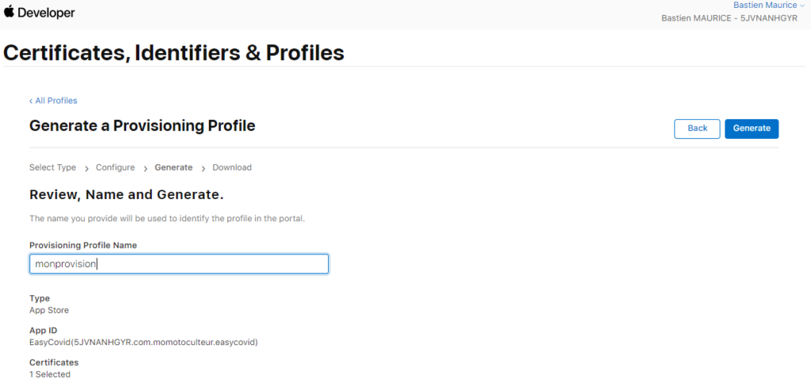

Téléchargez le, et gardez le de côté, vous en aurez besoin pour générer votre build :

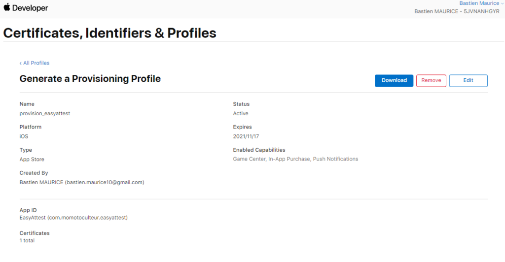

## Export de l'application

### Android & iOS

La seconde étape consiste à exporter notre application. Cela permet de créer les bundles (iOS & Android) à partir des fichiers javascript. Vous devriez apercevoir la création d'un dossier **"dist"** dans votre répertoire courant via la commande suivante :

```bash linenums="1"
# APPLICATION CONTENANT QUE DU HTTP
expo export --dev --public-url http://127.0.0.1:8000/

# APPLICATION CONTENANT DU HTTPS
expo export --public-url http://127.0.0.1:8000/
```

Attention à utiliser la bonne, selon si votre application contient du HTTP ou HTTPS.

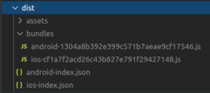{ loading=lazy }
{ .center-text }

## Servir l'application

### Android & iOS

On va maintenant lancer notre application à partir du bundle crée précédemment, en local. Pour cela on va utiliser python. Déplacez vous dans le dossier **"dist"** précédemment crée, et lancer la commande suivante :

```bash linenums="1"
python3 -m http.server 8000
```

Vérifiez bien que le serveur tourne, via **curl**, ou en lançant une connexion à votre localhost via votre navigateur :

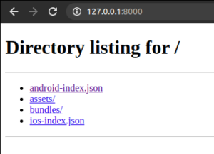{ loading=lazy }
{ .center-text }

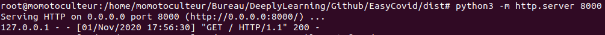{ loading=lazy }
{ .center-text }

## Build l'application

Dernière étape, on va pouvoir lancer le build de nos fichiers. Revenez à la racine de votre projet et ouvrer une autre console.

### Android

Lancez la commande suivante pour lancer le build via turtle-cli :

```bash linenums="1"
# VERSION HTTP
EXPO_ANDROID_KEYSTORE_PASSWORD="MDP_DU_KEYSTORE" \
EXPO_ANDROID_KEY_PASSWORD="MDP_DE_CLE" \
turtle build:android \
--type apk \
--keystore-path CHEMIN_VERS_LE_FICHIER_DE_CLE \
--keystore-alias "ALIAS_DU_KEYSTORE" \
--allow-non-https-public-url \
--public-url http://127.0.0.1:8000/android-index.json

# VERSION HTTPS
EXPO_ANDROID_KEYSTORE_PASSWORD="MDP_DU_KEYSTORE" \
EXPO_ANDROID_KEY_PASSWORD="MDP_DE_CLE" \
turtle build:android \
--type apk \
--keystore-path CHEMIN_VERS_LE_KEYSTORE \
--keystore-alias "ALIAS_DU_KEYSTORE" \
--public-url http://127.0.0.1:8000/android-index.json
```

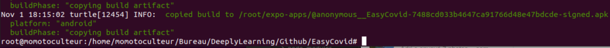{ loading=lazy }
{ .center-text }

Voilà votre fichier APK, situé dans le répertoire annoncé dans la console.

### iOS

Lancez la commande suivante pour lancer le build via turtle-cli :

```bash linenums="1"
# VERSION HTTP
EXPO_IOS_DIST_P12_PASSWORD="MDP_FICHIER_DE_CERTIF" \
turtle build:ios \
  --team-id TEAM_APPLE_ID \
  --dist-p12-path CHEMIN_VERS_FICHIER_DE_CERTIF/cert.p12 \
  --provisioning-profile-path CHEMIN_VERS_FICHIER_DE_PROVISIONING/provisioning.mobileprovision \
  --allow-non-https-public-url \
  --public-url http://127.0.0.1:8000/ios-index.json
  
# VERSION HTTPS
EXPO_IOS_DIST_P12_PASSWORD="MDP_FICHIER_DE_CERTIF" \
turtle build:ios \
  --team-id TEAM_APPLE_ID \
  --dist-p12-path CHEMIN_VERS_FICHIER_DE_CERTIF/cert.p12 \
  --provisioning-profile-path CHEMIN_VERS_FICHIER_DE_PROVISIONING/provisioning.mobileprovision \
  --public-url http://127.0.0.1:8000/ios-index.json
```
 
## Soucis fréquemment rencontré

### EACESS permissions denied

Vous pouvez vous confronter à des erreurs d'accès aux fichiers pour installer des packets npm globaux ( pour turtle-cli ou encore expo ). Oubliez les sudo su et sudo en tout genre, qui m'ont fait juste galérer encore plus. Vous pouvez fix cela en deux étapes :

- Utilisez l'option '**\--unsafe-perm**' de NPM
- Pour le dossier 'lib/node\_modules' qui résisterait aux erreurs, passez un coup de **chown -R votreNomUser** pour donner accès à votre utilisateur courant de la session au dossier en lecture et écriture.

## Conclusion

Nous venons de générer nos fichiers d'installation APK pour Android et IPA pour iOS, afin de distribuer notre application. On s'attaque à la navigation entre plusieurs écrans sur notre prochain chapitre.

 