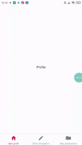
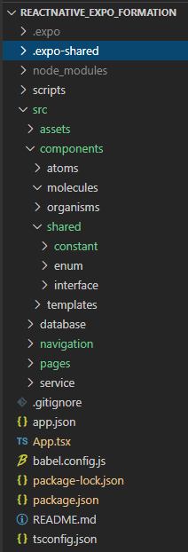
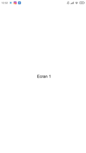
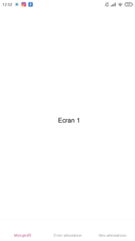
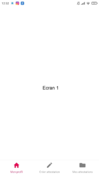

On va vu dans le chapitre 1 comment afficher un HelloWorld!, puis dans le chapitre 2 comment générer nos installeurs. Maintenant que l'on est capable d'utiliser notre application du code à notre smartphone, on va commencer le développement.

{ loading=lazy }
{ .center-text }

## Objectif

- Initialiser une petite architecture
- Créer plusieurs écrans en affichant un titre différent
- Créer une barre de navigation qui switch entre elles

Code source du chapitre disponible sur [Github](https://github.com/Momotoculteur/ReactNative_Expo_Formation/tree/Chap3).  


## Définition de l'architecture

On va devoir commencer à réfléchir à la structure de notre projet. En effet, nous codions toute l'app dans le même fichier auparavant. On va ajouter cette fois ci de nouveaux composants, et ça risquerai de faire plutôt brouillon par la suite de notre tutoriel. Je vous propose celle-ci :


{ loading=lazy } 
{ .center-text }

Voici un squelette de base que j'utilise couramment pour débuter une application ReactNative. Quelques explications concernant leurs utilités :

**\- Service** : dossier donnant des services à l'utilisateurs. Générer un pdf, initialiser des paramètres à l'ouverture de l'application, etc.
**\- Page** : contient nos vues globales, affiché tel qu'elle à l'utilisateur
**\- Navigation** : définit l'ensemble des éléments permettant de naviguer entre les vues (tab navigator, stack navigator, etc.)
**\- Database** : contient l'ensemble des requêtes pour questionner une base de données SQL
**\- Shared** : éléments utilisé à travers toute l'application, que ça soit des énumérations, constantes ou interfaces
**\- Assets** : contient des images, des polices, et tout autre éléments 'brut' nécessaire pour remplir notre application
**\- Scripts** : permet d'automatiser des tâches, comme le build des ipa ou apk
**\- Component** : contient les différents composants de notre applications, avec une granularité concernant leurs tailles (Atome => Molécule => Organisme => Template )
- **App.tsx** : Point d'entrée de notre application
- **App.json** : fichier de configuration global de notre application
- **Package.json** : contient l'ensemble des dépendances de notre app (paquets npm)

 

## Biblio requises

Il nous faut de belles icones :

```
npm install --save @expo/vector-icons
```

Il nous faut notre lib de navigation, inclus depuis react :

```
npm install --save @react-navigation/bottom-tabs

```

Ainsi que les dépendances nécessaires :

```
npm install @react-navigation/native
```

```
expo install react-native-gesture-handler react-native-reanimated react-native-screens react-native-safe-area-context @react-native-community/masked-view
```

## Définition de nos écrans

Pour chaque écrans que l'on aura besoin, nous allons juste y inclure au milieu un texte, pour démontrer que l'on change bien d'écrans en naviguant. Je créer des interface minimaliste avec le code suivant :

```tsx linenums="1" title="index.tsx"
import React from 'react';
import { StyleSheet, Text, View } from 'react-native';

export default function Profile() {
    return (
      <View style={styles.container}>
        <Text>Ecran 1</Text>
      </View>
    );
  }
  
  const styles = StyleSheet.create({
    container: {
      flex: 1,
      backgroundColor: '#fff',
      alignItems: 'center',
      justifyContent: 'center',
    },
});
```

Je le fais à l'identique pour mes deux autres écrans. Tout se passe dans le dossier **/scenes/**.

{ loading=lazy }
{ .center-text }

 
## Définition de notre barre de navigation

```tsx linenums="1"
import * as React from 'react'
import { NavigationContainer } from '@react-navigation/native'
import { createBottomTabNavigator } from '@react-navigation/bottom-tabs'
import { Platform, Switch } from 'react-native'
import { Ionicons } from '@expo/vector-icons';

import Screen1 from '../scenes/screen1'
import Screen2 from '../scenes/screen2'
import Screen3 from '../scenes/screen3'

const Tab = createBottomTabNavigator()

export default function MainTabNavigator() {
    return (
        <NavigationContainer>
            <Tab.Navigator
                tabBarOptions={
                {
                    activeTintColor: '#e50d54',
                    inactiveTintColor: 'gray',
                    labelPosition: 'below-icon'
                }
            }>
                <Tab.Screen
                    name='Mon profil'
                    component={Screen1}
                />
                <Tab.Screen
                    name='Créer attestation'
                    component={Screen2}
                />
                <Tab.Screen
                    name='Mes attestations'
                    component={Screen3}
                />
            </Tab.Navigator>
        </NavigationContainer>
    )
}
```

1. Premièrement, on définit via la méthode  **createBottomTabNavigator()**, une instance
2. On export le type **MainTabNavigator()**
3. On créer un **<NavigationContainer>**
4. On créer **<Tab.Navigator>**
5. Dans ce dernier on définit autant de **<Tab.Screen>** que nous souhaitons d'écrans. On lui fourni un nom, et un composant à afficher. Rappelez vous, ce sont les écrans définit précédemment via **<View>**

Le **tabBarOptions** nous permet de définir une couleur différente selon l'onglet qui est actuellement ouvert.  

{ loading=lazy }
{ .center-text }

## Ajout d'icone

Afin de rendre notre barre plus jolie, on va y ajouter des icones au dessus de nos écritures. Pour cela on va ajouter une nouvelles propriétés à la suite de **tabBarOptions**, dans le **Tab.Navigator** :

```tsx linenums="1"
screenOptions={({ route }) => ({
    tabBarIcon: ({ focused, color, size }) => {
        let iconName: string = "";

        // Definit le type d icones selon la platforme
        if (Platform.OS === "android") {
            iconName += "md-";
        } else if (Platform.OS === "ios") {
            iconName += "ios-";
        }

        // assigne l icone
        switch (route.name) {
            case "Mon profil": {
                iconName += "home";
                break;
            }
            case "Créer attestation": {
                iconName += "create";
                break;
            }
            case "Mes attestations": {
                iconName += "folder";
                break;
            }
            default: {
                break;
            }
        }
        return <Ionicons name={iconName} size={size} color={color} />;
    }
  })
}
```

La propriété **route** nous permet d'assigner la bonne icone à la bonne page.

La propriété **Platform.OS** nous permet de savoir si nous sommes sur un iOS ou Android, permettant d'assigner la bonne icones selon les codes de bonne conduite UI/UX de chaque constructeur.

## Ajouter notre tab barre au lancement de l'application

On ajoute simplement notre composant **MainTabNavigator** dans la fonction principale de notre App :

```tsx linenums="1" title="app.tsx"
export default function App() {
  return (
    <MainTabNavigator/>
  );
}
```

{ loading=lazy }
{ .center-text }

## Soucis de superposition de status bar

Dans certains cas, il se peut que votre application déborde sur la status bar, engendrant des données au niveau de l'horloge ainsi que sur les icones de vos notifications. Pour régler ce problème, on va encapsuler notre **MainTabNavigator**, par une **SafeAreaView** :
 
```tsx linenums="1" title="app.tsx"
export default function App() {
    return (
        <SafeAreaView style={styles.container}>
            <MainTabNavigator />
        </SafeAreaView>
    );
}
```

## Chargement local de fonts

J'ai déjà eu des soucis concernant certains texte qui étaient coupé au sein de mon application, lorsque je rendais le texte en gras. En me baladant un peu sur la toile, j'ai trouvé une petite soluce, qui consiste à charger une nouvelle font pour toute mon application, en local. Dans votre dossier **Assets/**, rajoutez un dossier **Fonts/**. Ajoutez y la police que vous souhaitez, je prends pour exemple la police Arial.

Installez le module correspondant :

```
expo install expo-font
```

On commence par définir nos variables dans le fichier d'entrée globale de notre application :
 
```tsx linenums="1" title="app.tsx"
let customFonts = {
  'Arial': require('./src/assets/fonts/arial.ttf'),
}

interface iState {
  fontsLoaded: boolean;
}

interface IProps {
}

export default function App() {
}
```

Je transforme notre composant de fonction en un composant de classe. Cela va nous permettre de définir un attribut nous permettant de savoir quand notre police sera chargé :
 
```tsx linenums="1" title="app.tsx"
export default class App extends React.Component<IProps, iState> {
    render() {
        return (
            <SafeAreaView style={styles.container}>
                <MainTabNavigator />
            </SafeAreaView>
        );
    }
}
```

J'initialise le constructeur de la classe App :

```tsx linenums="1" title="app.tsx"
constructor(props: IProps) {
    super(props);      
    this.state = {
        fontsLoaded: false,
    }
}
```
 
On utilise la fonction **componentDidMount()**. Celle-ci est une routine appelé une seule fois la construction de la classe, et permet de lancer des fonctions une seule et unique fois durant tout le cycle de vie de l'application :

```tsx linenums="1" title="app.tsx"
componentDidMount() {
    this.loadFontsAsync();
}
async loadFontsAsync() {
    await Font.loadAsync(customFonts);
    this.setState({ fontsLoaded: true });
}
```

Elle appellera ma fonction ou je lui demande de charger ma police en local, et de mettre à jour ma variable **fontsLoaded**.


Le dernier changement consiste à laisser l'utilisateur patienter sur le splashscreen, tant que la police d'écriture n'est pas chargé. Une les assets voulu chargé, on lance notre application :

```tsx linenums="1" title="app.tsx"
import { AppLoading } from 'expo';
import * as Font from 'expo-font';

render() {
    if (!this.state.fontsLoaded) {
        return <AppLoading />;
    } else {
        return (
            <SafeAreaView style={styles.container}>
                <MainTabNavigator />
            </SafeAreaView>
        );
    }
}
```
 
Faîte comme suit pour utiliser notre nouvelle police fraichement installé :
 
```html linenums="1" title="app.tsx"
<Text style={{ font-family:'Arial' }}>
    MonTexte
</Text>
```

## Conclusion

Nous venons de construire notre barre de navigation principale de notre application.

Je vous montre au prochain chapitre, comme faire de la navigation imbriqué avec des StackNavigator. Cela permettra d'ajouter autant de vue que l'on souhaite à travers nos onglets de notre barre principale.

