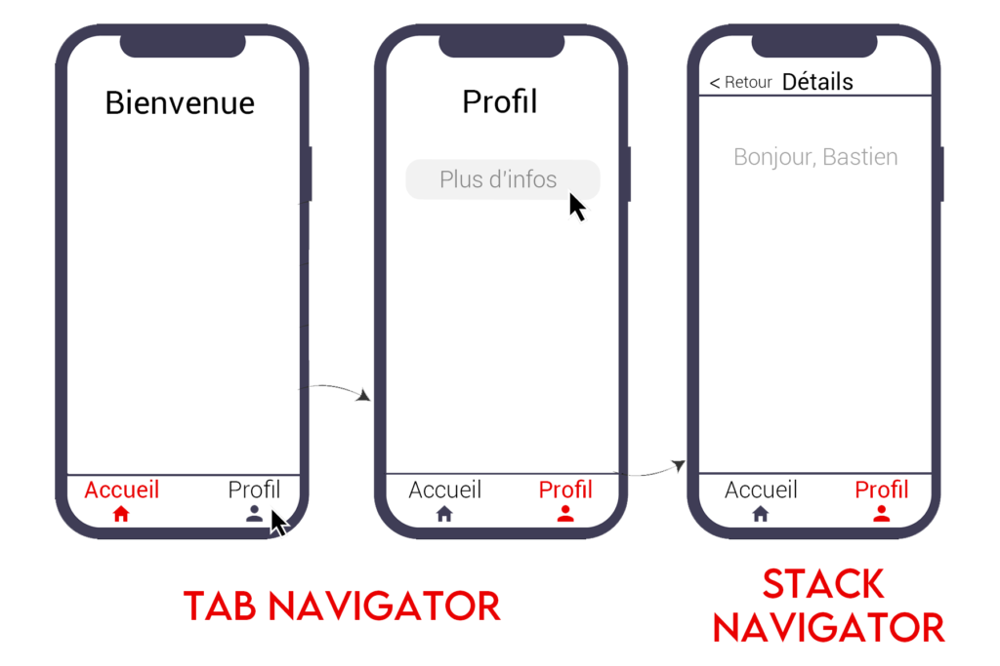
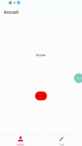

Nous venons de voir dans le chapitre précèdent comment faire une barre de navigation principal. Mais comment faire si nous souhaitons naviguer dans de nouveaux composant à travers nos vues actuelle ?

Pour réaliser une navigation imbriqué de vue dans d'autres vues, nous allons ajouter un nouvel élément, une **StackNavigation**.

Code source du chapitre disponible sur [Github](https://github.com/Momotoculteur/ReactNative_Expo_Formation/tree/Chap4).  

## Objectifs

- Créer de nouvelles vues
- Réaliser une navigation imbriqué

{ loading=lazy }
{ .center-text }

## Prérequis

Installez la lib qui gère la stack :

```
npm install @react-navigation/stack

```

## Créer une nouvelle vue

Pour faire de la navigation imbriquée, il va nous falloir dans une première partie créer un nouveau composant, une nouvelle page. Faisons une nouvelle page Profil, qui affiche mon prénom, par exemple :

```tsx linenums="1" title="profile-page.tsx"
export default function ProfilPage() {
    return (
        <Text>Bastien M.</Text>
    );
}
```

## Mise a jour des ROUTES

On va ajouter une nouvelle route dans notre constante globale des routes, amenant à notre nouvelle vue précédemment crée :

```tsx linenums="1" title="CRoute.tsx"
export const ROUTE = {
    WELCOME_TAB : {
        MAIN: "Accueil",
        PROFIL: "Profil"
    },
    TODO_TAB: {
        MAIN: "Todo"
    }
};
```

## Création de la stack navigator 

On va créer notre composant qui va gérer la navigation par pile. On doit lui définir nos deux composants (nos deux vues), leurs routes respectifs pour y accéder, et la route initiale lorsque le composant est crée :

```tsx linenums="1" title="stackNavigatorProfil.tsx)"
import { createStackNavigator } from '@react-navigation/stack';
import { ROUTE } from "../components/shared/constant/CRoute";
import ProfilPage from "../pages/welcome-page/profil-page/profil-page";
import WelcomePage from "../pages/welcome-page/welcome-page";
import * as React from 'react'

const Stack = createStackNavigator();

export default function StackNavigatorProfil() {
    return (
        <Stack.Navigator initialRouteName={ROUTE.WELCOME_TAB.MAIN}>
            <Stack.Screen name={ROUTE.WELCOME_TAB.MAIN} component={WelcomePage} />
            <Stack.Screen name={ROUTE.WELCOME_TAB.PROFIL} component={ProfilPage} />
        </Stack.Navigator>
    )
}
```

## Mise a jour de notre tab navigator

On va désormais fournir à notre navigation par tab, non plus mon composant **WelcomePage** comme initial, mais directement notre **stackNavigator**, crée précédemment :

```tsx linenums="1" title="stackNavigatorProfil.tsx"
import { createStackNavigator } from '@react-navigation/stack';
import { ROUTE } from "../components/shared/constant/CRoute";
import ProfilPage from "../pages/welcome-page/profil-page/profil-page";
import WelcomePage from "../pages/welcome-page/welcome-page";
import * as React from 'react'

const Stack = createStackNavigator();

export default function StackNavigatorProfil() {
    return (
        <Stack.Navigator initialRouteName={ROUTE.WELCOME_TAB.MAIN}>
            <Stack.Screen name={ROUTE.WELCOME_TAB.MAIN} component={WelcomePage} />
            <Stack.Screen name={ROUTE.WELCOME_TAB.PROFIL} component={ProfilPage} />
        </Stack.Navigator>
    )
}
```
 
## Appel du changement de route par un bouton

On met à jour notre composant **WelcomePage**, via la méthode **onPress**, qui est appelé lors d'un clique sur notre item, permettant d'appeler le changement de vue en lui donnant la route que l'on souhaite. Je vous montre comment faire cet appel selon le type de composant que vous utilisez au sein de votre application :


### Navigation via composant fonctionnel
 
```tsx linenums="1" title="welcome-page.tsx"
import { useNavigation } from '@react-navigation/native';

export default function WelcomePage() {

    const navigation = useNavigation();

    return (
        <View style={styles.container}>
            <Text>Accueil</Text>
            <TouchableOpacity activeOpacity={0.7}
                style={styles.buttonStyle}
                onPress={() => navigation.navigate(ROUTE.WELCOME_TAB.PROFIL)}>
                <Text>Profil</Text>
            </TouchableOpacity >
        </View>
    );
}
```

### Navigation via composant de classe

```tsx linenums="1" title="welcome-page.tsx"
export default class WelcomePage extends React.Component {

    constructor(props: any) {
        super(props)
    }

    render() {
        return (
            <View style={styles.container}>
                <Text>Accueil</Text>
                <TouchableOpacity activeOpacity={0.7}
                    style={styles.buttonStyle}
                    onPress={() => this.props.navigation.navigate(ROUTE.WELCOME_TAB.PROFIL)}>
                    <Text>Profil</Text>
                </TouchableOpacity >
            </View>
        );
    }
}
```

## Conclusion

Nous venons de voir comment naviguer à l'infinie entre nos vues. Dans le prochain chapitre, nous nous attarderons à comment sauvegarder, à la fermeture de notre application, des données simples, comme des paramètres de l'application.

{ loading=lazy }
{ .center-text }
///caption
Résultat du cours
///