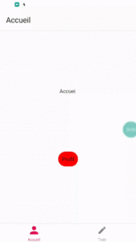

Nous venons de voir au chapitre précédent comment organiser une navigation complexe et imbriquée pour une application avec une architecture grandissante.

Nous allons voir aujourd'hui comment stocker des données plutôt simple, par exemple des paramètres de l'application comme l'activation ou non d'un thème clair ou sombre.


!!! info
    On ne peut utiliser n'importe quel outils pour persister des données car nous sommes sur un projet Expo, nous empêchant d'accéder aux modules natifs de iOS et Android. AsyncStorage est un moyen fonctionnant avec des projets Expo

 

Code source du chapitre disponible sur [Github](https://github.com/Momotoculteur/ReactNative_Expo_Formation/tree/Chap5).  

 

## Objectifs

- Stocker localement des informations via JSON

{ loading=lazy }
{ .center-text }

## Prérequis

Installez le packet requis via une console :

`expo install @react-native-async-storage/async-storage`

Utilisez l'import qui correspond dans vos fichiers :

```
import AsyncStorage from '@react-native-async-storage/async-storage';
```

## Que-ce que AsyncStorage

AsyncStorage nous permet de persister des données en local sur le smartphone, de façon asynchrone et non crypté. Les informations sont sauvegardé en clair, donc éviter de stocker des données sensibles tel que des mots de passes.

Le stockage s'effectue sous forme de couple tel quel : <Clé, Valeur>.

On ne peut stocker que des string, donc pour des éléments plus complexe tel que des objets, on devra utiliser **JSON.stringify()** pour la conversion en JSON lors de la sauvegarde d'une donnée, et utiliser **JSON.parse()** pour lire un objet.

## Sauvegarder des données

### Pour un string

```tsx linenums="1"
const storeData = async (value) => {
  try {
    await AsyncStorage.setItem('@ma_clé', ma_valeur)
  } catch (e) {
    // lance une erreur
  }
}
```

### Pour un objet

```tsx linenums="1"
const storeData = async (value) => {
  try {
    const jsonValue = JSON.stringify(ma_valeur_a_save)
    await AsyncStorage.setItem('@ma_clé', jsonValue)
  } catch (e) {
    // lance une erreur
  }
}
```

## Lire des données

### Pour un string

```tsx linenums="1"
const getData = async () => {
  try {
    const value = await AsyncStorage.getItem('@ma_clé')
    if(value !== null) {
      // donnée stocké
    }
  } catch(e) {
    // lance une erreur
  }
}
```

### Pour un objet

```tsx linenums="1"
const getData = async () => {
    try {
        const jsonValue = await AsyncStorage.getItem('@storage_Key')
        return jsonValue != null ? JSON.parse(jsonValue) : null;
    } catch(e) {
        // lance une erreur
    }
}
```
 
## En pratique

On va faire un exemple tout bête, à savoir charger le nom d'un utilisateur à l'appui d'un bouton.

### Méthode d'écriture & lecture de donnée

On commence par définir nos deux méthodes pour charger et sauvegarder une donnée :

```tsx linenums="1" title="profilAsyncStorage.tsx"
import AsyncStorage from "@react-native-async-storage/async-storage"

export async function initProfileName() {
    try {
        const jsonValue = await AsyncStorage.getItem('@profile')
        if(jsonValue == null) {
            await AsyncStorage.setItem('@profile', JSON.stringify('Bastien MAURICE'))
        }
    } catch(e) {
        console.log('ERREUR : ' + e);
    }
}

export async function getProfileName() {
    try {
        const value = await AsyncStorage.getItem('@profile')
        if(value !== null) {
          return JSON.parse(value);
        } else {
            return 'Invité';
        }
      } catch(e) {
    }
}
```

On appellera la méthode **initProfileName()** dans l'entrée de notre l'application (App.tsx) pour initialiser notre donnée.

### Mise à jour de notre vue

On crée un état initialisé à 'Invité'. On aura une méthode appelant notre fonction pour lire notre donnée via **AsyncStorage**, définit précédemment. Et enfin une méthode **render()** pour afficher un champ de texte, et un bouton bindé avec la fonction de chargement de notre donnée locale :

```tsx linenums="1" title="profil-page.tsx"
interface iState {
    connectedUser: string
}

interface IProps {
}

export default class ProfilPage extends React.Component<IProps, iState> {
    constructor(props: IProps) {
        super(props)
        this.state = {
            connectedUser: 'Invité',
        }
    }

    loadProfil() {
        getProfileName()
            .then((newName: string) => {
                this.setState({ connectedUser: newName })
            })
    }

    render() {
        return (
            <View>
                <Text>Bonjour, {this.state.connectedUser}</Text>
                <TouchableOpacity activeOpacity={0.7}
                    style={styles.buttonStyle}
                    onPress={() => this.loadProfil()}>
                    <Text>Charger profil</Text>
                </TouchableOpacity >
            </View>
        );
    }
}
```


## Conclusion

On vient de voir comment stocker des informations simple en local. Nous allons voir au prochain chapitre comment stocker des informations plus complexe et surtout en quantités plus importantes.
