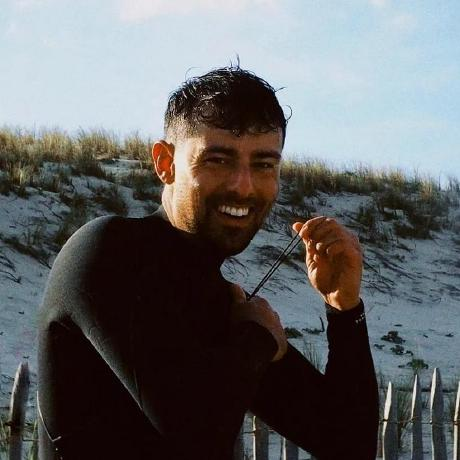

  
  

    

        Développeur en génie logiciel de formation, je suis aujourd'hui avec quelques années d'expériences DevOps chez Betclic (Bordeaux, France).
        Je m'intéresse aussi au domaine du machine & deep learning.
    
  
  

<a href="https://github.com/Momotoculteur" target="_blank" rel="noopener" style="margin-left:10px;margin-right:10px">
:fontawesome-brands-github:
</a>
<a href="https://www.linkedin.com/in/bmaurice10/" target="_blank" rel="noopener" style="margin-left:10px;margin-right:10px">
:fontawesome-brands-linkedin-in:
</a>
<a href="https://deeplylearning.fr" target="_blank" rel="noopener" style="margin-left:10px;margin-right:10px">
:fontawesome-solid-globe:
</a>
<a href="https://youtube.com/@deeplylearning5754" target="_blank" rel="noopener" style="margin-left:10px;margin-right:10px">
:fontawesome-brands-youtube:
</a>
<a href="https://gitlab.com/Momotoculteur" target="_blank" rel="noopener" style="margin-left:10px;margin-right:10px">
:fontawesome-brands-gitlab:
</a>

